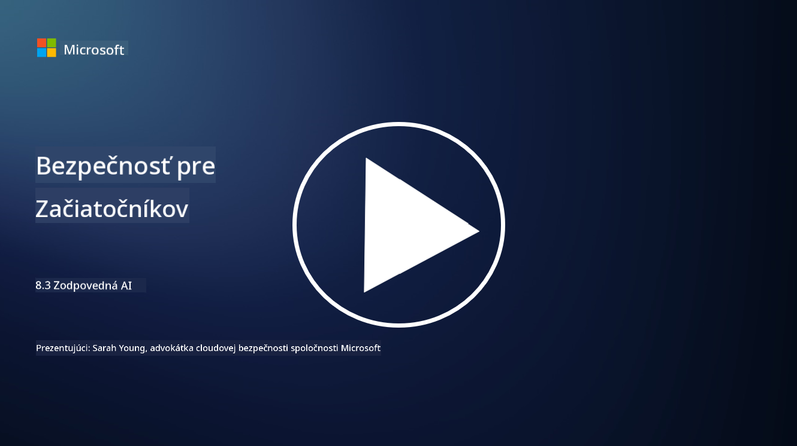

<!--
CO_OP_TRANSLATOR_METADATA:
{
  "original_hash": "5e9775ee91bde7d44577891d5f11c4c5",
  "translation_date": "2025-09-04T00:07:58+00:00",
  "source_file": "8.3 Responsible AI.md",
  "language_code": "sk"
}
-->
# Zodpovedná AI

## Čo je zodpovedná AI a ako súvisí s bezpečnosťou AI?

Zodpovedná AI označuje vývoj a používanie umelej inteligencie spôsobom, ktorý je etický, transparentný a v súlade so spoločenskými hodnotami. Zahŕňa princípy ako spravodlivosť, zodpovednosť a odolnosť, pričom zabezpečuje, že systémy AI sú navrhnuté a prevádzkované tak, aby prinášali prospech jednotlivcom, komunitám a celej spoločnosti.

Vzťah medzi zodpovednou AI a bezpečnosťou AI je významný, pretože:

-   **Etické aspekty**: Zodpovedná AI zahŕňa etické aspekty, ktoré priamo ovplyvňujú bezpečnosť, ako napríklad ochranu súkromia a údajov. Zabezpečenie, že systémy AI rešpektujú súkromie používateľov a chránia osobné údaje, je kľúčovým prvkom zodpovednej AI.
-   **Odolnosť a spoľahlivosť**: Systémy AI musia byť odolné voči manipulácii a útokom, čo je základným princípom zodpovednej AI aj bezpečnosti AI. To zahŕňa ochranu pred útokmi a zabezpečenie integrity rozhodovacích procesov AI.
-   **Transparentnosť a vysvetliteľnosť**: Súčasťou zodpovednej AI je zabezpečenie, že systémy AI sú transparentné a ich rozhodnutia je možné vysvetliť. To je kľúčové pre bezpečnosť, pretože zainteresované strany musia rozumieť fungovaniu systémov AI, aby mohli dôverovať ich bezpečnostným opatreniam.
-   **Zodpovednosť**: Systémy AI by mali byť zodpovedné za svoje činnosti, čo znamená, že musia existovať mechanizmy na sledovanie rozhodnutí a nápravu problémov. To sa zhoduje s bezpečnostnými praktikami, ktoré monitorujú a auditujú aktivity systému, aby zabránili porušeniam a reagovali na ne.

V podstate sú zodpovedná AI a bezpečnosť AI úzko prepojené, pričom praktiky zodpovednej AI zvyšujú bezpečnosť systémov AI a naopak. Implementácia princípov zodpovednej AI pomáha vytvárať systémy AI, ktoré sú nielen eticky správne, ale aj bezpečnejšie voči potenciálnym hrozbám.

## Ako môžem zabezpečiť, že môj systém AI je bezpečný aj etický?

Zabezpečenie, že váš systém AI je bezpečný aj etický, zahŕňa viacero krokov, vrátane:

- **Dodržiavanie etických princípov**: Riadiť sa zavedenými etickými smernicami, ktoré zdôrazňujú blaho ľudí, spoločnosti a životného prostredia; spravodlivosť; ochranu súkromia; spoľahlivosť; transparentnosť; možnosť spochybnenia; a zodpovednosť.

- **Implementácia robustných bezpečnostných opatrení**: Používať proaktívne bezpečnostné testovanie a programy na správu dôvery, rizík a bezpečnosti AI na ochranu pred hrozbami a zraniteľnosťami.

- **Zapojenie rôznorodých zainteresovaných strán**: Zahrnúť široké spektrum účastníkov do procesu vývoja AI, vrátane etikov, sociálnych vedcov a zástupcov dotknutých komunít, aby sa zohľadnili rôzne perspektívy a hodnoty.

- **Zabezpečenie transparentnosti a vysvetliteľnosti**: Uistiť sa, že rozhodovacie procesy AI sú transparentné a je možné ich vysvetliť, čo umožňuje väčšiu dôveru a jednoduchšiu identifikáciu potenciálnych predsudkov alebo chýb.

- **Ochrana súkromia údajov**: Chrániť súkromie a autentickosť údajov prostredníctvom šifrovania a iných opatrení na ochranu údajov, aby sa rešpektovali práva používateľov na súkromie.

- **Umožnenie ľudského dohľadu**: Implementovať mechanizmy na ľudský dohľad, ktoré umožňujú spochybnenie rozhodnutí systémov AI a zabezpečujú zodpovednosť.

- **Informovanosť o bezpečnosti AI**: Udržiavať aktuálne informácie o najnovšom výskume a diskusiách o bezpečnosti AI, aby ste pochopili meniace sa prostredie bezpečnosti a etiky AI.

- **Dodržiavanie predpisov**: Zabezpečiť, že váš systém AI je v súlade so všetkými relevantnými zákonmi a predpismi, ktoré môžu zahŕňať zákony o ochrane údajov, zákony proti diskriminácii a odvetvové smernice.

## Môžete uviesť niekoľko príkladov bezpečnostných problémov spôsobených neetickým používaním AI?

Tu sú niektoré príklady bezpečnostných problémov, ktoré môžu vzniknúť z neetického používania AI:

- **Predsudky v rozhodovaní**: Systémy AI môžu udržiavať a zosilňovať existujúce predsudky, ak sú trénované na zaujatých dátových súboroch. Napríklad, ak je vyhľadávač trénovaný na údajoch, ktoré odrážajú spoločenské stereotypy, môže zobrazovať zaujaté výsledky vyhľadávania, čo môže viesť k nespravodlivému zaobchádzaniu alebo diskriminácii.

- **AI v súdnych systémoch**: Používanie AI v právnom rozhodovaní môže vyvolávať etické obavy, najmä ak proces rozhodovania AI postráda transparentnosť alebo je ovplyvnený zaujatými údajmi. To by mohlo viesť k nespravodlivým právnym výsledkom a porušeniu práv jednotlivcov.

- **Manipulácia systémov AI**: Systémy AI môžu byť náchylné na útoky, pri ktorých malé úpravy vstupných údajov môžu spôsobiť nesprávne výsledky. Napríklad autonómne vozidlá by mohli byť zavádzané k nesprávnemu interpretovaniu dopravných značiek, čo by mohlo ohroziť bezpečnosť.

- **AI poháňané sledovanie**: Nasadenie AI na účely sledovania môže viesť k porušeniu súkromia, najmä ak sa používa bez riadneho súhlasu alebo spôsobmi, ktoré zasahujú do osobných slobôd. To môže byť obzvlášť problematické v autoritárskych režimoch, ktoré môžu používať AI na monitorovanie a potláčanie nesúhlasu.

Tieto príklady zdôrazňujú dôležitosť etických úvah pri vývoji a nasadzovaní systémov AI, aby sa predišlo bezpečnostným problémom a chránili práva a súkromie jednotlivcov.

## Ďalšie čítanie

 - [Microsoft Responsible AI Standard v2 General Requirements](https://query.prod.cms.rt.microsoft.com/cms/api/am/binary/RE5cmFl?culture=en-us&country=us&WT.mc_id=academic-96948-sayoung)
 - [Responsible AI (mit.edu)](https://sloanreview.mit.edu/big-ideas/responsible-ai/)
 - [13 Principles for Using AI Responsibly (hbr.org)](https://hbr.org/2023/06/13-principles-for-using-ai-responsibly)

---

**Upozornenie**:  
Tento dokument bol preložený pomocou služby na automatický preklad [Co-op Translator](https://github.com/Azure/co-op-translator). Hoci sa snažíme o presnosť, upozorňujeme, že automatické preklady môžu obsahovať chyby alebo nepresnosti. Pôvodný dokument v jeho pôvodnom jazyku by mal byť považovaný za autoritatívny zdroj. Pre kritické informácie sa odporúča profesionálny ľudský preklad. Nezodpovedáme za akékoľvek nedorozumenia alebo nesprávne interpretácie vyplývajúce z použitia tohto prekladu.