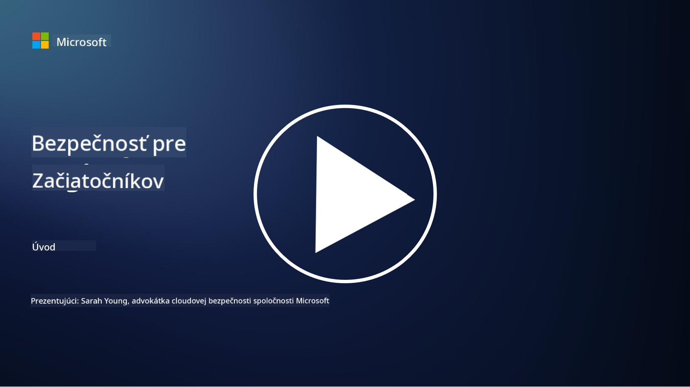

<!--
CO_OP_TRANSLATOR_METADATA:
{
  "original_hash": "33e83c2beb28a1b6e031416624dc23aa",
  "translation_date": "2025-10-11T11:07:45+00:00",
  "source_file": "README.md",
  "language_code": "sk"
}
-->

### 🌐 Podpora viacerých jazykov

#### Podporované cez GitHub Action (automatizované a vždy aktuálne)

<!-- CO-OP TRANSLATOR LANGUAGES TABLE START -->
[Arabčina](../ar/README.md) | [Bengálčina](../bn/README.md) | [Bulharčina](../bg/README.md) | [Barmčina (Mjanmarsko)](../my/README.md) | [Čínština (zjednodušená)](../zh/README.md) | [Čínština (tradičná, Hongkong)](../hk/README.md) | [Čínština (tradičná, Macao)](../mo/README.md) | [Čínština (tradičná, Taiwan)](../tw/README.md) | [Chorvátčina](../hr/README.md) | [Čeština](../cs/README.md) | [Dánčina](../da/README.md) | [Holandčina](../nl/README.md) | [Estónčina](../et/README.md) | [Fínčina](../fi/README.md) | [Francúzština](../fr/README.md) | [Nemčina](../de/README.md) | [Gréčtina](../el/README.md) | [Hebrejčina](../he/README.md) | [Hindčina](../hi/README.md) | [Maďarčina](../hu/README.md) | [Indonézština](../id/README.md) | [Taliančina](../it/README.md) | [Japončina](../ja/README.md) | [Kórejčina](../ko/README.md) | [Litovčina](../lt/README.md) | [Malajčina](../ms/README.md) | [Maráthčina](../mr/README.md) | [Nepálčina](../ne/README.md) | [Nórčina](../no/README.md) | [Perzština (Farsi)](../fa/README.md) | [Poľština](../pl/README.md) | [Portugalčina (Brazília)](../br/README.md) | [Portugalčina (Portugalsko)](../pt/README.md) | [Pandžábčina (Gurmukhi)](../pa/README.md) | [Rumunčina](../ro/README.md) | [Ruština](../ru/README.md) | [Srbčina (cyrilika)](../sr/README.md) | [Slovenčina](./README.md) | [Slovinčina](../sl/README.md) | [Španielčina](../es/README.md) | [Swahilčina](../sw/README.md) | [Švédčina](../sv/README.md) | [Tagalog (Filipínčina)](../tl/README.md) | [Tamilčina](../ta/README.md) | [Thajčina](../th/README.md) | [Turečtina](../tr/README.md) | [Ukrajinčina](../uk/README.md) | [Urdu](../ur/README.md) | [Vietnamčina](../vi/README.md)
<!-- CO-OP TRANSLATOR LANGUAGES TABLE END -->

**Ak chcete podporiť ďalšie jazyky, zoznam podporovaných jazykov nájdete [tu](https://github.com/Azure/co-op-translator/blob/main/getting_started/supported-languages.md)**

#### Pridajte sa k našej komunite 

# 🚀 Kybernetická bezpečnosť pre začiatočníkov – učebný plán

V tejto rýchlo sa meniacej dobe prijímania technológií AI je ešte dôležitejšie pochopiť, ako zabezpečiť IT systémy. Tento kurz je navrhnutý tak, aby vás naučil základné koncepty kybernetickej bezpečnosti a naštartoval vaše vzdelávanie v oblasti bezpečnosti. Je nezávislý od konkrétnych dodávateľov a rozdelený do krátkych lekcií, ktoré by mali trvať približne 30-60 minút. Každá lekcia obsahuje krátky kvíz a odkazy na ďalšie čítanie, ak sa chcete do témy ponoriť hlbšie.

Čo tento kurz pokrýva 📚

- 🔐 Základné koncepty kybernetickej bezpečnosti, ako je trojica CIA, rozdiely medzi rizikami, hrozbami atď.
- 🛡️ Pochopenie, čo je bezpečnostné opatrenie a aké formy môže mať.
- 🌐 Pochopenie, čo je zero trust a prečo je dôležitý v modernej kybernetickej bezpečnosti.
- 🔑 Pochopenie kľúčových konceptov a tém v oblasti identity, sieťovania, bezpečnostných operácií, infraštruktúry a ochrany dát.
- 🔧 Poskytnutie príkladov nástrojov používaných na implementáciu bezpečnostných opatrení.

Čo tento kurz nepokrýva 🙅‍♂️

- 🚫 Ako používať konkrétne bezpečnostné nástroje.
- 🚫 Ako "hackovať" alebo vykonávať red teaming/ofenzívnu bezpečnosť.
- 🚫 Učenie sa o konkrétnych normách súladu.

Keď dokončíte tento kurz, môžete pokračovať na niektoré z našich modulov Microsoft Learn. Odporúčame vám pokračovať vo vzdelávaní s [Microsoft Security, Compliance, and Identity Fundamentals.](https://learn.microsoft.com/training/paths/describe-concepts-of-security-compliance-identity/?WT.mc_id=academic-96948-sayoung) 

Nakoniec môžete zvážiť absolvovanie [Exam SC-900: Microsoft Security, Compliance, and Identity Fundamentals exam.](https://learn.microsoft.com/credentials/certifications/exams/sc-900/?WT.mc_id=academic-96948-sayoung)

> 💁 Ak máte akékoľvek pripomienky alebo návrhy k tomuto kurzu a obsahu, ktorý nám chýba, radi si ich vypočujeme!

## Prehľad modulov 📝 
| **Číslo modulu** | **Názov modulu**                           | **Učené koncepty**                  | **Ciele učenia**                                                                                          |
|-------------------|-------------------------------------------|--------------------------------------|-----------------------------------------------------------------------------------------------------------------|
| **1.1**           | Základné bezpečnostné koncepty                   | [Trojica CIA](https://github.com/microsoft/Security-101/blob/main/1.1%20The%20CIA%20triad%20and%20other%20key%20concepts.md)                        | Naučte sa o dôvernosti, dostupnosti a integrite. Tiež o autentickosti, nepopierateľnosti a súkromí. |
| **1.2**           | Základné bezpečnostné koncepty                   | [Bežné kybernetické hrozby](https://github.com/microsoft/Security-101/blob/main/1.2%20Common%20cybersecurity%20threats.md)        | Naučte sa o bežných kybernetických hrozbách, ktorým čelia jednotlivci a organizácie.                             |
| **1.3**           | Základné bezpečnostné koncepty                   | [Pochopenie riadenia rizík](https://github.com/microsoft/Security-101/blob/main/1.3%20Understanding%20risk%20management.md)       | Naučte sa hodnotiť a chápať riziká – dopad/pravdepodobnosť a implementáciu opatrení.                                                                                                               | |
| **1.4**           | Základné bezpečnostné koncepty                   | [Bezpečnostné praktiky a dokumentácia](https://github.com/microsoft/Security-101/blob/main/1.4%20Security%20practices%20and%20documentation.md) | Naučte sa rozdiel medzi politikami, postupmi, normami a reguláciami/zákonmi.                         |
| **1.5**           | Základné bezpečnostné koncepty                   | [Zero trust](https://github.com/microsoft/Security-101/blob/main/1.5%20Zero%20trust.md)                           | Naučte sa, čo je zero trust a ako ovplyvňuje architektúru. Čo je obrana do hĺbky?                   |
| **1.6**           | Základné bezpečnostné koncepty                   | [Model zdieľanej zodpovednosti](https://github.com/microsoft/Security-101/blob/main/1.6%20Shared%20responsibility%20model.md)                           | Čo je model zdieľanej zodpovednosti a ako ovplyvňuje kybernetickú bezpečnosť?                  |
| **1.7**           | [Kvíz na konci modulu](https://github.com/microsoft/Security-101/blob/main/1.7%20End%20of%20module%20quiz.md)                        |                                      |                                                                                                                 |
| **2.1**           | Základy správy identity a prístupu | [Kľúčové koncepty IAM](https://github.com/microsoft/Security-101/blob/main/2.1%20IAM%20key%20concepts.md)                     | Naučte sa o princípe minimálnych oprávnení, segregácii povinností, ako IAM podporuje zero trust.               |
| **2.2**           | Základy správy identity a prístupu | [IAM architektúra zero trust](https://github.com/microsoft/Security-101/blob/main/2.2%20IAM%20zero%20trust%20architecture.md)          | Naučte sa, ako je identita novým perimetrom pre moderné IT prostredia a aké hrozby zmierňuje.          |
| **2.3**           | Základy správy identity a prístupu | [IAM schopnosti](https://github.com/microsoft/Security-101/blob/main/2.3%20IAM%20capabilities.md)                     | Naučte sa o schopnostiach IAM a opatreniach na zabezpečenie identít                                                  |
| **2.4**           | [Kvíz na konci modulu](https://github.com/microsoft/Security-101/blob/main/2.4%20End%20of%20module%20quiz.md)                        |                                      |                                                                                                                 |
| **3.1**           | Základy sieťovej bezpečnosti             | [Kľúčové koncepty sieťovania](https://github.com/microsoft/Security-101/blob/main/3.1%20Networking%20key%20concepts.md)              | Naučte sa o konceptoch sieťovania (IP adresovanie, čísla portov, šifrovanie, atď.)                                 |
| **3.2**           | Základy sieťovej bezpečnosti             | [Sieťová architektúra zero trust](https://github.com/microsoft/Security-101/blob/main/3.2%20Networking%20zero%20trust%20architecture.md)   | Naučte sa, ako sieťovanie prispieva k E2E ZT architektúre a aké hrozby zmierňuje.                  |
| **3.3**           | Základy sieťovej bezpečnosti             | [Schopnosti sieťovej bezpečnosti](https://github.com/microsoft/Security-101/blob/main/3.3%20Network%20security%20capabilities.md)        | Naučte sa o nástrojoch sieťovej bezpečnosti – firewally, WAF, ochrana proti DDoS, atď.                                    |
| **3.4**           | [Kvíz na konci modulu](https://github.com/microsoft/Security-101/blob/main/3.4%20End%20of%20module%20quiz.md)                        |                                      |                                                                                                                 |
| **4.1**           | Základy bezpečnostných operácií          | [Kľúčové koncepty SecOps](https://github.com/microsoft/Security-101/blob/main/4.1%20SecOps%20key%20concepts.md)                  | Naučte sa, prečo sú bezpečnostné operácie dôležité a ako sa líšia od bežných IT operačných tímov.                  |
| **4.2**           | Základy bezpečnostných operácií          | [SecOps architektúra zero trust](https://github.com/microsoft/Security-101/blob/main/4.2%20SecOps%20zero%20trust%20architecture.md)       | Naučte sa, ako SecOps prispieva k E2E ZT architektúre a aké hrozby zmierňuje.                      |
| **4.3**           | Základy bezpečnostných operácií          | [Schopnosti SecOps](https://github.com/microsoft/Security-101/blob/main/4.3%20SecOps%20capabilities.md)                  | Naučte sa o nástrojoch SecOps – SIEM, XDR, atď.                                                                    |
| **4.4**           | [Kvíz na konci modulu](https://github.com/microsoft/Security-101/blob/main/4.4%20End%20of%20module%20quiz.md)                        |                                      |                                                                                                                 |
| **5.1**           | Základy bezpečnosti aplikácií         | [Kľúčové koncepty AppSec](https://github.com/microsoft/Security-101/blob/main/5.1%20AppSec%20key%20concepts.md)                  | Naučte sa o konceptoch AppSec, ako je bezpečnosť už pri návrhu, validácia vstupov, atď.                                    |
| **5.2**           | Základy bezpečnosti aplikácií            | [Schopnosti AppSec](https://github.com/microsoft/Security-101/blob/main/5.2%20AppSec%20key%20capabilities.md)                  | Naučte sa o nástrojoch AppSec: nástroje na zabezpečenie pipeline, skenovanie kódu, skenovanie tajomstiev a pod.   |
| **5.3**           | [Kvíz na konci modulu](https://github.com/microsoft/Security-101/blob/main/5.3%20End%20of%20module%20quiz.md)                        |                                      |                                                                                                                 |
| **6.1**           | Základy bezpečnosti infraštruktúry       | [Kľúčové koncepty bezpečnosti infraštruktúry](https://github.com/microsoft/Security-101/blob/main/6.1%20Infrastructure%20security%20key%20concepts.md) | Naučte sa o spevňovaní systémov, aktualizáciách, bezpečnostnej hygiene, bezpečnosti kontajnerov.                 |
| **6.2**           | Základy bezpečnosti infraštruktúry       | [Schopnosti bezpečnosti infraštruktúry](https://github.com/microsoft/Security-101/blob/main/6.2%20Infrastructure%20security%20capabilities.md) | Naučte sa o nástrojoch, ktoré môžu pomôcť s bezpečnosťou infraštruktúry, napr. CSPM, bezpečnosť kontajnerov a pod.|
| **6.3**           | [Kvíz na konci modulu](https://github.com/microsoft/Security-101/blob/main/6.3%20End%20of%20module%20quiz.md)                        |                                      |                                                                                                                 |
| **7.1**           | Základy bezpečnosti dát                 | [Kľúčové koncepty bezpečnosti dát](https://github.com/microsoft/Security-101/blob/main/7.1%20Data%20security%20key%20concepts.md)           | Naučte sa o klasifikácii a uchovávaní dát a prečo je to dôležité pre organizáciu.                                |
| **7.2**           | Základy bezpečnosti dát                 | [Schopnosti bezpečnosti dát](https://github.com/microsoft/Security-101/blob/main/7.2%20Data%20security%20capabilities.md)           | Naučte sa o nástrojoch na bezpečnosť dát – DLP, manažment vnútorných rizík, správa dát a pod.                     |
| **7.3**           | [Kvíz na konci modulu](https://github.com/microsoft/Security-101/blob/main/7.3%20End%20of%20module%20quiz.md)                        |
| **8.1**           | Základy bezpečnosti AI                  | [Kľúčové koncepty bezpečnosti AI](https://github.com/microsoft/Security-101/blob/main/8.1%20AI%20security%20key%20concepts.md)          | Naučte sa o rozdieloch a podobnostiach medzi tradičnou bezpečnosťou a bezpečnosťou AI.                           |
| **8.2**           | Základy bezpečnosti AI                  | [Schopnosti bezpečnosti AI](https://github.com/microsoft/Security-101/blob/main/8.2%20AI%20security%20capabilities.md)           | Naučte sa o nástrojoch na bezpečnosť AI a kontrolách, ktoré môžu byť použité na zabezpečenie AI.                 |
| **8.3**           | Základy bezpečnosti AI                  | [Zodpovedná AI](https://github.com/microsoft/Security-101/blob/main/8.3%20Responsible%20AI.md)          | Naučte sa, čo je zodpovedná AI a o špecifických rizikách AI, ktoré by mali bezpečnostní odborníci poznať.         |
| **8.4**           | [Kvíz na konci modulu](https://github.com/microsoft/Security-101/blob/main/8.4%20End%20of%20module%20quiz.md)     

## 🎒 Ďalšie kurzy 

Náš tím vytvára aj ďalšie kurzy! Pozrite si:

- [Generatívna AI pre začiatočníkov](https://aka.ms/genai-beginners)
- [Generatívna AI pre začiatočníkov .NET](https://github.com/microsoft/Generative-AI-for-beginners-dotnet)
- [Generatívna AI s JavaScriptom](https://github.com/microsoft/generative-ai-with-javascript)
- [Generatívna AI s Javou](https://github.com/microsoft/Generative-AI-for-beginners-java)
- [AI pre začiatočníkov](https://aka.ms/ai-beginners)
- [Data Science pre začiatočníkov](https://aka.ms/datascience-beginners)
- [ML pre začiatočníkov](https://aka.ms/ml-beginners)
- [Kybernetická bezpečnosť pre začiatočníkov](https://github.com/microsoft/Security-101) 
- [Webový vývoj pre začiatočníkov](https://aka.ms/webdev-beginners)
- [IoT pre začiatočníkov](https://aka.ms/iot-beginners)
- [Vývoj XR pre začiatočníkov](https://github.com/microsoft/xr-development-for-beginners)
- [Ovládnutie GitHub Copilot pre párové programovanie](https://github.com/microsoft/Mastering-GitHub-Copilot-for-Paired-Programming)
- [Ovládnutie GitHub Copilot pre vývojárov C#/.NET](https://github.com/microsoft/mastering-github-copilot-for-dotnet-csharp-developers)
- [Vyberte si vlastné dobrodružstvo s Copilotom](https://github.com/microsoft/CopilotAdventures)

---

**Upozornenie**:  
Tento dokument bol preložený pomocou služby AI prekladu [Co-op Translator](https://github.com/Azure/co-op-translator). Hoci sa snažíme o presnosť, prosím, berte na vedomie, že automatizované preklady môžu obsahovať chyby alebo nepresnosti. Pôvodný dokument v jeho rodnom jazyku by mal byť považovaný za autoritatívny zdroj. Pre kritické informácie sa odporúča profesionálny ľudský preklad. Nenesieme zodpovednosť za akékoľvek nedorozumenia alebo nesprávne interpretácie vyplývajúce z použitia tohto prekladu.