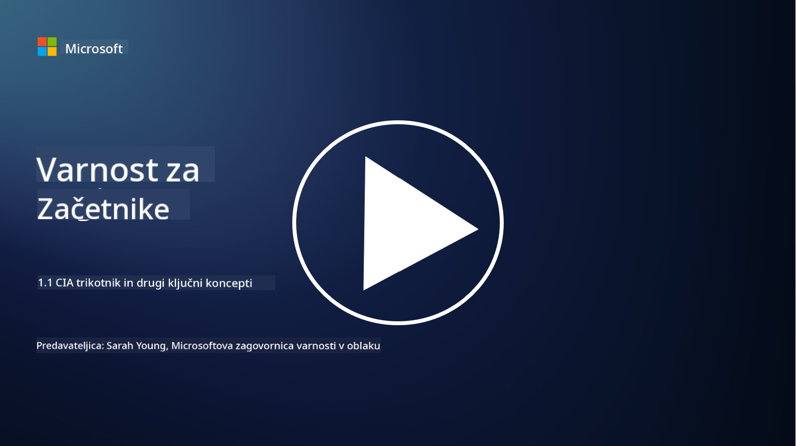
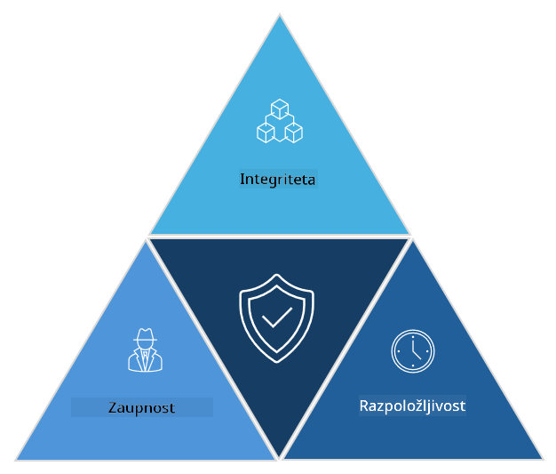

<!--
CO_OP_TRANSLATOR_METADATA:
{
  "original_hash": "16a76f9fa372fb63cffb6d76b855f023",
  "translation_date": "2025-09-04T01:12:58+00:00",
  "source_file": "1.1 The CIA triad and other key concepts.md",
  "language_code": "sl"
}
-->
# Triada CIA in drugi ključni koncepti

## Uvod

V tej lekciji bomo obravnavali:

 - Kaj je kibernetska varnost?
   
 
 - Kaj je triada CIA v kibernetski varnosti?

   

 - Kaj pomenijo pristnost, neovrgljivost in zasebnost v kontekstu kibernetske varnosti?

## Kaj je kibernetska varnost?

Kibernetska varnost, znana tudi kot informacijska varnost, je praksa zaščite računalniških sistemov, omrežij, naprav in podatkov pred digitalnimi napadi, nepooblaščenim dostopom, škodo ali krajo. Glavni cilj kibernetske varnosti je zagotoviti zaupnost, celovitost in razpoložljivost digitalnih sredstev in informacij. Strokovnjaki za kibernetsko varnost načrtujejo in izvajajo varnostne ukrepe za zaščito sredstev, podatkov in informacij. Ker je vse več naših življenj digitaliziranih in povezanih na spletu, je kibernetska varnost postala ena glavnih skrbi tako za posameznike kot za organizacije.

## Kaj je triada CIA v kibernetski varnosti?

Triada CIA v kibernetski varnosti se nanaša na model, ki vključuje tri glavne vidike vsakega dela na področju kibernetske varnosti ali pri načrtovanju sistema/okolja:

### Zaupnost

To je vidik, ki ga večina ljudi povezuje s pojmom "kibernetska varnost": zaupnost je proces zaščite podatkov in informacij pred nepooblaščenimi poskusi dostopa, tj. samo osebe, ki morajo videti informacije, imajo dostop do njih. Vendar pa vsi podatki niso enako pomembni, zato se podatki običajno razvrščajo in zaščitijo glede na to, koliko škode bi nastalo, če bi jih pridobili nepooblaščeni posamezniki.

### Celovitost

Nanaša se na zaščito natančnosti in zanesljivosti podatkov v okoljih ter preprečevanje, da bi podatke spreminjali ali urejali nepooblaščeni posamezniki. Na primer, študent spremeni svoj datum rojstva v evidenci vozniškega dovoljenja, da bi bil videti starejši in si lahko ponovno natisne dovoljenje z zgodnejšim datumom rojstva za nakup alkohola.

### Razpoložljivost

To je vidik, ki je pomemben v operativni IT, vendar je razpoložljivost ključna tudi za kibernetsko varnost. Obstajajo specifični tipi napadov, ki ciljajo na razpoložljivost, pred katerimi morajo strokovnjaki za varnost zaščititi sisteme (npr. napadi z razpršeno zavrnitvijo storitve – DDoS).

**Triada CIA v kibernetski varnosti**

## Kaj pomenijo pristnost, neovrgljivost in zasebnost v kontekstu kibernetske varnosti?

To so dodatni pomembni koncepti, ki se nanašajo na zagotavljanje varnosti in zanesljivosti sistemov ter podatkov:

**Pristnost** - se nanaša na zagotovilo, da so informacije, komunikacija ali entiteta, s katero komunicirate, pristne in jih niso spremenile ali ponaredile nepooblaščene osebe.

**Neovrgljivost** - je koncept, ki zagotavlja, da stranka ne more zanikati svoje vpletenosti ali pristnosti transakcije ali komunikacije. Preprečuje, da bi nekdo trdil, da ni poslal sporočila ali izvedel določenega dejanja, ko obstajajo dokazi, ki kažejo nasprotno.

**Zasebnost** - se nanaša na zaščito občutljivih in osebno prepoznavnih informacij pred nepooblaščenim dostopom, uporabo, razkritjem ali manipulacijo. Vključuje nadzor nad tem, kdo ima dostop do osebnih podatkov in kako se ti podatki zbirajo, shranjujejo in delijo.

## Dodatno branje

[What Is Information Security (InfoSec)? | Microsoft Security](https://www.microsoft.com/security/business/security-101/what-is-information-security-infosec#:~:text=Three%20pillars%20of%20information%20security%3A%20the%20CIA%20triad,as%20guiding%20principles%20for%20implementing%20an%20InfoSec%20plan.)

---

**Omejitev odgovornosti**:  
Ta dokument je bil preveden z uporabo storitve za strojno prevajanje [Co-op Translator](https://github.com/Azure/co-op-translator). Čeprav si prizadevamo za natančnost, vas prosimo, da se zavedate, da lahko avtomatizirani prevodi vsebujejo napake ali netočnosti. Izvirni dokument v njegovem maternem jeziku je treba obravnavati kot avtoritativni vir. Za ključne informacije priporočamo strokovno človeško prevajanje. Ne prevzemamo odgovornosti za morebitna nesporazumevanja ali napačne razlage, ki izhajajo iz uporabe tega prevoda.