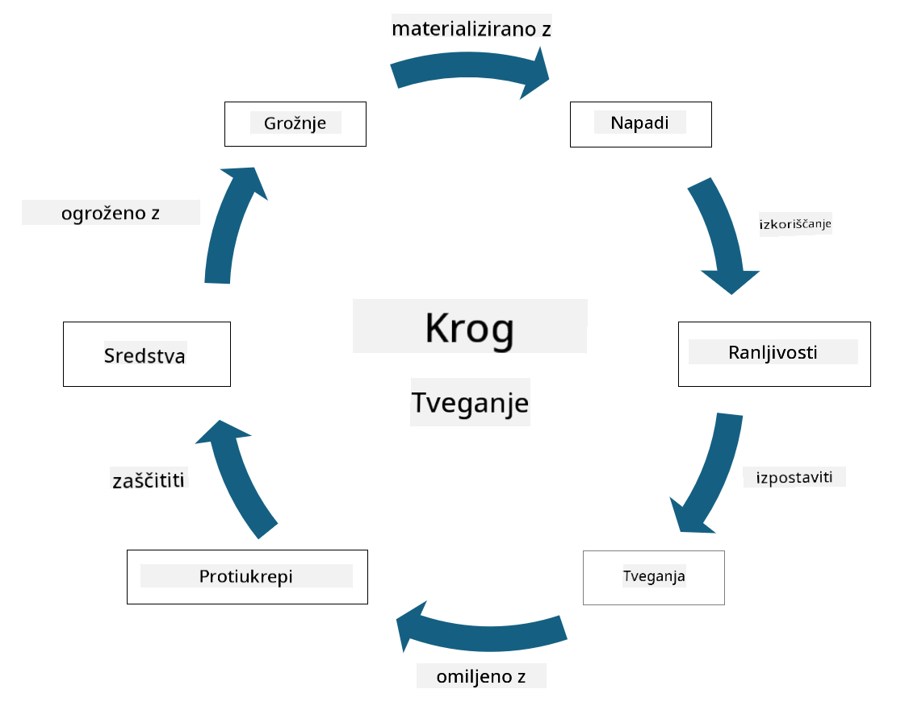

<!--
CO_OP_TRANSLATOR_METADATA:
{
  "original_hash": "fcca304f072cabf206388199e8e2e578",
  "translation_date": "2025-09-04T01:36:32+00:00",
  "source_file": "1.3 Understanding risk management.md",
  "language_code": "sl"
}
-->
# Razumevanje upravljanja tveganj

## Uvod

V tej lekciji bomo obravnavali:

- Definicije pogosto uporabljenih varnostnih izrazov

- Vrste varnostnih ukrepov

- Ocena varnostnih tveganj

## Definicije pogosto uporabljenih varnostnih izrazov

Ti izrazi so temeljni koncepti na področju kibernetske varnosti in upravljanja tveganj. Poglejmo si vsak izraz in kako se med seboj povezujejo:

1. **Grožnja (Threat Agent)**:

Grožnja je posameznik, skupina, organizacija ali avtomatiziran sistem, ki ima potencial izkoristiti ranljivosti v sistemu ali omrežju ter povzročiti škodo ali poškodbe. Grožnje lahko predstavljajo hekerji, avtorji zlonamerne programske opreme, nezadovoljni zaposleni ali katerikoli subjekt, ki predstavlja tveganje za informacijske in tehnološke sisteme.

2. **Grožnja (Threat)**:

Grožnja je potencialni dogodek ali dejanje, ki lahko izkoristi ranljivosti v sistemu in povzroči škodo na sredstvih. Grožnje vključujejo dejanja, kot so vdori, kraje podatkov, napadi za zavrnitev storitve in podobno. Grožnje so "kaj" v smislu potencialne škode, ki jo lahko utrpijo sredstva organizacije.

3. **Ranljivost (Vulnerability)**:

Ranljivost je šibkost ali pomanjkljivost v zasnovi, izvedbi ali konfiguraciji sistema, ki jo lahko grožnja izkoristi za ogrožanje varnosti sistema. Ranljivosti se lahko pojavijo v programski opremi, strojni opremi, procesih ali človeškem vedenju. Identifikacija in odpravljanje ranljivosti sta ključna za zmanjšanje tveganja uspešnih napadov.

4. **Tveganje (Risk)**:

Tveganje je potencialna izguba, škoda ali poškodba, ki izhaja iz interakcije med grožnjo in ranljivostjo. To je verjetnost, da bo grožnja izkoristila ranljivost in povzročila negativne posledice. Tveganja se pogosto ocenjujejo glede na njihov potencialni vpliv in verjetnost nastanka.

5. **Sredstvo (Asset)**:

Sredstvo je karkoli vrednega, kar organizacija želi zaščititi. Sredstva lahko vključujejo fizične predmete (kot so računalniki in strežniki), podatke (informacije o strankah, finančne evidence), intelektualno lastnino (poslovne skrivnosti, patente) in celo človeške vire (znanje in veščine zaposlenih). Zaščita sredstev je ključni cilj kibernetske varnosti.

6. **Izpostavljenost (Exposure)**:

Izpostavljenost se nanaša na stanje, ko je sistem ranljiv za potencialne grožnje. Pojavi se, ko obstaja ranljivost, ki jo lahko grožnja izkoristi. Izpostavljenost poudarja tveganje, povezano s prisotnostjo ranljivosti v sistemu ali omrežju.

7. **Ukrepi (Control)**:

Ukrepi so ukrepi, ki se izvajajo za zmanjšanje tveganja, povezanega z ranljivostmi in grožnjami. Ukrepi so lahko tehnični, postopkovni ali administrativni. Namenjeni so preprečevanju, zaznavanju ali blaženju potencialnih groženj in ranljivosti. Primeri vključujejo požarne zidove, nadzor dostopa, šifriranje, varnostne politike in usposabljanje zaposlenih.

Če povzamemo odnos med temi izrazi: Grožnje izkoriščajo ranljivosti za izvajanje groženj, kar lahko vodi do tveganj, ki imajo potencial povzročiti škodo na dragocenih sredstvih. Izpostavljenost se pojavi, ko so prisotne ranljivosti, ukrepi pa se izvajajo za zmanjšanje tveganja z preprečevanjem ali blaženjem vpliva groženj na sredstva. Ta okvir predstavlja osnovo upravljanja kibernetskih tveganj, ki organizacijam pomaga pri identifikaciji, ocenjevanju in obravnavanju potencialnih tveganj za njihove informacijske sisteme in sredstva.

## Vrste varnostnih ukrepov

Varnostni ukrepi so ukrepi ali zaščitni mehanizmi, ki se izvajajo za zaščito informacijskih sistemov in sredstev pred različnimi grožnjami in ranljivostmi. Razvrstimo jih lahko v več kategorij glede na njihov namen in osredotočenost. Tukaj so nekatere pogoste vrste varnostnih ukrepov:

1. **Administrativni ukrepi**:

Ti ukrepi se nanašajo na politike, postopke in smernice, ki urejajo varnostne prakse organizacije in vedenje uporabnikov.

- Varnostne politike in postopki: Dokumentirane smernice, ki določajo, kako se varnost vzdržuje v organizaciji.

- Ozaveščenost o varnosti in usposabljanje: Programi za izobraževanje zaposlenih o najboljših praksah varnosti in potencialnih grožnjah.

- Načrti za odziv na incidente: Načrti za odzivanje na varnostne incidente in njihovo blaženje.

2. **Tehnični ukrepi**:

Tehnični ukrepi vključujejo uporabo tehnologije za izvajanje varnostnih ukrepov in zaščito sistemov ter podatkov. Primeri tehničnih ukrepov so:

- Nadzor dostopa: Ukrepi, ki omejujejo dostop uporabnikov do virov glede na njihove vloge in dovoljenja.

- Šifriranje: Pretvorba podatkov v varen format za preprečevanje nepooblaščenega dostopa.

- Požarni zidovi: Naprave za varnost omrežja, ki filtrirajo in nadzorujejo vhodni ter izhodni promet.

- Sistemi za zaznavanje in preprečevanje vdorov (IDPS): Orodja za spremljanje omrežnega prometa zaradi sumljivih aktivnosti.

- Antivirusna in antimalware programska oprema: Programi za zaznavanje in odstranjevanje zlonamerne programske opreme.

- Mehanizmi za preverjanje identitete: Metode za preverjanje identitete uporabnikov, kot so gesla, biometrija in večfaktorska avtentikacija.

- Upravljanje popravkov: Redno posodabljanje programske opreme za odpravljanje znanih ranljivosti.

3. **Fizični ukrepi**:

Fizični ukrepi so ukrepi za zaščito fizičnih sredstev in objektov.

- Varnostniki in osebje za nadzor dostopa: Osebje, ki spremlja in nadzoruje dostop do fizičnih prostorov.

- Kamere za nadzor: Video nadzorni sistemi za spremljanje in snemanje aktivnosti.

- Ključavnice in fizične ovire: Fizični ukrepi za omejevanje dostopa do občutljivih območij.

- Okoljski ukrepi: Ukrepi za regulacijo temperature, vlage in drugih okoljskih dejavnikov, ki vplivajo na opremo in podatkovne centre.

4. **Operativni ukrepi**:

Ti ukrepi se nanašajo na vsakodnevne operacije in aktivnosti, ki zagotavljajo stalno varnost sistemov.

- Upravljanje sprememb: Procesi za sledenje in odobritev sprememb v sistemih in konfiguracijah.

- Varnostno kopiranje in obnova po katastrofi: Načrti za varnostno kopiranje podatkov in njihovo obnovo v primeru okvar sistema ali katastrof.

- Beleženje in revizija: Spremljanje in beleženje aktivnosti sistema za varnostne in skladnostne namene.

- Prakse varnega kodiranja: Smernice za pisanje programske opreme, ki zmanjšujejo ranljivosti.

5. **Pravni in regulativni ukrepi**:

Ti ukrepi zagotavljajo skladnost z ustreznimi zakoni, predpisi in industrijskimi standardi. Standardi, ki jih mora organizacija upoštevati, so odvisni od jurisdikcije, industrijskega sektorja in drugih dejavnikov.

- Predpisi o varstvu podatkov: Skladnost z zakoni, kot so GDPR, HIPAA in CCPA.

- Industrijski standardi: Upoštevanje standardov, kot je PCI DSS za varnost podatkov plačilnih kartic.

Te kategorije varnostnih ukrepov delujejo skupaj, da ustvarijo celovito varnostno držo organizacij, ki pomaga zaščititi njihove sisteme, podatke in sredstva pred širokim naborom groženj.

## Ocena varnostnih tveganj

Nekateri strokovnjaki za varnost menijo, da je upravljanje tveganj naloga strokovnjakov za tveganja, vendar je razumevanje procesa upravljanja varnostnih tveganj pomembno za vsakega strokovnjaka za varnost, da lahko izrazi varnostna tveganja v jeziku, ki ga preostali del organizacije razume in na podlagi katerega lahko ukrepa.

Organizacije morajo nenehno ocenjevati varnostna tveganja in se odločati, kakšne ukrepe (ali neukrepe) bodo sprejele proti tveganjem za poslovanje. Spodaj je pregled, kako se to običajno izvaja. Upoštevajte, da ta proces običajno poteka med več različnimi ekipami znotraj organizacije; redko je ena ekipa odgovorna za celovito upravljanje tveganj.

1. **Identifikacija sredstev in groženj**:

Organizacija identificira sredstva, ki jih želi zaščititi. Ta lahko vključujejo podatke, sisteme, strojno opremo, programsko opremo, intelektualno lastnino in drugo. Nato identificira potencialne grožnje, ki bi lahko ciljale na ta sredstva.

2. **Ocena ranljivosti**:

Organizacije nato identificirajo ranljivosti ali šibkosti v sistemih ali procesih, ki bi jih grožnje lahko izkoristile. Te ranljivosti lahko izhajajo iz napak v programski opremi, napačnih konfiguracij, pomanjkanja varnostnih ukrepov in človeških napak.

3. **Ocena verjetnosti**:

Organizacija nato oceni verjetnost vsake grožnje. To vključuje upoštevanje zgodovinskih podatkov, obveščevalnih informacij o grožnjah, industrijskih trendov in notranjih dejavnikov. Verjetnost se lahko razvrsti kot nizka, srednja ali visoka glede na verjetnost uresničitve grožnje.

4. **Ocena vpliva**:

Nato organizacija določi potencialni vpliv vsake grožnje, če bi izkoristila ranljivost. Vpliv lahko vključuje finančne izgube, operativne motnje, škodo na ugledu, pravne posledice in drugo. Vpliv se lahko razvrsti kot nizek, srednji ali visok glede na potencialne posledice.

5. **Izračun tveganja**:

Oceni verjetnosti in vpliva se združita za izračun celotne ravni tveganja za vsako identificirano grožnjo. To se pogosto izvaja z matriko tveganja, ki dodeljuje številčne vrednosti ali kvalitativne opise ravnem verjetnosti in vpliva. Nastala raven tveganja pomaga določiti, katera tveganja zahtevajo takojšnjo pozornost.

6. **Prioritizacija in odločanje**:

Organizacija nato prioritizira tveganja, pri čemer se osredotoči na tista z najvišjimi kombiniranimi vrednostmi verjetnosti in vpliva. To ji omogoča učinkovitejšo dodelitev virov in izvajanje ukrepov. Grožnje z visokim tveganjem zahtevajo takojšnjo pozornost, medtem ko se grožnje z nižjim tveganjem lahko obravnavajo v daljšem časovnem obdobju.

7. **Obravnava tveganj**:

Na podlagi ocene tveganj organizacija določi, kako ublažiti ali upravljati vsako tveganje. To lahko vključuje izvajanje varnostnih ukrepov, prenos tveganja prek zavarovanja ali celo sprejemanje določenih ravni preostalega tveganja, če se ocenijo kot obvladljive/preveč drage za odpravo itd.

8. **Nenehno spremljanje in pregled**:

Ocena tveganj ni enkraten proces. Izvajati jo je treba periodično ali kadar pride do pomembnih sprememb v okolju organizacije. Nenehno spremljanje zagotavlja, da so upoštevane nove grožnje, ranljivosti ali spremembe v poslovnem okolju.

Z ocenjevanjem varnostnih tveganj na strukturiran način lahko organizacije sprejemajo informirane odločitve o dodelitvi virov, varnostnih ukrepih in strategijah upravljanja tveganj. Cilj je zmanjšati celotno izpostavljenost organizacije tveganjem, hkrati pa uskladiti varnostne napore s poslovnimi cilji in usmeritvami organizacije.

---

**Omejitev odgovornosti**:  
Ta dokument je bil preveden z uporabo storitve za strojno prevajanje [Co-op Translator](https://github.com/Azure/co-op-translator). Čeprav si prizadevamo za natančnost, vas prosimo, da se zavedate, da lahko avtomatizirani prevodi vsebujejo napake ali netočnosti. Izvirni dokument v njegovem izvirnem jeziku je treba obravnavati kot avtoritativni vir. Za ključne informacije priporočamo strokovno človeško prevajanje. Ne prevzemamo odgovornosti za morebitna nesporazumevanja ali napačne razlage, ki izhajajo iz uporabe tega prevoda.