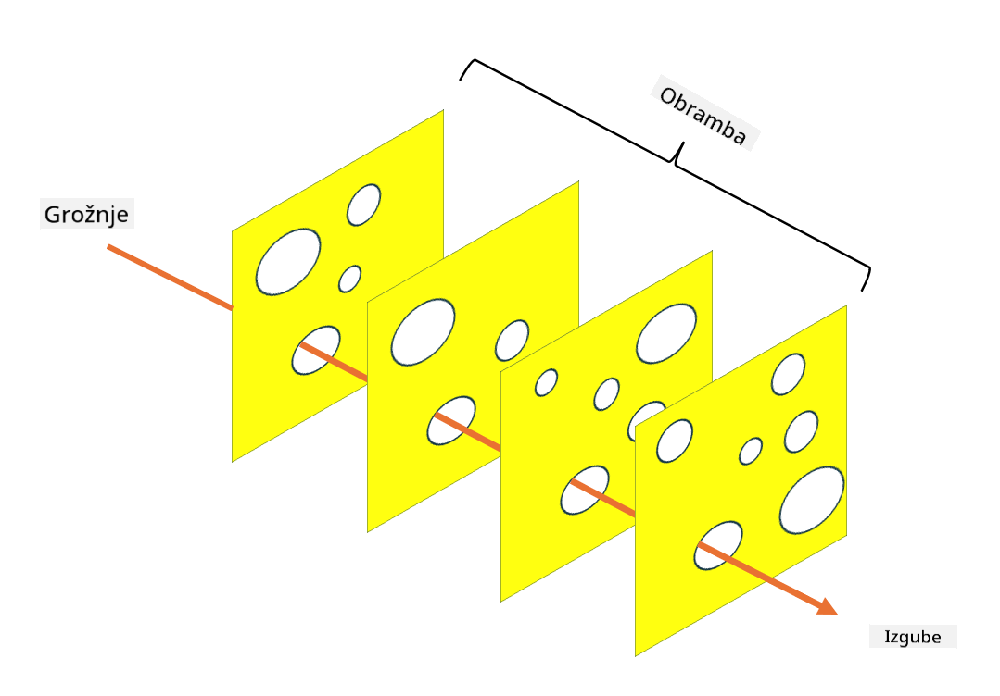

<!--
CO_OP_TRANSLATOR_METADATA:
{
  "original_hash": "75f77f972d2233c584f87c1eb96c983b",
  "translation_date": "2025-09-03T23:50:37+00:00",
  "source_file": "1.5 Zero trust.md",
  "language_code": "sl"
}
-->
# Zero Trust

"Zero trust" je izraz, ki se danes pogosto uporablja v krogih kibernetske varnosti. Kaj pa pravzaprav pomeni? Je to le modna muha? V tej lekciji bomo podrobno raziskali, kaj zero trust dejansko je.

## Uvod

- V tej lekciji bomo obravnavali:
  
  - Kaj je zero trust?
  
  - Kako se zero trust razlikuje od tradicionalnih varnostnih arhitektur?
  
  - Kaj je obramba v globino?

## Zero Trust

Zero Trust je pristop kibernetske varnosti, ki izpodbija tradicionalni koncept "zaupaj, a preveri" s predpostavko, da noben subjekt, bodisi znotraj ali zunaj omrežja organizacije, ne sme biti samodejno zaupanja vreden. Namesto tega Zero Trust zagovarja preverjanje vsakega uporabnika, naprave in aplikacije, ki poskuša dostopati do virov, ne glede na njihovo lokacijo. Osnovno načelo Zero Trust je zmanjšanje "površine napada" in omejevanje potencialnega vpliva varnostnih kršitev.

V modelu Zero Trust so poudarjena naslednja načela:

1. **Preverjanje identitete**: Avtentikacija in avtorizacija se strogo izvajata za vse uporabnike in naprave, ne glede na njihovo lokacijo. Ne pozabite, da identiteta ni nujno človeška – lahko gre za napravo, aplikacijo itd.

2. **Najmanjše privilegije**: Uporabnikom in napravam se dodeli najmanjša raven dostopa, ki je potrebna za opravljanje njihovih nalog, kar zmanjšuje potencialno škodo v primeru kompromitacije.

3. **Mikrosegmentacija**: Omrežni viri so razdeljeni na manjše segmente, da se omeji lateralno gibanje znotraj omrežja v primeru kršitve.

4. **Nenehno spremljanje**: Izvajajo se stalno spremljanje in analiza vedenja uporabnikov in naprav za odkrivanje anomalij in potencialnih groženj. Sodobne tehnike spremljanja vključujejo tudi strojno učenje, umetno inteligenco in obveščanje o grožnjah za zagotavljanje dodatnih podrobnosti in konteksta.

5. **Šifriranje podatkov**: Podatki so šifrirani tako med prenosom kot v mirovanju, da se prepreči nepooblaščen dostop.

6. **Strogi nadzor dostopa**: Nadzor dostopa se izvaja na podlagi konteksta, kot so vloge uporabnikov, stanje naprav in lokacija omrežja.

Microsoft razdeli Zero Trust na pet stebrov, ki jih bomo obravnavali v kasnejši lekciji.

## Razlike od tradicionalnih varnostnih arhitektur

Zero Trust se od tradicionalnih varnostnih arhitektur, kot so modeli, ki temeljijo na obodu, razlikuje na več načinov:

1. **Obod vs. identitetno usmerjen pristop**: Tradicionalni modeli se osredotočajo na zaščito oboda omrežja in predpostavljajo, da so notranji uporabniki in naprave zaupanja vredni, ko so enkrat znotraj. Zero Trust pa predpostavlja, da grožnje lahko izvirajo tako znotraj kot zunaj omrežja, in uveljavlja stroge kontrole, ki temeljijo na identiteti.

2. **Implicitno vs. eksplicitno zaupanje**: Tradicionalni modeli implicitno zaupajo napravam in uporabnikom znotraj omrežja, dokler ni dokazano nasprotno. Zero Trust eksplicitno preverja identitete in nenehno spremlja anomalije.

3. **Ravno vs. segmentirano omrežje**: Tradicionalne arhitekture pogosto vključujejo ravna omrežja, kjer imajo notranji uporabniki širok dostop. Zero Trust zagovarja segmentacijo omrežja na manjše, izolirane cone za omejevanje potencialnih kršitev.

4. **Reaktivno vs. proaktivno**: Tradicionalna varnost se pogosto zanaša na reaktivne ukrepe, kot so obodni požarni zidovi in sistemi za zaznavanje vdorov. Zero Trust zavzema proaktiven pristop s predpostavko, da so kršitve verjetne, in zmanjšuje njihov vpliv.

## Obramba v globino

Obramba v globino, znana tudi kot slojevita varnost, je strategija kibernetske varnosti, ki vključuje uvajanje več slojev varnostnih kontrol in ukrepov za zaščito sredstev organizacije. Cilj je ustvariti prekrivajoče se sloje obrambe, tako da lahko drugi sloji še vedno zagotavljajo zaščito, če je en sloj prebit. Vsak sloj se osredotoča na drugačen vidik varnosti in povečuje splošno varnostno držo organizacije.

Obramba v globino vključuje kombinacijo tehničnih, postopkovnih in fizičnih varnostnih ukrepov. Ti lahko vključujejo požarne zidove, sisteme za zaznavanje vdorov, nadzor dostopa, šifriranje, usposabljanje uporabnikov, varnostne politike in drugo. Ideja je ustvariti več ovir, ki skupaj otežujejo napadalcem vdor v sisteme in omrežja organizacije. To je včasih znano tudi kot "model švicarskega sira", ki se uporablja tudi pri preprečevanju nesreč v drugih panogah (npr. transport).

## Nadaljnje branje

[What is Zero Trust?](https://learn.microsoft.com/security/zero-trust/zero-trust-overview?WT.mc_id=academic-96948-sayoung)

[Evolving Zero Trust – Microsoft Position Paper](https://query.prod.cms.rt.microsoft.com/cms/api/am/binary/RWJJdT?WT.mc_id=academic-96948-sayoung)

[Zero Trust and BeyondCorp Google Cloud | Google Cloud Blog](https://cloud.google.com/blog/topics/developers-practitioners/zero-trust-and-beyondcorp-google-cloud)

---

**Omejitev odgovornosti**:  
Ta dokument je bil preveden z uporabo storitve za strojno prevajanje [Co-op Translator](https://github.com/Azure/co-op-translator). Čeprav si prizadevamo za natančnost, vas prosimo, da se zavedate, da lahko avtomatizirani prevodi vsebujejo napake ali netočnosti. Izvirni dokument v njegovem izvirnem jeziku je treba obravnavati kot avtoritativni vir. Za ključne informacije priporočamo strokovno človeško prevajanje. Ne prevzemamo odgovornosti za morebitna nesporazumevanja ali napačne razlage, ki izhajajo iz uporabe tega prevoda.