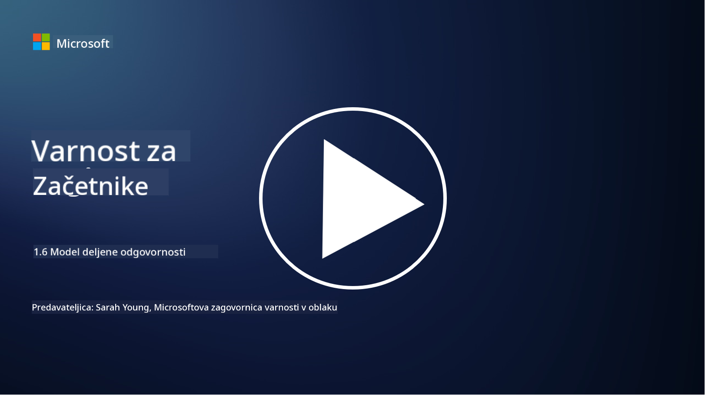

<!--
CO_OP_TRANSLATOR_METADATA:
{
  "original_hash": "a48db640d80c786b928ca178c414f084",
  "translation_date": "2025-09-04T00:29:23+00:00",
  "source_file": "1.6 Shared responsibility model.md",
  "language_code": "sl"
}
-->
# Model deljene odgovornosti

Deljena odgovornost je novejši koncept v IT-ju, ki se je pojavil z razvojem računalništva v oblaku. Z vidika kibernetske varnosti je ključnega pomena razumeti, kdo zagotavlja katere varnostne ukrepe, da ne pride do vrzeli v obrambi.

## Uvod

V tej lekciji bomo obravnavali:

- Kaj je deljena odgovornost v kontekstu kibernetske varnosti?

- Kakšna je razlika v deljeni odgovornosti za varnostne ukrepe med IaaS, PaaS in SaaS?

- Kje lahko najdete informacije o varnostnih ukrepih, ki jih zagotavlja vaša platforma v oblaku?

- Kaj pomeni "zaupaj, a preveri"?

## Kaj je deljena odgovornost v kontekstu kibernetske varnosti?

Deljena odgovornost v kibernetski varnosti se nanaša na razdelitev varnostnih nalog med ponudnikom storitev v oblaku (CSP) in njegovimi strankami. V okoljih računalništva v oblaku, kot so Infrastructure as a Service (IaaS), Platform as a Service (PaaS) in Software as a Service (SaaS), imata tako CSP kot stranka vlogo pri zagotavljanju varnosti podatkov, aplikacij in sistemov.

## Kakšna je razlika v deljeni odgovornosti za varnostne ukrepe med IaaS, PaaS in SaaS?

Razdelitev odgovornosti običajno temelji na vrsti uporabljene storitve v oblaku:

- **IaaS (Infrastructure as a Service)**: CSP zagotavlja osnovno infrastrukturo (strežnike, omrežje, shranjevanje), medtem ko je stranka odgovorna za upravljanje operacijskih sistemov, aplikacij in varnostnih konfiguracij na tej infrastrukturi.

- **PaaS (Platform as a Service)**: CSP ponuja platformo, na kateri lahko stranke gradijo in uvajajo aplikacije. CSP upravlja osnovno infrastrukturo, stranka pa se osredotoča na razvoj aplikacij in varnost podatkov.

- **SaaS (Software as a Service)**: CSP zagotavlja popolnoma funkcionalne aplikacije, dostopne prek interneta. V tem primeru je CSP odgovoren za varnost aplikacije in infrastrukture, medtem ko stranka upravlja dostop uporabnikov in uporabo podatkov.

Razumevanje deljene odgovornosti je ključno, saj pojasnjuje, kateri vidiki varnosti so pokriti s strani CSP in katere mora nasloviti stranka. To pomaga preprečiti nesporazume in zagotavlja celovito izvajanje varnostnih ukrepov.

## Kje lahko najdete informacije o varnostnih ukrepih, ki jih zagotavlja vaša platforma v oblaku?

Da bi izvedeli, katere varnostne ukrepe zagotavlja vaša platforma v oblaku, se morate obrniti na dokumentacijo in vire ponudnika storitev v oblaku. Ti vključujejo:

- **Spletno mesto in dokumentacija CSP**: Spletno mesto CSP bo vsebovalo informacije o varnostnih funkcijah in ukrepih, ki so del njihovih storitev. CSP-ji običajno ponujajo podrobno dokumentacijo, ki pojasnjuje njihove varnostne prakse, ukrepe in priporočila. To lahko vključuje bele knjige, varnostne vodnike in tehnično dokumentacijo.

- **Varnostne ocene in revizije**: Večina CSP-jev svoje varnostne ukrepe oceni neodvisni varnostni strokovnjaki in organizacije. Te ocene lahko ponudijo vpogled v kakovost varnostnih ukrepov CSP-ja. Včasih to vodi do pridobitve certifikata o skladnosti z varnostnimi standardi (glejte naslednjo točko).

- **Certifikati o skladnosti z varnostnimi standardi**: Večina CSP-jev pridobi certifikate, kot so ISO:27001, SOC 2 in FedRAMP itd. Ti certifikati dokazujejo, da ponudnik izpolnjuje določene varnostne in skladnostne standarde.

Ne pozabite, da se lahko raven podrobnosti in dostopnost informacij razlikujeta med ponudniki storitev v oblaku. Vedno se prepričajte, da uporabljate uradne in posodobljene vire, ki jih zagotavlja ponudnik storitev v oblaku, da sprejemate informirane odločitve o varnosti svojih sredstev v oblaku.

## Kaj pomeni "zaupaj, a preveri"?

V kontekstu uporabe CSP-ja, programske opreme tretjih oseb ali druge storitve IT varnosti lahko organizacija sprva zaupa trditvam ponudnika o varnostnih ukrepih. Vendar pa mora za resnično zagotovitev varnosti svojih podatkov in sistemov te trditve preveriti prek varnostnih ocen, testiranja penetracije in pregleda varnostnih ukrepov zunanjega ponudnika, preden popolnoma integrira programsko opremo ali storitev v svoje delovanje. Vsi posamezniki in organizacije bi morali zaupati, a preveriti varnostne ukrepe, za katere niso odgovorni.

## Deljena odgovornost znotraj organizacije

Ne pozabite, da je treba upoštevati tudi deljeno odgovornost za varnost znotraj organizacije med različnimi ekipami. Varnostna ekipa redko sama izvaja vse ukrepe in mora sodelovati z operativnimi ekipami, razvijalci in drugimi deli podjetja, da uvede vse potrebne varnostne ukrepe za zaščito organizacije.

## Dodatno branje

- [Shared responsibility in the cloud - Microsoft Azure | Microsoft Learn](https://learn.microsoft.com/azure/security/fundamentals/shared-responsibility?WT.mc_id=academic-96948-sayoung)
- [What is shared responsibility model? – Definition from TechTarget.com](https://www.techtarget.com/searchcloudcomputing/definition/shared-responsibility-model)
- [The shared responsibility model explained and what it means for cloud security | CSO Online](https://www.csoonline.com/article/570779/the-shared-responsibility-model-explained-and-what-it-means-for-cloud-security.html)
- [Shared Responsibility for Cloud Security: What You Need to Know (cisecurity.org)](https://www.cisecurity.org/insights/blog/shared-responsibility-cloud-security-what-you-need-to-know)

---

**Omejitev odgovornosti**:  
Ta dokument je bil preveden z uporabo storitve AI za prevajanje [Co-op Translator](https://github.com/Azure/co-op-translator). Čeprav si prizadevamo za natančnost, vas prosimo, da upoštevate, da lahko avtomatizirani prevodi vsebujejo napake ali netočnosti. Izvirni dokument v njegovem izvirnem jeziku je treba obravnavati kot avtoritativni vir. Za ključne informacije priporočamo profesionalni človeški prevod. Ne prevzemamo odgovornosti za morebitna napačna razumevanja ali napačne interpretacije, ki bi nastale zaradi uporabe tega prevoda.