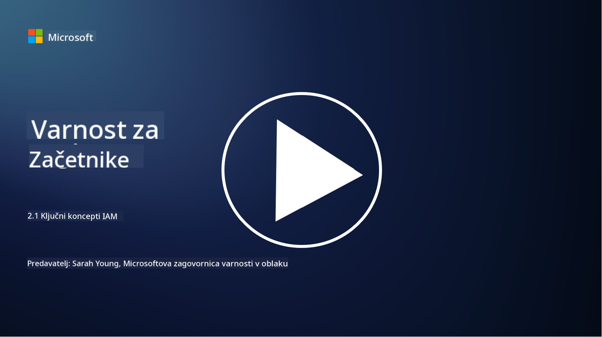

<!--
CO_OP_TRANSLATOR_METADATA:
{
  "original_hash": "2e3864e3d579f0dbb4ac2ec8c5f82acf",
  "translation_date": "2025-09-03T22:44:07+00:00",
  "source_file": "2.1 IAM key concepts.md",
  "language_code": "sl"
}
-->
# Ključni koncepti IAM

Ste se že kdaj prijavili v računalnik ali na spletno stran? Seveda ste! To pomeni, da ste že uporabljali nadzor identitete v vsakdanjem življenju. Upravljanje identitete in dostopa (IAM) je ključni steber varnosti, o katerem bomo več izvedeli v naslednjih lekcijah.

**Uvod**

V tej lekciji bomo obravnavali:

- Kaj pomeni upravljanje identitete in dostopa (IAM) v kontekstu kibernetske varnosti?

- Kaj je načelo najmanjših privilegijev?

- Kaj je ločevanje dolžnosti?

- Kaj sta avtentikacija in avtorizacija?

## Kaj pomeni upravljanje identitete in dostopa (IAM) v kontekstu kibernetske varnosti?

Upravljanje identitete in dostopa (IAM) se nanaša na niz procesov, tehnologij in politik, ki se izvajajo za zagotovitev, da imajo pravi posamezniki ustrezen dostop do virov v digitalnem okolju organizacije. IAM vključuje upravljanje digitalnih identitet (uporabnikov, zaposlenih, partnerjev) in njihovega dostopa do sistemov, aplikacij, podatkov in omrežij. Glavni cilj IAM je izboljšanje varnosti, poenostavitev dostopa uporabnikov in zagotavljanje skladnosti z organizacijskimi politikami ter predpisi. Rešitve IAM običajno vključujejo avtentikacijo uporabnikov, avtorizacijo, upravljanje identitet, nadzor dostopa in upravljanje življenjskega cikla uporabnikov (zagotavljanje, da se računi izbrišejo, ko se ne uporabljajo več).

## Kaj je načelo najmanjših privilegijev?

Načelo najmanjših privilegijev je temeljni koncept, ki zagovarja dodeljevanje uporabnikom in sistemom le tistih privilegijev, ki so nujno potrebni za izvajanje njihovih nalog ali vlog. To načelo pomaga omejiti potencialno škodo, ki bi lahko nastala v primeru varnostne kršitve ali notranje grožnje. Z upoštevanjem načela najmanjših privilegijev organizacije zmanjšajo površino napada in tveganje nepooblaščenega dostopa, kršitev podatkov ter nenamerne zlorabe privilegijev. V praksi to pomeni, da imajo uporabniki dostop le do specifičnih virov in funkcionalnosti, ki jih potrebujejo za svoje delovne naloge, in nič več. Na primer, če morate samo prebrati dokument, bi bilo pretirano, da bi vam dodelili polne skrbniške pravice do tega dokumenta.

## Kaj je ločevanje dolžnosti?

Ločevanje dolžnosti je načelo, ki si prizadeva preprečiti konflikte interesov in zmanjšati tveganje goljufij ter napak z razdelitvijo ključnih nalog in odgovornosti med različne posameznike znotraj organizacije. V kontekstu kibernetske varnosti ločevanje dolžnosti vključuje zagotavljanje, da noben posameznik nima nadzora nad vsemi vidiki kritičnega procesa ali sistema. Cilj je ustvariti sistem preverjanj in ravnovesij, ki preprečuje, da bi ena oseba imela možnost izvajati tako nastavitvene kot odobritvene faze procesa. Na primer, v finančnih sistemih to lahko pomeni, da oseba, ki vnese transakcije v sistem, ne sme biti ista oseba, ki te transakcije odobri. To zmanjšuje tveganje, da bi nepooblaščena ali goljufiva dejanja ostala neopažena.

## Kaj sta avtentikacija in avtorizacija?

Avtentikacija in avtorizacija sta dva temeljna koncepta v kibernetski varnosti, ki igrata ključno vlogo pri zagotavljanju varnosti in integritete računalniških sistemov ter podatkov. Pogosto se uporabljata skupaj za nadzor dostopa do virov in zaščito občutljivih informacij.

**1. Avtentikacija**: Avtentikacija je proces preverjanja identitete uporabnika, sistema ali entitete, ki poskuša dostopati do računalniškega sistema ali specifičnega vira. Zagotavlja, da je prijavljena identiteta resnična in točna. Metode avtentikacije običajno vključujejo uporabo enega ali več naslednjih dejavnikov:

   a. Nekaj, kar poznate: To vključuje gesla, PIN kode ali druge skrivne informacije, ki jih ima le pooblaščeni uporabnik.

   b. Nekaj, kar imate: To vključuje fizične naprave ali predmete, kot so pametne kartice, varnostni žetoni ali mobilni telefoni, ki potrjujejo identiteto uporabnika.

   c. Nekaj, kar ste: To se nanaša na biometrične dejavnike, kot so prstni odtisi, prepoznavanje obraza ali skeniranje mrežnice, ki so edinstveni za posameznika.

Mehanizmi avtentikacije se uporabljajo za potrditev, da je uporabnik tisti, za katerega se izdaja, preden mu omogočijo dostop do sistema ali vira. Pomagajo preprečiti nepooblaščen dostop in zagotavljajo, da lahko dejanja v sistemu izvajajo le legitimni uporabniki.

**2. Avtorizacija**: Avtorizacija je proces dodeljevanja ali zavračanja specifičnih dovoljenj in privilegijev avtenticiranim uporabnikom ali entitetam, potem ko je njihova identiteta potrjena. Določa, katere akcije ali operacije lahko uporabnik izvaja znotraj sistema ali na specifičnih virih. Avtorizacija temelji na vnaprej določenih politikah, pravilih nadzora dostopa in vlogah, dodeljenih uporabnikom.

Avtorizacijo si lahko predstavljamo kot odgovor na vprašanje: "Kaj lahko avtenticirani uporabnik počne?" Vključuje definiranje in uveljavljanje politik nadzora dostopa za zaščito občutljivih podatkov in virov pred nepooblaščenim dostopom ali spremembami.

**Povzetek:**

- Avtentikacija potrjuje identiteto uporabnikov ali entitet.
- Avtorizacija določa, katere akcije in vire lahko avtenticirani uporabniki dostopajo ali upravljajo.

## Dodatno branje

- [Describe identity concepts - Training | Microsoft Learn](https://learn.microsoft.com/training/modules/describe-identity-principles-concepts/?WT.mc_id=academic-96948-sayoung)
- [Introduction to identity - Microsoft Entra | Microsoft Learn](https://learn.microsoft.com/azure/active-directory/fundamentals/identity-fundamental-concepts?WT.mc_id=academic-96948-sayoung)
- [What is Identity Access Management (IAM)? | Microsoft Security](https://www.microsoft.com/security/business/security-101/what-is-identity-access-management-iam?WT.mc_id=academic-96948-sayoung)
- [What is IAM? Identity and access management explained | CSO Online](https://www.csoonline.com/article/518296/what-is-iam-identity-and-access-management-explained.html)
- [What is IAM? (auth0.com)](https://auth0.com/blog/what-is-iam/)
- [Security+: implementing Identity and Access Management (IAM) controls [updated 2021] | Infosec (infosecinstitute.com)](https://resources.infosecinstitute.com/certifications/securityplus/security-implementing-identity-and-access-management-iam-controls/)
- [least privilege - Glossary | CSRC (nist.gov)](https://csrc.nist.gov/glossary/term/least_privilege)
- [Security: The Principle of Least Privilege (POLP) - Microsoft Community Hub](https://techcommunity.microsoft.com/t5/azure-sql-blog/security-the-principle-of-least-privilege-polp/ba-p/2067390?WT.mc_id=academic-96948-sayoung)
- [Principle of least privilege | CERT NZ](https://www.cert.govt.nz/it-specialists/critical-controls/principle-of-least-privilege/)
- [Why is separation of duties required by NIST 800-171 and CMMC? - (totem.tech)](https://www.totem.tech/cmmc-separation-of-duties/)

---

**Omejitev odgovornosti**:  
Ta dokument je bil preveden z uporabo storitve za prevajanje z umetno inteligenco [Co-op Translator](https://github.com/Azure/co-op-translator). Čeprav si prizadevamo za natančnost, vas prosimo, da upoštevate, da lahko avtomatizirani prevodi vsebujejo napake ali netočnosti. Izvirni dokument v njegovem maternem jeziku je treba obravnavati kot avtoritativni vir. Za ključne informacije priporočamo profesionalni človeški prevod. Ne prevzemamo odgovornosti za morebitna napačna razumevanja ali napačne interpretacije, ki bi nastale zaradi uporabe tega prevoda.