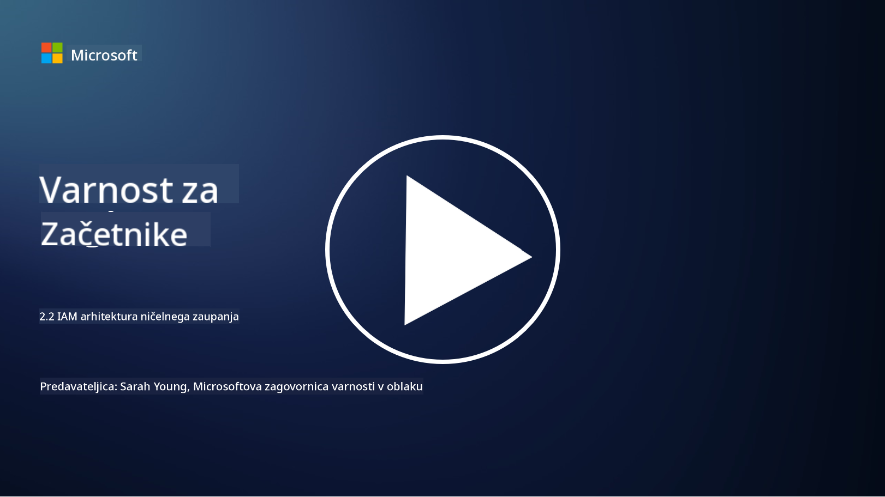

<!--
CO_OP_TRANSLATOR_METADATA:
{
  "original_hash": "4774a978af123f72ebb872199c4c4d4f",
  "translation_date": "2025-09-03T23:44:21+00:00",
  "source_file": "2.2 IAM zero trust architecture.md",
  "language_code": "sl"
}
-->
# IAM arhitektura ničelnega zaupanja

Identiteta je ključni del pri izvajanju arhitekture ničelnega zaupanja in vzpostavljanju perimetra za katerokoli IT okolje. V tem razdelku bomo raziskali, zakaj je pomembno uporabljati identitetne kontrole za implementacijo ničelnega zaupanja.

## Uvod

V tej lekciji bomo obravnavali:

- Zakaj moramo uporabljati identiteto kot naš perimeter v sodobnih IT okoljih?

- Kako se to razlikuje od tradicionalnih IT arhitektur?

- Kako se identiteta uporablja za implementacijo arhitekture ničelnega zaupanja?

## Zakaj moramo uporabljati identiteto kot naš perimeter v sodobnih IT okoljih?

V sodobnih IT okoljih postaja tradicionalni koncept fizičnega perimetra (z uporabo orodij, kot so požarni zidovi in omrežne meje) kot primarne obrambne linije proti kibernetskim grožnjam vse manj učinkovit zaradi naraščajoče kompleksnosti tehnologije, porasta dela na daljavo in sprejemanja oblačnih storitev. Namesto tega se organizacije usmerjajo k uporabi identitete kot novega perimetra. To pomeni, da se varnost osredotoča na preverjanje in upravljanje identitete uporabnikov, naprav in aplikacij, ki poskušajo dostopati do virov, ne glede na njihovo fizično lokacijo.

Tukaj je nekaj razlogov, zakaj je uporaba identitete kot perimetra ključna v sodobnih IT okoljih:

**Oddaljena delovna sila**: Z delom na daljavo in mobilnimi napravami, ki postajajo norma, lahko uporabniki dostopajo do virov z različnih lokacij in naprav. Tradicionalni pristop perimetra ne deluje, ko uporabniki niso več omejeni na fizično pisarno.

**Oblačna in hibridna okolja**: Organizacije vse bolj sprejemajo oblačne storitve in hibridna okolja. Podatki in aplikacije niso več izključno locirani znotraj prostorov organizacije, kar zmanjšuje relevantnost tradicionalnih obrambnih perimetrov.

**Varnost ničelnega zaupanja**: Koncept varnosti ničelnega zaupanja predpostavlja, da noben subjekt, bodisi znotraj ali zunaj omrežja, ne sme biti samodejno zaupan. Identiteta postane temelj za preverjanje zahtevkov za dostop, ne glede na njihov izvor.

**Pokrajina groženj**: Kibernetske grožnje se razvijajo, napadalci pa najdejo načine za obhod tradicionalnih obrambnih perimetrov. Phishing, socialni inženiring in notranje grožnje pogosto izkoriščajo človeške ranljivosti, namesto da bi poskušali vdreti v omrežne meje.

**Pristop, osredotočen na podatke**: Zaščita občutljivih podatkov je ključnega pomena. Z osredotočanjem na identiteto lahko organizacije nadzorujejo, kdo dostopa do katerih podatkov, kar zmanjšuje tveganje za kršitve podatkov.

## Kako se to razlikuje od tradicionalnih IT arhitektur?

Tradicionalne IT arhitekture so se močno zanašale na modele varnosti, ki temeljijo na perimetru, kjer so požarni zidovi in omrežne meje igrali pomembno vlogo pri preprečevanju groženj. Glavne razlike med tradicionalnim in identitetno usmerjenim pristopom so:

|      Vidik                 |      Tradicionalne IT arhitekture                                                                  |      Identitetno usmerjen pristop                                                                             |
|-----------------------------|----------------------------------------------------------------------------------------------------|------------------------------------------------------------------------------------------------------------|
|     Osredotočenost         |     Osredotočenost na perimeter: Zanašanje na obrambne perimetre, kot so požarni zidovi in nadzor dostopa. |     Osredotočenost na preverjanje identitete: Premik od omrežnih meja k preverjanju identitete uporabnikov/naprav. |
|     Lokacija               |     Odvisnost od lokacije: Varnost vezana na fizične lokacije pisarn in omrežne meje.              |     Neodvisnost od lokacije: Varnost ni vezana na specifične lokacije; dostop od kjerkoli.                  |
|     Predpostavka zaupanja  |     Predpostavljeno zaupanje: Zaupanje znotraj omrežnega perimetra za uporabnike/naprave.          |     Pristop ničelnega zaupanja: Zaupanje ni nikoli predpostavljeno; dostop je preverjen na podlagi identitete in konteksta. |
|     Upoštevanje naprav     |     Raznolikost naprav: Predpostavka, da so naprave znotraj omrežnega perimetra varne.             |     Zavedanje naprav: Upoštevanje zdravja in varnostne drže naprav, ne glede na lokacijo.                   |
|     Zaščita podatkov       |     Zaščita podatkov: Osredotočenost na zaščito omrežnih perimetrov za zaščito podatkov.           |     Zaščita, osredotočena na podatke: Osredotočenost na nadzor dostopa do podatkov na podlagi identitete in občutljivosti podatkov. |

## Kako se identiteta uporablja za implementacijo arhitekture ničelnega zaupanja?

V arhitekturi ničelnega zaupanja je temeljno načelo, da nikoli ne zaupamo nobenemu subjektu samodejno, ne glede na to, ali je znotraj ali zunaj omrežnega perimetra. Identiteta igra osrednjo vlogo pri izvajanju pristopa ničelnega zaupanja, saj omogoča neprekinjeno preverjanje subjektov, ki poskušajo dostopati do virov. Sodobne kontrole varnosti identitete omogočajo, da mora biti vsak uporabnik, naprava, aplikacija in storitev, ki želi dostopati do virov, temeljito identificiran in avtenticiran, preden je dostop odobren. To vključuje preverjanje njihove digitalne identitete z metodami, kot so kombinacije uporabniškega imena/gesla, večfaktorska avtentikacija (MFA), biometrija in drugi močni mehanizmi avtentikacije.

## Dodatno branje

- [Securing identity with Zero Trust | Microsoft Learn](https://learn.microsoft.com/security/zero-trust/deploy/identity?WT.mc_id=academic-96948-sayoung)
- [Zero Trust Principles and Guidance for Identity and Access | CSA (cloudsecurityalliance.org)](https://cloudsecurityalliance.org/artifacts/zero-trust-principles-and-guidance-for-iam/)
- [Zero Trust Identity Controls - Essentials Series - Episode 2 - YouTube](https://www.youtube.com/watch?v=fQZQznIKcGM&list=PLXtHYVsvn_b_gtX1-NB62wNervQx1Fhp4&index=13)

---

**Omejitev odgovornosti**:  
Ta dokument je bil preveden z uporabo storitve za prevajanje z umetno inteligenco [Co-op Translator](https://github.com/Azure/co-op-translator). Čeprav si prizadevamo za natančnost, vas prosimo, da upoštevate, da lahko avtomatizirani prevodi vsebujejo napake ali netočnosti. Izvirni dokument v njegovem izvirnem jeziku je treba obravnavati kot avtoritativni vir. Za ključne informacije priporočamo profesionalni človeški prevod. Ne prevzemamo odgovornosti za morebitne nesporazume ali napačne razlage, ki bi nastale zaradi uporabe tega prevoda.