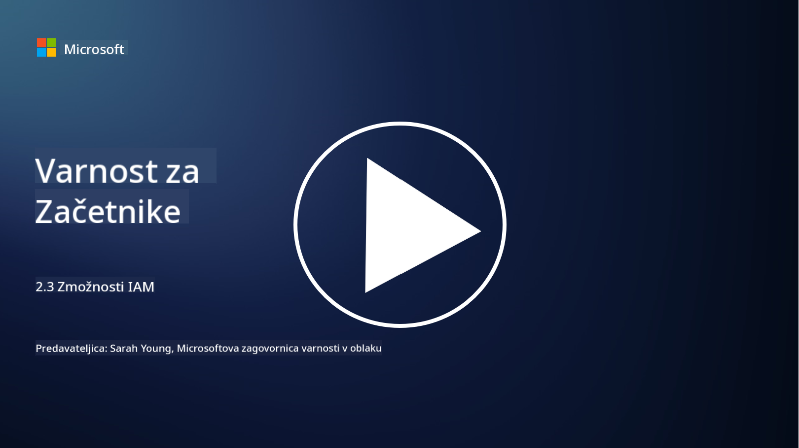

<!--
CO_OP_TRANSLATOR_METADATA:
{
  "original_hash": "bf0b8a54f2c69951744df5a94bc923f7",
  "translation_date": "2025-09-04T01:59:34+00:00",
  "source_file": "2.3 IAM capabilities.md",
  "language_code": "sl"
}
-->
# Zmožnosti IAM

V tem poglavju bomo podrobneje obravnavali osnovna orodja in zmožnosti, ki se uporabljajo za varnost identitet.

## Uvod

V tej lekciji bomo obravnavali:

 - Kaj je storitev imenika?
      
     
    
 - Katere zmožnosti lahko uporabimo za zaščito identitet?
>
>        Večfaktorska avtentikacija (MFA)
> 
>        Enotna prijava (SSO)
> 
>        Nadzor dostopa na podlagi vlog (RBAC)
> 
>        Prilagodljiva avtentikacija
> 
>        Biometrična avtentikacija
> 
>        Upravljanje privilegiranega dostopa (PAM)
> 
>        Upravljanje in administracija identitet (IGA)
> 
>        Vedenjska analitika

## Kaj je storitev imenika?

Storitev imenika je specializirana baza podatkov, ki shranjuje in upravlja informacije o omrežnih virih, vključno z uporabniki, skupinami, napravami, aplikacijami in drugimi objekti. Deluje kot centralizirano skladišče podatkov, povezanih z identiteto in dostopom, kar organizacijam omogoča učinkovito upravljanje in nadzor avtentikacije uporabnikov, avtorizacije in drugih varnostnih nalog.

Storitve imenika igrajo ključno vlogo v sodobnih IT-okoljih, saj zagotavljajo osnovo za rešitve za upravljanje identitet in dostopa (IAM). Omogočajo varen dostop do virov, uveljavljajo politike dostopa in poenostavljajo administrativne naloge. Ena najbolj znanih storitev imenika je Microsoft Active Directory, vendar obstajajo tudi druge rešitve, kot so imeniki LDAP (Lightweight Directory Access Protocol), ki služijo podobnim namenom.

Ključne funkcije in značilnosti storitve imenika v kontekstu kibernetske varnosti vključujejo:

 - **Avtentikacija uporabnikov**: Storitve imenika preverjajo uporabniške poverilnice (kot so uporabniška imena in gesla), da zagotovijo, da lahko omrežje in njegove vire dostopajo le pooblaščeni uporabniki.
 - **Avtorizacija uporabnikov**: Določajo raven dostopa, ki jo ima posamezen uporabnik, na podlagi njegove vloge, članstva v skupini in drugih atributov. To zagotavlja, da uporabniki dostopajo le do virov, do katerih so upravičeni.
 - **Upravljanje skupin**: Storitve imenika omogočajo administratorjem organiziranje uporabnikov v logične skupine, kar poenostavi upravljanje nadzora dostopa. Dovoljenja je mogoče dodeliti skupinam namesto posameznim uporabnikom.
 - **Politike gesel**: Uveljavljajo pravila o zapletenosti in poteku gesel, kar povečuje varnost uporabniških računov.
 - **Enotna prijava (SSO)**: Nekatere storitve imenika podpirajo SSO, kar uporabnikom omogoča dostop do več aplikacij in storitev z enim naborom poverilnic.
 - **Centralizirano upravljanje uporabnikov**: Storitve imenika centralizirajo informacije o uporabnikih, kar olajša upravljanje uporabniških računov, profilov in atributov z ene lokacije.
 - **Revizija in beleženje**: Lahko beležijo dejavnosti avtentikacije in dostopa uporabnikov, kar pomaga pri varnostnih revizijah in prizadevanjih za skladnost.

## Katere zmožnosti lahko uporabimo za zaščito identitet?

**Večfaktorska avtentikacija (MFA)**

MFA zahteva, da uporabniki pred dostopom zagotovijo več oblik preverjanja. To običajno vključuje nekaj, kar uporabnik ve (geslo), nekaj, kar uporabnik ima (pametni telefon ali varnostni žeton), in nekaj, kar uporabnik je (biometrični podatki, kot so prstni odtis ali prepoznavanje obraza).

**Enotna prijava (SSO)**

SSO omogoča uporabnikom dostop do več aplikacij in sistemov z enim naborom poverilnic. To izboljša uporabniško izkušnjo in zmanjša tveganje, povezano z upravljanjem več gesel.

**Nadzor dostopa na podlagi vlog (RBAC)**

RBAC dodeljuje dovoljenja na podlagi vnaprej določenih vlog. Uporabniki dobijo dostop na podlagi svojih vlog znotraj organizacije.

**Prilagodljiva avtentikacija**

Prilagodljiva avtentikacija ocenjuje dejavnike tveganja, kot so lokacija, naprava, čas dostopa in vedenje uporabnika, da dinamično prilagodi raven zahtevane avtentikacije. Če se zahteva zdi sumljiva, se lahko sprožijo dodatni koraki avtentikacije.

**Biometrična avtentikacija**

Biometrična avtentikacija uporablja edinstvene biološke značilnosti, kot so prstni odtisi, obrazne poteze, vzorci glasu in celo vedenjske značilnosti, kot je hitrost tipkanja, za preverjanje identitete.

**Upravljanje privilegiranega dostopa (PAM)**

PAM se osredotoča na zaščito dostopa do ključnih sistemov in podatkov z uveljavljanjem strogih kontrol nad privilegiranimi računi. Vključuje funkcije, kot so dostop "just-in-time" in spremljanje sej.

**Upravljanje in administracija identitet (IGA)**

Rešitve IGA upravljajo uporabniške identitete in njihov dostop do virov skozi celoten življenjski cikel. To vključuje vključevanje, dodeljevanje, nadzor dostopa na podlagi vlog in odstranjevanje dostopa.

**Vedenjska analitika**

Vedenjska analitika spremlja vedenje uporabnikov in vzpostavlja osnovne vzorce. Odstopanja od norme lahko sprožijo opozorila za nadaljnjo preiskavo.

# Nadaljnje branje
- [Azure Active Directory fundamentals documentation - Microsoft Entra | Microsoft Learn](https://learn.microsoft.com/azure/active-directory/fundamentals/?WT.mc_id=academic-96948-sayoung)
- [What is Azure Active Directory? - Microsoft Entra | Microsoft Learn](https://learn.microsoft.com/azure/active-directory/fundamentals/whatis?WT.mc_id=academic-96948-sayoung)
- [Manage your multi-cloud identity infrastructure with Microsoft Entra - YouTube](https://www.youtube.com/watch?v=9qQiq3wTS2Y&list=PLXtHYVsvn_b_gtX1-NB62wNervQx1Fhp4&index=18)

---

**Omejitev odgovornosti**:  
Ta dokument je bil preveden z uporabo storitve za prevajanje z umetno inteligenco [Co-op Translator](https://github.com/Azure/co-op-translator). Čeprav si prizadevamo za natančnost, vas prosimo, da upoštevate, da lahko avtomatizirani prevodi vsebujejo napake ali netočnosti. Izvirni dokument v njegovem maternem jeziku je treba obravnavati kot avtoritativni vir. Za ključne informacije priporočamo profesionalni prevod s strani človeka. Ne prevzemamo odgovornosti za morebitne nesporazume ali napačne razlage, ki bi nastale zaradi uporabe tega prevoda.