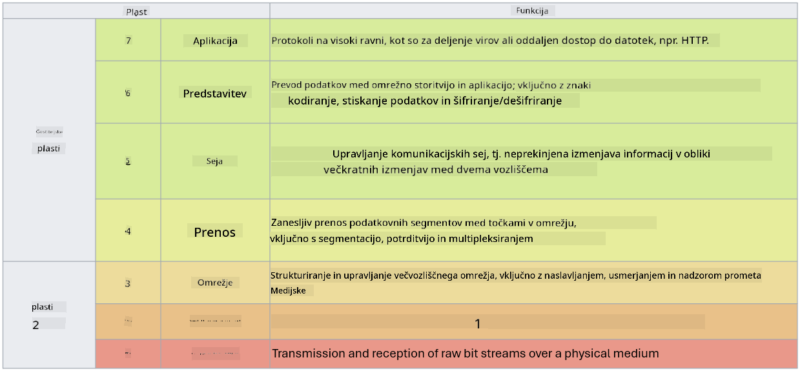

<!--
CO_OP_TRANSLATOR_METADATA:
{
  "original_hash": "252724eceeb183fb9018f88c5e1a3f0c",
  "translation_date": "2025-09-04T01:51:17+00:00",
  "source_file": "3.1 Networking key concepts.md",
  "language_code": "sl"
}
-->
# Ključni koncepti omrežja

Če ste že delali v IT-ju, je verjetno, da ste se srečali s koncepti omrežja. Čeprav v sodobnih okoljih uporabljamo identiteto kot primarno kontrolo obsega, to ne pomeni, da so omrežne kontrole odveč. Čeprav je to obsežna tema, bomo v tej lekciji obravnavali nekaj ključnih konceptov omrežja.

V tej lekciji bomo obravnavali:

- Kaj je IP naslov?

- Kaj je OSI model?

- Kaj sta TCP/UDP?

- Kaj so številke vrat?

- Kaj je šifriranje podatkov v mirovanju in med prenosom?

## Kaj je IP naslov?

IP naslov, ali naslov internetnega protokola, je numerična oznaka, dodeljena vsaki napravi, povezani v računalniško omrežje, ki uporablja internetni protokol za komunikacijo. Služi kot edinstven identifikator naprav znotraj omrežja, kar omogoča pošiljanje in prejemanje podatkov prek interneta ali drugih povezanih omrežij. Obstajata dve glavni različici IP naslovov: IPv4 (različica internetnega protokola 4) in IPv6 (različica internetnega protokola 6). IP naslov je običajno predstavljen v formatu IPv4 (npr. 192.168.1.1) ali IPv6 (npr. 2001:0db8:85a3:0000:0000:8a2e:0370:7334).

## Kaj je OSI model?

OSI (Open Systems Interconnection) model je konceptualni okvir, ki standardizira funkcije komunikacijskega sistema v sedem ločenih slojev. Vsak sloj opravlja specifične naloge in komunicira s sosednjimi sloji, da zagotovi učinkovito in zanesljivo komunikacijo podatkov med napravami v omrežju. Sloji, od spodaj navzgor, so:

1. Fizični sloj

2. Sloj podatkovne povezave

3. Omrežni sloj

4. Transportni sloj

5. Sejni sloj

6. Predstavitveni sloj

7. Aplikacijski sloj

OSI model zagotavlja skupno referenco za razumevanje, kako omrežni protokoli in tehnologije medsebojno delujejo, ne glede na specifične strojne ali programske implementacije.

_ref: https://en.wikipedia.org/wiki/OSI_model_

## Kaj sta TCP/UDP?

TCP (Transmission Control Protocol) in UDP (User Datagram Protocol) sta dva osnovna protokola transportnega sloja, ki se uporabljata v računalniških omrežjih za omogočanje komunikacije med napravami prek interneta ali znotraj lokalnega omrežja. Odgovorna sta za razbijanje podatkov na pakete za prenos in nato ponovno sestavljanje teh paketov v izvirne podatke na sprejemni strani. Vendar se razlikujeta po svojih značilnostih in primerih uporabe.

**TCP (Transmission Control Protocol)**:

TCP je protokol, usmerjen na povezavo, ki zagotavlja zanesljivo in urejeno dostavo podatkov med napravami. Pred začetkom izmenjave podatkov vzpostavi povezavo med pošiljateljem in prejemnikom. TCP zagotavlja, da paketi podatkov prispejo v pravilnem vrstnem redu in lahko ponovno pošlje izgubljene pakete, da zagotovi celovitost in popolnost podatkov. To naredi TCP primeren za aplikacije, ki zahtevajo zanesljivo dostavo podatkov, kot so brskanje po spletu, e-pošta, prenos datotek (FTP) in komunikacija z bazami podatkov.

**UDP (User Datagram Protocol)**:

UDP je protokol brez povezave, ki omogoča hitrejši prenos podatkov, vendar ne zagotavlja enake stopnje zanesljivosti kot TCP. Ne vzpostavi formalne povezave pred pošiljanjem podatkov in ne vključuje mehanizmov za potrjevanje ali ponovno pošiljanje izgubljenih paketov. UDP je primeren za aplikacije, kjer sta hitrost in učinkovitost pomembnejša od zagotovljene dostave, kot so komunikacija v realnem času, pretakanje medijev, spletne igre in DNS poizvedbe.

Na kratko, TCP daje prednost zanesljivosti in urejeni dostavi, kar ga naredi primernega za aplikacije, ki zahtevajo natančnost podatkov, medtem ko UDP poudarja hitrost in učinkovitost, kar ga naredi primernega za aplikacije, kjer je sprejemljiva manjša izguba podatkov ali sprememba vrstnega reda v zameno za zmanjšano zakasnitev. Izbira med TCP in UDP je odvisna od specifičnih zahtev aplikacije ali storitve.

## Kaj so številke vrat?

V omrežju je številka vrat numerični identifikator, ki se uporablja za razlikovanje med različnimi storitvami ali aplikacijami, ki se izvajajo na eni napravi znotraj omrežja. Vrata pomagajo usmerjati dohodne podatke na ustrezno aplikacijo. Številke vrat so 16-bitna cela števila brez predznaka, kar pomeni, da segajo od 0 do 65535. Razdeljena so v tri razpone:

- Dobro znana vrata (0-1023): Rezervirana za standardne storitve, kot sta HTTP (vrata 80) in FTP (vrata 21).

- Registrirana vrata (1024-49151): Uporabljena za aplikacije in storitve, ki niso del dobro znanega razpona, vendar so uradno registrirana.

- Dinamična/privatna vrata (49152-65535): Na voljo za začasno ali privatno uporabo aplikacij.

## Kaj je šifriranje podatkov v mirovanju in med prenosom?

Šifriranje je proces pretvorbe podatkov v varen format, da jih zaščitimo pred nepooblaščenim dostopom ali spreminjanjem. Šifriranje se lahko uporablja za podatke "v mirovanju" (ko so shranjeni na napravi ali strežniku) in "med prenosom" (ko se prenašajo med napravami ali prek omrežij).

Šifriranje v mirovanju: To vključuje šifriranje podatkov, ki so shranjeni na napravah, strežnikih ali sistemih za shranjevanje. Tudi če napadalec pridobi fizični dostop do medija za shranjevanje, ne more dostopati do podatkov brez šifrirnih ključev. To je ključno za zaščito občutljivih podatkov v primeru kraje naprave, kršitev podatkov ali nepooblaščenega dostopa.

Šifriranje med prenosom: To vključuje šifriranje podatkov, ko se prenašajo med napravami ali prek omrežij. To preprečuje prisluškovanje in nepooblaščen prestrezanje podatkov med prenosom. Pogosti protokoli za šifriranje med prenosom vključujejo HTTPS za spletno komunikacijo in TLS/SSL za zaščito različnih vrst omrežnega prometa.

## Dodatno branje
- [Kako delujejo IP naslovi? (howtogeek.com)](https://www.howtogeek.com/341307/how-do-ip-addresses-work/)
- [Razumevanje IP naslova: Uvodni vodič (geekflare.com)](https://geekflare.com/understanding-ip-address/)
- [Kaj je OSI model? 7 slojev OSI razloženo (techtarget.com)](https://www.techtarget.com/searchnetworking/definition/OSI)
- [OSI model – 7 slojev omrežja razloženo v preprostem jeziku (freecodecamp.org)](https://www.freecodecamp.org/news/osi-model-networking-layers-explained-in-plain-english/)
- [TCP/IP protokoli - IBM Dokumentacija](https://www.ibm.com/docs/en/aix/7.3?topic=protocol-tcpip-protocols)
- [Seznam pogostih vrat: Končni seznam vrat in protokolov (stationx.net)](https://www.stationx.net/common-ports-cheat-sheet/)
- [Šifriranje podatkov v mirovanju v Azure - Azure varnost | Microsoft Learn](https://learn.microsoft.com/azure/security/fundamentals/encryption-atrest?WT.mc_id=academic-96948-sayoung)

---

**Omejitev odgovornosti**:  
Ta dokument je bil preveden z uporabo storitve za strojno prevajanje [Co-op Translator](https://github.com/Azure/co-op-translator). Čeprav si prizadevamo za natančnost, vas prosimo, da se zavedate, da lahko avtomatizirani prevodi vsebujejo napake ali netočnosti. Izvirni dokument v njegovem izvirnem jeziku je treba obravnavati kot avtoritativni vir. Za ključne informacije priporočamo strokovno človeško prevajanje. Ne prevzemamo odgovornosti za morebitna nesporazumevanja ali napačne razlage, ki izhajajo iz uporabe tega prevoda.