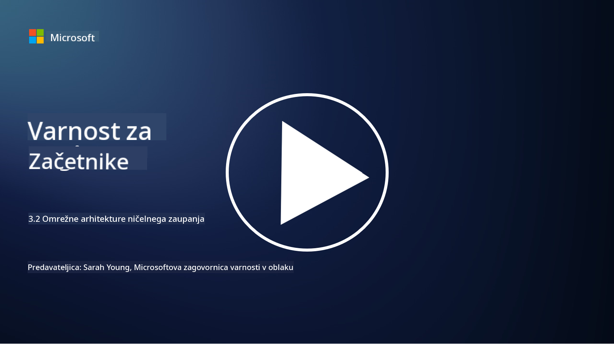

<!--
CO_OP_TRANSLATOR_METADATA:
{
  "original_hash": "680d6e14d9d33fc471c22f44679713f8",
  "translation_date": "2025-09-04T00:42:01+00:00",
  "source_file": "3.2 Networking zero trust architecture.md",
  "language_code": "sl"
}
-->
# Omrežne arhitekture z ničelnim zaupanjem

Omrežje zagotavlja ključno plast v kontrolah ničelnega zaupanja. V tej lekciji bomo izvedeli več o naslednjem:

- Kaj je segmentacija omrežja?  
- Kako segmentacija omrežja pomaga pri izvajanju ničelnega zaupanja?  
- Kaj je šifriranje od konca do konca?

## Kaj je segmentacija omrežja?

Segmentacija omrežja je praksa delitve omrežja na manjše, izolirane segmente ali podomrežja. Vsak segment je izoliran od drugih, dostop med segmenti pa je nadzorovan in omejen na podlagi določenih varnostnih politik. Segmentacija omrežja se uporablja za izboljšanje varnosti z omejevanjem vpliva morebitnih vdorov in zmanjšanjem lateralnega gibanja napadalcev znotraj omrežja.

Z izvajanjem segmentacije omrežja lahko organizacija ustvari "cone", ki ločujejo različne vrste uporabnikov, aplikacij in podatkov. To zmanjšuje površino napada in minimizira potencialno škodo, ki jo lahko povzroči varnostni incident. Segmentacija omrežja se lahko doseže s tehnologijami, kot so virtualna lokalna omrežja (VLAN), požarni zidovi in kontrola dostopa.

## Kako segmentacija omrežja pomaga pri izvajanju ničelnega zaupanja?

Segmentacija omrežja je tesno povezana z načeli modela ničelnega zaupanja. V arhitekturi ničelnega zaupanja segmentacija omrežja pomaga uveljavljati načelo "najmanjših privilegijev" s tem, da zagotavlja, da imajo uporabniki in naprave dostop le do specifičnih virov in storitev, ki jih potrebujejo za opravljanje svojih nalog. Z razdelitvijo omrežja na manjše cone lahko organizacije izvajajo stroge kontrole dostopa, izolirajo kritične vire in preprečijo lateralno gibanje napadalcev.

Segmentacija omrežja prav tako pomaga pri uveljavljanju identitetno osnovanih kontrol dostopa, kjer so uporabniki in naprave temeljito preverjeni in avtorizirani, preden dostopajo do določenih segmentov. To preprečuje nepooblaščen dostop do občutljivih virov in zmanjšuje potencialni vpliv kompromitiranih poverilnic.

## Kaj je šifriranje od konca do konca?

Šifriranje od konca do konca (E2E) je varnostni ukrep, ki zagotavlja, da podatki ostanejo šifrirani skozi celotno pot od pošiljatelja do prejemnika. V tem procesu so podatki šifrirani na strani pošiljatelja, dešifrirni ključ pa ima le prejemnik, ki lahko podatke odklene in prebere. Procesi šifriranja in dešifriranja potekajo na končnih točkah, kar otežuje dostop do nešifriranih podatkov nepooblaščenim strankam, vključno s ponudniki storitev in posredniki.

E2E šifriranje zagotavlja visoko raven zaupnosti in varnosti pri prenosu podatkov, tudi če podatki prehajajo skozi različne posredniške sisteme ali omrežja. Pogosto se uporablja v varnih aplikacijah za sporočanje, e-poštnih storitvah in drugih komunikacijskih platformah za zaščito občutljivih informacij pred prestrezanjem in nepooblaščenim dostopom.

Ta metoda šifriranja zagotavlja, da tudi če napadalci pridobijo dostop do podatkov med prenosom, vidijo le šifrirano vsebino, ki je brez dešifrirnega ključa neuporabna. Šifriranje od konca do konca igra ključno vlogo pri zaščiti zasebnosti uporabnikov in varovanju občutljivih informacij pred izpostavitvijo nepooblaščenim strankam.

## Kaj je SASE?

SASE pomeni "Secure Access Service Edge" (varni dostop na robu storitev) in je kibernetski varnostni okvir ter arhitektura, ki združuje varnost omrežja in zmogljivosti širokopasovnega omrežja (WAN) v eno samo storitev, ki temelji na oblaku. SASE je zasnovan za zagotavljanje varnega in skalabilnega dostopa do omrežnih virov, aplikacij in podatkov za oddaljene in mobilne uporabnike, hkrati pa poenostavlja upravljanje omrežja in zmanjšuje kompleksnost tradicionalnih omrežnih in varnostnih arhitektur.

Ključne značilnosti in komponente SASE vključujejo:

1. **Na osnovi oblaka:** SASE je dostavljen kot storitev v oblaku, kar pomeni, da so varnostne in omrežne funkcije zagotovljene iz oblaka, namesto da bi se zanašali na tradicionalno strojno opremo in naprave na lokaciji.

2. **Integracija varnosti in omrežja:** SASE združuje različne varnostne storitve, kot so varni spletni prehodi (SWG), požarni zid kot storitev (FWaaS), preprečevanje izgube podatkov (DLP), dostop do omrežja z ničelnim zaupanjem (ZTNA) in optimizacija WAN z zmogljivostmi širokopasovnega omrežja. Ta integracija pomaga poenostaviti varnostne in omrežne operacije.

3. **Ničelno zaupanje:** SASE deluje na načelu ničelnega zaupanja, kar pomeni, da uveljavlja stroge kontrole dostopa in politike najmanjših privilegijev. Uporabniki in naprave niso privzeto zaupani, temveč morajo biti preverjeni in avtorizirani pred dostopom do virov.

4. **Osredotočenost na identiteto:** SASE se osredotoča na identiteto uporabnikov in naprav kot osnovo za nadzor dostopa. Politike, ki temeljijo na identiteti in kontekstu, se uporabljajo za določanje dovoljenj za dostop, te politike pa se dinamično prilagajajo glede na vedenje uporabnikov in kontekst.

5. **Skalabilnost in prilagodljivost:** SASE se lahko enostavno prilagodi za podporo velikemu številu uporabnikov in naprav, zaradi česar je primeren za organizacije z raznolikimi in spreminjajočimi se potrebami po omrežju in varnosti.

SASE je še posebej pomemben v sodobni dobi oddaljenega dela in uporabe oblaka, saj zagotavlja celovit in agilen pristop k varovanju in upravljanju dostopa do omrežja. Pomaga organizacijam, da se prilagodijo spreminjajočim se zahtevam glede varnosti in omrežja, hkrati pa ohranjajo močan poudarek na uporabniško usmerjenih in modelih varnosti z ničelnim zaupanjem.

## Nadaljnje branje

- [What Is Network Segmentation? - Cisco](https://www.cisco.com/c/en/us/products/security/what-is-network-segmentation.html#~benefits)  
- [What Is Micro-Segmentation? - Cisco](https://www.cisco.com/c/en/us/products/security/what-is-microsegmentation.html)  
- [Implementing Network Segmentation and Segregation | Cyber.gov.au](https://www.cyber.gov.au/resources-business-and-government/maintaining-devices-and-systems/system-hardening-and-administration/network-hardening/implementing-network-segmentation-and-segregation)  
- [What Is Network Segmentation and Why It Matters | CompTIA](https://www.comptia.org/blog/security-awareness-training-network-segmentation)  
- [Network Segmentation: Concepts and Practices (cmu.edu)](https://insights.sei.cmu.edu/blog/network-segmentation-concepts-and-practices/)  
- [Secure networks with Zero Trust | Microsoft Learn](https://learn.microsoft.com/security/zero-trust/deploy/networks?WT.mc_id=academic-96948-sayoung)  
- [What is end-to-end encryption? | IBM](https://www.ibm.com/topics/end-to-end-encryption)  
- [What Is End-to-End Encryption, and Why Does It Matter? (howtogeek.com)](https://www.howtogeek.com/711656/what-is-end-to-end-encryption-and-why-does-it-matter/)  
- [Definition of Secure Access Service Edge (SASE) - Gartner Information Technology Glossary](https://www.gartner.com/en/information-technology/glossary/secure-access-service-edge-sase)  
- [What Is Secure Access Service Edge (SASE)? | Microsoft Security](https://www.microsoft.com/security/business/security-101/what-is-sase?WT.mc_id=academic-96948-sayoung)  

---

**Omejitev odgovornosti**:  
Ta dokument je bil preveden z uporabo storitve za strojno prevajanje [Co-op Translator](https://github.com/Azure/co-op-translator). Čeprav si prizadevamo za natančnost, vas prosimo, da upoštevate, da lahko avtomatizirani prevodi vsebujejo napake ali netočnosti. Izvirni dokument v njegovem izvirnem jeziku je treba obravnavati kot avtoritativni vir. Za ključne informacije priporočamo strokovno človeško prevajanje. Ne prevzemamo odgovornosti za morebitna nesporazumevanja ali napačne razlage, ki izhajajo iz uporabe tega prevoda.