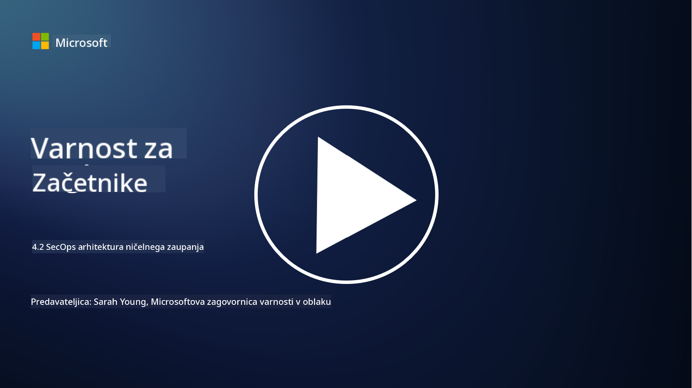

<!--
CO_OP_TRANSLATOR_METADATA:
{
  "original_hash": "45bbdc114e70936816b0b3e7c40189cf",
  "translation_date": "2025-09-04T00:47:50+00:00",
  "source_file": "4.2 SecOps zero trust architecture.md",
  "language_code": "sl"
}
-->
# SecOps arhitektura zaupanja nič

Varnostne operacije predstavljajo dva dela arhitekture zaupanja nič, v tej lekciji pa bomo spoznali oba:

- Kako je treba zgraditi IT arhitekture, da omogočajo centralizirano zbiranje dnevnikov?

- Katere so najboljše prakse za varnostne operacije v sodobnih IT okoljih?

## Kako je treba zgraditi IT arhitekture, da omogočajo centralizirano zbiranje dnevnikov?

Centralizirano zbiranje dnevnikov je ključna komponenta sodobnih varnostnih operacij. Omogoča organizacijam združevanje dnevnikov in podatkov iz različnih virov, kot so strežniki, aplikacije, omrežne naprave in varnostna orodja, v osrednji repozitorij za analizo, spremljanje in odzivanje na incidente. Tukaj je nekaj najboljših praks za gradnjo IT arhitektur, ki podpirajo centralizirano zbiranje dnevnikov:

1. **Integracija virov dnevnikov**:

- Poskrbite, da so vse ustrezne naprave in sistemi konfigurirani za ustvarjanje dnevnikov. To vključuje strežnike, požarne zidove, usmerjevalnike, stikala, aplikacije in varnostne naprave.

- Konfigurirajte vire dnevnikov, da posredujejo dnevnike centraliziranemu zbiralniku ali sistemu za upravljanje dnevnikov.

2. **Izbira pravega SIEM orodja (Security Information and Event Management)**:

- Izberite SIEM rešitev, ki ustreza potrebam in obsegu vaše organizacije.

- Prepričajte se, da izbrana rešitev podpira zbiranje, združevanje, analizo in poročanje dnevnikov.

3. **Razširljivost in redundanca**:

- Načrtujte arhitekturo za razširljivost, da bo lahko obvladovala naraščajoče število virov dnevnikov in večje količine dnevnikov.

- Implementirajte redundanco za visoko razpoložljivost, da preprečite motnje zaradi okvar strojne opreme ali omrežja.

4. **Varno prenašanje dnevnikov**:

- Uporabljajte varne protokole, kot so TLS/SSL ali IPsec, za prenašanje dnevnikov iz virov v centralizirani repozitorij.

- Uvedite preverjanje pristnosti in nadzor dostopa, da zagotovite, da lahko dnevnike pošiljajo samo pooblaščene naprave.

5. **Normalizacija**:

- Standardizirajte formate dnevnikov in normalizirajte podatke, da zagotovite doslednost in enostavnost analize.

6. **Shranjevanje in hramba**:

- Določite ustrezno obdobje hrambe dnevnikov na podlagi skladnosti in varnostnih zahtev.

- Dnevnike shranjujte varno, zaščitene pred nepooblaščenim dostopom in posegi.

## Katere so najboljše prakse za varnostne operacije v sodobnih IT okoljih?

Poleg centraliziranega zbiranja dnevnikov so tukaj še nekatere najboljše prakse za varnostne operacije v sodobnih IT okoljih:

1. **Neprekinjeno spremljanje**: Uvedite neprekinjeno spremljanje omrežnih in sistemskih aktivnosti za zaznavanje in odzivanje na grožnje v realnem času.

2. **Obveščanje o grožnjah**: Bodite na tekočem z novimi grožnjami in ranljivostmi z uporabo virov in storitev za obveščanje o grožnjah.

3. **Usposabljanje uporabnikov**: Redno izvajajte usposabljanje za ozaveščanje o varnosti za zaposlene, da zmanjšate tveganja, povezana s socialnim inženiringom in phishing napadi.

4. **Načrt odzivanja na incidente**: Razvijte in preizkusite načrt odzivanja na incidente, da zagotovite hiter in učinkovit odziv na varnostne incidente.

5. **Avtomatizacija varnosti**: Uporabljajte orodja za avtomatizacijo in orkestracijo varnosti za poenostavitev odzivanja na incidente in ponavljajočih se nalog.

6. **Varnostno kopiranje in obnova**: Uvedite robustne rešitve za varnostno kopiranje in obnovo, da zagotovite razpoložljivost podatkov v primeru izgube podatkov ali napadov z izsiljevalsko programsko opremo.

## Nadaljnje branje

- [Microsoft Security Best Practices module: Security operations | Microsoft Learn](https://learn.microsoft.com/security/operations/security-operations-videos-and-decks?WT.mc_id=academic-96948-sayoung)
- [Security operations - Cloud Adoption Framework | Microsoft Learn](https://learn.microsoft.com/azure/cloud-adoption-framework/secure/security-operations?WT.mc_id=academic-96948-sayoung)
- [What is Security Operations and Analytics Platform Architecture? A Definition of SOAPA, How It Works, Benefits, and More (digitalguardian.com)](https://www.digitalguardian.com/blog/what-security-operations-and-analytics-platform-architecture-definition-soapa-how-it-works#:~:text=All%20in%20all%2C%20security%20operations%20and%20analytics%20platform,become%20more%20efficient%20and%20operative%20with%20your%20security.)

---

**Omejitev odgovornosti**:  
Ta dokument je bil preveden z uporabo storitve za strojno prevajanje [Co-op Translator](https://github.com/Azure/co-op-translator). Čeprav si prizadevamo za natančnost, vas prosimo, da se zavedate, da lahko avtomatizirani prevodi vsebujejo napake ali netočnosti. Izvirni dokument v njegovem izvirnem jeziku je treba obravnavati kot avtoritativni vir. Za ključne informacije priporočamo strokovno človeško prevajanje. Ne prevzemamo odgovornosti za morebitna nesporazumevanja ali napačne razlage, ki izhajajo iz uporabe tega prevoda.