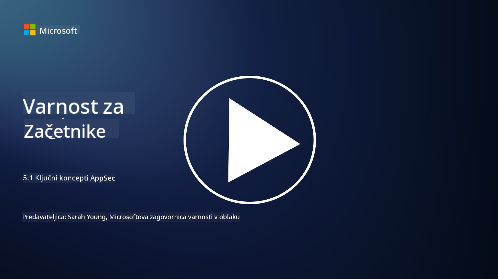

<!--
CO_OP_TRANSLATOR_METADATA:
{
  "original_hash": "e4b56bb23078d3ffb7ad407d280b0c36",
  "translation_date": "2025-09-04T00:34:38+00:00",
  "source_file": "5.1 AppSec key concepts.md",
  "language_code": "sl"
}
-->
# Ključni koncepti aplikacijske varnosti

Aplikacijska varnost je posebna veja varnosti. V tem delu tečaja bomo podrobneje raziskali aplikacijsko varnost.

## Uvod

V tej lekciji bomo obravnavali:

- Kaj je aplikacijska varnost?

- Kateri so ključni koncepti/principi aplikacijske varnosti?

## Kaj je aplikacijska varnost?

Aplikacijska varnost, pogosto skrajšano kot "AppSec," se nanaša na prakso zaščite programske opreme pred varnostnimi grožnjami, ranljivostmi in napadi. Vključuje procese, tehnike in orodja za prepoznavanje, zmanjševanje in preprečevanje varnostnih tveganj skozi celoten življenjski cikel razvoja, uvajanja in vzdrževanja aplikacije.

Aplikacijska varnost je ključnega pomena, saj so aplikacije pogoste tarče kibernetskih napadov. Zlonamerni akterji izkoriščajo ranljivosti in šibkosti v programski opremi za nepooblaščen dostop, krajo podatkov, motenje storitev ali izvajanje drugih zlonamernih dejavnosti. Učinkovita aplikacijska varnost pomaga zagotoviti zaupnost, celovitost in razpoložljivost aplikacije ter njenih povezanih podatkov.

## Kateri so ključni koncepti/principi aplikacijske varnosti?

Ključni koncepti in principi, ki so temelj aplikacijske varnosti, vključujejo:

1. **Varnost že v zasnovi**:

- Varnost je treba vključiti v zasnovo in arhitekturo aplikacije že od začetka, ne pa dodajati naknadno.

2. **Validacija vhodnih podatkov**:

- Vse uporabniške vnose je treba preveriti, da ustrezajo pričakovanim formatom in so brez zlonamerne kode ali podatkov.

3. **Kodiranje izhodnih podatkov**:

- Podatki, poslani klientu, morajo biti ustrezno kodirani, da se preprečijo ranljivosti, kot je XSS (cross-site scripting).

4. **Avtentikacija in avtorizacija**:

- Uporabnike je treba avtenticirati in jim dodeliti dostop do virov glede na njihove vloge in dovoljenja.

5. **Zaščita podatkov**:

- Občutljivi podatki morajo biti šifrirani med shranjevanjem, prenosom in obdelavo, da se prepreči nepooblaščen dostop.

6. **Upravljanje sej**:

- Varno upravljanje sej zagotavlja zaščito uporabniških sej pred prevzemom ali nepooblaščenim dostopom.

7. **Varne odvisnosti**:

- Vse programske odvisnosti je treba redno posodabljati z varnostnimi popravki, da se preprečijo ranljivosti.

8. **Ravnanje z napakami in beleženje**:

- Uvedite varno ravnanje z napakami, da se izognete razkrivanju občutljivih informacij, ter zagotovite varne prakse beleženja.

9. **Varnostno testiranje**:

- Aplikacije je treba redno testirati na ranljivosti z metodami, kot so penetracijsko testiranje, pregled kode in avtomatizirana orodja za skeniranje.

10. **Varni življenjski cikel razvoja programske opreme (SDLC)**:

- Varnostne prakse je treba vključiti v vsako fazo življenjskega cikla razvoja programske opreme, od zahtev do uvajanja in vzdrževanja.

## Dodatno branje

- [SheHacksPurple: Kaj je aplikacijska varnost? - YouTube](https://www.youtube.com/watch?v=eNmccQNzSSY)
- [Kaj je aplikacijska varnost? - Cisco](https://www.cisco.com/c/en/us/solutions/security/application-first-security/what-is-application-security.html#~how-does-it-work)
- [Kaj je aplikacijska varnost? Proces in orodja za zaščito programske opreme | CSO Online](https://www.csoonline.com/article/566471/what-is-application-security-a-process-and-tools-for-securing-software.html)
- [OWASP Cheat Sheet Series | OWASP Foundation](https://owasp.org/www-project-cheat-sheets/)

---

**Omejitev odgovornosti**:  
Ta dokument je bil preveden z uporabo storitve za prevajanje z umetno inteligenco [Co-op Translator](https://github.com/Azure/co-op-translator). Čeprav si prizadevamo za natančnost, vas prosimo, da upoštevate, da lahko avtomatizirani prevodi vsebujejo napake ali netočnosti. Izvirni dokument v njegovem maternem jeziku je treba obravnavati kot avtoritativni vir. Za ključne informacije priporočamo profesionalni človeški prevod. Ne prevzemamo odgovornosti za morebitne nesporazume ali napačne razlage, ki bi nastale zaradi uporabe tega prevoda.