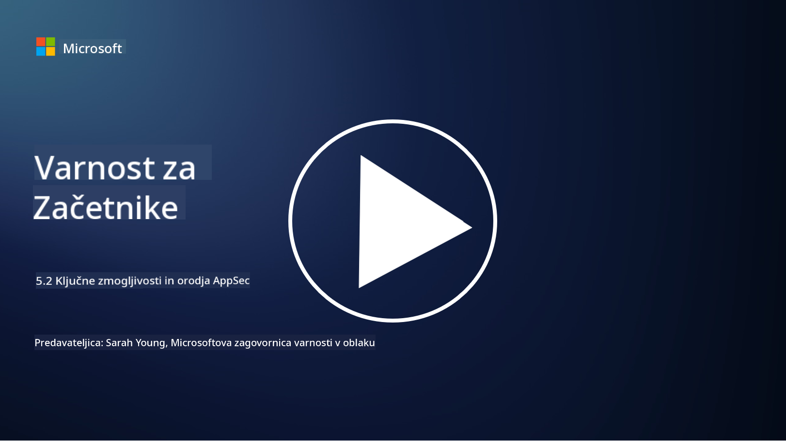

<!--
CO_OP_TRANSLATOR_METADATA:
{
  "original_hash": "790a3fa7e535ec60bb51bde13e759781",
  "translation_date": "2025-09-04T00:53:32+00:00",
  "source_file": "5.2 AppSec key capabilities.md",
  "language_code": "sl"
}
-->
V tem razdelku bomo podrobneje obravnavali ključna orodja in zmogljivosti, ki se uporabljajo pri varnosti aplikacij:

## Uvod

V tej lekciji bomo obravnavali ključne zmogljivosti in orodja, ki se uporabljajo pri varnosti aplikacij.

## Ključne zmogljivosti in orodja za varnost aplikacij

Ključne zmogljivosti in orodja, ki se uporabljajo pri varnosti aplikacij, so bistvenega pomena za prepoznavanje, zmanjševanje in preprečevanje varnostnih ranljivosti ter groženj v programski opremi. Tukaj je nekaj najpomembnejših:

**1. Statično testiranje varnosti aplikacij (SAST)**:

- **Zmogljivosti**: Analizira izvorno kodo, bajtno kodo ali binarno kodo za prepoznavanje varnostnih ranljivosti v kodi aplikacije.

- **Orodja**: Primeri vključujejo Fortify, Checkmarx in Veracode.

**2. Dinamično testiranje varnosti aplikacij (DAST)**:

- **Zmogljivosti**: Pregleduje delujočo aplikacijo za prepoznavanje ranljivosti z pošiljanjem vhodnih zahtevkov in analizo odgovorov.

- **Orodja**: Primeri vključujejo ZAP, Burp Suite in Qualys Web Application Scanning.

**3. Interaktivno testiranje varnosti aplikacij (IAST)**:

- **Zmogljivosti**: Združuje elemente SAST in DAST za analizo kode med izvajanjem, kar zagotavlja natančnejše rezultate in zmanjšuje lažne pozitivne rezultate.

- **Orodja**: Primeri vključujejo Contrast Security in HCL AppScan.

**4. Samozaščita aplikacij med izvajanjem (RASP)**:

- **Zmogljivosti**: Spremlja in ščiti aplikacije v realnem času, zaznava in se odziva na varnostne grožnje, ko se pojavijo.

- **Orodja**: Primeri vključujejo Veracode Runtime Protection in F5 Advanced WAF z RASP.

**5. Požarni zidovi za spletne aplikacije (WAFs)**:

- **Zmogljivosti**: Zagotavljajo zaščitno plast med aplikacijo in internetom, filtrirajo vhodni promet ter blokirajo zlonamerne zahteve.

- **Orodja**: Primeri vključujejo ModSecurity, AWS WAF in Akamai Kona Site Defender.

**6. Pregledovanje odvisnosti**:

- **Zmogljivosti**: Prepoznava ranljivosti v knjižnicah in komponentah tretjih oseb, ki jih uporablja aplikacija.

- **Orodja**: Primeri vključujejo OWASP Dependency-Check in Snyk.

**7. Testiranje penetracije (Pen Testing)**:

- **Zmogljivosti**: Simulira napade iz resničnega sveta za odkrivanje ranljivosti in oceno varnosti aplikacije.

- **Orodja**: Izvajajo ga certificirani etični hekerji in varnostni strokovnjaki z uporabo različnih orodij, kot sta Metasploit in Nmap.

**8. Pregledovanje in analiza varnosti**:

- **Zmogljivosti**: Pregleduje znane ranljivosti, napake v konfiguraciji in varnostne nepravilnosti.

- **Orodja**: Primeri vključujejo Nessus, Qualys Vulnerability Management in OpenVAS.

**9. Orodja za varnost kontejnerjev**:

- **Zmogljivosti**: Osredotočajo se na varnost kontejneriziranih aplikacij in njihovih okolij.

- **Orodja**: Primeri vključujejo Docker Security Scanning in Aqua Security.

**10. Usposabljanje za varni razvoj**:

- **Zmogljivosti**: Ponuja programe usposabljanja in ozaveščanja za razvojne ekipe, da spodbujajo varne prakse kodiranja.

- **Orodja**: Prilagojeni programi usposabljanja in platforme.

**11. Okviri za testiranje varnosti**:

- **Zmogljivosti**: Zagotavljajo celovite okvire za različne potrebe testiranja varnosti aplikacij.

- **Orodja**: OWASP Amass, OWASP OWTF in FrAppSec.

**12. Orodja za pregled varne kode**:

- **Zmogljivosti**: Pregledujejo izvorno kodo za varnostne ranljivosti in najboljše prakse kodiranja.

- **Orodja**: Primeri vključujejo SonarQube in Checkmarx.

**13. Orodja za varne API-je in mikrostoritve**:

- **Zmogljivosti**: Osredotočajo se na varnost API-jev in mikrostoritev, vključno z avtentikacijo, avtorizacijo in zaščito podatkov.

- **Orodja**: Primeri vključujejo Apigee, AWS API Gateway in Istio.

## Nadaljnje branje

- [Kaj je varnost aplikacij? Koncepti, orodja in najboljše prakse | HackerOne](https://www.hackerone.com/knowledge-center/what-application-security-concepts-tools-best-practices)
- [Kaj je IAST? (Interaktivno testiranje varnosti aplikacij) (comparitech.com)](https://www.comparitech.com/net-admin/what-is-iast/)
- [10 vrst orodij za testiranje varnosti aplikacij: kdaj in kako jih uporabljati (cmu.edu)](https://insights.sei.cmu.edu/blog/10-types-of-application-security-testing-tools-when-and-how-to-use-them/)
- [Premik ravnotežja kibernetskega tveganja: načela in pristopi za varnost po zasnovi in privzeto | Cyber.gov.au](https://www.cyber.gov.au/about-us/view-all-content/publications/principles-and-approaches-for-security-by-design-and-default)

---

**Omejitev odgovornosti**:  
Ta dokument je bil preveden z uporabo storitve za strojno prevajanje [Co-op Translator](https://github.com/Azure/co-op-translator). Čeprav si prizadevamo za natančnost, vas prosimo, da upoštevate, da lahko avtomatizirani prevodi vsebujejo napake ali netočnosti. Izvirni dokument v njegovem izvirnem jeziku je treba obravnavati kot avtoritativni vir. Za ključne informacije priporočamo strokovno človeško prevajanje. Ne prevzemamo odgovornosti za morebitna nesporazumevanja ali napačne razlage, ki izhajajo iz uporabe tega prevoda.