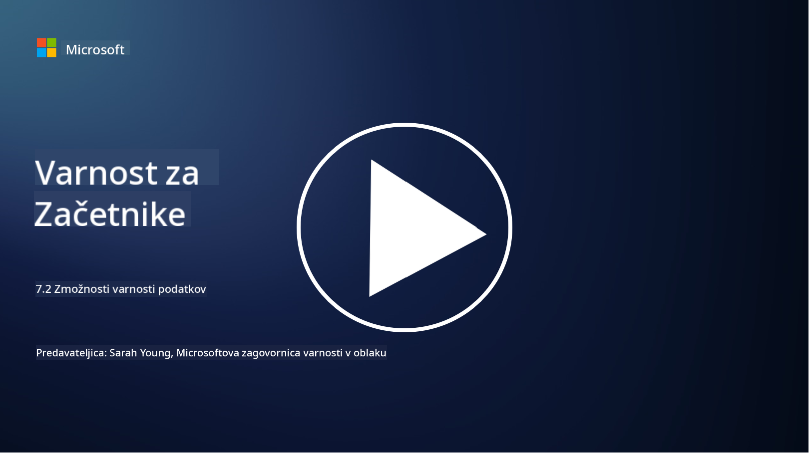

<!--
CO_OP_TRANSLATOR_METADATA:
{
  "original_hash": "50697add9758e54693442d502d2d5f8a",
  "translation_date": "2025-09-04T00:58:33+00:00",
  "source_file": "7.2 Data security capabilities.md",
  "language_code": "sl"
}
-->
# Zmožnosti varnosti podatkov

V tem razdelku bomo podrobneje obravnavali osnovna orodja in zmožnosti, ki se uporabljajo za varnost podatkov:

**Uvod**

V tej lekciji bomo obravnavali:

- Kaj so orodja za preprečevanje izgube podatkov?

- Kaj so orodja za upravljanje tveganj znotraj organizacije?

- Katera orodja za hrambo podatkov so na voljo?

## Kaj so orodja za preprečevanje izgube podatkov?

Orodja za preprečevanje izgube podatkov (Data Loss Prevention - DLP) se nanašajo na nabor programske opreme in tehnologij, ki so zasnovane za preprečevanje nepooblaščenega dostopa, deljenja ali uhajanja občutljivih ali zaupnih podatkov znotraj organizacije. Ta orodja uporabljajo pregled vsebine, uveljavljanje politik in spremljanje za prepoznavanje ter zaščito občutljivih podatkov pred izpostavitvijo ali zlorabo. Primeri DLP izdelkov vključujejo: Symantec Data Loss Prevention, McAfee Total Protection for Data Loss Prevention, Microsoft 365 DLP**: Integrira se z aplikacijami Microsoft 365, da pomaga organizacijam prepoznati in zaščititi občutljive podatke v e-pošti, dokumentih in sporočilih.

## Kaj so orodja za upravljanje tveganj znotraj organizacije?

Orodja za upravljanje tveganj znotraj organizacije pomagajo organizacijam prepoznati in zmanjšati tveganja, ki jih predstavljajo zaposleni, pogodbeni sodelavci ali partnerji, ki lahko namerno ali nenamerno ogrozijo varnost podatkov. Ta orodja spremljajo vedenje uporabnikov, vzorce dostopa in uporabo podatkov, da zaznajo sumljive dejavnosti in potencialne notranje grožnje. Primeri izdelkov za upravljanje tveganj znotraj organizacije vključujejo: Microsoft Insider Risk Management (del Microsoft 365), Forcepoint Insider Threat Data Protection, Varonis Insider Threat Detection.

## Katera orodja za hrambo podatkov so na voljo?

Orodja za hrambo podatkov vključujejo programsko opremo in rešitve, zasnovane za upravljanje hrambe in brisanja podatkov v skladu s politikami hrambe podatkov organizacije ter zakonskimi zahtevami. Ta orodja pomagajo avtomatizirati proces hrambe podatkov za določena obdobja in njihovo varno brisanje, ko niso več potrebni. Primeri izdelkov za hrambo podatkov vključujejo: Veritas Enterprise Vault, Commvault Complete Data Protection, Microsoft data lifecycle management. Ta orodja pomagajo organizacijam ohranjati nadzor nad hrambo in odstranjevanjem podatkov, zagotavljajo skladnost z regulacijami o varstvu podatkov ter učinkovito upravljajo podatke skozi njihov življenjski cikel.

## Dodatno branje

- [Guide to Data Security Posture Management (DSPM) | CSA (cloudsecurityalliance.org)](https://cloudsecurityalliance.org/blog/2023/03/31/the-big-guide-to-data-security-posture-management-dspm/)
- [Data Loss Prevention across endpoints, apps, & services | Microsoft Purview](https://youtu.be/hvqq8L_0kgI)
- [18 Best Data Loss Prevention Software Tools 2023 (Free + Paid) (comparitech.com)](https://www.comparitech.com/data-privacy-management/data-loss-prevention-tools-software/)
- [Data Loss Prevention (nist.gov)](https://tsapps.nist.gov/publication/get_pdf.cfm?pub_id=904672)
- [Learn about insider risk management | Microsoft Learn](https://learn.microsoft.com/purview/insider-risk-management?WT.mc_id=academic-96948-sayoung)
- [Data Lifecycle Management | IBM](https://www.ibm.com/topics/data-lifecycle-management)
- [What Is Data Lifecycle Management (DLM)? | 2023 Best Practices (selecthub.com)](https://www.selecthub.com/big-data-analytics/data-lifecycle-management/)

---

**Omejitev odgovornosti**:  
Ta dokument je bil preveden z uporabo storitve za strojno prevajanje [Co-op Translator](https://github.com/Azure/co-op-translator). Čeprav si prizadevamo za natančnost, vas prosimo, da se zavedate, da lahko avtomatizirani prevodi vsebujejo napake ali netočnosti. Izvirni dokument v njegovem izvirnem jeziku je treba obravnavati kot avtoritativni vir. Za ključne informacije priporočamo strokovno človeško prevajanje. Ne prevzemamo odgovornosti za morebitna nesporazumevanja ali napačne razlage, ki izhajajo iz uporabe tega prevoda.