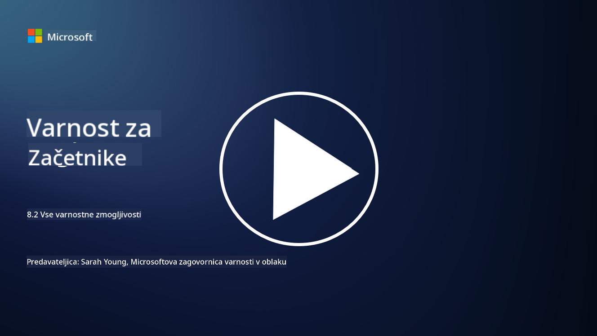

<!--
CO_OP_TRANSLATOR_METADATA:
{
  "original_hash": "b6bb7175672298d1e2f73ba7e0006f95",
  "translation_date": "2025-09-04T01:07:42+00:00",
  "source_file": "8.2 AI security capabilities.md",
  "language_code": "sl"
}
-->
# Zmožnosti varnosti umetne inteligence

## Katere orodja in zmožnosti imamo trenutno za zaščito sistemov umetne inteligence?

Trenutno je na voljo več orodij in zmožnosti za zaščito sistemov umetne inteligence:

-   **Counterfit**: Orodje odprte kode za avtomatizirano testiranje varnosti sistemov umetne inteligence, zasnovano za pomoč organizacijam pri ocenjevanju tveganj varnosti umetne inteligence in zagotavljanju robustnosti njihovih algoritmov.
-   **Orodja za nasprotovalno strojno učenje**: Ta orodja ocenjujejo odpornost modelov strojnega učenja proti nasprotovalnim napadom, kar pomaga pri prepoznavanju in zmanjševanju ranljivosti.
-   **Kompleti orodij za varnost umetne inteligence**: Na voljo so kompleti odprte kode, ki ponujajo vire za zaščito sistemov umetne inteligence, vključno s knjižnicami in ogrodji za izvajanje varnostnih ukrepov.
-   **Sodelovalne platforme**: Partnerstva med podjetji in skupnostmi umetne inteligence za razvoj varnostnih skenerjev, specifičnih za umetno inteligenco, ter drugih orodij za zaščito dobavne verige umetne inteligence.

Ta orodja in zmožnosti so del rastočega področja, namenjenega izboljšanju varnosti sistemov umetne inteligence pred različnimi grožnjami. Predstavljajo kombinacijo raziskav, praktičnih orodij in industrijskega sodelovanja, usmerjenega v reševanje edinstvenih izzivov, ki jih prinašajo tehnologije umetne inteligence.

## Kaj pa rdeče ekipno testiranje umetne inteligence? Kako se to razlikuje od tradicionalnega rdečega ekipnega testiranja varnosti?

Rdeče ekipno testiranje umetne inteligence se od tradicionalnega rdečega ekipnega testiranja varnosti razlikuje v več ključnih vidikih:

-   **Osredotočenost na sisteme umetne inteligence**: Rdeče ekipno testiranje umetne inteligence se osredotoča na edinstvene ranljivosti sistemov umetne inteligence, kot so modeli strojnega učenja in podatkovni tokovi, namesto na tradicionalno IT infrastrukturo.
-   **Testiranje vedenja umetne inteligence**: Vključuje testiranje, kako sistemi umetne inteligence reagirajo na nenavadne ali nepričakovane vnose, kar lahko razkrije ranljivosti, ki jih lahko izkoristijo napadalci.
-   **Raziskovanje neuspehov umetne inteligence**: Rdeče ekipno testiranje umetne inteligence preučuje tako zlonamerne kot benigne neuspehe, pri čemer upošteva širši nabor osebnosti in možnih sistemskih neuspehov, ne le varnostnih kršitev.
-   **Vbrizgavanje ukazov in generiranje vsebine**: Vključuje tudi preverjanje neuspehov, kot je vbrizgavanje ukazov, kjer napadalci manipulirajo s sistemi umetne inteligence, da ustvarijo škodljivo ali neutemeljeno vsebino.
-   **Etika in odgovorna umetna inteligenca**: Je del zagotavljanja odgovorne umetne inteligence po zasnovi, s čimer se zagotovi, da so sistemi umetne inteligence odporni proti poskusom, da bi jih prisilili v nepredvideno vedenje.

Na splošno je rdeče ekipno testiranje umetne inteligence razširjena praksa, ki ne zajema le preverjanja varnostnih ranljivosti, temveč tudi testiranje drugih vrst sistemskih neuspehov, specifičnih za tehnologije umetne inteligence. Je ključni del razvoja varnejših sistemov umetne inteligence z razumevanjem in zmanjševanjem novih tveganj, povezanih z uvajanjem umetne inteligence.

## Dodatno branje

 - [Microsoft AI Red Team building future of safer AI | Microsoft Security Blog](https://www.microsoft.com/en-us/security/blog/2023/08/07/microsoft-ai-red-team-building-future-of-safer-ai/?WT.mc_id=academic-96948-sayoung)
 - [Announcing Microsoft’s open automation framework to red team generative AI Systems | Microsoft Security Blog](https://www.microsoft.com/en-us/security/blog/2024/02/22/announcing-microsofts-open-automation-framework-to-red-team-generative-ai-systems/?WT.mc_id=academic-96948-sayoung)
 - [AI Security Tools: The Open-Source Toolkit | Wiz](https://www.wiz.io/academy/ai-security-tools)

---

**Omejitev odgovornosti**:  
Ta dokument je bil preveden z uporabo storitve za strojno prevajanje [Co-op Translator](https://github.com/Azure/co-op-translator). Čeprav si prizadevamo za natančnost, vas prosimo, da se zavedate, da lahko avtomatizirani prevodi vsebujejo napake ali netočnosti. Izvirni dokument v njegovem izvirnem jeziku je treba obravnavati kot avtoritativni vir. Za ključne informacije priporočamo strokovno človeško prevajanje. Ne prevzemamo odgovornosti za morebitna nesporazumevanja ali napačne razlage, ki izhajajo iz uporabe tega prevoda.