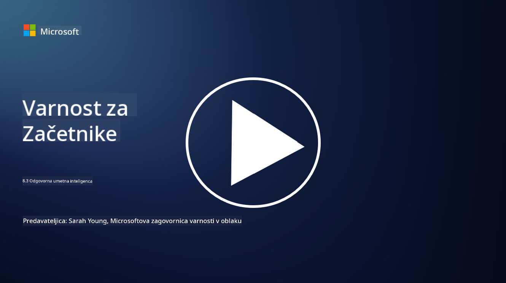

<!--
CO_OP_TRANSLATOR_METADATA:
{
  "original_hash": "5e9775ee91bde7d44577891d5f11c4c5",
  "translation_date": "2025-09-04T00:09:01+00:00",
  "source_file": "8.3 Responsible AI.md",
  "language_code": "sl"
}
-->
# Odgovorna umetna inteligenca

## Kaj je odgovorna umetna inteligenca in kako je povezana z varnostjo umetne inteligence?

Odgovorna umetna inteligenca se nanaša na razvoj in uporabo umetne inteligence na način, ki je etičen, pregleden in usklajen z družbenimi vrednotami. Vključuje načela, kot so pravičnost, odgovornost in robustnost, kar zagotavlja, da so sistemi umetne inteligence zasnovani in uporabljeni v korist posameznikov, skupnosti in družbe kot celote.

Povezava med odgovorno umetno inteligenco in varnostjo umetne inteligence je pomembna, ker:

-   **Etična vprašanja**: Odgovorna umetna inteligenca vključuje etična vprašanja, ki neposredno vplivajo na varnost, kot sta zasebnost in zaščita podatkov. Zagotavljanje, da sistemi umetne inteligence spoštujejo zasebnost uporabnikov in varujejo osebne podatke, je ključen vidik odgovorne umetne inteligence.
-   **Robustnost in zanesljivost**: Sistemi umetne inteligence morajo biti odporni proti manipulacijam in napadom, kar je osrednje načelo tako odgovorne umetne inteligence kot varnosti umetne inteligence. To vključuje zaščito pred sovražnimi napadi in zagotavljanje integritete procesov odločanja umetne inteligence.
-   **Transparentnost in razložljivost**: Del odgovorne umetne inteligence je zagotavljanje, da so sistemi umetne inteligence pregledni in da je mogoče razložiti njihove odločitve. To je ključno za varnost, saj morajo deležniki razumeti, kako sistemi umetne inteligence delujejo, da jim lahko zaupajo varnostne ukrepe.
-   **Odgovornost**: Sistemi umetne inteligence morajo biti odgovorni za svoja dejanja, kar pomeni, da morajo obstajati mehanizmi za sledenje odločitvam in odpravljanje težav. To je skladno z varnostnimi praksami, ki spremljajo in preverjajo dejavnosti sistema, da preprečijo in se odzovejo na kršitve.

Odgovorna umetna inteligenca in varnost umetne inteligence sta torej tesno povezana, saj odgovorne prakse umetne inteligence izboljšujejo varnost sistemov umetne inteligence in obratno. Uvajanje načel odgovorne umetne inteligence pomaga ustvariti sisteme, ki so ne le etično sprejemljivi, temveč tudi bolj varni pred morebitnimi grožnjami.

## Kako lahko zagotovim, da je moj sistem umetne inteligence hkrati varen in etičen?

Zagotavljanje, da je vaš sistem umetne inteligence hkrati varen in etičen, zahteva večplastni pristop, ki vključuje naslednje korake:

- **Upoštevajte etična načela**: Sledite uveljavljenim etičnim smernicam, ki poudarjajo dobrobit ljudi, družbe in okolja; pravičnost; zaščito zasebnosti; zanesljivost; transparentnost; možnost izpodbijanja odločitev; in odgovornost.

- **Uvedite robustne varnostne ukrepe**: Uporabljajte proaktivno varnostno testiranje ter programe za upravljanje zaupanja, tveganj in varnosti umetne inteligence za zaščito pred grožnjami in ranljivostmi.

- **Vključite raznolike deležnike**: V proces razvoja umetne inteligence vključite širok spekter udeležencev, vključno z etiki, družboslovci in predstavniki prizadetih skupnosti, da zagotovite upoštevanje različnih perspektiv in vrednot.

- **Zagotovite transparentnost in razložljivost**: Poskrbite, da bodo procesi odločanja umetne inteligence pregledni in razložljivi, kar omogoča večje zaupanje in lažje prepoznavanje morebitnih pristranskosti ali napak.

- **Ohranite zasebnost podatkov**: Zaščitite zasebnost in avtentičnost podatkov z uporabo šifriranja in drugih ukrepov za zaščito podatkov, da spoštujete pravice uporabnikov do zasebnosti.

- **Omogočite človeški nadzor**: Uvedite mehanizme za človeški nadzor, ki omogočajo izpodbijanje odločitev, ki jih sprejmejo sistemi umetne inteligence, in zagotavljajo odgovornost.

- **Bodite na tekočem z varnostjo umetne inteligence**: Spremljajte najnovejše raziskave in razprave o varnosti umetne inteligence, da boste razumeli spreminjajočo se pokrajino varnosti in etike umetne inteligence.

- **Skladnost z zakonodajo**: Poskrbite, da vaš sistem umetne inteligence izpolnjuje vse ustrezne zakone in predpise, kar lahko vključuje zakone o varstvu podatkov, protidiskriminacijske zakone in smernice, specifične za posamezno panogo.

## Ali mi lahko navedete nekaj primerov varnostnih težav, ki jih povzroča neetična uporaba umetne inteligence?

Tukaj je nekaj primerov varnostnih težav, ki lahko nastanejo zaradi neetične uporabe umetne inteligence:

- **Pristransko odločanje**: Sistemi umetne inteligence lahko ohranjajo in krepijo obstoječe pristranskosti, če so usposobljeni na pristranskih podatkovnih nizih. Na primer, če je iskalnik usposobljen na podatkih, ki odražajo družbene stereotipe, lahko prikaže pristranske rezultate iskanja, kar lahko vodi do nepoštenega obravnavanja ali diskriminacije.

- **Umetna inteligenca v pravosodnih sistemih**: Uporaba umetne inteligence pri pravnih odločitvah lahko sproži etična vprašanja, zlasti če proces odločanja umetne inteligence ni pregleden ali je pod vplivom pristranskih podatkov. To lahko povzroči nepravične pravne izide in krši pravice posameznikov.

- **Manipulacija sistemov umetne inteligence**: Sistemi umetne inteligence so lahko dovzetni za sovražne napade, kjer lahko majhne spremembe vhodnih podatkov povzročijo napačne rezultate. Na primer, avtonomna vozila bi lahko bila zavedena, da napačno interpretirajo prometne znake, kar bi povzročilo varnostna tveganja.

- **Nadzor z umetno inteligenco**: Uporaba umetne inteligence za namene nadzora lahko vodi do kršitev zasebnosti, zlasti če se uporablja brez ustreznega soglasja ali na načine, ki posegajo v svoboščine posameznikov. To je lahko še posebej problematično v avtoritarnih režimih, ki lahko umetno inteligenco uporabljajo za spremljanje in zatiranje nestrinjanja.

Ti primeri poudarjajo pomen etičnih premislekov pri razvoju in uporabi sistemov umetne inteligence za preprečevanje varnostnih težav ter zaščito pravic in zasebnosti posameznikov.

## Nadaljnje branje

 - [Microsoft Responsible AI Standard v2 General Requirements](https://query.prod.cms.rt.microsoft.com/cms/api/am/binary/RE5cmFl?culture=en-us&country=us&WT.mc_id=academic-96948-sayoung)
 - [Responsible AI (mit.edu)](https://sloanreview.mit.edu/big-ideas/responsible-ai/)
 - [13 Principles for Using AI Responsibly (hbr.org)](https://hbr.org/2023/06/13-principles-for-using-ai-responsibly)

---

**Omejitev odgovornosti**:  
Ta dokument je bil preveden z uporabo storitve za strojno prevajanje [Co-op Translator](https://github.com/Azure/co-op-translator). Čeprav si prizadevamo za natančnost, vas prosimo, da upoštevate, da lahko avtomatizirani prevodi vsebujejo napake ali netočnosti. Izvirni dokument v njegovem izvirnem jeziku je treba obravnavati kot avtoritativni vir. Za ključne informacije priporočamo strokovno človeško prevajanje. Ne prevzemamo odgovornosti za morebitna nesporazumevanja ali napačne razlage, ki izhajajo iz uporabe tega prevoda.