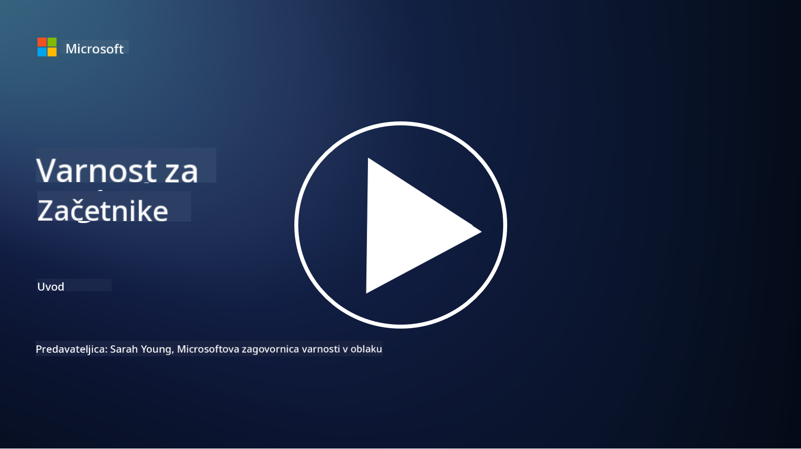

<!--
CO_OP_TRANSLATOR_METADATA:
{
  "original_hash": "0f9381fb23638f9341416474ce3c1563",
  "translation_date": "2025-09-03T23:04:42+00:00",
  "source_file": "README.md",
  "language_code": "sl"
}
-->
  
  
  
  
  
  

# 🚀 Kibernetska varnost za začetnike – učni načrt

V tem hitro spreminjajočem se obdobju sprejemanja tehnologij umetne inteligence je še bolj pomembno razumeti, kako zaščititi IT sisteme. Ta tečaj je zasnovan tako, da vas nauči osnovnih konceptov kibernetske varnosti in vam pomaga začeti z učenjem varnosti. Tečaj je neodvisen od ponudnikov in razdeljen na kratke lekcije, ki trajajo približno 30–60 minut. Vsaka lekcija vključuje kratek kviz in povezave do dodatnega gradiva, če želite poglobiti svoje znanje o določeni temi.

Kaj zajema ta tečaj 📚

- 🔐 Osnovni koncepti kibernetske varnosti, kot so trikotnik CIA, razlike med tveganji, grožnjami itd.
- 🛡️ Razumevanje, kaj je varnostni ukrep in kakšne oblike lahko ima.
- 🌐 Razumevanje koncepta "zero trust" in zakaj je pomemben v sodobni kibernetski varnosti.
- 🔑 Razumevanje ključnih konceptov in tem na področjih identitete, omrežja, varnostnih operacij, infrastrukture in varnosti podatkov.
- 🔧 Primeri orodij, ki se uporabljajo za izvajanje varnostnih ukrepov.

Kaj ta tečaj ne zajema 🙅‍♂️

- 🚫 Kako uporabljati specifična varnostna orodja.
- 🚫 Kako "hekirati" ali izvajati napade (red teaming/offensive security).
- 🚫 Učenje o specifičnih standardih skladnosti.

Ko zaključite ta tečaj, lahko nadaljujete z nekaterimi moduli na Microsoft Learn. Priporočamo, da nadaljujete z učenjem prek [Microsoft Security, Compliance, and Identity Fundamentals.](https://learn.microsoft.com/training/paths/describe-concepts-of-security-compliance-identity/?WT.mc_id=academic-96948-sayoung)  

Na koncu lahko razmislite o opravljanju [izpita SC-900: Microsoft Security, Compliance, and Identity Fundamentals.](https://learn.microsoft.com/credentials/certifications/exams/sc-900/?WT.mc_id=academic-96948-sayoung)  

> 💁 Če imate povratne informacije ali predloge glede tega tečaja ali menite, da kaj manjka, bi radi slišali vaše mnenje!

## Pregled modulov 📝  
| **Številka modula** | **Ime modula**                           | **Poučeni koncepti**                  | **Cilji učenja**                                                                                          |
|---------------------|------------------------------------------|---------------------------------------|-----------------------------------------------------------------------------------------------------------|
| **1.1**             | Osnovni koncepti varnosti               | [Trikotnik CIA](https://github.com/microsoft/Security-101/blob/main/1.1%20The%20CIA%20triad%20and%20other%20key%20concepts.md)                        | Naučite se o zaupnosti, razpoložljivosti in celovitosti. Prav tako o avtentičnosti, neizpodbitnosti in zasebnosti. |
| **1.2**             | Osnovni koncepti varnosti               | [Pogoste grožnje kibernetski varnosti](https://github.com/microsoft/Security-101/blob/main/1.2%20Common%20cybersecurity%20threats.md)        | Naučite se o pogostih grožnjah kibernetski varnosti, ki ogrožajo posameznike in organizacije.                             |
| **1.3**             | Osnovni koncepti varnosti               | [Razumevanje upravljanja tveganj](https://github.com/microsoft/Security-101/blob/main/1.3%20Understanding%20risk%20management.md)       | Naučite se oceniti in razumeti tveganja – vpliv/verjetnost ter izvajanje ukrepov.                                                                                                               | |
| **1.4**             | Osnovni koncepti varnosti               | [Varnostne prakse in dokumentacija](https://github.com/microsoft/Security-101/blob/main/1.4%20Security%20practices%20and%20documentation.md) | Naučite se razlikovati med politikami, postopki, standardi in predpisi/zakoni.                         |
| **1.5**             | Osnovni koncepti varnosti               | [Zero trust](https://github.com/microsoft/Security-101/blob/main/1.5%20Zero%20trust.md)                           | Naučite se, kaj je "zero trust" in kako vpliva na arhitekturo. Kaj je obramba v globino?                   |
| **1.6**             | Osnovni koncepti varnosti               | [Model deljene odgovornosti](https://github.com/microsoft/Security-101/blob/main/1.6%20Shared%20responsibility%20model.md)                           | Kaj je model deljene odgovornosti in kako vpliva na kibernetsko varnost?                  |
| **1.7**             | [Kviz ob koncu modula](https://github.com/microsoft/Security-101/blob/main/1.7%20End%20of%20module%20quiz.md)                        |                                      |                                                                                                                 |
| **2.1**             | Osnove upravljanja identitete in dostopa | [Ključni koncepti IAM](https://github.com/microsoft/Security-101/blob/main/2.1%20IAM%20key%20concepts.md)                     | Naučite se o načelu najmanjših privilegijev, ločevanju dolžnosti in kako IAM podpira "zero trust".               |
| **2.2**             | Osnove upravljanja identitete in dostopa | [IAM arhitektura "zero trust"](https://github.com/microsoft/Security-101/blob/main/2.2%20IAM%20zero%20trust%20architecture.md)          | Naučite se, kako identiteta predstavlja novo obmejno področje za sodobna IT okolja in grožnje, ki jih zmanjšuje.          |
| **2.3**             | Osnove upravljanja identitete in dostopa | [Zmožnosti IAM](https://github.com/microsoft/Security-101/blob/main/2.3%20IAM%20capabilities.md)                     | Naučite se o zmožnostih in ukrepih IAM za zaščito identitet.                                                  |
| **2.4**             | [Kviz ob koncu modula](https://github.com/microsoft/Security-101/blob/main/2.4%20End%20of%20module%20quiz.md)                        |                                      |                                                                                                                 |
| **3.1**             | Osnove varnosti omrežja                 | [Ključni koncepti omrežja](https://github.com/microsoft/Security-101/blob/main/3.1%20Networking%20key%20concepts.md)              | Naučite se o konceptih omrežja (IP naslavljanje, številke vrat, šifriranje itd.).                                 |
| **3.2**             | Osnove varnosti omrežja                 | [Omrežna arhitektura "zero trust"](https://github.com/microsoft/Security-101/blob/main/3.2%20Networking%20zero%20trust%20architecture.md)   | Naučite se, kako omrežje prispeva k celoviti arhitekturi "zero trust" in grožnje, ki jih zmanjšuje.                  |
| **3.3**             | Osnove varnosti omrežja                 | [Zmožnosti varnosti omrežja](https://github.com/microsoft/Security-101/blob/main/3.3%20Network%20security%20capabilities.md)        | Naučite se o orodjih za varnost omrežja – požarni zidovi, WAF, zaščita pred DDoS napadi itd.                                    |
| **3.4**             | [Kviz ob koncu modula](https://github.com/microsoft/Security-101/blob/main/3.4%20End%20of%20module%20quiz.md)                        |                                      |                                                                                                                 |
| **4.1**             | Osnove varnostnih operacij              | [Ključni koncepti SecOps](https://github.com/microsoft/Security-101/blob/main/4.1%20SecOps%20key%20concepts.md)                  | Naučite se, zakaj so varnostne operacije pomembne in kako se razlikujejo od običajnih IT operacijskih ekip.                  |
| **4.2**             | Osnove varnostnih operacij              | [SecOps arhitektura "zero trust"](https://github.com/microsoft/Security-101/blob/main/4.2%20SecOps%20zero%20trust%20architecture.md)       | Naučite se, kako SecOps prispeva k celoviti arhitekturi "zero trust" in grožnje, ki jih zmanjšuje.                      |
| **4.3**             | Osnove varnostnih operacij              | [Zmožnosti SecOps](https://github.com/microsoft/Security-101/blob/main/4.3%20SecOps%20capabilities.md)                  | Naučite se o orodjih SecOps – SIEM, XDR itd.                                                                    |
| **4.4**             | [Kviz ob koncu modula](https://github.com/microsoft/Security-101/blob/main/4.4%20End%20of%20module%20quiz.md)                        |                                      |                                                                                                                 |
| **5.1**             | Osnove varnosti aplikacij               | [Ključni koncepti AppSec](https://github.com/microsoft/Security-101/blob/main/5.1%20AppSec%20key%20concepts.md)                  | Naučite se o konceptih AppSec, kot so varnost pri zasnovi, validacija vhodnih podatkov itd.                                    |
| **5.2**             | Osnove varnosti aplikacij               | [Zmožnosti AppSec](https://github.com/microsoft/Security-101/blob/main/5.2%20AppSec%20key%20capabilities.md)                  | Naučite se o orodjih AppSec: orodja za varnost v razvojnih procesih, pregled kode, pregled skrivnosti itd.                       |
| **5.3**             | [Kviz ob koncu modula](https://github.com/microsoft/Security-101/blob/main/5.3%20End%20of%20module%20quiz.md)                        |                                      |                                                                                                                 |
| **6.1**             | Osnove varnosti infrastrukture          | [Ključni koncepti varnosti infrastrukture](https://github.com/microsoft/Security-101/blob/main/6.1%20Infrastructure%20security%20key%20concepts.md) | Naučite se o utrjevanju sistemov, nameščanju popravkov, varnostni higieni, varnosti kontejnerjev.                                  |
| **6.2**             | Osnove varnosti infrastrukture          | [Zmožnosti varnosti infrastrukture](https://github.com/microsoft/Security-101/blob/main/6.2%20Infrastructure%20security%20capabilities.md) | Naučite se o orodjih, ki lahko pomagajo pri varnosti infrastrukture, npr. CSPM, varnost kontejnerjev itd.            |
| **6.3**             | [Kviz ob koncu modula](https://github.com/microsoft/Security-101/blob/main/6.3%20End%20of%20module%20quiz.md)                        |                                      |                                                                                                                 |
| **7.1**             | Osnove varnosti podatkov                | [Ključni koncepti varnosti podatkov](https://github.com/microsoft/Security-101/blob/main/7.1%20Data%20security%20key%20concepts.md)           | Naučite se o klasifikaciji in hrambi podatkov ter zakaj je to pomembno za organizacijo.                     |
| **7.2**             | Osnove varnosti podatkov                | [Zmožnosti varnosti podatkov](https://github.com/microsoft/Security-101/blob/main/7.2%20Data%20security%20capabilities.md)           | Naučite se o orodjih za varnost podatkov – DLP, upravljanje notranjih tveganj, upravljanje podatkov itd.                          |
| **7.3**             | [Kviz ob koncu modula](https://github.com/microsoft/Security-101/blob/main/7.3%20End%20of%20module%20quiz.md)                        |
| **8.1**             | Osnove varnosti umetne inteligence      | [Ključni koncepti varnosti AI](https://github.com/microsoft/Security-101/blob/main/8.1%20AI%20security%20key%20concepts.md)          | Naučite se o razlikah in podobnostih med tradicionalno varnostjo in varnostjo AI.                 |
| **8.2**             | Osnove varnosti umetne inteligence      | [Zmožnosti varnosti AI](https://github.com/microsoft/Security-101/blob/main/8.2%20AI%20security%20capabilities.md)           | Naučite se o orodjih za varnost AI in ukrepih, ki jih je mogoče uporabiti za zaščito AI.                         |
| **8.3**             | Osnove varnosti umetne inteligence      | [Odgovorna AI](https://github.com/microsoft/Security-101/blob/main/8.3%20Responsible%20AI.md)          | Naučite se, kaj je odgovorna AI in o specifičnih škodah, ki jih morajo strokovnjaki za varnost poznati.                          |
| **8.4**             | [Kviz ob koncu modula](https://github.com/microsoft/Security-101/blob/main/8.4%20End%20of%20module%20quiz.md)     

## 🎒 Drugi tečaji  

Naša ekipa pripravlja tudi druge tečaje! Oglejte si:  

- [Generativna AI za začetnike](https://aka.ms/genai-beginners)  
- [Generativna AI za začetnike .NET](https://github.com/microsoft/Generative-AI-for-beginners-dotnet)  
- [Generativna AI z JavaScript](https://github.com/microsoft/generative-ai-with-javascript)  
- [Generativna AI z Java](https://github.com/microsoft/Generative-AI-for-beginners-java)  
- [AI za začetnike](https://aka.ms/ai-beginners)  
- [Podatkovna znanost za začetnike](https://aka.ms/datascience-beginners)  
- [Strojno učenje za začetnike](https://aka.ms/ml-beginners)  
- [Kibernetska varnost za začetnike](https://github.com/microsoft/Security-101)  
- [Razvoj spletnih strani za začetnike](https://aka.ms/webdev-beginners)  
- [IoT za začetnike](https://aka.ms/iot-beginners)  
- [Razvoj XR za začetnike](https://github.com/microsoft/xr-development-for-beginners)  
- [Obvladovanje GitHub Copilot za parno programiranje](https://github.com/microsoft/Mastering-GitHub-Copilot-for-Paired-Programming)  
- [Obvladovanje GitHub Copilot za razvijalce C#/.NET](https://github.com/microsoft/mastering-github-copilot-for-dotnet-csharp-developers)  
- [Izberi svojo Copilot pustolovščino](https://github.com/microsoft/CopilotAdventures)  

---

**Omejitev odgovornosti**:  
Ta dokument je bil preveden z uporabo storitve za strojno prevajanje [Co-op Translator](https://github.com/Azure/co-op-translator). Čeprav si prizadevamo za natančnost, vas prosimo, da se zavedate, da lahko avtomatizirani prevodi vsebujejo napake ali netočnosti. Izvirni dokument v njegovem izvirnem jeziku je treba obravnavati kot avtoritativni vir. Za ključne informacije priporočamo strokovno človeško prevajanje. Ne prevzemamo odgovornosti za morebitna nesporazumevanja ali napačne razlage, ki izhajajo iz uporabe tega prevoda.