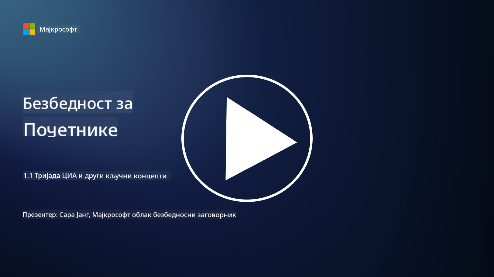
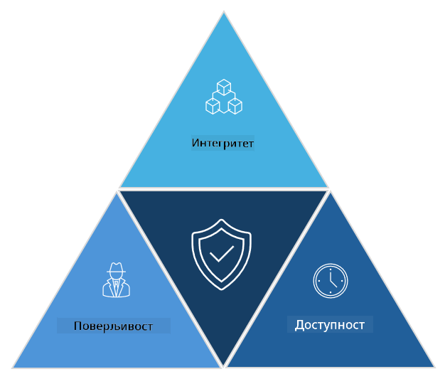

<!--
CO_OP_TRANSLATOR_METADATA:
{
  "original_hash": "16a76f9fa372fb63cffb6d76b855f023",
  "translation_date": "2025-09-04T01:12:40+00:00",
  "source_file": "1.1 The CIA triad and other key concepts.md",
  "language_code": "sr"
}
-->
# ЦИА тријада и други кључни концепти

## Увод

У овој лекцији ћемо обрадити:

 - Шта је сајбер безбедност?
   
 
 - Шта је ЦИА тријада сајбер безбедности?

   

 - Шта су аутентичност, непрекосновеност и приватност у контексту сајбер безбедности?

## Шта је сајбер безбедност?

Сајбер безбедност, позната и као информациона безбедност, представља праксу заштите компјутерских система, мрежа, уређаја и података од дигиталних напада, неовлашћеног приступа, оштећења или крађе. Примарни циљ сајбер безбедности је да обезбеди поверљивост, интегритет и доступност дигиталних ресурса и информација. Професионалци у области сајбер безбедности дизајнирају и имплементирају безбедносне контроле како би заштитили ресурсе, податке и информације. Како је све више аспеката наших живота дигитализовано и онлајн, сајбер безбедност је постала један од најважнијих приоритета како за приватне особе, тако и за организације.

## Шта је ЦИА тријада сајбер безбедности?

ЦИА тријада сајбер безбедности односи се на модел који укључује три главна аспекта који се узимају у обзир у било ком раду на сајбер безбедности или дизајнирању система/окружења:

### Поверљивост

Ово је аспект који је већини људи најпознатији када помисле на „сајбер безбедност“: поверљивост је процес заштите података и информација од покушаја неовлашћеног приступа, односно само људи који треба да виде информације могу да им приступе. Међутим, нису сви подаци једнако важни, па се подаци обично категоризују и штите на основу тога колико би штете настало ако би им приступили погрешни људи.

### Интегритет

Односи се на заштиту тачности и поузданости података унутар окружења и спречавање да подаци буду измењени или допуњени од стране неовлашћених особа. На пример, студент мења датум рођења у својим возачким записима у ДМВ-у како би изгледало да је старији, па може да добије нову возачку дозволу са ранијим датумом рођења и купује алкохол.

### Доступност

Ово је аспект који је важан у оперативном ИТ-у, али доступност је такође значајна за сајбер безбедност. Постоје специфични типови напада који циљају доступност и које професионалци у области безбедности морају спречити (нпр. напади ускраћивања услуге – DDoS напади).

**ЦИА тријада сајбер безбедности**

## Шта су аутентичност, непрекосновеност и приватност у контексту сајбер безбедности?

Ово су додатни важни концепти који се односе на обезбеђивање безбедности и поузданости система и података:

**Аутентичност** - односи се на уверење да су информације, комуникација или ентитет са којим комуницирате аутентични и да нису измењени или манипулисани од стране неовлашћених страна.

**Непрекосновеност** - представља концепт који осигурава да страна не може порећи своје учешће или аутентичност трансакције или комуникације. Спречава некога да тврди да није послао поруку или извршио одређену радњу када постоје докази који указују на супротно.

**Приватност** - односи се на заштиту осетљивих и лично идентификујућих информација од неовлашћеног приступа, употребе, откривања или манипулације. Укључује контролу над тим ко има приступ личним подацима и како се ти подаци прикупљају, чувају и деле.

## Додатно читање

[Шта је информациона безбедност (InfoSec)? | Microsoft Security](https://www.microsoft.com/security/business/security-101/what-is-information-security-infosec#:~:text=Three%20pillars%20of%20information%20security%3A%20the%20CIA%20triad,as%20guiding%20principles%20for%20implementing%20an%20InfoSec%20plan.)

---

**Одрицање од одговорности**:  
Овај документ је преведен коришћењем услуге за превођење помоћу вештачке интелигенције [Co-op Translator](https://github.com/Azure/co-op-translator). Иако тежимо тачности, молимо вас да имате у виду да аутоматски преводи могу садржати грешке или нетачности. Оригинални документ на изворном језику треба сматрати ауторитативним извором. За критичне информације препоручује се професионални превод од стране људи. Не сносимо одговорност за било каква неспоразумевања или погрешна тумачења настала услед коришћења овог превода.