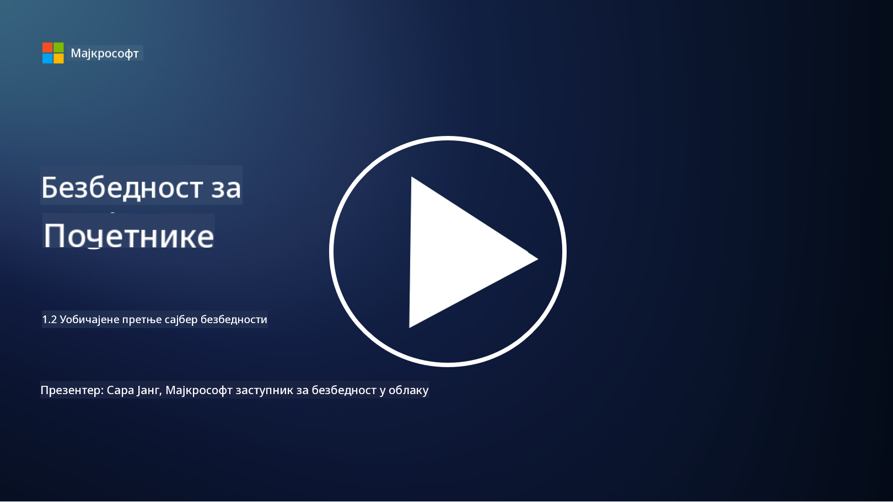

<!--
CO_OP_TRANSLATOR_METADATA:
{
  "original_hash": "6fc3030323139d7134a4ca9d03eccac9",
  "translation_date": "2025-09-03T23:29:38+00:00",
  "source_file": "1.2 Common cybersecurity threats.md",
  "language_code": "sr"
}
-->
# Уобичајене претње у сајбер безбедности

## Увод

У овој лекцији обрадићемо:

- Шта је претња у сајбер безбедности?

- Зашто злонамерни актери желе да угрожавају податке и ИТ системе?

- Које су најчешће врсте претњи у сајбер безбедности?

- Шта је MITRE ATT&CK оквир?

- Где могу да се информишем о трендовима у сајбер безбедности?

## Шта је претња у сајбер безбедности?

Претња у сајбер безбедности односи се на било коју потенцијалну опасност или ризик који може угрозити поверљивост, интегритет или доступност података или ИТ система. Ове претње долазе од злонамерних актера који покушавају да искористе рањивости како би стекли неовлашћени приступ, украли осетљиве информације, пореметили рад или нанели штету појединцима, организацијама или чак целим државама. Претње у сајбер безбедности могу имати различите облике и циљати различите аспекте дигиталних система и података.

## Зашто злонамерни актери желе да угрожавају податке и ИТ системе?

Злонамерни актери угрожавају податке и ИТ системе из различитих разлога, често вођени личном користи, идеолошким мотивима или жељом за изазивањем поремећаја. Разумевање ових мотивација може помоћи организацијама и појединцима да се боље бране од сајбер претњи. Неки од уобичајених разлога зашто злонамерни актери изводе сајбер нападе укључују:

1. **Финансијска добит**: Многи напади су мотивисани жељом за финансијском користи. Злонамерни актери могу украсти осетљиве информације као што су бројеви кредитних картица, банковни подаци или лични идентификациони подаци како би извршили превару, крађу идентитета, уцену или продали украдене податке на тамном вебу.

2. **Шпијунажа**: Државе, конкуренти или друге ентитети могу се бавити сајбер шпијунажом како би украли осетљиве владине, корпоративне или истраживачке податке ради политичке, економске или војне предности.

3. **Поремећај и саботажа**: Неки напади имају за циљ поремећај критичне инфраструктуре, услуга или операција из политичких или идеолошких разлога. Ови напади могу изазвати широко распрострањени хаос, финансијске губитке и штету по углед.

4. **Идеолошке мотивације**: Хактивисти и групе са идеолошким или политичким мотивима могу угрожавати системе како би скренули пажњу на одређена питања, промовисали своја уверења или протестовали против одређених акција или организација.

5. **Ненамерне радње**: Нису све злонамерне радње намерне; неки појединци могу ненамерно допринети сајбер претњама тако што постану жртве социјалног инжењеринга или део компромитоване мреже.

На крају, мотивације за угрожавање података и ИТ система могу бити веома различите, а утицај ових напада може бити озбиљан. Важно је да појединци, организације и владе озбиљно схвате сајбер безбедност и примене мере заштите од ових претњи.

## Које су најчешће врсте претњи у сајбер безбедности?

Постоји неколико уобичајених врста сајбер напада које злонамерни актери користе за угрожавање система, крађу података и изазивање поремећаја. Ево неких од најзаступљенијих врста у време писања:

1. **Фишинг**:

Фишинг подразумева слање обмањујућих имејлова или порука које изгледају као да долазе из легитимних извора како би се примаоци преварили да открију осетљиве информације, као што су лозинке, бројеви кредитних картица или лични подаци. Фишинг такође може довести жртве на злонамерне веб странице или да преузму малвер.

2. **Малвер**:

Малвер (злонамерни софтвер) обухвата низ злонамерних програма дизајнираних да заразе системе, украду податке или нанесу штету. Типови малвера укључују:

- **Рансомвер**: Шифрује датотеке и захтева откуп за њихово дешифровање.

- **Тројанци**: Прерушени у легитимни софтвер, омогућавају нападачима неовлашћени приступ.

- **Вируси**: Програми који се сами реплицирају и прикаче на датотеке, ширећи се.

- **Црви**: Програми који се сами реплицирају и шире кроз мреже.

3. **Напади ускраћивања услуге (DoS) и дистрибуирани напади ускраћивања услуге (DDoS)**:

DoS напади преоптерећују циљани систем, чинећи га недоступним корисницима. DDoS напади укључују коришћење мреже компромитованих уређаја за преплављивање циља саобраћајем, што отежава функционисање система или га у потпуности онемогућава.

4. **SQL инјекција**:

У овом нападу, нападачи манипулишу улазним пољима веб апликације како би убацили злонамерне SQL упите, потенцијално стичући неовлашћени приступ базама података и осетљивим информацијама.

5. **Cross-Site Scripting (XSS)**:

Нападачи убацују злонамерне скрипте у веб апликације, које затим извршавају претраживачи несумњивих корисника. Ово може довести до крађе корисничких података и/или ширења малвера.

6. **Социјално инжењерство**:

Социјално инжењерство користи људску психологију за манипулацију појединаца да открију поверљиве информације или изврше радње које угрожавају безбедност.

7. **Zero-Day (0day) експлоатације**:

Ови напади циљају рањивости у софтверу или хардверу које још нису познате произвођачу или јавности. Нападачи искоришћавају ове рањивости пре него што се развију закрпе. Многе организације брину о zero-day нападима јер за њих не постоји закрпа, али они нису тако чести као други напади на овој листи. Када се открије zero-day, истраживачи безбедности брзо раде на развоју закрпе, па су ови напади обично кратког века.

8. **Напади на акредитиве**:

Ови напади укључују brute force нападе, где нападачи више пута погађају лозинке, и credential stuffing нападе, где украдени акредитиви са једног сајта се користе за покушај приступа на другим сајтовима.

## Шта је MITRE ATT&CK оквир?

[MITRE ATT&CK оквир](https://attack.mitre.org/) (Adversarial Tactics, Techniques, and Common Knowledge) је оквир који каталогизује и категоризује тактике, технике и процедуре (TTPs) које противници користе током сајбер напада. Оквир је креирала MITRE Corporation, непрофитна организација која управља истраживачким и развојним центрима за различите владине агенције.

MITRE ATT&CK оквир пружа стандардизован начин за описивање и анализу сајбер претњи, омогућавајући професионалцима у сајбер безбедности да боље разумеју и бране се од различитих техника напада. Широко га користе безбедносни тимови, ловци на претње и реаговаоци на инциденте за:

1. **Разумевање понашања противника**: Оквир документује стварна понашања напада, описујући кораке које нападачи предузимају од почетног уласка до постизања својих циљева. Покрива широк спектар техника напада које користе различите групе претњи.

2. **Планирање и имплементација стратегија одбране**: Безбедносни тимови могу користити оквир за развој проактивних стратегија одбране које су усклађене са специфичним тактикама и техникама које противници могу применити.

3. **Реаговање на инциденте и лов на претње**: Приликом истраживања инцидената или спровођења лова на претње, професионалци у безбедности могу се ослонити на оквир како би идентификовали и ублажили специфичне технике које нападачи користе.

MITRE ATT&CK оквир је организован у матрице које групишу технике напада на основу специфичних платформи и окружења, као што су Windows, macOS, Linux и cloud услуге. Свака матрица је подељена на тактике (висок ниво циљева) и технике (специфичне методе које се користе за постизање тих циљева). За сваку технику, оквир пружа информације о томе како функционише, потенцијалним мерама ублажавања и релевантним референцама на стварне групе претњи које су користиле ту технику.

Оквир се континуирано ажурира и проширује како се прикупљају нове информације о претњама и како се сајбер пејзаж развија. То је вредан ресурс за побољшање сајбер безбедности организације, омогућавајући дубље разумевање како нападачи делују и како се бранити од њихових тактика.

## Где могу да се информишем о трендовима у сајбер безбедности?

Постоји много извора који се могу користити за праћење сајбер претњи, ево неколико:

- [Open Web Application Security Project (OWASP) топ 10 рањивости](https://owasp.org/Top10/)
- [Common Vulnerabilities and Exposures (CVEs)](https://www.bing.com/ck/a?!&&p=53df6007f017bca2JmltdHM9MTY5MjU3NjAwMCZpZ3VpZD0zYmY4N2RiYS1jYWI1LTYwMDgtMWY1YS02ZmYyY2JjNjYxZWUmaW5zaWQ9NTc2OQ&ptn=3&hsh=3&fclid=3bf87dba-cab5-6008-1f5a-6ff2cbc661ee&psq=cve&u=a1aHR0cHM6Ly9iaW5nLmNvbS9hbGluay9saW5rP3VybD1odHRwcyUzYSUyZiUyZmN2ZS5taXRyZS5vcmclMmYmc291cmNlPXNlcnAtcnImaD1BZXN4S0VBWTNnbGhNZEFpd3daMlNSZkZQNTlrODhIUnYxRUtlSkY1RTk0JTNkJnA9a2NvZmZjaWFsd2Vic2l0ZQ&ntb=1 "Common Vulnerabilities and Exposures")
- [Microsoft Security Response Center блогови](https://msrc.microsoft.com/blog/)
- [National Institute of Standards and Technology (NIST)](https://www.dhs.gov/topics/cybersecurity): NIST пружа ресурсе, упозорења и најновије информације о потенцијалним сајбер претњама.
- [Cybersecurity and Infrastructure Security Agency (CISA)](https://www.cisa.gov/resources-tools/resources/free-cybersecurity-services-and-tools): CISA пружа ресурсе за сајбер безбедност и најбоље праксе за предузећа, владине агенције и друге организације. CISA дели ажуриране информације о врстама безбедносних активности које утичу на заједницу у целини и детаљну анализу нових и развојних сајбер претњи.
- [National Cybersecurity Center of Excellence (NCCoE)](https://www.dhs.gov/topics/cybersecurity): NCCoE је центар који пружа практична решења за сајбер безбедност која се могу применити у стварним ситуацијама.
- [US-CERT](https://www.cisa.gov/resources-tools/resources/free-cybersecurity-services-and-tools): Амерички тим за спремност на рачунарске хитне случајеве (US-CERT) пружа разне ресурсе за сајбер безбедност, укључујући упозорења, савете и још много тога.
- CERT вашег земље

---

**Одрицање од одговорности**:  
Овај документ је преведен коришћењем услуге за превођење помоћу вештачке интелигенције [Co-op Translator](https://github.com/Azure/co-op-translator). Иако се трудимо да превод буде тачан, молимо вас да имате у виду да аутоматизовани преводи могу садржати грешке или нетачности. Оригинални документ на његовом изворном језику треба сматрати меродавним извором. За критичне информације препоручује се професионални превод од стране људског преводиоца. Не преузимамо одговорност за било каква погрешна тумачења или неспоразуме који могу настати услед коришћења овог превода.