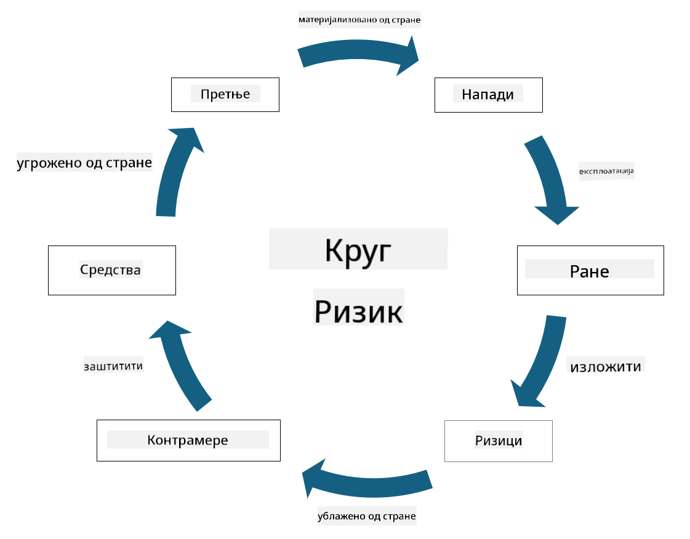

<!--
CO_OP_TRANSLATOR_METADATA:
{
  "original_hash": "fcca304f072cabf206388199e8e2e578",
  "translation_date": "2025-09-04T01:35:57+00:00",
  "source_file": "1.3 Understanding risk management.md",
  "language_code": "sr"
}
-->
# Разумевање управљања ризиком

## Увод

У овој лекцији ћемо обрадити:

- Дефиниције често коришћене терминологије у области безбедности

- Типове безбедносних контрола

- Процену безбедносних ризика

## Дефиниције често коришћене терминологије у области безбедности

Ови термини представљају основне концепте у области сајбер безбедности и управљања ризиком. Хајде да разложимо сваки термин и њихову међусобну повезаност:

1. **Агент претње**:

Агент претње је појединац, група, организација или аутоматизовани систем који има потенцијал да искористи рањивости у систему или мрежи како би нанео штету или изазвао проблеме. Агент претње може бити хакер, аутор злонамерног софтвера, незадовољни запослени или било који ентитет који представља ризик за информационе и технолошке системе.

2. **Претња**:

Претња је потенцијални догађај или акција која може искористити рањивости у систему и нанети штету неком ресурсу. Претње могу укључивати акције као што су хаковање, крађа података, напади ускраћивања услуге и слично. Претње представљају "шта" у смислу потенцијалне штете која може бити нанета ресурсима организације.

3. **Ранљивост**:

Ранљивост је слабост или недостатак у дизајну, имплементацији или конфигурацији система који може бити искоришћен од стране агента претње за компромитовање безбедности система. Ранљивости могу постојати у софтверу, хардверу, процесима или људском понашању. Идентификовање и решавање рањивости је кључно за минимизирање ризика од успешних напада.

4. **Ризик**:

Ризик је потенцијал за губитак, штету или проблем који произилази из интеракције између претње и рањивости. То је вероватноћа да ће агент претње искористити рањивост и изазвати негативан утицај. Ризици се често процењују у смислу њиховог потенцијалног утицаја и вероватноће да ће се догодити.

5. **Ресурс**:

Ресурс је све што има вредност и што организација жели да заштити. Ресурси могу укључивати физичке објекте (као што су рачунари и сервери), податке (информације о клијентима, финансијске записе), интелектуалну својину (пословне тајне, патенте) и чак људске ресурсе (вештине и знање запослених). Заштита ресурса је кључни циљ сајбер безбедности.

6. **Изложеност**:

Изложеност се односи на стање у којем постоји рањивост која би могла бити искоришћена од стране агента претње. Изложеност истиче ризик повезан са присуством рањивости у систему или мрежи.

7. **Контрола**:

Контрола је мера која се примењује ради смањења ризика повезаног са рањивостима и претњама. Контроле могу бити техничке, процедуралне или административне природе. Оне су дизајниране да спрече, открију или ублаже потенцијалне претње и рањивости. Примери укључују заштитне зидове, контроле приступа, енкрипцију, безбедносне политике и обуку запослених.

Да сумирамо однос између ових термина: агенти претње искоришћавају рањивости да би реализовали претње, што може довести до ризика који имају потенцијал да нанесу штету вредним ресурсима. Изложеност се јавља када су рањивости присутне, а контроле се примењују ради смањења ризика спречавањем или ублажавањем утицаја претњи на ресурсе. Овај оквир представља основу управљања ризиком у сајбер безбедности, водећи организације у идентификовању, процени и решавању потенцијалних ризика за њихове информационе системе и ресурсе.

## Типови безбедносних контрола

Безбедносне контроле су мере или заштитне мере које се примењују ради заштите информационих система и ресурса од различитих претњи и рањивости. Оне се могу класификовати у неколико категорија на основу њиховог фокуса и сврхе. Ево неких уобичајених типова безбедносних контрола:

1. **Административне контроле**:

Ове контроле се односе на политике, процедуре и смернице које регулишу безбедносне праксе и понашање корисника у организацији.

- Безбедносне политике и процедуре: Документоване смернице које дефинишу како се одржава безбедност у организацији.

- Свесност о безбедности и обука: Програми за едукацију запослених о најбољим праксама у области безбедности и потенцијалним претњама.

- Одговор на инциденте и управљање: Планови за реаговање на безбедносне инциденте и њихово ублажавање.

2. **Техничке контроле**:

Техничке контроле укључују употребу технологије за спровођење безбедносних мера и заштиту система и података. Примери техничких контрола су:

- Контроле приступа: Мере које ограничавају приступ корисника ресурсима на основу њихових улога и дозвола.

- Енкрипција: Претварање података у сигуран формат ради спречавања неовлашћеног приступа.

- Заштитни зидови: Уређаји за безбедност мреже који филтрирају и контролишу долазни и одлазни саобраћај.

- Системи за откривање и спречавање упада (IDPS): Алатке које надгледају мрежни саобраћај ради сумњивих активности.

- Антивирусни и анти-малвер софтвер: Програми који откривају и уклањају злонамерни софтвер.

- Механизми за аутентификацију: Методе за верификацију идентитета корисника, као што су лозинке, биометрија и мултифакторска аутентификација.

- Управљање закрпама: Редовно ажурирање софтвера ради решавања познатих рањивости.

3. **Физичке контроле**:

Физичке контроле су мере за заштиту физичких ресурса и објеката.

- Обезбеђење и особље за контролу приступа: Особље које надгледа и контролише приступ физичким просторијама.

- Камере за надзор: Системи за видео надгледање ради праћења и снимања активности.

- Браве и физичке баријере: Физичке мере за ограничавање приступа осетљивим областима.

- Контроле окружења: Мере за регулисање температуре, влажности и других фактора који утичу на опрему и центре података.

4. **Оперативне контроле**:

Ове контроле се односе на свакодневне операције и активности које осигуравају континуирану безбедност система.

- Управљање променама: Процеси за праћење и одобравање промена у системима и конфигурацијама.

- Резервне копије и опоравак од катастрофа: Планови за резервну копију података и опоравак у случају отказа система или катастрофа.

- Логовање и ревизија: Надгледање и снимање активности система ради безбедности и усаглашености.

- Практике сигурног кодирања: Смернице за писање софтвера ради минимизирања рањивости.

5. **Правне и регулаторне контроле**:

Ове контроле осигуравају усаглашеност са релевантним законима, прописима и индустријским стандардима. Стандарди које организација мора да поштује зависе од јурисдикције, индустријског сектора и других фактора.

- Регулативе о заштити података: Усаглашеност са законима као што су GDPR, HIPAA и CCPA.

- Индустријски стандарди: Придржавање стандарда као што је PCI DSS за безбедност података о платним картицама.

Ове категорије безбедносних контрола раде заједно како би створиле свеобухватну безбедносну позицију за организације, помажући у заштити њихових система, података и ресурса од широког спектра претњи.

## Процена безбедносних ризика

Неки стручњаци за безбедност сматрају да управљање ризиком треба препустити професионалцима за ризик, али разумевање процеса управљања безбедносним ризиком је важно за сваког стручњака за безбедност како би изразио безбедносни ризик на језику који остатак организације може разумети и деловати на основу њега.

Организације морају стално процењивати безбедносне ризике и одлучивати које акције (или неакције) да предузму против ризика за пословање. Испод је преглед како се то обично ради. Напомињемо да се овај процес обично спроводи кроз неколико различитих тимова унутар организације; ретко је да један тим буде одговоран за управљање ризиком од почетка до краја.

1. **Идентификација ресурса и претњи**:

Организација идентификује ресурсе које жели да заштити. Ово може укључивати податке, системе, хардвер, софтвер, интелектуалну својину и више. Затим идентификује потенцијалне претње које би могле циљати те ресурсе.

2. **Процена рањивости**:

Организације затим идентификују рањивости или слабости у системима или процесима које би претње могле искористити. Ове рањивости могу проистицати из софтверских недостатака, погрешних конфигурација, недостатка безбедносних контрола и људских грешака.

3. **Процена вероватноће**:

Организација затим процењује вероватноћу да ће се свака претња догодити. Ово укључује разматрање историјских података, обавештајних информација о претњама, трендова у индустрији и унутрашњих фактора. Вероватноћа се може категорисати као ниска, средња или висока на основу вероватности да ће се претња реализовати.

4. **Процена утицаја**:

Затим организација одређује потенцијални утицај сваке претње ако би искористила рањивост. Утицај може обухватати финансијске губитке, оперативне поремећаје, штету угледу, правне последице и више. Утицај се такође може категорисати као низак, средњи или висок на основу потенцијалних последица.

5. **Израчунавање ризика**:

Процене вероватноће и утицаја се комбинују ради израчунавања укупног нивоа ризика за сваку идентификовану претњу. Ово се често ради коришћењем матрице ризика која додељује нумеричке вредности или квалитативне описе нивоима вероватноће и утицаја. Добијени ниво ризика помаже у приоритизацији ризика који захтевају хитну пажњу.

6. **Приоритизација и доношење одлука**:

Организација затим приоритизује ризике фокусирајући се на оне са највишим комбинованим вредностима вероватноће и утицаја. Ово омогућава ефикаснију алокацију ресурса и примену контрола. Претње високог ризика захтевају хитну пажњу, док се претње нижег ризика могу решавати током дужег временског периода.

7. **Третман ризика**:

На основу процене ризика, организација одређује како да ублажи или управља сваким ризиком. Ово може укључивати примену безбедносних контрола, пренос ризика кроз осигурање или чак прихватање одређених нивоа резидуалног ризика ако се сматрају управљивим/превише скупим за решавање/итд.

8. **Континуирано праћење и ревизија**:

Процена ризика није једнократни процес. Треба је спроводити периодично или кад год дође до значајних промена у окружењу организације. Континуирано праћење осигурава да се нове претње, рањивости или промене у пословном окружењу узимају у обзир.

Процењивањем безбедносних ризика на овај структуриран начин, организације могу доносити информисане одлуке о алокацији ресурса, безбедносним контролама и стратегијама управљања ризиком. Циљ је смањење укупне изложености ризику организације уз усклађивање безбедносних напора са пословним циљевима и приоритетима организације.

---

**Одрицање од одговорности**:  
Овај документ је преведен коришћењем услуге за превођење помоћу вештачке интелигенције [Co-op Translator](https://github.com/Azure/co-op-translator). Иако тежимо тачности, молимо вас да имате у виду да аутоматски преводи могу садржати грешке или нетачности. Оригинални документ на изворном језику треба сматрати ауторитативним извором. За критичне информације препоручује се професионални превод од стране људи. Не сносимо одговорност за било каква погрешна тумачења или неспоразуме који могу произаћи из коришћења овог превода.