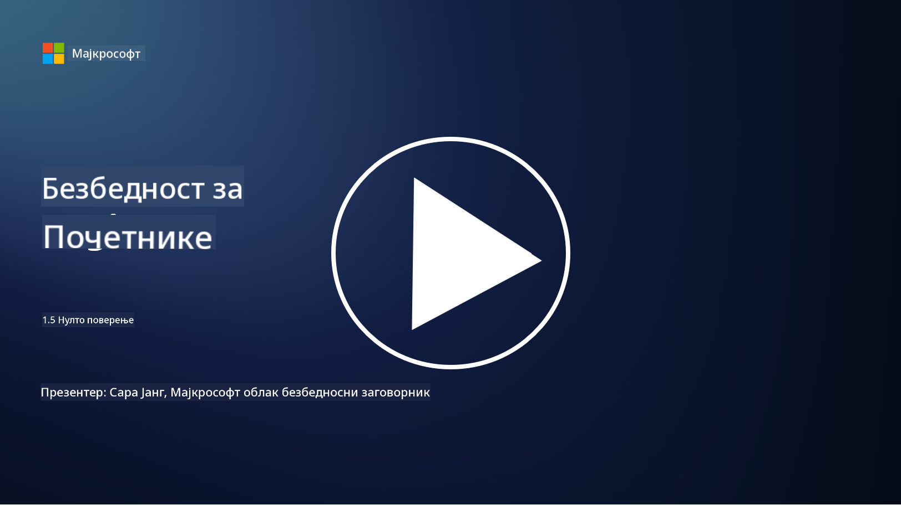
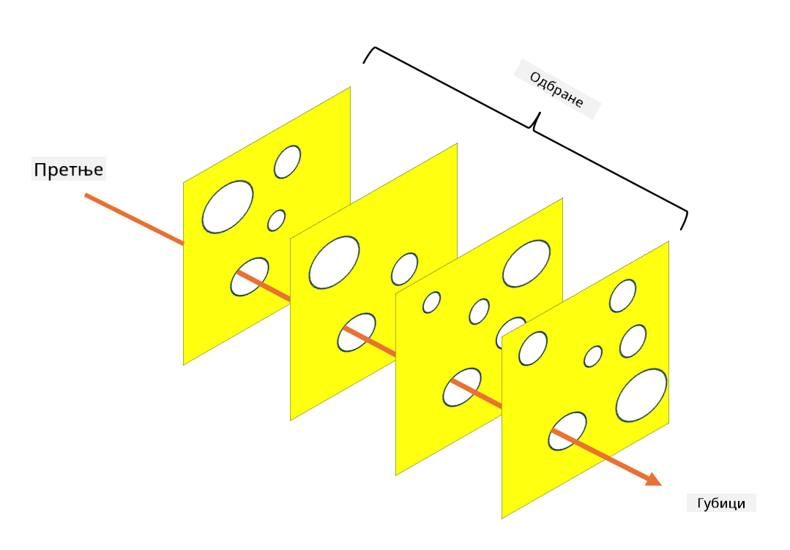

<!--
CO_OP_TRANSLATOR_METADATA:
{
  "original_hash": "75f77f972d2233c584f87c1eb96c983b",
  "translation_date": "2025-09-03T23:50:19+00:00",
  "source_file": "1.5 Zero trust.md",
  "language_code": "sr"
}
-->
# Зеро Траст

„Зеро траст“ је израз који се данас често користи у круговима безбедности. Али шта он заправо значи, да ли је то само популарна реч? У овој лекцији, детаљно ћемо објаснити шта је зеро траст.

## Увод

 - У овој лекцији, обрадићемо:
   
   
 - Шта је зеро траст?

   
  

 - Како се зеро траст разликује од традиционалних безбедносних архитектура?

   
   

 - Шта је одбрана у дубини?

## Зеро Траст

Зеро Траст је приступ сајбер безбедности који доводи у питање традиционални концепт „веруј, али провери“ претпостављајући да ниједан ентитет, било унутар или ван мреже организације, не треба да буде аутоматски сматран поузданим. Уместо тога, Зеро Траст заговара проверу сваког корисника, уређаја и апликације који покушавају да приступе ресурсима, без обзира на њихову локацију. Основни принцип Зеро Траста је минимизирање „површине напада“ и смањење потенцијалног утицаја безбедносних пробоја.

У Зеро Траст моделу, наглашавају се следећи принципи:

1. **Провера идентитета**: Аутентификација и ауторизација се строго примењују на све кориснике и уређаје, без обзира на њихову локацију. Запамтите да идентитет не мора нужно бити људски: то може бити уређај, апликација, итд.

2. **Најмањи привилегијум**: Корисницима и уређајима се додељује минимални ниво приступа неопходан за обављање њихових задатака, чиме се смањује потенцијална штета у случају компромитовања.

3. **Микро-сегментација**: Мрежни ресурси се деле на мање сегменте како би се ограничило латерално кретање унутар мреже у случају пробоја.

4. **Континуирано праћење**: Спроводи се стално праћење и анализа понашања корисника и уређаја ради откривања аномалија и потенцијалних претњи. Савремене технике праћења користе машинско учење, вештачку интелигенцију и обавештајне податке о претњама за додатне детаље и контекст.

5. **Шифровање података**: Подаци се шифрују како у транзиту, тако и у стању мировања, како би се спречио неовлашћени приступ.

6. **Строга контрола приступа**: Контроле приступа се спроводе на основу контекста, као што су улоге корисника, здравље уређаја и локација мреже.

Мајкрософт дели зеро траст на пет стубова, које ћемо обрадити у каснијој лекцији.

## Разлике у односу на традиционалне безбедносне архитектуре

Зеро Траст се разликује од традиционалних безбедносних архитектура, као што су модели засновани на периметру, на неколико начина:

1. **Периметар наспрам идентитет-центрираног приступа**: Традиционални модели се фокусирају на обезбеђивање периметра мреже и претпостављају да се унутрашњим корисницима и уређајима може веровати када су унутра. Зеро Траст, с друге стране, претпоставља да претње могу потицати и изнутра и споља и примењује строге контроле засноване на идентитету.

2. **Имплицитно наспрам експлицитног поверења**: Традиционални модели имплицитно верују уређајима и корисницима унутар мреже док се не докаже супротно. Зеро Траст експлицитно проверава идентитете и континуирано прати аномалије.

3. **Равна наспрам сегментиране мреже**: Традиционалне архитектуре често укључују равне мреже где унутрашњи корисници имају широк приступ. Зеро Траст заговара сегментирање мреже на мање, изоловане зоне како би се ограничили потенцијални пробоји.

4. **Реактивно наспрам проактивног приступа**: Традиционална безбедност често се ослања на реактивне мере као што су периметарски заштитни зидови и системи за откривање упада. Зеро Траст примењује проактивни приступ претпостављајући да су пробоји вероватни и минимизирајући њихов утицај.

## Одбрана у дубини

Одбрана у дубини, позната и као слојевита безбедност, је стратегија сајбер безбедности која подразумева примену више слојева безбедносних контрола и мера за заштиту ресурса организације. Циљ је стварање преклапајућих слојева одбране тако да, ако један слој буде пробијен, други и даље могу пружити заштиту. Сваки слој се фокусира на различите аспекте безбедности и повећава укупну безбедносну позицију организације.

Одбрана у дубини укључује комбинацију техничких, процедуралних и физичких безбедносних мера. Оне могу укључивати заштитне зидове, системе за откривање упада, контроле приступа, шифровање, обуку корисника, безбедносне политике и још много тога. Идеја је да се створе вишеструке баријере које колективно отежавају нападачима да продру у системе и мреже организације. Ово је понекад познато и као модел „швајцарског сира“, који се користи у превенцији несрећа у другим индустријама (нпр. транспорт).

## Додатно читање

[Шта је Зеро Траст?](https://learn.microsoft.com/security/zero-trust/zero-trust-overview?WT.mc_id=academic-96948-sayoung)

[Еволуција Зеро Траста – Мајкрософт позициони папир](https://query.prod.cms.rt.microsoft.com/cms/api/am/binary/RWJJdT?WT.mc_id=academic-96948-sayoung)

[Зеро Траст и BeyondCorp Google Cloud | Google Cloud Blog](https://cloud.google.com/blog/topics/developers-practitioners/zero-trust-and-beyondcorp-google-cloud)

---

**Одрицање од одговорности**:  
Овај документ је преведен коришћењем услуге за превођење помоћу вештачке интелигенције [Co-op Translator](https://github.com/Azure/co-op-translator). Иако се трудимо да обезбедимо тачност, молимо вас да имате у виду да аутоматски преводи могу садржати грешке или нетачности. Оригинални документ на његовом изворном језику треба сматрати меродавним извором. За критичне информације препоручује се професионални превод од стране људи. Не преузимамо одговорност за било каква погрешна тумачења или неспоразуме који могу настати услед коришћења овог превода.