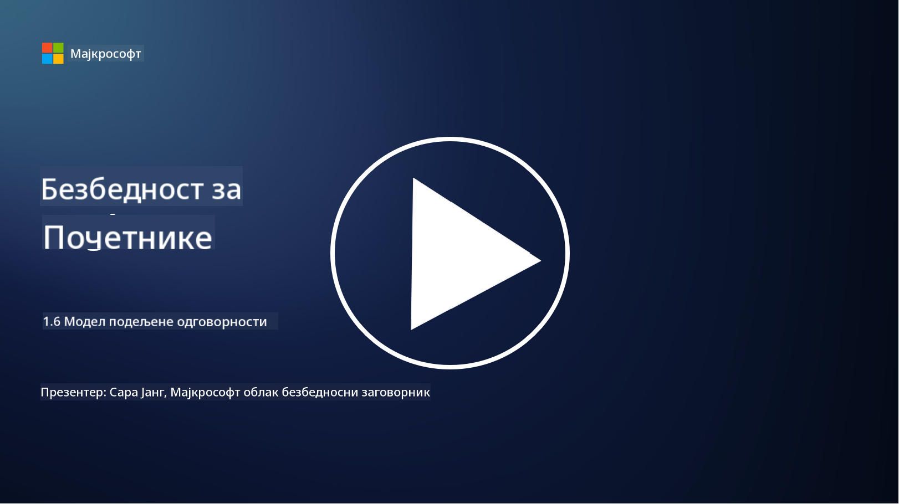

<!--
CO_OP_TRANSLATOR_METADATA:
{
  "original_hash": "a48db640d80c786b928ca178c414f084",
  "translation_date": "2025-09-04T00:29:03+00:00",
  "source_file": "1.6 Shared responsibility model.md",
  "language_code": "sr"
}
-->
# Модел заједничке одговорности

Заједничка одговорност је новији концепт у ИТ-у који је настао са развојем облачног рачунарства. Из перспективе сајбер безбедности, кључно је разумети ко обезбеђује које безбедносне контроле како би се избегле празнине у одбрани.

## Увод

У овој лекцији ћемо обрадити:

- Шта је заједничка одговорност у контексту сајбер безбедности?

- Која је разлика у заједничкој одговорности за безбедносне контроле
  између IaaS, PaaS и SaaS?

- Где можете пронаћи информације о безбедносним контролама које ваша облачна платформа пружа?

- Шта значи „веруј, али провери“?

## Шта је заједничка одговорност у контексту сајбер безбедности?

Заједничка одговорност у сајбер безбедности односи се на расподелу безбедносних одговорности између провајдера облачних услуга (CSP) и његових корисника. У окружењима облачног рачунарства, као што су Инфраструктура као услуга (IaaS), Платформа као услуга (PaaS) и Софтвер као услуга (SaaS), и CSP и корисник имају улоге у обезбеђивању безбедности података, апликација и система.

## Која је разлика у заједничкој одговорности за безбедносне контроле између IaaS, PaaS и SaaS?

Подела одговорности обично зависи од типа облачне услуге која се користи:

- **IaaS (Инфраструктура као услуга)**: CSP обезбеђује основну инфраструктуру (сервере, мрежу, складиште), док је корисник одговоран за управљање оперативним системима, апликацијама и безбедносним конфигурацијама на тој инфраструктури.

- **PaaS (Платформа као услуга):** CSP нуди платформу на којој корисници могу да граде и постављају апликације. CSP управља основном инфраструктуром, а корисник се фокусира на развој апликација и безбедност података.

- **SaaS (Софтвер као услуга):** CSP пружа потпуно функционалне апликације доступне преко интернета. У овом случају, CSP је одговоран за безбедност апликације и инфраструктуре, док корисник управља приступом корисника и употребом података.

Разумевање заједничке одговорности је кључно јер разјашњава који аспекти безбедности су покривени од стране CSP-а, а које корисник треба да адресира. Ово помаже у избегавању неспоразума и осигурава да се безбедносне мере имплементирају свеобухватно.

## Где можете пронаћи информације о безбедносним контролама које ваша облачна платформа пружа?

Да бисте сазнали које безбедносне контроле ваша облачна платформа пружа, потребно је да се обратите документацији и ресурсима провајдера облачних услуга. Ово укључује:

- **Веб-сајт и документацију CSP-а**: Веб-сајт CSP-а садржи информације о безбедносним функцијама и контролама које се нуде као део њихових услуга. CSP-и обично пружају детаљну документацију која објашњава њихове безбедносне праксе, контроле и препоруке. Ово може укључивати беле књиге, водиче за безбедност и техничку документацију.

- **Процене и ревизије безбедности**: Већина CSP-а ангажује независне стручњаке и организације за процену њихових безбедносних контрола. Ове ревизије могу пружити увид у квалитет безбедносних мера CSP-а. Понекад ово доводи до добијања сертификата о усаглашености са безбедносним стандардима (види следећу ставку).

- **Сертификати о усаглашености са безбедносним стандардима**: Већина CSP-а добија сертификате као што су ISO:27001, SOC 2 и FedRAMP, итд. Ови сертификати показују да провајдер испуњава одређене стандарде безбедности и усаглашености.

Имајте на уму да ниво детаља и доступност информација могу варирати између провајдера облачних услуга. Увек се уверите да консултујете званичне и ажуриране ресурсе које пружа CSP како бисте донели информисане одлуке о безбедности ваших облачних ресурса.

## Шта значи „веруј, али провери“?

У контексту коришћења CSP-а, софтвера треће стране или друге ИТ безбедносне услуге, организација може у почетку веровати тврдњама провајдера о безбедносним мерама. Међутим, да би заиста осигурала безбедност својих података и система, организација би требало да провери те тврдње кроз процене безбедности, тестирање продора и преглед безбедносних контрола треће стране пре него што у потпуности интегрише софтвер или услугу у своје операције. Сви појединци и организације треба да се воде принципом „веруј, али провери“ када је реч о безбедносним контролама за које нису одговорни.

## Заједничка одговорност унутар организације

Запамтите, заједничка одговорност за безбедност унутар организације између различитих тимова такође мора бити узета у обзир. Безбедносни тим ретко ће самостално имплементирати све контроле и мораће да сарађује са оперативним тимовима, програмерима и другим деловима пословања како би имплементирали све потребне безбедносне контроле за очување безбедности организације.

## Додатно читање

- [Shared responsibility in the cloud - Microsoft Azure | Microsoft Learn](https://learn.microsoft.com/azure/security/fundamentals/shared-responsibility?WT.mc_id=academic-96948-sayoung)
- [What is shared responsibility model? – Definition from TechTarget.com](https://www.techtarget.com/searchcloudcomputing/definition/shared-responsibility-model)
- [The shared responsibility model explained and what it means for cloud security | CSO Online](https://www.csoonline.com/article/570779/the-shared-responsibility-model-explained-and-what-it-means-for-cloud-security.html)
- [Shared Responsibility for Cloud Security: What You Need to Know (cisecurity.org)](https://www.cisecurity.org/insights/blog/shared-responsibility-cloud-security-what-you-need-to-know)

---

**Одрицање од одговорности**:  
Овај документ је преведен коришћењем услуге за превођење помоћу вештачке интелигенције [Co-op Translator](https://github.com/Azure/co-op-translator). Иако се трудимо да обезбедимо тачност, молимо вас да имате у виду да аутоматизовани преводи могу садржати грешке или нетачности. Оригинални документ на његовом изворном језику треба сматрати меродавним извором. За критичне информације препоручује се професионални превод од стране људи. Не преузимамо одговорност за било каква погрешна тумачења или неспоразуме који могу настати услед коришћења овог превода.