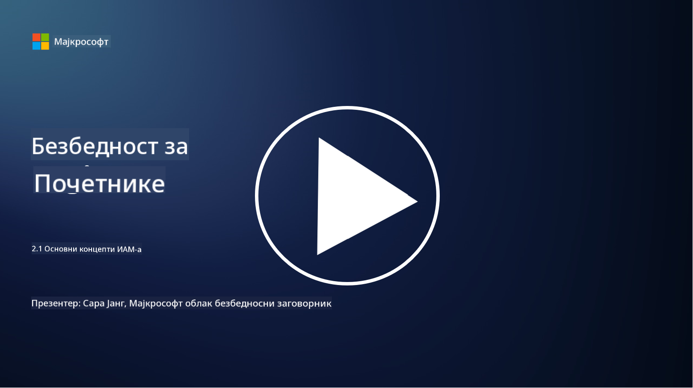

<!--
CO_OP_TRANSLATOR_METADATA:
{
  "original_hash": "2e3864e3d579f0dbb4ac2ec8c5f82acf",
  "translation_date": "2025-09-03T22:43:40+00:00",
  "source_file": "2.1 IAM key concepts.md",
  "language_code": "sr"
}
-->
# Основни концепти IAM

Да ли сте се икада пријавили на рачунар или веб-сајт? Наравно да јесте! То значи да сте већ користили контроле идентитета у свакодневном животу. Управљање идентитетом и приступом (IAM) је кључни стуб безбедности, а у наредним лекцијама ћемо научити више о томе.

**Увод**

У овој лекцији ћемо обрадити:

- Шта подразумевамо под управљањем идентитетом и приступом (IAM) у
  контексту сајбер безбедности?
  
- Шта је принцип најмањих привилегија?
  
- Шта је раздвајање дужности?
  
- Шта су аутентикација и ауторизација?

## Шта подразумевамо под управљањем идентитетом и приступом (IAM) у контексту сајбер безбедности?

Управљање идентитетом и приступом (IAM) односи се на сет процеса, технологија и политика које се примењују како би се осигурало да праве особе имају одговарајући приступ ресурсима унутар дигиталног окружења организације. IAM укључује управљање дигиталним идентитетима (корисници, запослени, партнери) и њиховим приступом системима, апликацијама, подацима и мрежама. Примарни циљ IAM-а је побољшање безбедности, поједностављење корисничког приступа и осигурање усклађености са политикама и прописима организације. IAM решења обично обухватају аутентикацију корисника, ауторизацију, креирање идентитета, контролу приступа и управљање животним циклусом корисника (осигурање да се налози бришу када се више не користе).

## Шта је принцип најмањих привилегија?

Принцип најмањих привилегија је основни концепт који заговара да се корисницима и системима додељују само минималне привилегије неопходне за обављање њихових задатака или улога. Овај принцип помаже у ограничавању потенцијалне штете која може настати у случају безбедносног пробоја или претње изнутра. Придржавањем принципа најмањих привилегија, организације смањују површину напада и минимизирају ризик од неовлашћеног приступа, пробоја података и случајне злоупотребе привилегија. У пракси, то значи да се корисницима додељује приступ само специфичним ресурсима и функционалностима потребним за њихове радне улоге, и ништа више. На пример, ако вам је потребно само да прочитате документ, било би претерано да вам се доделе пуне администраторске привилегије за тај документ.

## Шта је раздвајање дужности?

Раздвајање дужности је принцип који има за циљ спречавање сукоба интереса и смањење ризика од преваре и грешака кроз расподелу критичних задатака и одговорности међу различитим особама унутар организације. У контексту сајбер безбедности, раздвајање дужности подразумева осигурање да ниједна особа нема контролу над свим аспектима критичног процеса или система. Циљ је стварање система провера и равнотеже који спречавају да било која особа има могућност да обавља и фазу постављања и фазу одобравања процеса. На пример, у финансијским системима, ово може значити да особа која уноси трансакције у систем не сме бити иста особа која одобрава те трансакције. Ово смањује ризик од неовлашћених или преварантских радњи које би могле остати непримећене.

## Шта су аутентикација и ауторизација?

Аутентикација и ауторизација су два основна концепта у сајбер безбедности која играју кључну улогу у осигурању безбедности и интегритета компјутерских система и података. Често се користе заједно како би се контролисао приступ ресурсима и заштитиле осетљиве информације.

**1. Аутентикација**: Аутентикација је процес верификације идентитета корисника, система или ентитета који покушавају да приступе компјутерском систему или одређеном ресурсу. Она осигурава да је наведени идентитет истинит и тачан. Методе аутентикације обично укључују коришћење једног или више од следећих фактора:
    
    а. Нешто што знате: Ово укључује лозинке, ПИН-ове или друге тајне информације које само овлашћени корисник треба да поседује.
    
    б. Нешто што имате: Ово подразумева физичке токене или уређаје као што су паметне картице, безбедносни токени или мобилни телефони који се користе за потврду идентитета корисника.
    
    в. Нешто што јесте: Ово се односи на биометријске факторе као што су отисци прстију, препознавање лица или скенирање мрежњаче који су јединствени за појединца.
    

Механизми аутентикације се користе за потврду да је корисник оно за шта се представља пре него што му се дозволи приступ систему или ресурсу. Они помажу у спречавању неовлашћеног приступа и осигуравају да само легитимни корисници могу обављати радње унутар система.

**2. Ауторизација**: Ауторизација је процес додељивања или ускраћивања специфичних дозвола и привилегија аутентификованим корисницима или ентитетима након што је њихов идентитет потврђен. Она одређује које радње или операције корисник може да обавља унутар система или на одређеним ресурсима. Ауторизација се често заснива на унапред дефинисаним политикама, правилима контроле приступа и улогама додељеним корисницима.

Ауторизација се може посматрати као одговор на питање: "Шта аутентификовани корисник може да уради?" Она укључује дефинисање и спровођење политика контроле приступа како би се осетљиви подаци и ресурси заштитили од неовлашћеног приступа или модификације.

**Укратко:**

- Аутентикација утврђује идентитет корисника или ентитета.
- Ауторизација одређује које радње и ресурсе аутентификовани корисници могу да приступе или модификују.

## Додатно читање

- [Describe identity concepts - Training | Microsoft Learn](https://learn.microsoft.com/training/modules/describe-identity-principles-concepts/?WT.mc_id=academic-96948-sayoung)
- [Introduction to identity - Microsoft Entra | Microsoft Learn](https://learn.microsoft.com/azure/active-directory/fundamentals/identity-fundamental-concepts?WT.mc_id=academic-96948-sayoung)
- [What is Identity Access Management (IAM)? | Microsoft Security](https://www.microsoft.com/security/business/security-101/what-is-identity-access-management-iam?WT.mc_id=academic-96948-sayoung)
- [What is IAM? Identity and access management explained | CSO Online](https://www.csoonline.com/article/518296/what-is-iam-identity-and-access-management-explained.html)
- [What is IAM? (auth0.com)](https://auth0.com/blog/what-is-iam/)
- [Security+: implementing Identity and Access Management (IAM) controls [updated 2021] | Infosec (infosecinstitute.com)](https://resources.infosecinstitute.com/certifications/securityplus/security-implementing-identity-and-access-management-iam-controls/)
- [least privilege - Glossary | CSRC (nist.gov)](https://csrc.nist.gov/glossary/term/least_privilege)
- [Security: The Principle of Least Privilege (POLP) - Microsoft Community Hub](https://techcommunity.microsoft.com/t5/azure-sql-blog/security-the-principle-of-least-privilege-polp/ba-p/2067390?WT.mc_id=academic-96948-sayoung)
- [Principle of least privilege | CERT NZ](https://www.cert.govt.nz/it-specialists/critical-controls/principle-of-least-privilege/)
- [Why is separation of duties required by NIST 800-171 and CMMC? - (totem.tech)](https://www.totem.tech/cmmc-separation-of-duties/)

---

**Одрицање од одговорности**:  
Овај документ је преведен коришћењем услуге за превођење помоћу вештачке интелигенције [Co-op Translator](https://github.com/Azure/co-op-translator). Иако се трудимо да обезбедимо тачност, молимо вас да имате у виду да аутоматски преводи могу садржати грешке или нетачности. Оригинални документ на његовом изворном језику треба сматрати ауторитативним извором. За критичне информације препоручује се професионални превод од стране људи. Не преузимамо одговорност за било каква погрешна тумачења или неспоразуме који могу настати услед коришћења овог превода.