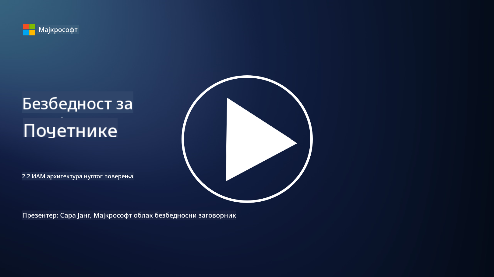

<!--
CO_OP_TRANSLATOR_METADATA:
{
  "original_hash": "4774a978af123f72ebb872199c4c4d4f",
  "translation_date": "2025-09-03T23:43:59+00:00",
  "source_file": "2.2 IAM zero trust architecture.md",
  "language_code": "sr"
}
-->
# IAM архитектура са нултим поверењем

Идентитет је кључни део имплементације архитектуре са нултим поверењем и изградње периметра за било које ИТ окружење. У овом одељку ћемо истражити зашто је важно користити контроле идентитета за имплементацију нултог поверења.

## Увод

У овој лекцији ћемо обрадити:

- Зашто је потребно користити идентитет као наш периметар у савременим ИТ окружењима?

- Како се ово разликује од традиционалних ИТ архитектура?

- Како се идентитет користи за имплементацију архитектуре са нултим поверењем?

## Зашто је потребно користити идентитет као наш периметар у савременим ИТ окружењима?

У савременим ИТ окружењима, традиционални концепт физичког периметра (коришћењем алата као што су заштитни зидови и мрежне границе) као примарне линије одбране од сајбер претњи постаје мање ефикасан због све веће сложености технологије, пораста рада на даљину и усвајања облачних услуга. Уместо тога, организације се све више ослањају на идентитет као нови периметар. То значи да се безбедност заснива на верификацији и управљању идентитетом корисника, уређаја и апликација које покушавају да приступе ресурсима, без обзира на њихову физичку локацију.

Ево зашто је коришћење идентитета као периметра кључно у савременим ИТ окружењима:

**Рад на даљину**: Са радом на даљину и мобилним уређајима који постају норма, корисници могу приступати ресурсима са различитих локација и уређаја. Традиционални приступ периметру не функционише када корисници више нису ограничени на физичку канцеларију.

**Облачна и хибридна окружења**: Организације све више усвајају облачне услуге и хибридна окружења. Подаци и апликације више нису искључиво смештени у просторијама организације, што чини традиционалне одбране периметра мање релевантним.

**Безбедност са нултим поверењем**: Концепт безбедности са нултим поверењем претпоставља да ниједан ентитет, било унутар или ван мреже, не треба аутоматски да се сматра поузданим. Идентитет постаје основа за верификацију захтева за приступ, без обзира на њихово порекло.

**Претње у сајбер простору**: Сајбер претње се развијају, а нападачи проналазе начине да заобиђу традиционалне одбране периметра. Фишинг, социјални инжењеринг и унутрашње претње често искоришћавају људске слабости уместо да покушавају да пробију мрежне периметре.

**Приступ усмерен на податке**: Заштита осетљивих података је од суштинског значаја. Фокусирањем на идентитет, организације могу контролисати ко приступа којим подацима, смањујући ризик од цурења података.

## Како се ово разликује од традиционалних ИТ архитектура?

Традиционалне ИТ архитектуре су се у великој мери ослањале на моделе безбедности засноване на периметру, где су заштитни зидови и мрежне границе играли значајну улогу у спречавању претњи. Главне разлике између традиционалног и приступа заснованог на идентитету су:

|      Аспект                |      Традиционалне ИТ архитектуре                                                                  |      Приступ заснован на идентитету                                                                         |
|-----------------------------|----------------------------------------------------------------------------------------------------|------------------------------------------------------------------------------------------------------------|
|     Фокус                  |     Фокус на периметру: Ослањање на одбране периметра као што су заштитни зидови и   контрола приступа. |     Фокус на верификацији идентитета: Прелазак са мрежних граница на верификацију   идентитета корисника/уређаја. |
|     Локација               |     Зависност од локације: Безбедност везана за физичке локације канцеларија и   мрежне границе.    |     Независност од локације: Безбедност није везана за одређене локације; приступ   са било ког места.       |
|     Претпоставка поверења  |     Претпостављено поверење: Поверење унутар мрежног периметра за   кориснике/уређаје.              |     Приступ са нултим поверењем: Поверење се никада не претпоставља; приступ се верификује   на основу идентитета и контекста. |
|     Разматрање уређаја     |     Разноликост уређаја: Претпоставка да су уређаји унутар мрежног периметра   безбедни.            |     Свесност о уређајима: Разматрање здравља и безбедносног стања уређаја,   без обзира на локацију.         |
|     Заштита података       |     Заштита података: Фокус на обезбеђивање мрежних периметара ради заштите   података.             |     Заштита усмерена на податке: Фокус на контролисање приступа подацима на основу   идентитета и осетљивости података. |

## Како се идентитет користи за имплементацију архитектуре са нултим поверењем?

У архитектури са нултим поверењем, основни принцип је да се ниједан ентитет, без обзира да ли је унутар или ван мрежног периметра, не треба аутоматски сматрати поузданим. Идентитет игра централну улогу у имплементацији приступа са нултим поверењем омогућавајући континуирану верификацију ентитета који покушавају да приступе ресурсима. Савремене контроле безбедности идентитета омогућавају да сваки корисник, уређај, апликација и услуга која тражи приступ ресурсима мора бити темељно идентификована и аутентификована пре него што приступ буде одобрен. Ово укључује верификацију њиховог дигиталног идентитета кроз методе као што су комбинације корисничког имена и лозинке, мултифакторска аутентификација (MFA), биометрија и други механизми јаке аутентификације.

## Додатно читање

- [Securing identity with Zero Trust | Microsoft Learn](https://learn.microsoft.com/security/zero-trust/deploy/identity?WT.mc_id=academic-96948-sayoung)
- [Zero Trust Principles and Guidance for Identity and Access | CSA (cloudsecurityalliance.org)](https://cloudsecurityalliance.org/artifacts/zero-trust-principles-and-guidance-for-iam/)
- [Zero Trust Identity Controls - Essentials Series - Episode 2 - YouTube](https://www.youtube.com/watch?v=fQZQznIKcGM&list=PLXtHYVsvn_b_gtX1-NB62wNervQx1Fhp4&index=13)

---

**Одрицање од одговорности**:  
Овај документ је преведен коришћењем услуге за превођење помоћу вештачке интелигенције [Co-op Translator](https://github.com/Azure/co-op-translator). Иако настојимо да обезбедимо тачност, молимо вас да имате у виду да аутоматизовани преводи могу садржати грешке или нетачности. Оригинални документ на изворном језику треба сматрати ауторитативним извором. За критичне информације препоручује се професионални превод од стране људи. Не сносимо одговорност за било каква погрешна тумачења или неспоразуме који могу произаћи из коришћења овог превода.