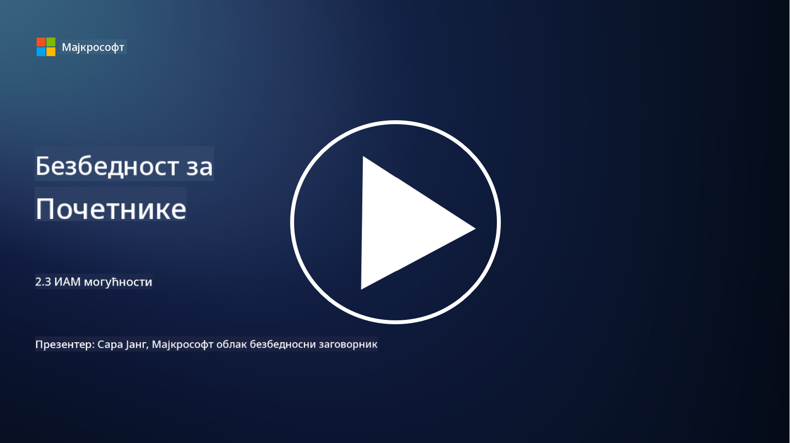

<!--
CO_OP_TRANSLATOR_METADATA:
{
  "original_hash": "bf0b8a54f2c69951744df5a94bc923f7",
  "translation_date": "2025-09-04T01:59:06+00:00",
  "source_file": "2.3 IAM capabilities.md",
  "language_code": "sr"
}
-->
# IAM Могућности

У овом одељку ћемо детаљније обрадити основне алате и могућности који се користе у безбедности идентитета.

## Увод

У овој лекцији ћемо обрадити:

 - Шта је директоријумска услуга?
      
     
    
 - Које могућности се могу користити за обезбеђивање идентитета?
>
>        Вишефакторска аутентификација (MFA)
> 
>        Једнократна пријава (SSO)
> 
>        Контрола приступа заснована на улогама (RBAC)
> 
>        Адаптивна аутентификација
> 
>        Биометријска аутентификација
> 
>        Управљање привилегованим приступом (PAM)
> 
>        Управљање идентитетом и администрација (IGA)
> 
>        Анализа понашања

## Шта је директоријумска услуга?

Директоријумска услуга је специјализована база података која чува и управља информацијама о мрежним ресурсима, укључујући кориснике, групе, уређаје, апликације и друге објекте. Она служи као централизовани репозиторијум података везаних за идентитет и приступ, омогућавајући организацијама да ефикасно управљају аутентификацијом корисника, ауторизацијом и другим задацима везаним за безбедност.

Директоријумске услуге играју кључну улогу у савременим ИТ окружењима, пружајући основу за решења за управљање идентитетом и приступом (IAM). Оне омогућавају сигуран приступ ресурсима, спроводе политике приступа и поједностављују административне задатке. Једна од најпознатијих директоријумских услуга је Microsoft Active Directory, али постоје и друга решења попут LDAP (Lightweight Directory Access Protocol) директоријума која служе сличним сврхама.

Кључне функције и карактеристике директоријумске услуге у контексту сајбер безбедности укључују:

 - **Аутентификација корисника**: Директоријумске услуге верификују акредитиве корисника (као што су корисничка имена и лозинке) како би осигурале да само овлашћени корисници могу приступити мрежи и њеним ресурсима.
 - **Ауторизација корисника**: Оне одређују ниво приступа који сваки корисник има на основу његове улоге, чланства у групама и других атрибута. Ово осигурава да корисници могу приступити само ресурсима за које имају дозволу.
 - **Управљање групама**: Директоријумске услуге омогућавају администраторима да организују кориснике у логичке групе, чиме се поједностављује управљање контролом приступа. Дозволе се могу доделити групама уместо појединачним корисницима.
 - **Политике лозинки**: Оне спроводе правила о сложености и истеку лозинки, чиме се побољшава безбедност корисничких налога.
 - **Једнократна пријава (SSO)**: Неке директоријумске услуге подржавају SSO, омогућавајући корисницима приступ више апликација и услуга са једним сетом акредитива.
 - **Централизовано управљање корисницима**: Директоријумске услуге централизују информације о корисницима, чиме се олакшава управљање корисничким налозима, профилима и атрибутима са једног места.
 - **Аудитовање и евидентирање**: Оне могу бележити активности аутентификације и приступа корисника, што помаже у безбедносним аудитима и напорима за усаглашеност.

## Које могућности се могу користити за обезбеђивање идентитета?

**Вишефакторска аутентификација (MFA)**

MFA захтева од корисника да пруже више облика верификације пре него што им се одобри приступ. Ово обично укључује нешто што корисник зна (лозинка), нешто што корисник има (паметни телефон или безбедносни токен) и нешто што корисник јесте (биометријски подаци попут отиска прста или препознавања лица).

**Једнократна пријава (SSO)**

SSO омогућава корисницима приступ више апликација и система са једним сетом акредитива. Ово побољшава корисничко искуство и смањује ризик повезан са управљањем више лозинки.

**Контрола приступа заснована на улогама (RBAC)**

RBAC додељује дозволе на основу унапред дефинисаних улога. Корисницима се приступ одобрава на основу њихових улога унутар организације.

**Адаптивна аутентификација**

Адаптивна аутентификација процењује факторе ризика као што су локација, уређај, време приступа и понашање корисника како би динамички прилагодила ниво потребне аутентификације. Ако захтев делује сумњиво, могу се активирати додатни кораци аутентификације.

**Биометријска аутентификација**

Биометријска аутентификација користи јединствене биолошке карактеристике као што су отисци прстију, црте лица, гласовни обрасци, па чак и понашајне особине попут брзине куцања за верификацију идентитета.

**Управљање привилегованим приступом (PAM)**

PAM се фокусира на обезбеђивање приступа критичним системима и подацима спровођењем строгих контрола над привилегованим налозима. Ово укључује функције као што су приступ "на време" и праћење сесија.

**Управљање идентитетом и администрација (IGA)**

IGA решења управљају идентитетима корисника и њиховим приступом ресурсима током њиховог животног циклуса. Ово укључује укључивање, обезбеђивање, контролу приступа засновану на улогама и уклањање приступа.

**Анализа понашања**

Анализа понашања прати понашање корисника и успоставља основне обрасце. Одступања од норме могу покренути упозорења за даљу истрагу.

# Додатно читање
- [Azure Active Directory основна документација - Microsoft Entra | Microsoft Learn](https://learn.microsoft.com/azure/active-directory/fundamentals/?WT.mc_id=academic-96948-sayoung)
- [Шта је Azure Active Directory? - Microsoft Entra | Microsoft Learn](https://learn.microsoft.com/azure/active-directory/fundamentals/whatis?WT.mc_id=academic-96948-sayoung)
- [Управљајте својом мулти-облачном инфраструктуром идентитета са Microsoft Entra - YouTube](https://www.youtube.com/watch?v=9qQiq3wTS2Y&list=PLXtHYVsvn_b_gtX1-NB62wNervQx1Fhp4&index=18)

---

**Одрицање од одговорности**:  
Овај документ је преведен коришћењем услуге за превођење помоћу вештачке интелигенције [Co-op Translator](https://github.com/Azure/co-op-translator). Иако се трудимо да обезбедимо тачност, молимо вас да имате у виду да аутоматски преводи могу садржати грешке или нетачности. Оригинални документ на његовом изворном језику треба сматрати ауторитативним извором. За критичне информације препоручује се професионални превод од стране људи. Не преузимамо одговорност за било каква погрешна тумачења или неспоразуме који могу настати услед коришћења овог превода.