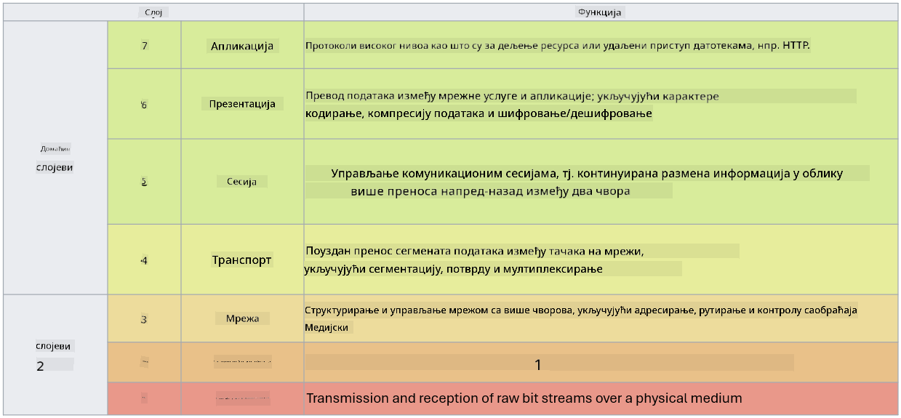

<!--
CO_OP_TRANSLATOR_METADATA:
{
  "original_hash": "252724eceeb183fb9018f88c5e1a3f0c",
  "translation_date": "2025-09-04T01:50:42+00:00",
  "source_file": "3.1 Networking key concepts.md",
  "language_code": "sr"
}
-->
# Основни концепти умрежавања

Ако сте радили у ИТ-у, вероватно сте се сусрели са концептима умрежавања. Иако се у савременим окружењима идентитет користи као примарна контрола периметра, то не значи да су мрежне контроле сувишне. Иако је ово обимна тема, у овој лекцији ћемо покрити неке кључне концепте умрежавања.

У овој лекцији ћемо обрадити:

- Шта је IP адресирање?

- Шта је OSI модел?

- Шта су TCP/UDP?

- Шта су бројеви портова?

- Шта је енкрипција у мировању и у преносу?

## Шта је IP адресирање?

IP адресирање, или адресирање Интернет протокола, је нумеричка ознака додељена сваком уређају који је повезан на рачунарску мрежу која користи Интернет протокол за комуникацију. Она служи као јединствени идентификатор за уређаје унутар мреже, омогућавајући им да шаљу и примају податке преко интернета или других међусобно повезаних мрежа. Постоје две главне верзије IP адресирања: IPv4 (верзија 4 Интернет протокола) и IPv6 (верзија 6 Интернет протокола). IP адреса се обично представља у IPv4 формату (нпр. 192.168.1.1) или IPv6 формату (нпр. 2001:0db8:85a3:0000:0000:8a2e:0370:7334).

## Шта је OSI модел?

OSI (Open Systems Interconnection) модел је концептуални оквир који стандардизује функције комуникационог система у седам различитих слојева. Сваки слој обавља специфичне задатке и комуницира са суседним слојевима како би осигурао ефикасну и поуздану размену података између уређаја у мрежи. Слојеви, од дна ка врху, су следећи:

1. Физички слој

2. Слој везе података

3. Мрежни слој

4. Транспортни слој

5. Сесијски слој

6. Презентациони слој

7. Апликациони слој

OSI модел пружа заједничку референцу за разумевање како мрежни протоколи и технологије међусобно делују, без обзира на специфичне хардверске или софтверске имплементације.

  
_реф: https://en.wikipedia.org/wiki/OSI_model_

## Шта су TCP/UDP?

TCP (Transmission Control Protocol) и UDP (User Datagram Protocol) су два основна протокола транспортног слоја која се користе у рачунарским мрежама за омогућавање комуникације између уређаја преко интернета или унутар локалне мреже. Они су одговорни за разбијање података у пакете за пренос и затим поновно састављање тих пакета у оригиналне податке на пријемној страни. Међутим, разликују се по својим карактеристикама и случајевима употребе.

**TCP (Transmission Control Protocol):**

TCP је протокол оријентисан на везу који пружа поуздан и уређен пренос података између уређаја. Он успоставља везу између пошиљаоца и примаоца пре него што размена података почне. TCP осигурава да пакети података стигну у исправном редоследу и може поново послати изгубљене пакете како би гарантовао интегритет и потпуност података. Ово чини TCP погодним за апликације које захтевају поуздан пренос података, као што су прегледање веба, е-пошта, пренос датотека (FTP) и комуникација са базама података.

**UDP (User Datagram Protocol):**

UDP је протокол без везе који нуди бржи пренос података, али не пружа исти ниво поузданости као TCP. Он не успоставља формалну везу пре слања података и не укључује механизме за потврду или поновно слање изгубљених пакета. UDP је погодан за апликације где су брзина и ефикасност важнији од гарантоване испоруке, као што су комуникација у реалном времену, стриминг медија, онлајн игре и DNS упити.

Укратко, TCP даје приоритет поузданости и уређеном преносу, што га чини погодним за апликације које захтевају тачност података, док UDP наглашава брзину и ефикасност, што га чини прикладним за апликације где је прихватљив мањи губитак података или промена редоследа у замену за смањену латенцију. Избор између TCP и UDP зависи од специфичних захтева апликације или услуге која се користи.

## Шта су бројеви портова?

У умрежавању, број порта је нумерички идентификатор који се користи за разликовање различитих услуга или апликација које раде на једном уређају унутар мреже. Портови помажу у усмеравању долазних података ка одговарајућој апликацији. Бројеви портова су 16-битни беззнаковни цели бројеви, што значи да се крећу од 0 до 65535. Они су подељени у три опсега:

- Добро познати портови (0-1023): Резервисани за стандардне услуге као што су HTTP (порт 80) и FTP (порт 21).

- Регистровани портови (1024-49151): Користе се за апликације и услуге које нису део добро познатог опсега, али су званично регистроване.

- Динамички/приватни портови (49152-65535): Доступни за привремену или приватну употребу од стране апликација.

## Шта је енкрипција у мировању и у преносу?

Енкрипција је процес претварања података у сигуран формат како би се заштитили од неовлашћеног приступа или манипулације. Енкрипција се може применити на податке како у "мировању" (када су сачувани на уређају или серверу), тако и у "преносу" (када се преносе између уређаја или преко мрежа).

Енкрипција у мировању: Ово подразумева енкрипцију података који су сачувани на уређајима, серверима или системима за складиштење. Чак и ако нападач добије физички приступ медијуму за складиштење, не може приступити подацима без кључева за енкрипцију. Ово је кључно за заштиту осетљивих података у случају крађе уређаја, пробоја података или неовлашћеног приступа.

Енкрипција у преносу: Ово подразумева енкрипцију података док путују између уређаја или преко мрежа. Ово спречава прислушкивање и неовлашћено пресретање података током преноса. Уобичајени протоколи за енкрипцију у преносу укључују HTTPS за веб комуникацију и TLS/SSL за обезбеђивање различитих типова мрежног саобраћаја.

## Додатно читање
- [Како функционишу IP адресе? (howtogeek.com)](https://www.howtogeek.com/341307/how-do-ip-addresses-work/)
- [Разумевање IP адреса: Уводни водич (geekflare.com)](https://geekflare.com/understanding-ip-address/)
- [Шта је OSI модел? 7 слојева OSI објашњено (techtarget.com)](https://www.techtarget.com/searchnetworking/definition/OSI)
- [OSI модел – 7 слојева умрежавања објашњено једноставним језиком (freecodecamp.org)](https://www.freecodecamp.org/news/osi-model-networking-layers-explained-in-plain-english/)
- [TCP/IP протоколи - IBM документација](https://www.ibm.com/docs/en/aix/7.3?topic=protocol-tcpip-protocols)
- [Листа најчешћих портова и протокола (stationx.net)](https://www.stationx.net/common-ports-cheat-sheet/)
- [Azure енкрипција података у мировању - Azure Security | Microsoft Learn](https://learn.microsoft.com/azure/security/fundamentals/encryption-atrest?WT.mc_id=academic-96948-sayoung)

---

**Одрицање од одговорности**:  
Овај документ је преведен коришћењем услуге за превођење помоћу вештачке интелигенције [Co-op Translator](https://github.com/Azure/co-op-translator). Иако настојимо да обезбедимо тачност, молимо вас да имате у виду да аутоматски преводи могу садржати грешке или нетачности. Оригинални документ на изворном језику треба сматрати меродавним извором. За критичне информације препоручује се професионални превод од стране људи. Не сносимо одговорност за било каква погрешна тумачења или неспоразуме који могу произаћи из коришћења овог превода.