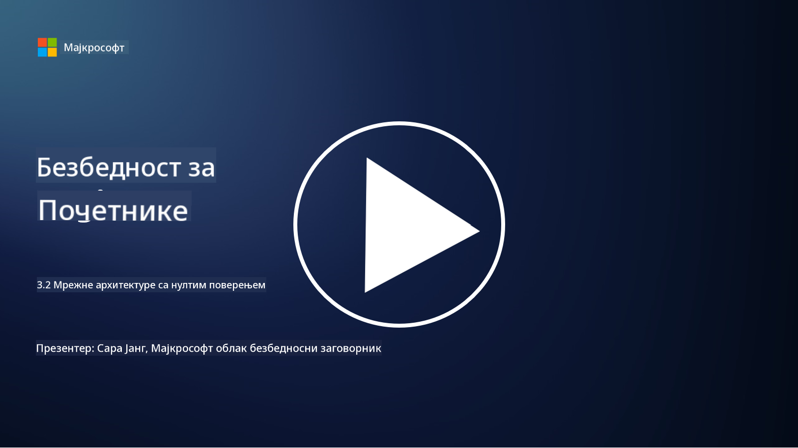

<!--
CO_OP_TRANSLATOR_METADATA:
{
  "original_hash": "680d6e14d9d33fc471c22f44679713f8",
  "translation_date": "2025-09-04T00:41:38+00:00",
  "source_file": "3.2 Networking zero trust architecture.md",
  "language_code": "sr"
}
-->
# Мрежне архитектуре са нултим поверењем

Мрежа пружа кључни слој у контролама са нултим поверењем, у овој лекцији ћемо научити више о следећем:

- Шта је сегментација мреже?  
- Како сегментација мреже помаже у имплементацији нултог поверења?  
- Шта је енкрипција од краја до краја?

## Шта је сегментација мреже?

Сегментација мреже је пракса дељења мреже на мање, изоловане сегменте или подмреже. Сваки сегмент је изолован од осталих, а приступ између сегмената се контролише и ограничава на основу специфичних безбедносних политика. Сегментација мреже се користи за побољшање безбедности ограничавањем утицаја потенцијалних пробоја и смањењем латералног кретања нападача унутар мреже.

Применом сегментације мреже, организација може креирати "зоне" које раздвајају различите типове корисника, апликација и података. Ово смањује површину напада и минимизира потенцијалну штету узроковану безбедносним инцидентом. Сегментација мреже може се постићи кроз технологије као што су виртуелне LAN мреже (VLAN), заштитни зидови и контроле приступа.

## Како сегментација мреже помаже у имплементацији нултог поверења?

Сегментација мреже се у великој мери поклапа са принципима модела нултог поверења. У архитектури нултог поверења, сегментација мреже помаже у спровођењу принципа "најмањег привилегија" осигуравајући да корисници и уређаји имају приступ само специфичним ресурсима и услугама које су им потребне за обављање задатака. Сегментирањем мреже на мање зоне, организације могу применити строге контроле приступа, изоловати критичне ресурсе и спречити латерално кретање нападача.

Сегментација мреже такође помаже у спровођењу контроле приступа засноване на идентитету, где се корисници и уређаји темељно аутентификују и овлашћују пре приступа одређеним сегментима. Ово спречава неовлашћени приступ осетљивим ресурсима и ублажава потенцијални утицај компромитованих акредитива.

## Шта је енкрипција од краја до краја?

Енкрипција од краја до краја (E2E) је безбедносна мера која осигурава да подаци остану шифровани током целог пута од пошиљаоца до примаоца. У овом процесу, подаци се шифрују на страни пошиљаоца, а само прималац поседује кључ за дешифровање како би откључао и прочитао податке. Процеси шифровања и дешифровања се одвијају на крајњим тачкама, што чини изузетно тешким за неовлашћене стране, укључујући провајдере услуга и посреднике, да приступе текстуалним подацима.

Енкрипција од краја до краја пружа висок ниво поверљивости и безбедности за пренос података, чак и ако подаци пролазе кроз различите посредничке системе или мреже. Често се користи у апликацијама за сигурно слање порука, услугама е-поште и другим платформама за комуникацију како би се заштитиле осетљиве информације од пресретања и неовлашћеног приступа.

Овај метод енкрипције осигурава да чак и ако нападачи успеју да приступе подацима у транзиту, видеће само шифрован садржај који је бесмислен без кључа за дешифровање. Енкрипција од краја до краја игра кључну улогу у заштити приватности корисника и заштити осетљивих информација од излагања неовлашћеним странама.

## Шта је SASE?

SASE означава "Secure Access Service Edge" и представља оквир и архитектуру за сајбер безбедност која комбинује безбедност мреже и могућности широкопојасног умрежавања (WAN) у једну услугу засновану на облаку. SASE је дизајниран да обезбеди сигуран и скалабилан приступ мрежним ресурсима, апликацијама и подацима за удаљене и мобилне кориснике, истовремено поједностављујући управљање мрежом и смањујући сложеност традиционалних мрежних и безбедносних архитектура.

Кључне карактеристике и компоненте SASE укључују:

1. **Заснован на облаку:** SASE се испоручује као услуга у облаку, што значи да се функције безбедности и умрежавања пружају из облака, а не ослањајући се на традиционални хардвер и уређаје на лицу места.  

2. **Интеграција безбедности и умрежавања:** SASE интегрише различите безбедносне услуге као што су сигурни веб пролази (SWG), заштитни зид као услуга (FWaaS), спречавање губитка података (DLP), приступ мрежи са нултим поверењем (ZTNA) и оптимизација WAN-а са могућностима широкопојасног умрежавања. Ова интеграција помаже у поједностављењу операција безбедности и умрежавања.  

3. **Нулто поверење:** SASE функционише на принципу нултог поверења, што значи да спроводи строге контроле приступа и политике најмањег привилегија. Корисници и уређаји се не сматрају поузданим по дефиницији и морају бити аутентификовани и овлашћени пре приступа ресурсима.  

4. **Фокус на идентитет:** SASE се фокусира на идентитет корисника и уређаја као основу за контролу приступа. Политике засноване на идентитету и контексту се користе за одређивање дозвола за приступ, а те политике се динамички прилагођавају на основу понашања корисника и контекста.  

5. **Скалабилност и флексибилност:** SASE се лако скалира како би се прилагодио великом броју корисника и уређаја, што га чини погодним за организације са разноврсним и променљивим потребама за умрежавањем и безбедношћу.  

SASE је посебно релевантан у модерној ери рада на даљину и усвајања облака, јер пружа свеобухватан и агилан приступ обезбеђивању и управљању приступом мрежи. Помаже организацијама да се прилагоде променљивим захтевима за безбедност и умрежавање, истовремено одржавајући снажан фокус на моделе безбедности засноване на кориснику и нултом поверењу.

## Додатно читање

- [What Is Network Segmentation? - Cisco](https://www.cisco.com/c/en/us/products/security/what-is-network-segmentation.html#~benefits)  
- [What Is Micro-Segmentation? - Cisco](https://www.cisco.com/c/en/us/products/security/what-is-microsegmentation.html)  
- [Implementing Network Segmentation and Segregation | Cyber.gov.au](https://www.cyber.gov.au/resources-business-and-government/maintaining-devices-and-systems/system-hardening-and-administration/network-hardening/implementing-network-segmentation-and-segregation)  
- [What Is Network Segmentation and Why It Matters | CompTIA](https://www.comptia.org/blog/security-awareness-training-network-segmentation)  
- [Network Segmentation: Concepts and Practices (cmu.edu)](https://insights.sei.cmu.edu/blog/network-segmentation-concepts-and-practices/)  
- [Secure networks with Zero Trust | Microsoft Learn](https://learn.microsoft.com/security/zero-trust/deploy/networks?WT.mc_id=academic-96948-sayoung)  
- [What is end-to-end encryption? | IBM](https://www.ibm.com/topics/end-to-end-encryption)  
- [What Is End-to-End Encryption, and Why Does It Matter? (howtogeek.com)](https://www.howtogeek.com/711656/what-is-end-to-end-encryption-and-why-does-it-matter/)  
- [Definition of Secure Access Service Edge (SASE) - Gartner Information Technology Glossary](https://www.gartner.com/en/information-technology/glossary/secure-access-service-edge-sase)  
- [What Is Secure Access Service Edge (SASE)? | Microsoft Security](https://www.microsoft.com/security/business/security-101/what-is-sase?WT.mc_id=academic-96948-sayoung)  

---

**Одрицање од одговорности**:  
Овај документ је преведен коришћењем услуге за превођење помоћу вештачке интелигенције [Co-op Translator](https://github.com/Azure/co-op-translator). Иако настојимо да обезбедимо тачност, молимо вас да имате у виду да аутоматски преводи могу садржати грешке или нетачности. Оригинални документ на изворном језику треба сматрати ауторитативним извором. За критичне информације препоручује се професионални превод од стране људи. Не сносимо одговорност за било каква погрешна тумачења или неспоразуме који могу произаћи из коришћења овог превода.