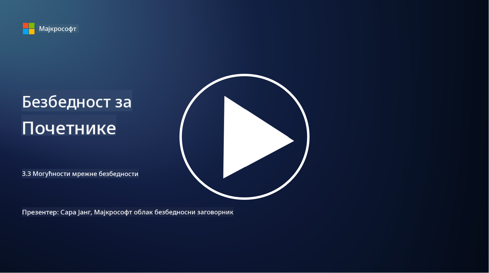

<!--
CO_OP_TRANSLATOR_METADATA:
{
  "original_hash": "c3aba077bb98eebc925dd58d870229ab",
  "translation_date": "2025-09-03T23:36:16+00:00",
  "source_file": "3.3 Network security capabilities.md",
  "language_code": "sr"
}
-->
# Могућности мрежне безбедности

У овој лекцији ћемо научити о следећим могућностима које се могу користити за обезбеђивање мреже:

 - Традиционални заштитни зидови
 - Заштитни зидови за веб апликације
 - Групе за безбедност у облаку
 - CDN
 - Балансери оптерећења
 - Bastion хостови
 - VPN-ови
 - Заштита од DDoS напада

## Традиционални заштитни зидови

Традиционални заштитни зидови су уређаји за безбедност који контролишу и надгледају долазни и одлазни мрежни саобраћај на основу унапред дефинисаних правила безбедности. Они делују као баријера између поуздане унутрашње мреже и непоузданих спољашњих мрежа, филтрирајући саобраћај како би спречили неовлашћени приступ и потенцијалне претње.

## Заштитни зидови за веб апликације

Заштитни зидови за веб апликације (WAFs) су специјализовани заштитни зидови дизајнирани да заштите веб апликације од различитих напада, као што су SQL инјекције, cross-site scripting и друге рањивости. Они анализирају HTTP захтеве и одговоре како би идентификовали и блокирали злонамерни саобраћај који циља веб апликације.

## Групе за безбедност у облаку

Групе за безбедност су основна функција мрежне безбедности коју пружају провајдери услуга у облаку. Оне делују као виртуелни заштитни зидови који контролишу долазни и одлазни саобраћај ка и од ресурса у облаку, као што су виртуелне машине (VMs) и инстанце. Групе за безбедност омогућавају организацијама да дефинишу правила која одређују који типови саобраћаја су дозвољени или забрањени, додајући додатни слој одбране у облачним окружењима.

## Мрежа за испоруку садржаја (CDN)

Мрежа за испоруку садржаја је дистрибуирана мрежа сервера смештених на различитим географским локацијама. CDN-ови помажу у побољшању перформанси и доступности веб сајтова кеширањем садржаја и његовим испоручивањем са сервера који су ближи кориснику. Они такође пружају одређени ниво заштите од DDoS напада дистрибуцијом саобраћаја на више локација сервера.

## Балансери оптерећења

Балансери оптерећења распоређују долазни мрежни саобраћај на више сервера како би оптимизовали коришћење ресурса, осигурали високу доступност и побољшали перформансе апликација. Они помажу у спречавању преоптерећења сервера и одржавају ефикасно време одзива, повећавајући отпорност мреже.

## Bastion хостови

Bastion хостови су високо обезбеђени и изоловани сервери који пружају контролисан приступ мрежи из спољашње, непоуздане мреже (као што је интернет). Они служе као улазне тачке за администраторе који желе да безбедно приступе унутрашњим системима. Bastion хостови су обично конфигурисани са снажним безбедносним мерама како би се минимизирала површина напада.

## Виртуелне приватне мреже (VPNs)

VPN-ови креирају шифроване тунеле између уређаја корисника и удаљеног сервера, обезбеђујући сигурну и приватну комуникацију преко потенцијално несигурних мрежа као што је интернет. VPN-ови се често користе за пружање удаљеног приступа унутрашњим мрежама, омогућавајући корисницима да приступе ресурсима као да су физички на истој мрежи.

## Алатке за заштиту од DDoS напада

Алатке и услуге за заштиту од DDoS (Distributed Denial of Service) напада су дизајниране да ублаже утицај DDoS напада, где више компромитованих уређаја преплављује мрежу или услугу како би је преоптеретили. Решења за заштиту од DDoS напада идентификују и филтрирају злонамерни саобраћај, осигуравајући да легитимни саобраћај може да стигне до своје намењене дестинације.

## Додатно читање

- [What Is a Firewall? - Cisco](https://www.cisco.com/c/en/us/products/security/firewalls/what-is-a-firewall.html#~types-of-firewalls)
- [What Does a Firewall Actually Do? (howtogeek.com)](https://www.howtogeek.com/144269/htg-explains-what-firewalls-actually-do/)
- [What is a Firewall? How Firewalls Work & Types of Firewalls (kaspersky.com)](https://www.kaspersky.com/resource-center/definitions/firewall)
- [Network security group - how it works | Microsoft Learn](https://learn.microsoft.com/azure/virtual-network/network-security-group-how-it-works)
- [Introduction to Azure Content Delivery Network (CDN) - Training | Microsoft Learn](https://learn.microsoft.com/training/modules/intro-to-azure-content-delivery-network/?WT.mc_id=academic-96948-sayoung)
- [What is a content delivery network (CDN)? - Azure | Microsoft Learn](https://learn.microsoft.com/azure/cdn/cdn-overview?WT.mc_id=academic-96948-sayoung)
- [What Is Load Balancing? How Load Balancers Work (nginx.com)](https://www.nginx.com/resources/glossary/load-balancing/)
- [Bastion hosts vs. VPNs · Tailscale](https://tailscale.com/learn/bastion-hosts-vs-vpns/)
- [What is VPN? How It Works, Types of VPN (kaspersky.com)](https://www.kaspersky.com/resource-center/definitions/what-is-a-vpn)
- [Introduction to Azure DDoS Protection - Training | Microsoft Learn](https://learn.microsoft.com/training/modules/introduction-azure-ddos-protection/?WT.mc_id=academic-96948-sayoung)
- [What Is a DDoS Attack? | Microsoft Security](https://www.microsoft.com/security/business/security-101/what-is-a-ddos-attack?WT.mc_id=academic-96948-sayoung)

---

**Одрицање од одговорности**:  
Овај документ је преведен коришћењем услуге за превођење помоћу вештачке интелигенције [Co-op Translator](https://github.com/Azure/co-op-translator). Иако тежимо тачности, молимо вас да имате у виду да аутоматски преводи могу садржати грешке или нетачности. Оригинални документ на изворном језику треба сматрати ауторитативним извором. За критичне информације препоручује се професионални превод од стране људи. Не сносимо одговорност за било каква неспоразумевања или погрешна тумачења која могу произаћи из коришћења овог превода.