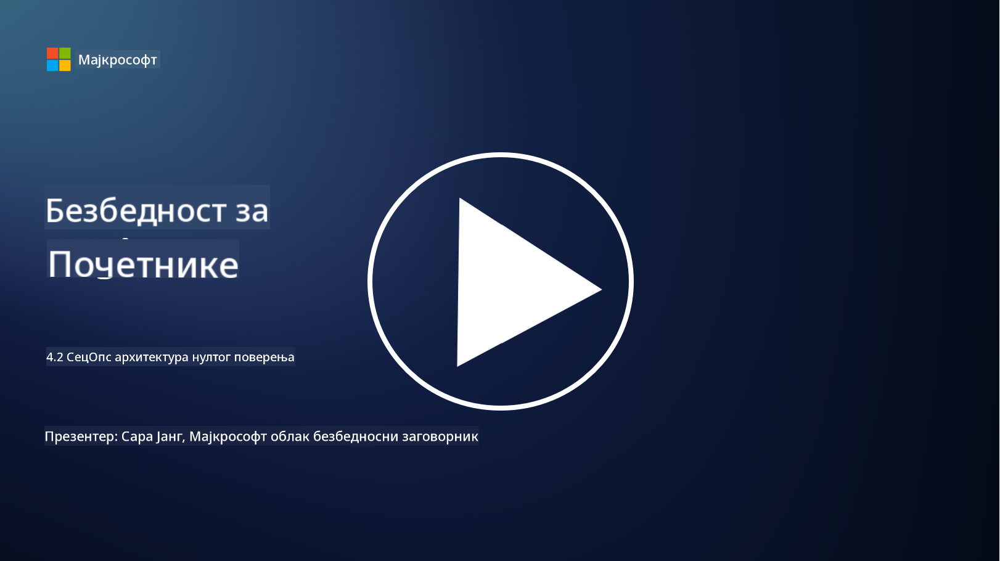

<!--
CO_OP_TRANSLATOR_METADATA:
{
  "original_hash": "45bbdc114e70936816b0b3e7c40189cf",
  "translation_date": "2025-09-04T00:47:31+00:00",
  "source_file": "4.2 SecOps zero trust architecture.md",
  "language_code": "sr"
}
-->
# SecOps архитектура са нултим поверењем

Операције безбедности чине два дела архитектуре са нултим поверењем, а у овој лекцији ћемо научити о оба:

- Како треба изградити ИТ архитектуре да омогуће централизовано прикупљање логова?

- Које су најбоље праксе за операције безбедности у савременим ИТ окружењима?

## Како треба изградити ИТ архитектуре да омогуће централизовано прикупљање логова?

Централизовано прикупљање логова је критична компонента савремених операција безбедности. Омогућава организацијама да агрегирају логове и податке из различитих извора, као што су сервери, апликације, мрежни уређаји и алати за безбедност, у централни репозиторијум ради анализе, праћења и реаговања на инциденте. Ево неких најбољих пракси за изградњу ИТ архитектура које подржавају централизовано прикупљање логова:

1. **Интеграција извора логова**:

- Осигурајте да су сви релевантни уређаји и системи конфигурисани да генеришу логове. Ово укључује сервере, заштитне зидове, рутере, свичеве, апликације и уређаје за безбедност.

- Конфигуришите изворе логова да прослеђују логове централизованом колектору или систему за управљање.

2. **Избор правог SIEM алата**:

- Изаберите SIEM (Security Information and Event Management) решење које одговара потребама и обиму ваше организације.

- Осигурајте да изабрано решење подржава прикупљање, агрегирање, анализу и извештавање логова.

3. **Скалабилност и редундантност**:

- Дизајнирајте архитектуру за скалабилност како би се прилагодила растућем броју извора логова и повећаном обиму логова.

- Имплементирајте редундантност ради високе доступности како бисте спречили прекиде услед отказа хардвера или мреже.

4. **Сигурно преношење логова**:

- Користите сигурне протоколе као што су TLS/SSL или IPsec за пренос логова од извора до централизованог репозиторијума.

- Имплементирајте аутентификацију и контролу приступа како би само овлашћени уређаји могли да шаљу логове.

5. **Нормализација**:

- Стандардујте формате логова и нормализујте податке ради конзистентности и лакше анализе.

6. **Складиштење и задржавање**:

- Одредите одговарајући период задржавања логова на основу захтева за усаглашеност и безбедност.

- Складиштите логове сигурно, штитећи их од неовлашћеног приступа и манипулације.

## Које су најбоље праксе за операције безбедности у савременим ИТ окружењима?

Поред централизованог прикупљања логова, ево неких најбољих пракси за операције безбедности у савременим ИТ окружењима:

1. **Континуирано праћење**: Имплементирајте континуирано праћење активности мреже и система ради откривања и реаговања на претње у реалном времену.

2. **Интелигенција о претњама**: Будите информисани о новим претњама и рањивостима користећи изворе и услуге интелигенције о претњама.

3. **Обука корисника**: Спроводите редовну обуку о безбедности за запослене како бисте смањили ризике повезане са социјалним инжењерингом и нападима фишинга.

4. **План реаговања на инциденте**: Развијте и тестирајте план реаговања на инциденте како бисте осигурали брз и ефикасан одговор на безбедносне инциденте.

5. **Аутоматизација безбедности**: Користите алате за аутоматизацију и оркестрацију безбедности ради убрзања реаговања на инциденте и рутинских задатака.

6. **Бекап и опоравак**: Имплементирајте робусна решења за бекап и опоравак како бисте осигурали доступност података у случају губитка података или напада рансомвера.

## Додатно читање

- [Microsoft Security Best Practices module: Security operations | Microsoft Learn](https://learn.microsoft.com/security/operations/security-operations-videos-and-decks?WT.mc_id=academic-96948-sayoung)
- [Security operations - Cloud Adoption Framework | Microsoft Learn](https://learn.microsoft.com/azure/cloud-adoption-framework/secure/security-operations?WT.mc_id=academic-96948-sayoung)
- [What is Security Operations and Analytics Platform Architecture? A Definition of SOAPA, How It Works, Benefits, and More (digitalguardian.com)](https://www.digitalguardian.com/blog/what-security-operations-and-analytics-platform-architecture-definition-soapa-how-it-works#:~:text=All%20in%20all%2C%20security%20operations%20and%20analytics%20platform,become%20more%20efficient%20and%20operative%20with%20your%20security.)

---

**Одрицање од одговорности**:  
Овај документ је преведен коришћењем услуге за превођење помоћу вештачке интелигенције [Co-op Translator](https://github.com/Azure/co-op-translator). Иако тежимо тачности, молимо вас да имате у виду да аутоматски преводи могу садржати грешке или нетачности. Оригинални документ на изворном језику треба сматрати ауторитативним извором. За критичне информације препоручује се професионални превод од стране људи. Не сносимо одговорност за било каква погрешна тумачења или неспоразуме који могу произаћи из коришћења овог превода.