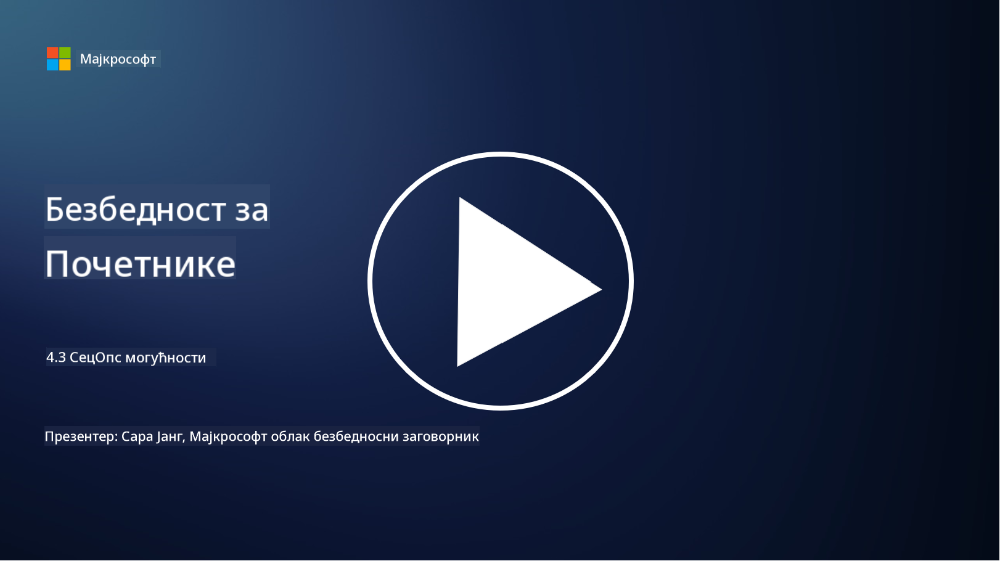

<!--
CO_OP_TRANSLATOR_METADATA:
{
  "original_hash": "553eb694c89f1caca0694e8d8ab89e0e",
  "translation_date": "2025-09-04T01:23:09+00:00",
  "source_file": "4.3 SecOps capabilities.md",
  "language_code": "sr"
}
-->
# Могућности SecOps-а

У овом одељку ћемо детаљније обрадити основне алате и могућности који се могу користити у безбедносним операцијама.

У овој лекцији ћемо обрадити:

- Шта је алат за управљање безбедносним информацијама и догађајима (SIEM)?

- Шта је XDR?

- Које могућности могу бити коришћене за унапређење безбедносних операција?

## Шта је алат за управљање безбедносним информацијама и догађајима (SIEM)?

Алат за управљање безбедносним информацијама и догађајима (SIEM) се користи за анализу безбедносних упозорења генерисаних унутар ИТ окружења организације. Они прикупљају, агрегирају, корелирају и анализирају податке из дневника и безбедносних догађаја из различитих извора, као што су мрежни уређаји, сервери, апликације и безбедносни системи.

Кључне функције и могућности SIEM алата укључују:

1. **Прикупљање дневника**: SIEM алати прикупљају дневнике и податке о безбедносним догађајима са широког спектра уређаја, система и апликација, укључујући заштитне зидове, системе за детекцију упада, антивирусни софтвер и друге.

2. **Нормализација података**: Они нормализују податке из дневника у заједнички формат ради лакше анализе и корелације.

3. **Корелација догађаја**: SIEM алати корелирају догађаје како би идентификовали обрасце и аномалије које могу указивати на безбедносне инциденте или претње.

4. **Упозорења и обавештења**: SIEM алати генеришу упозорења и обавештења у реалном времену када се открију сумњиве активности или кршења безбедности, омогућавајући тренутну реакцију.

5. **Детекција инцидената**: Они олакшавају детекцију безбедносних инцидената, укључујући неовлашћени приступ, пробој података, инфекције малвером и унутрашње претње.

6. **Анализа понашања корисника и ентитета (UEBA)**: Неки SIEM алати укључују UEBA могућности за идентификацију абнормалног понашања корисника и ентитета које може указивати на компромитоване налоге или унутрашње претње.

7. **Интеграција са обавештајним подацима о претњама**: SIEM алати могу се интегрисати са изворима обавештајних података о претњама ради побољшања детекције претњи упоређивањем познатих индикатора компромиса (IOC) са мрежним активностима.

8. **Аутоматизација и оркестрација**: Функције аутоматизације омогућавају SIEM-у да аутоматизује одговоре на уобичајене безбедносне инциденте, смањујући време реакције и ручни напор.

9. **Контролна табла и визуализација**: Они нуде контролне табле и алате за визуализацију ради праћења безбедносних података и креирања прилагођених извештаја.

10. **Интеграција са другим безбедносним алатима**: SIEM алати често се интегришу са другим безбедносним алатима и технологијама, као што су решења за детекцију и одговор на крајњим тачкама (EDR), ради пружања холистичког прегледа безбедносног стања организације.

## Шта је XDR?

XDR (Extended Detection and Response) је технологија која проширује могућности традиционалног EDR-а (Endpoint Detection and Response) и комбинује их са ширим безбедносним телеметријама из различитих извора ради пружања свеобухватнијег прегледа безбедносног стања организације. XDR има за циљ побољшање детекције претњи, одговора на инциденте и укупне безбедности решавањем ограничења ослањања искључиво на EDR, SIEM или друге појединачне безбедносне алате.

Кључне карактеристике и компоненте XDR-а укључују:

1. **Интеграција података**: XDR интегрише податке из више извора, укључујући крајње тачке, мрежни саобраћај, услуге у облаку, е-пошту и друге. Ова свеобухватна агрегирања података пружају шири контекст за детекцију и анализу претњи.

2. **Напредна аналитика**: XDR користи напредну аналитику, машинско учење и анализу понашања за идентификацију и приоритизацију безбедносних претњи. Тражи обрасце и аномалије у интегрисаним подацима ради детекције познатих и непознатих претњи.

3. **Аутоматизована детекција претњи**: XDR аутоматизује детекцију безбедносних претњи и аномалија корелирањем информација из различитих извора. Може идентификовати сложене ланце напада који могу обухватати више вектора.

4. **Истраживање и одговор на инциденте**: XDR пружа алате за истраживање и одговор на инциденте, помажући безбедносним тимовима да брзо процене обим и утицај инцидената и предузму одговарајуће мере.

5. **Интеграција са обавештајним подацима о претњама**: Интегрише изворе обавештајних података о претњама ради побољшања детекције претњи упоређивањем познатих индикатора компромиса (IOC) са активностима мреже и крајњих тачака организације.

6. **Јединствена конзола**: XDR обично нуди јединствену конзолу или контролну таблу где безбедносни тимови могу прегледати и управљати безбедносним упозорењима и инцидентима из различитих извора на централизован начин.

7. **Покривеност више платформи**: XDR решења покривају широк спектар платформи, укључујући крајње тачке, сервере, окружења у облаку и мобилне уређаје, што их чини погодним за модерна, мултиплатформска ИТ окружења.

## Које могућности могу бити коришћене за унапређење безбедносних операција?

За унапређење безбедносних операција, организације могу искористити неколико могућности поред SIEM алата:

1. **Машинско учење и вештачка интелигенција**: Примените напредну аналитику, машинско учење и вештачку интелигенцију за детекцију еволуирајућих претњи и аутоматизацију лова на претње.

2. **Анализа понашања корисника и ентитета (UEBA)**: Анализирајте понашање корисника и ентитета ради детекције аномалија и унутрашњих претњи.

3. **Извори обавештајних података о претњама**: Интегришите изворе обавештајних података о претњама ради ажурирања о најновијим претњама и индикаторима компромиса.

4. **Оркестрација, аутоматизација и одговор на безбедност (SOAR)**: Примените SOAR платформе ради аутоматизације одговора на инциденте и оптимизације радних токова безбедносних операција.

5. **Технологије обмане**: Примените технологије обмане ради збуњивања и детекције нападача унутар мреже.

## Додатно читање

- [What is SIEM? | Microsoft Security](https://www.microsoft.com/security/business/security-101/what-is-siem?WT.mc_id=academic-96948-sayoung)
- [What Is SIEM? - Security Information and Event Management - Cisco](https://www.cisco.com/c/en/us/products/security/what-is-siem.html)
- [Security information and event management - Wikipedia](https://en.wikipedia.org/wiki/Security_information_and_event_management)
- [What Is XDR? | Microsoft Security](https://www.microsoft.com/security/business/security-101/what-is-xdr?WT.mc_id=academic-96948-sayoung)
- [XDR & XDR Security (kaspersky.com.au)](https://www.kaspersky.com.au/resource-center/definitions/what-is-xdr)
- [The Power of SecOps: Redefining Core Security Capabilities - The New Stack](https://thenewstack.io/the-power-of-secops-redefining-core-security-capabilities/)
- [Seven Steps to Improve Your Security Operations and Response (securityintelligence.com)](https://securityintelligence.com/seven-steps-to-improve-your-security-operations-and-response/)

---

**Одрицање од одговорности**:  
Овај документ је преведен коришћењем услуге за превођење помоћу вештачке интелигенције [Co-op Translator](https://github.com/Azure/co-op-translator). Иако настојимо да обезбедимо тачност, молимо вас да имате у виду да аутоматизовани преводи могу садржати грешке или нетачности. Оригинални документ на изворном језику треба сматрати ауторитативним извором. За критичне информације препоручује се професионални превод од стране људи. Не сносимо одговорност за било каква погрешна тумачења или неспоразуме који могу произаћи из коришћења овог превода.