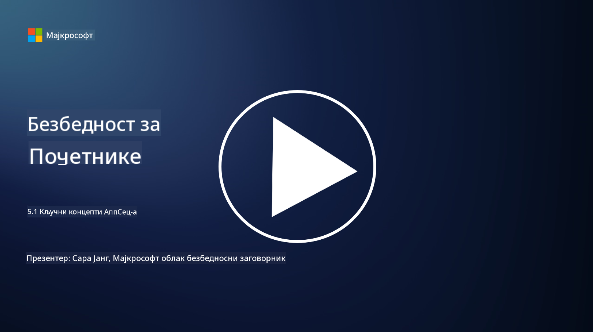

<!--
CO_OP_TRANSLATOR_METADATA:
{
  "original_hash": "e4b56bb23078d3ffb7ad407d280b0c36",
  "translation_date": "2025-09-04T00:34:23+00:00",
  "source_file": "5.1 AppSec key concepts.md",
  "language_code": "sr"
}
-->
# Основни концепти АпСек-а

Безбедност апликација је посебна област у оквиру безбедности. У овом делу курса ћемо се детаљније позабавити безбедношћу апликација.

## Увод

У овој лекцији ћемо обрадити:

- Шта је безбедност апликација?

- Који су кључни концепти/принципи безбедности апликација?

## Шта је безбедност апликација?

Безбедност апликација, често скраћено као "АпСек," односи се на праксу заштите софтверских апликација од безбедносних претњи, рањивости и напада. Она обухвата процесе, технике и алате који се користе за идентификацију, ублажавање и спречавање безбедносних ризика током развоја, имплементације и одржавања апликације.

Безбедност апликација је од суштинског значаја јер су апликације честе мете сајбер напада. Злонамерни актери искоришћавају рањивости и слабости у софтверу како би стекли неовлашћени приступ, украли податке, ометали услуге или извршили друге злонамерне активности. Ефективна безбедност апликација помаже у обезбеђивању поверљивости, интегритета и доступности апликације и њених повезаних података.

## Који су кључни концепти/принципи безбедности апликација?

Кључни концепти и принципи који су основа безбедности апликација укључују:

1. **Безбедност у дизајну**:

- Безбедност треба интегрисати у дизајн и архитектуру апликације од самог почетка, а не додавати накнадно.

2. **Валидација уноса**:

- Сви кориснички уноси треба да буду валидирани како би се осигурало да одговарају очекиваним форматима и да су без злонамерног кода или података.

3. **Кодирање излазних података**:

- Подаци који се шаљу клијенту треба да буду правилно кодирани како би се спречиле рањивости попут XSS-а (cross-site scripting).

4. **Аутентикација и ауторизација**:

- Аутентификујте кориснике и овластите њихов приступ ресурсима на основу њихових улога и дозвола.

5. **Заштита података**:

- Осетљиви подаци треба да буду шифровани приликом складиштења, преноса и обраде како би се спречио неовлашћени приступ.

6. **Управљање сесијама**:

- Сигурно управљање сесијама осигурава да су корисничке сесије заштићене од отмице и неовлашћеног приступа.

7. **Сигурне зависности**:

- Све софтверске зависности треба редовно ажурирати безбедносним закрпама како би се спречиле рањивости.

8. **Руковање грешкама и логовање**:

- Примените сигурно руковање грешкама како бисте избегли откривање осетљивих информација и осигурали сигурне праксе логовања.

9. **Тестирање безбедности**:

- Редовно тестирајте апликације на рањивости користећи методе као што су пенетрационо тестирање, прегледи кода и аутоматизовани алати за скенирање.

10. **Сигуран животни циклус развоја софтвера (SDLC)**:

- Интегришите безбедносне праксе у сваку фазу животног циклуса развоја софтвера, од захтева до имплементације и одржавања.

## Додатно читање

- [SheHacksPurple: Шта је безбедност апликација? - YouTube](https://www.youtube.com/watch?v=eNmccQNzSSY)
- [Шта је безбедност апликација? - Cisco](https://www.cisco.com/c/en/us/solutions/security/application-first-security/what-is-application-security.html#~how-does-it-work)
- [Шта је безбедност апликација? Процес и алати за обезбеђивање софтвера | CSO Online](https://www.csoonline.com/article/566471/what-is-application-security-a-process-and-tools-for-securing-software.html)
- [OWASP Cheat Sheet Series | OWASP Foundation](https://owasp.org/www-project-cheat-sheets/)

---

**Одрицање од одговорности**:  
Овај документ је преведен коришћењем услуге за превођење помоћу вештачке интелигенције [Co-op Translator](https://github.com/Azure/co-op-translator). Иако настојимо да обезбедимо тачност, молимо вас да имате у виду да аутоматизовани преводи могу садржати грешке или нетачности. Оригинални документ на изворном језику треба сматрати ауторитативним извором. За критичне информације препоручује се професионални превод од стране људи. Не сносимо одговорност за било каква погрешна тумачења или неспоразуме који могу произаћи из коришћења овог превода.