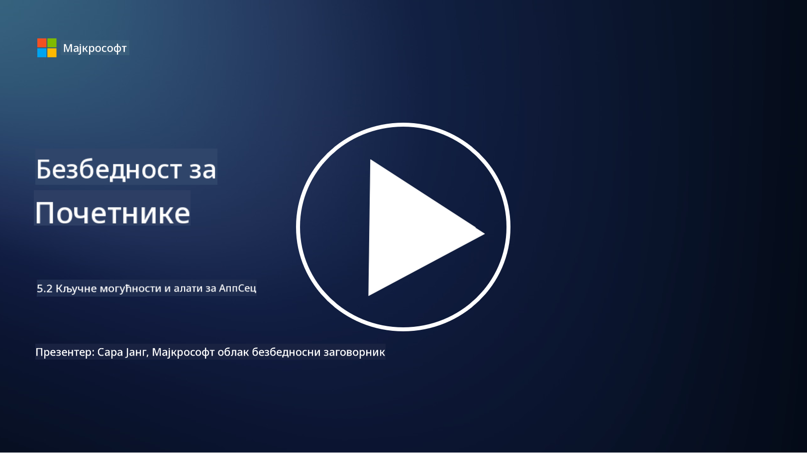

<!--
CO_OP_TRANSLATOR_METADATA:
{
  "original_hash": "790a3fa7e535ec60bb51bde13e759781",
  "translation_date": "2025-09-04T00:53:14+00:00",
  "source_file": "5.2 AppSec key capabilities.md",
  "language_code": "sr"
}
-->
## Увод

У овој лекцији ћемо обрадити које су кључне могућности и алати који се користе у безбедности апликација.

## Кључне могућности и алати за безбедност апликација

Кључне могућности и алати који се користе у безбедности апликација су од суштинског значаја за идентификовање, ублажавање и спречавање безбедносних рањивости и претњи у софтверским апликацијама. Ево неких од најважнијих:

**1. Статичко тестирање безбедности апликација (SAST)**:

- **Могућности**: Анализира изворни код, бајткод или бинарни код како би идентификовао безбедносне рањивости у коду апликације.

- **Алати**: Примери укључују Fortify, Checkmarx и Veracode.

**2. Динамичко тестирање безбедности апликација (DAST)**:

- **Могућности**: Скенира покренуту апликацију како би идентификовао рањивости слањем улазних захтева и анализом одговора.

- **Алати**: Примери укључују ZAP, Burp Suite и Qualys Web Application Scanning.

**3. Интерактивно тестирање безбедности апликација (IAST)**:

- **Могућности**: Комбинује елементе SAST-а и DAST-а за анализу кода током извршавања, пружајући прецизније резултате и смањујући лажне позитивне резултате.

- **Алати**: Примери укључују Contrast Security и HCL AppScan.

**4. Самозаштита апликација у реалном времену (RASP)**:

- **Могућности**: Надгледа и штити апликације у реалном времену, откривајући и реагујући на безбедносне претње како се оне дешавају.

- **Алати**: Примери укључују Veracode Runtime Protection и F5 Advanced WAF with RASP.

**5. Веб апликациони заштитни зидови (WAFs)**:

- **Могућности**: Пружају заштитни слој између апликације и интернета, филтрирајући долазни саобраћај и блокирајући злонамерне захтеве.

- **Алати**: Примери укључују ModSecurity, AWS WAF и Akamai Kona Site Defender.

**6. Скенирање зависности**:

- **Могућности**: Идентификује рањивости у библиотекама и компонентама трећих страна које се користе у апликацији.

- **Алати**: Примери укључују OWASP Dependency-Check и Snyk.

**7. Пенетрационо тестирање (Pen Testing)**:

- **Могућности**: Симулира стварне нападе како би открио рањивости и проценио безбедност апликације.

- **Алати**: Изводе га сертификовани етички хакери и безбедносни професионалци користећи различите алате као што су Metasploit и Nmap.

**8. Скенирање и анализа безбедности**:

- **Могућности**: Скенира познате рањивости, грешке у конфигурацији и безбедносне неправилности.

- **Алати**: Примери укључују Nessus, Qualys Vulnerability Management и OpenVAS.

**9. Алати за безбедност контејнера**:

- **Могућности**: Фокусирају се на обезбеђивање контејнеризованих апликација и њихових окружења.

- **Алати**: Примери укључују Docker Security Scanning и Aqua Security.

**10. Обука за безбедан развој**:

- **Могућности**: Пружа програме обуке и подизања свести за развојне тимове како би се подстакле праксе безбедног кодирања.

- **Алати**: Прилагођени програми обуке и платформе.

**11. Оквири за тестирање безбедности**:

- **Могућности**: Пружају свеобухватне оквире за различите потребе тестирања безбедности апликација.

- **Алати**: OWASP Amass, OWASP OWTF и FrAppSec.

**12. Алати за преглед безбедности кода**:

- **Могућности**: Прегледају изворни код ради откривања безбедносних рањивости и најбољих пракси кодирања.

- **Алати**: Примери укључују SonarQube и Checkmarx.

**13. Алати за безбедност API-ја и микросервиса**:

- **Могућности**: Фокусирају се на обезбеђивање API-ја и микросервиса, укључујући аутентификацију, ауторизацију и заштиту података.

- **Алати**: Примери укључују Apigee, AWS API Gateway и Istio.

## Додатно читање

- [What Is Application Security? Concepts, Tools & Best Practices | HackerOne](https://www.hackerone.com/knowledge-center/what-application-security-concepts-tools-best-practices)
- [What is IAST? (Interactive Application Security Testing) (comparitech.com)](https://www.comparitech.com/net-admin/what-is-iast/)
- [10 Types of Application Security Testing Tools: When and How to Use Them (cmu.edu)](https://insights.sei.cmu.edu/blog/10-types-of-application-security-testing-tools-when-and-how-to-use-them/)
- [Shifting the Balance of Cybersecurity Risk: Principles and Approaches for Security-by-Design and Default | Cyber.gov.au](https://www.cyber.gov.au/about-us/view-all-content/publications/principles-and-approaches-for-security-by-design-and-default)

---

**Одрицање од одговорности**:  
Овај документ је преведен коришћењем услуге за превођење помоћу вештачке интелигенције [Co-op Translator](https://github.com/Azure/co-op-translator). Иако тежимо тачности, молимо вас да имате у виду да аутоматски преводи могу садржати грешке или нетачности. Оригинални документ на изворном језику треба сматрати ауторитативним извором. За критичне информације препоручује се професионални превод од стране људи. Не сносимо одговорност за било каква погрешна тумачења или неспоразуме који могу произаћи из коришћења овог превода.