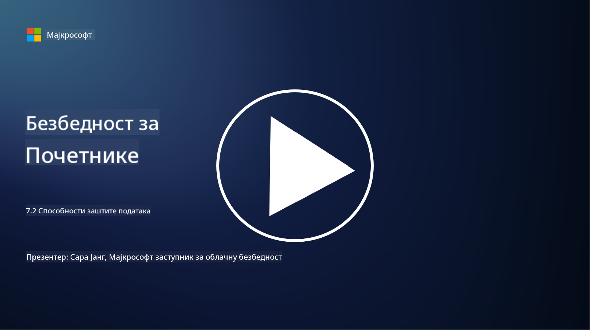

<!--
CO_OP_TRANSLATOR_METADATA:
{
  "original_hash": "50697add9758e54693442d502d2d5f8a",
  "translation_date": "2025-09-04T00:58:16+00:00",
  "source_file": "7.2 Data security capabilities.md",
  "language_code": "sr"
}
-->
# Способности заштите података

У овом одељку ћемо детаљније обрадити основне алате и могућности који се користе за заштиту података:

**Увод**

У овој лекцији ћемо обрадити:

- Шта су алати за спречавање губитка података?

- Шта су алати за управљање ризицима од интерних претњи?

- Који алати за задржавање података су доступни?

## Шта су алати за спречавање губитка података?

Алатке за спречавање губитка података (Data Loss Prevention - DLP) односе се на сет софтверских решења и технологија дизајнираних да спрече неовлашћени приступ, дељење или цурење осетљивих или поверљивих података унутар организације. Ови алати користе инспекцију садржаја, спровођење политика и праћење како би идентификовали и заштитили осетљиве податке од излагања или злоупотребе. Примери DLP производа укључују: Symantec Data Loss Prevention, McAfee Total Protection for Data Loss Prevention, Microsoft 365 DLP**: Интегрише се са Microsoft 365 апликацијама како би помогао организацијама да идентификују и заштите осетљиве податке у имејловима, документима и порукама.

## Шта су алати за управљање ризицима од интерних претњи?

Алатке за управљање ризицима од интерних претњи помажу организацијама да идентификују и ублаже ризике које представљају запослени, извођачи или партнери који могу намерно или ненамерно угрозити безбедност података. Ови алати прате понашање корисника, обрасце приступа и коришћење података како би открили сумњиве активности и потенцијалне интерне претње. Примери производа за управљање ризицима од интерних претњи укључују: Microsoft Insider Risk Management (део Microsoft 365), Forcepoint Insider Threat Data Protection, Varonis Insider Threat Detection.

## Који алати за задржавање података су доступни?

Алатке за задржавање података укључују софтвер и решења дизајнирана за управљање задржавањем и брисањем података у складу са политикама задржавања података и законским захтевима организације. Ови алати помажу у аутоматизацији процеса задржавања података током одређених периода и њиховог безбедног брисања када више нису потребни. Примери производа за задржавање података укључују: Veritas Enterprise Vault, Commvault Complete Data Protection, Microsoft data lifecycle management. Ова решења помажу организацијама да задрже контролу над задржавањем и уклањањем података, осигуравајући усклађеност са прописима о заштити података уз ефикасно управљање подацима током њиховог животног циклуса.

## Додатно читање

- [Guide to Data Security Posture Management (DSPM) | CSA (cloudsecurityalliance.org)](https://cloudsecurityalliance.org/blog/2023/03/31/the-big-guide-to-data-security-posture-management-dspm/)
- [Data Loss Prevention across endpoints, apps, & services | Microsoft Purview](https://youtu.be/hvqq8L_0kgI)
- [18 Best Data Loss Prevention Software Tools 2023 (Free + Paid) (comparitech.com)](https://www.comparitech.com/data-privacy-management/data-loss-prevention-tools-software/)
- [Data Loss Prevention (nist.gov)](https://tsapps.nist.gov/publication/get_pdf.cfm?pub_id=904672)
- [Learn about insider risk management | Microsoft Learn](https://learn.microsoft.com/purview/insider-risk-management?WT.mc_id=academic-96948-sayoung)
- [Data Lifecycle Management | IBM](https://www.ibm.com/topics/data-lifecycle-management)
- [What Is Data Lifecycle Management (DLM)? | 2023 Best Practices (selecthub.com)](https://www.selecthub.com/big-data-analytics/data-lifecycle-management/)

---

**Одрицање од одговорности**:  
Овај документ је преведен коришћењем услуге за превођење помоћу вештачке интелигенције [Co-op Translator](https://github.com/Azure/co-op-translator). Иако настојимо да обезбедимо тачност, молимо вас да имате у виду да аутоматски преводи могу садржати грешке или нетачности. Оригинални документ на изворном језику треба сматрати ауторитативним извором. За критичне информације препоручује се професионални превод од стране људи. Не сносимо одговорност за било каква погрешна тумачења или неспоразуме који могу произаћи из коришћења овог превода.