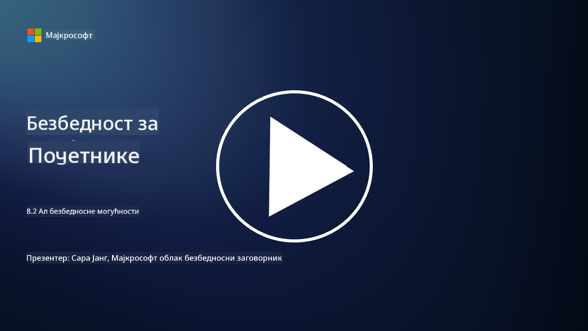

<!--
CO_OP_TRANSLATOR_METADATA:
{
  "original_hash": "b6bb7175672298d1e2f73ba7e0006f95",
  "translation_date": "2025-09-04T01:07:25+00:00",
  "source_file": "8.2 AI security capabilities.md",
  "language_code": "sr"
}
-->
# Безбедносне могућности вештачке интелигенције

## Које алате и могућности тренутно имамо за обезбеђивање система вештачке интелигенције?

Тренутно постоји неколико алата и могућности за обезбеђивање система вештачке интелигенције:

-   **Counterfit**: Алат отвореног кода за аутоматизацију тестирања безбедности система вештачке интелигенције, осмишљен да помогне организацијама у процени ризика и осигурању робусности њихових алгоритама.
-   **Алатке за адверзаријално машинско учење**: Ове алатке процењују отпорност модела машинског учења на адверзаријалне нападе, помажући у идентификацији и ублажавању рањивости.
-   **Безбедносни пакети за вештачку интелигенцију**: Доступни су пакети отвореног кода који пружају ресурсе за обезбеђивање система вештачке интелигенције, укључујући библиотеке и оквире за имплементацију безбедносних мера.
-   **Колаборативне платформе**: Партнерства између компанија и заједница вештачке интелигенције ради развоја специфичних алата за скенирање безбедности и других решења за обезбеђивање ланца снабдевања вештачке интелигенције.

Ови алати и могућности део су растуће области посвећене унапређењу безбедности система вештачке интелигенције против различитих претњи. Они представљају комбинацију истраживања, практичних алата и индустријске сарадње усмерене на решавање јединствених изазова које доносе технологије вештачке интелигенције.

## Шта је са AI red teaming-ом? Како се то разликује од традиционалног red teaming-а?

AI red teaming се разликује од традиционалног red teaming-а у неколико кључних аспеката:

-   **Фокус на системе вештачке интелигенције**: AI red teaming се специфично бави јединственим рањивостима система вештачке интелигенције, као што су модели машинског учења и податковни токови, а не традиционалном IT инфраструктуром.
-   **Тестирање понашања вештачке интелигенције**: Укључује тестирање како системи вештачке интелигенције реагују на необичне или неочекиване уносе, што може открити рањивости које нападачи могу искористити.
-   **Истраживање неуспеха вештачке интелигенције**: AI red teaming разматра и злонамерне и добронамерне неуспехе, узимајући у обзир шири спектар сценарија и потенцијалних системских грешака, а не само безбедносне пропусте.
-   **Убризгавање упутстава и генерисање садржаја**: Укључује испитивање пропуста као што је убризгавање упутстава, где нападачи манипулишу системима вештачке интелигенције да би генерисали штетан или неоснован садржај.
-   **Етичка и одговорна вештачка интелигенција**: Део је осигурања одговорног дизајна вештачке интелигенције, како би се осигурало да су системи отпорни на покушаје да се понашају на нежељене начине.

У целини, AI red teaming је проширена пракса која не само да укључује испитивање безбедносних рањивости, већ и тестирање других врста системских грешака специфичних за технологије вештачке интелигенције. То је кључни део развоја сигурнијих система вештачке интелигенције кроз разумевање и ублажавање нових ризика повезаних са њиховом применом.

## Додатно читање

 - [Microsoft AI Red Team building future of safer AI | Microsoft Security Blog](https://www.microsoft.com/en-us/security/blog/2023/08/07/microsoft-ai-red-team-building-future-of-safer-ai/?WT.mc_id=academic-96948-sayoung)
 - [Announcing Microsoft’s open automation framework to red team generative AI Systems | Microsoft Security Blog](https://www.microsoft.com/en-us/security/blog/2024/02/22/announcing-microsofts-open-automation-framework-to-red-team-generative-ai-systems/?WT.mc_id=academic-96948-sayoung)
 - [AI Security Tools: The Open-Source Toolkit | Wiz](https://www.wiz.io/academy/ai-security-tools)

---

**Одрицање од одговорности**:  
Овај документ је преведен коришћењем услуге за превођење помоћу вештачке интелигенције [Co-op Translator](https://github.com/Azure/co-op-translator). Иако тежимо тачности, молимо вас да имате у виду да аутоматски преводи могу садржати грешке или нетачности. Оригинални документ на изворном језику треба сматрати ауторитативним извором. За критичне информације препоручује се професионални превод од стране људи. Не сносимо одговорност за било каква погрешна тумачења или неспоразуме који могу произаћи из коришћења овог превода.