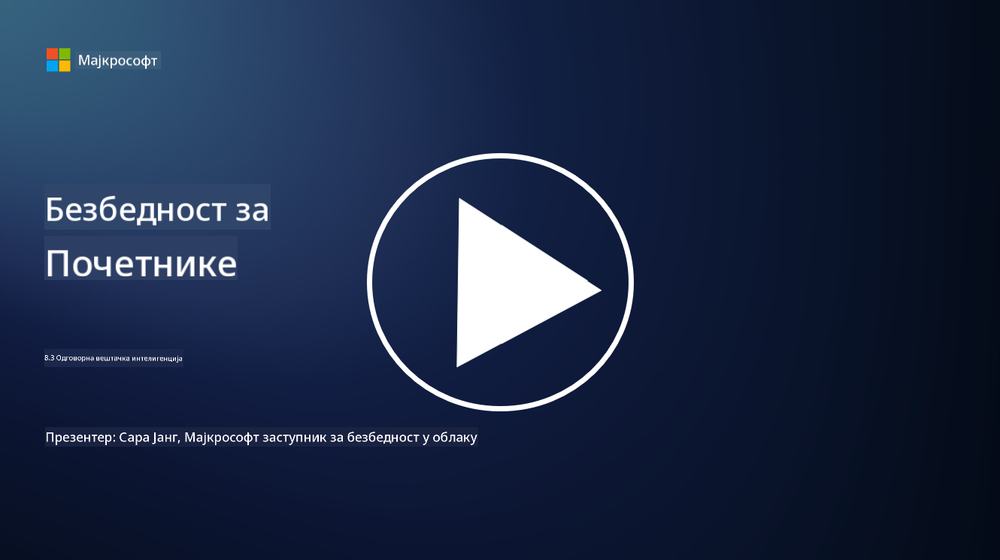

<!--
CO_OP_TRANSLATOR_METADATA:
{
  "original_hash": "5e9775ee91bde7d44577891d5f11c4c5",
  "translation_date": "2025-09-04T00:08:38+00:00",
  "source_file": "8.3 Responsible AI.md",
  "language_code": "sr"
}
-->
# Одговорна вештачка интелигенција

## Шта је одговорна вештачка интелигенција и како се односи на безбедност вештачке интелигенције?

Одговорна вештачка интелигенција подразумева развој и употребу вештачке интелигенције на етички, транспарентан начин који је у складу са друштвеним вредностима. Она обухвата принципе као што су правичност, одговорност и поузданост, осигуравајући да су системи вештачке интелигенције дизајнирани и коришћени тако да доносе корист појединцима, заједницама и друштву у целини.

Однос између одговорне вештачке интелигенције и безбедности вештачке интелигенције је значајан јер:

-   **Етичка разматрања**: Одговорна вештачка интелигенција укључује етичка разматрања која директно утичу на безбедност, као што су приватност и заштита података. Осигуравање да системи вештачке интелигенције поштују приватност корисника и штите личне податке је кључни аспект одговорне вештачке интелигенције.
-   **Поузданост и отпорност**: Системи вештачке интелигенције морају бити отпорни на манипулације и нападе, што је основни принцип и одговорне вештачке интелигенције и безбедности вештачке интелигенције. Ово укључује заштиту од напада и осигурање интегритета процеса доношења одлука.
-   **Транспарентност и објашњивост**: Део одговорне вештачке интелигенције је осигурање да су системи транспарентни и да се њихове одлуке могу објаснити. Ово је кључно за безбедност, јер је неопходно да заинтересоване стране разумеју како системи функционишу како би им веровали.
-   **Одговорност**: Системи вештачке интелигенције треба да буду одговорни за своје поступке, што значи да морају постојати механизми за праћење одлука и исправљање проблема. Ово је у складу са безбедносним праксама које прате и проверавају активности система како би се спречиле и решиле повреде.

У суштини, одговорна вештачка интелигенција и безбедност вештачке интелигенције су међусобно повезане, при чему праксе одговорне вештачке интелигенције побољшавају безбедност система и обрнуто. Примена принципа одговорне вештачке интелигенције помаже у стварању система који су не само етички исправни већ и безбеднији од потенцијалних претњи.

## Како могу осигурати да је мој систем вештачке интелигенције и безбедан и етичан?

Осигуравање да је ваш систем вештачке интелигенције и безбедан и етичан захтева вишеструки приступ који укључује следеће кораке:

- **Придржавајте се етичких принципа**: Пратите утврђене етичке смернице које наглашавају добробит људи, друштва и животне средине; правичност; заштиту приватности; поузданост; транспарентност; могућност оспоравања одлука; и одговорност.

- **Примените робусне безбедносне мере**: Користите проактивно тестирање безбедности и програме за управљање поверењем, ризицима и безбедношћу вештачке интелигенције како бисте се заштитили од претњи и рањивости.

- **Укључите разноврсне заинтересоване стране**: Укључите широк спектар учесника у процес развоја вештачке интелигенције, укључујући етичаре, друштвене научнике и представнике погођених заједница како бисте осигурали да се узму у обзир различите перспективе и вредности.

- **Осигурајте транспарентност и објашњивост**: Осигурајте да су процеси доношења одлука система вештачке интелигенције транспарентни и објашњиви, што омогућава веће поверење и лакше идентификовање потенцијалних пристрасности или грешака.

- **Очувајте приватност података**: Заштитите приватност и аутентичност података кроз енкрипцију и друге мере заштите података како бисте поштовали права корисника на приватност.

- **Омогућите људски надзор**: Примените механизме за људски надзор како бисте омогућили оспоравање одлука које доносе системи вештачке интелигенције и осигурали одговорност.

- **Будите у току са безбедношћу вештачке интелигенције**: Пратите најновија истраживања и дискусије о безбедности вештачке интелигенције како бисте разумели како се ова област развија.

- **Придржавајте се прописа**: Осигурајте да ваш систем вештачке интелигенције испуњава све релевантне законе и прописе, укључујући законе о заштити података, антидискриминационе законе и смернице специфичне за индустрију.

## Можете ли ми дати примере безбедносних проблема узрокованих неетичком употребом вештачке интелигенције?

Ево неколико примера безбедносних проблема који могу настати услед неетичке употребе вештачке интелигенције:

- **Пристрасно доношење одлука**: Системи вештачке интелигенције могу одржавати и појачавати постојеће пристрасности ако су обучени на пристрасним скуповима података. На пример, ако је претраживач обучен на подацима који одражавају друштвене стереотипе, може приказивати пристрасне резултате претраге, што може довести до неправедног третмана или дискриминације.

- **Вештачка интелигенција у правосудним системима**: Употреба вештачке интелигенције у доношењу правних одлука може изазвати етичке проблеме, посебно ако процес доношења одлука није транспарентан или је под утицајем пристрасних података. Ово може довести до неправедних правних исхода и нарушавања права појединаца.

- **Манипулација системима вештачке интелигенције**: Системи вештачке интелигенције могу бити подложни нападима, где мале измене у улазним подацима могу довести до нетачних резултата. На пример, аутономна возила могу бити обманута да погрешно тумаче саобраћајне знакове, што доводи до ризика по безбедност.

- **Надзор уз помоћ вештачке интелигенције**: Примена вештачке интелигенције за надзор може довести до кршења приватности, посебно ако се користи без одговарајућег пристанка или на начине који нарушавају индивидуалне слободе. Ово може бити посебно проблематично у ауторитарним режимима који могу користити вештачку интелигенцију за праћење и сузбијање неслагања.

Ови примери истичу важност етичких разматрања у развоју и примени система вештачке интелигенције како би се спречили безбедносни проблеми и заштитила права и приватност појединаца.

## Додатно читање

 - [Microsoft Responsible AI Standard v2 General Requirements](https://query.prod.cms.rt.microsoft.com/cms/api/am/binary/RE5cmFl?culture=en-us&country=us&WT.mc_id=academic-96948-sayoung)
 - [Responsible AI (mit.edu)](https://sloanreview.mit.edu/big-ideas/responsible-ai/)
 - [13 Principles for Using AI Responsibly (hbr.org)](https://hbr.org/2023/06/13-principles-for-using-ai-responsibly)

---

**Одрицање од одговорности**:  
Овај документ је преведен коришћењем услуге за превођење помоћу вештачке интелигенције [Co-op Translator](https://github.com/Azure/co-op-translator). Иако настојимо да обезбедимо тачност, молимо вас да имате у виду да аутоматизовани преводи могу садржати грешке или нетачности. Оригинални документ на изворном језику треба сматрати ауторитативним извором. За критичне информације препоручује се професионални превод од стране људи. Не сносимо одговорност за било каква погрешна тумачења или неспоразуме који могу произаћи из коришћења овог превода.