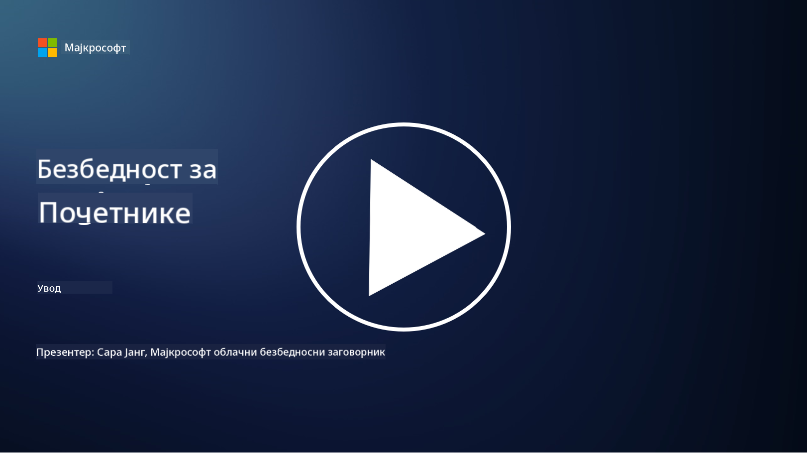

<!--
CO_OP_TRANSLATOR_METADATA:
{
  "original_hash": "5946c53720de84d57b17eafd98095d72",
  "translation_date": "2025-10-12T09:17:02+00:00",
  "source_file": "README.md",
  "language_code": "sr"
}
-->

### 🌐 Подршка за више језика

#### Подржано преко GitHub Action (аутоматски и увек ажурирано)

<!-- CO-OP TRANSLATOR LANGUAGES TABLE START -->
[Арапски](../ar/README.md) | [Бенгалски](../bn/README.md) | [Бугарски](../bg/README.md) | [Бирмански (Мјанмар)](../my/README.md) | [Кинески (поједностављени)](../zh/README.md) | [Кинески (традиционални, Хонг Конг)](../hk/README.md) | [Кинески (традиционални, Макао)](../mo/README.md) | [Кинески (традиционални, Тајван)](../tw/README.md) | [Хрватски](../hr/README.md) | [Чешки](../cs/README.md) | [Дански](../da/README.md) | [Холандски](../nl/README.md) | [Естонски](../et/README.md) | [Фински](../fi/README.md) | [Француски](../fr/README.md) | [Немачки](../de/README.md) | [Грчки](../el/README.md) | [Хебрејски](../he/README.md) | [Хинди](../hi/README.md) | [Мађарски](../hu/README.md) | [Индонежански](../id/README.md) | [Италијански](../it/README.md) | [Јапански](../ja/README.md) | [Корејски](../ko/README.md) | [Литвански](../lt/README.md) | [Малајски](../ms/README.md) | [Марати](../mr/README.md) | [Непалски](../ne/README.md) | [Норвешки](../no/README.md) | [Персијски (фарси)](../fa/README.md) | [Пољски](../pl/README.md) | [Португалски (Бразил)](../br/README.md) | [Португалски (Португал)](../pt/README.md) | [Пунџаби (Гурмуки)](../pa/README.md) | [Румунски](../ro/README.md) | [Руски](../ru/README.md) | [Српски (ћирилица)](./README.md) | [Словачки](../sk/README.md) | [Словеначки](../sl/README.md) | [Шпански](../es/README.md) | [Свахили](../sw/README.md) | [Шведски](../sv/README.md) | [Тагалог (Филипински)](../tl/README.md) | [Тамилски](../ta/README.md) | [Тајландски](../th/README.md) | [Турски](../tr/README.md) | [Украјински](../uk/README.md) | [Урду](../ur/README.md) | [Вијетнамски](../vi/README.md)
<!-- CO-OP TRANSLATOR LANGUAGES TABLE END -->

**Ако желите да додате још језика, подржани језици су наведени [овде](https://github.com/Azure/co-op-translator/blob/main/getting_started/supported-languages.md)**

#### Придружите се нашој заједници 

# 🚀 Сајбер безбедност за почетнике – курикулум

У овом брзом времену усвајања технологија вештачке интелигенције, још је важније разумети како обезбедити ИТ системе. Овај курс је осмишљен да вас научи основним концептима сајбер безбедности и започне ваше учење о безбедности. Курс је независан од добављача и подељен је на кратке лекције које трају око 30-60 минута. Свака лекција садржи кратак квиз и линкове за додатно читање ако желите да дубље истражите тему.

Шта овај курс покрива 📚

- 🔐 Основни концепти сајбер безбедности као што су ЦИА тријада, разлике између ризика, претњи итд.
- 🛡️ Разумевање шта је безбедносна контрола и у којим облицима се јавља.
- 🌐 Разумевање шта је "zero trust" и зашто је важан у модерној сајбер безбедности.
- 🔑 Разумевање кључних концепата и тема у области идентитета, мрежа, безбедносних операција, инфраструктуре и безбедности података.
- 🔧 Примери алата који се користе за имплементацију безбедносних контрола.

Шта овај курс не покрива 🙅‍♂️

- 🚫 Како користити одређене алате за безбедност.
- 🚫 Како "хаковати" или радити на офанзивној безбедности.
- 🚫 Учење о специфичним стандардима усаглашености.

Када завршите овај курс, можете наставити са неким од наших Microsoft Learn модула. Препоручујемо да наставите учење са [Microsoft Security, Compliance, and Identity Fundamentals.](https://learn.microsoft.com/training/paths/describe-concepts-of-security-compliance-identity/?WT.mc_id=academic-96948-sayoung) 

На крају, можете размотрити полагање [Exam SC-900: Microsoft Security, Compliance, and Identity Fundamentals exam.](https://learn.microsoft.com/credentials/certifications/exams/sc-900/?WT.mc_id=academic-96948-sayoung)

> 💁 Ако имате било какве повратне информације или предлоге о овом курсу и садржају који недостаје, волели бисмо да чујемо ваше мишљење!

## Преглед модула 📝 
| **Број модула** | **Назив модула**                           | **Концепти који се предају**                  | **Циљеви учења**                                                                                          |
|-------------------|-------------------------------------------|--------------------------------------|-----------------------------------------------------------------------------------------------------------------|
| **1.1**           | Основни концепти безбедности                   | [ЦИА тријада](https://github.com/microsoft/Security-101/blob/main/1.1%20The%20CIA%20triad%20and%20other%20key%20concepts.md)                        | Научите о поверљивости, доступности и интегритету. Такође о аутентичности, непрекосновености и приватности. |
| **1.2**           | Основни концепти безбедности                   | [Уобичајене претње сајбер безбедности](https://github.com/microsoft/Security-101/blob/main/1.2%20Common%20cybersecurity%20threats.md)        | Научите о уобичајеним претњама сајбер безбедности које угрожавају појединце и организације.                             |
| **1.3**           | Основни концепти безбедности                   | [Разумевање управљања ризиком](https://github.com/microsoft/Security-101/blob/main/1.3%20Understanding%20risk%20management.md)       | Научите о процени и разумевању ризика – утицај/вероватноћа и имплементација контрола.                                                                                                               | |
| **1.4**           | Основни концепти безбедности                   | [Практике и документација безбедности](https://github.com/microsoft/Security-101/blob/main/1.4%20Security%20practices%20and%20documentation.md) | Научите о разлици између политика, процедура, стандарда и прописа/закона.                         |
| **1.5**           | Основни концепти безбедности                   | [Zero trust](https://github.com/microsoft/Security-101/blob/main/1.5%20Zero%20trust.md)                           | Научите шта је "zero trust" и како утиче на архитектуру. Шта је одбрана у дубини?                   |
| **1.6**           | Основни концепти безбедности                   | [Модел заједничке одговорности](https://github.com/microsoft/Security-101/blob/main/1.6%20Shared%20responsibility%20model.md)                           | Шта је модел заједничке одговорности и како утиче на сајбер безбедност?                  |
| **1.7**           | [Квиз на крају модула](https://github.com/microsoft/Security-101/blob/main/1.7%20End%20of%20module%20quiz.md)                        |                                      |                                                                                                                 |
| **2.1**           | Основе управљања идентитетом и приступом | [Кључни концепти IAM](https://github.com/microsoft/Security-101/blob/main/2.1%20IAM%20key%20concepts.md)                     | Научите о принципу најмање привилегије, раздвајању дужности, како IAM подржава "zero trust".               |
| **2.2**           | Основе управљања идентитетом и приступом | [IAM архитектура "zero trust"](https://github.com/microsoft/Security-101/blob/main/2.2%20IAM%20zero%20trust%20architecture.md)          | Научите како је идентитет нова граница за модерна ИТ окружења и претње које ублажава.          |
| **2.3**           | Основе управљања идентитетом и приступом | [IAM могућности](https://github.com/microsoft/Security-101/blob/main/2.3%20IAM%20capabilities.md)                     | Научите о IAM могућностима и контролама за обезбеђивање идентитета                                                  |
| **2.4**           | [Квиз на крају модула](https://github.com/microsoft/Security-101/blob/main/2.4%20End%20of%20module%20quiz.md)                        |                                      |                                                                                                                 |
| **3.1**           | Основе мрежне безбедности             | [Кључни концепти мрежа](https://github.com/microsoft/Security-101/blob/main/3.1%20Networking%20key%20concepts.md)              | Научите о концептима мрежа (IP адресирање, бројеви портова, енкрипција, итд.)                                 |
| **3.2**           | Основе мрежне безбедности             | [Мрежна архитектура "zero trust"](https://github.com/microsoft/Security-101/blob/main/3.2%20Networking%20zero%20trust%20architecture.md)   | Научите како мрежа доприноси E2E ZT архитектури и претње које ублажава.                  |
| **3.3**           | Основе мрежне безбедности             | [Могућности мрежне безбедности](https://github.com/microsoft/Security-101/blob/main/3.3%20Network%20security%20capabilities.md)        | Научите о алатима за мрежну безбедност – заштитни зидови, WAF, заштита од DDoS напада, итд.                                    |
| **3.4**           | [Квиз на крају модула](https://github.com/microsoft/Security-101/blob/main/3.4%20End%20of%20module%20quiz.md)                        |                                      |                                                                                                                 |
| **4.1**           | Основе безбедносних операција          | [Кључни концепти SecOps](https://github.com/microsoft/Security-101/blob/main/4.1%20SecOps%20key%20concepts.md)                  | Научите зашто су безбедносне операције важне и како се разликују од нормалних ИТ операција.                  |
| **4.2**           | Основе безбедносних операција          | [SecOps архитектура "zero trust"](https://github.com/microsoft/Security-101/blob/main/4.2%20SecOps%20zero%20trust%20architecture.md)       | Научите како SecOps доприноси E2E ZT архитектури и претње које ублажава.                      |
| **4.3**           | Основе безбедносних операција          | [Могућности SecOps](https://github.com/microsoft/Security-101/blob/main/4.3%20SecOps%20capabilities.md)                  | Научите о алатима за SecOps – SIEM, XDR, итд.                                                                    |
| **4.4**           | [Квиз на крају модула](https://github.com/microsoft/Security-101/blob/main/4.4%20End%20of%20module%20quiz.md)                        |                                      |                                                                                                                 |
| **5.1**           | Основе безбедности апликација         | [Кључни концепти AppSec](https://github.com/microsoft/Security-101/blob/main/5.1%20AppSec%20key%20concepts.md)                  | Научите о концептима AppSec као што су безбедност по дизајну, валидација уноса, итд.                                    |
| **5.2**           | Основе безбедности апликација            | [AppSec способности](https://github.com/microsoft/Security-101/blob/main/5.2%20AppSec%20key%20capabilities.md)                  | Сазнајте више о AppSec алатима: алати за безбедност у развојном процесу, скенирање кода, скенирање тајни, итд.    |
| **5.3**           | [Квиз на крају модула](https://github.com/microsoft/Security-101/blob/main/5.3%20End%20of%20module%20quiz.md)                        |                                      |                                                                                                                 |
| **6.1**           | Основе безбедности инфраструктуре         | [Кључни концепти безбедности инфраструктуре](https://github.com/microsoft/Security-101/blob/main/6.1%20Infrastructure%20security%20key%20concepts.md) | Сазнајте више о јачању система, ажурирању, хигијени безбедности, безбедности контејнера.                         |
| **6.2**           | Основе безбедности инфраструктуре         | [Способности безбедности инфраструктуре](https://github.com/microsoft/Security-101/blob/main/6.2%20Infrastructure%20security%20capabilities.md) | Сазнајте више о алатима који могу помоћи у безбедности инфраструктуре, нпр. CSPM, безбедност контејнера, итд.     |
| **6.3**           | [Квиз на крају модула](https://github.com/microsoft/Security-101/blob/main/6.3%20End%20of%20module%20quiz.md)                        |                                      |                                                                                                                 |
| **7.1**           | Основе безбедности података               | [Кључни концепти безбедности података](https://github.com/microsoft/Security-101/blob/main/7.1%20Data%20security%20key%20concepts.md)           | Сазнајте више о класификацији и задржавању података и зашто је то важно за организацију.                         |
| **7.2**           | Основе безбедности података               | [Способности безбедности података](https://github.com/microsoft/Security-101/blob/main/7.2%20Data%20security%20capabilities.md)           | Сазнајте више о алатима за безбедност података – DLP, управљање унутрашњим ризицима, управљање подацима, итд.     |
| **7.3**           | [Квиз на крају модула](https://github.com/microsoft/Security-101/blob/main/7.3%20End%20of%20module%20quiz.md)                        |
| **8.1**           | Основе безбедности вештачке интелигенције | [Кључни концепти безбедности AI](https://github.com/microsoft/Security-101/blob/main/8.1%20AI%20security%20key%20concepts.md)          | Сазнајте више о разликама и сличностима између традиционалне безбедности и безбедности AI.                        |
| **8.2**           | Основе безбедности вештачке интелигенције | [Способности безбедности AI](https://github.com/microsoft/Security-101/blob/main/8.2%20AI%20security%20capabilities.md)           | Сазнајте више о алатима за безбедност AI и контролама које се могу користити за обезбеђивање AI.                  |
| **8.3**           | Основе безбедности вештачке интелигенције | [Одговорна AI](https://github.com/microsoft/Security-101/blob/main/8.3%20Responsible%20AI.md)          | Сазнајте шта је одговорна AI и о специфичним штетама AI које професионалци за безбедност треба да знају.           |
| **8.4**           | [Квиз на крају модула](https://github.com/microsoft/Security-101/blob/main/8.4%20End%20of%20module%20quiz.md)     

## 🎒 Остали курсеви 

Наш тим производи и друге курсеве! Погледајте:

- [Генеративна AI за почетнике](https://aka.ms/genai-beginners)
- [Генеративна AI за почетнике .NET](https://github.com/microsoft/Generative-AI-for-beginners-dotnet)
- [Генеративна AI са JavaScript-ом](https://github.com/microsoft/generative-ai-with-javascript)
- [Генеративна AI са Java-ом](https://github.com/microsoft/Generative-AI-for-beginners-java)
- [AI за почетнике](https://aka.ms/ai-beginners)
- [Наука о подацима за почетнике](https://aka.ms/datascience-beginners)
- [Машинско учење за почетнике](https://aka.ms/ml-beginners)
- [Сајбер безбедност за почетнике](https://github.com/microsoft/Security-101) 
- [Веб развој за почетнике](https://aka.ms/webdev-beginners)
- [IoT за почетнике](https://aka.ms/iot-beginners)
- [XR развој за почетнике](https://github.com/microsoft/xr-development-for-beginners)
- [Мастеринг GitHub Copilot за парно програмирање](https://github.com/microsoft/Mastering-GitHub-Copilot-for-Paired-Programming)
- [Мастеринг GitHub Copilot за C#/.NET програмере](https://github.com/microsoft/mastering-github-copilot-for-dotnet-csharp-developers)
- [Изаберите своју Copilot авантуру](https://github.com/microsoft/CopilotAdventures)

## Помоћ

Ако се заглавите или имате питања о изградњи AI апликација, придружите се:

Ако имате повратне информације о производу или наиђете на грешке током изградње, посетите:

---

**Одрицање од одговорности**:  
Овај документ је преведен помоћу услуге за превођење уз помоћ вештачке интелигенције [Co-op Translator](https://github.com/Azure/co-op-translator). Иако се трудимо да обезбедимо тачност, молимо вас да имате у виду да аутоматски преводи могу садржати грешке или нетачности. Оригинални документ на његовом изворном језику треба сматрати меродавним извором. За критичне информације препоручује се професионални превод од стране људског преводиоца. Не преузимамо одговорност за било каква погрешна тумачења или неспоразуме који могу настати услед коришћења овог превода.