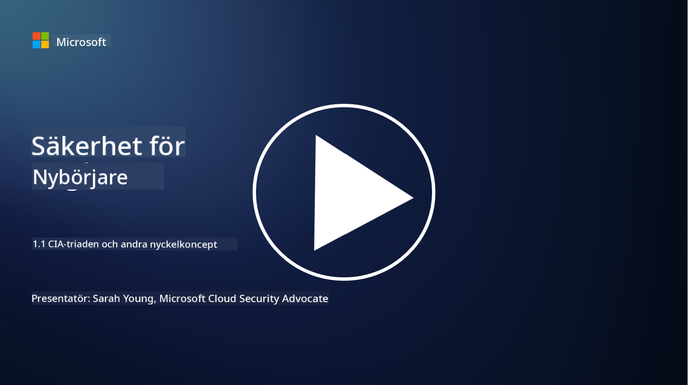
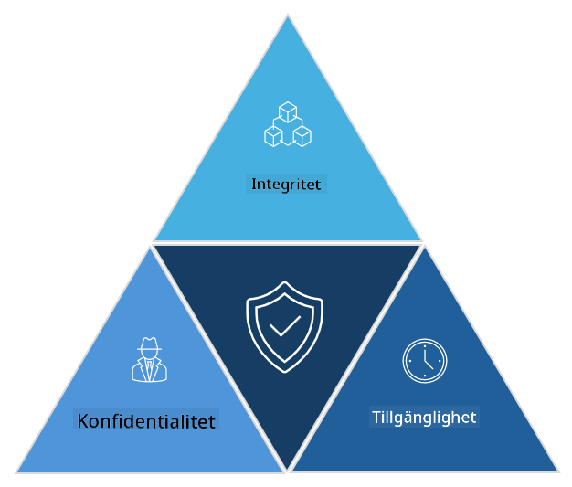

<!--
CO_OP_TRANSLATOR_METADATA:
{
  "original_hash": "16a76f9fa372fb63cffb6d76b855f023",
  "translation_date": "2025-09-04T01:10:11+00:00",
  "source_file": "1.1 The CIA triad and other key concepts.md",
  "language_code": "sv"
}
-->
# CIA-triaden och andra viktiga koncept

## Introduktion

I den här lektionen kommer vi att gå igenom:

 - Vad är cybersäkerhet?
   
 
 - Vad är cybersäkerhetens CIA-triad?

   

 - Vad innebär autenticitet, icke-förnekande och integritetsskydd i cybersäkerhetssammanhang?

## Vad är cybersäkerhet?

Cybersäkerhet, även kallat informationssäkerhet, är praxis att skydda datasystem, nätverk, enheter och information från digitala attacker, obehörig åtkomst, skador eller stöld. Huvudmålet med cybersäkerhet är att säkerställa konfidentialitet, integritet och tillgänglighet för digitala tillgångar och information. Cybersäkerhetsexperter designar och implementerar säkerhetskontroller för att skydda tillgångar, data och information. Eftersom allt mer av våra liv har blivit digitaliserade och online, har cybersäkerhet blivit en högprioriterad fråga för både privatpersoner och organisationer.

## Vad är cybersäkerhetens CIA-triad?

Cybersäkerhetens triad hänvisar till en modell som omfattar de tre huvudsakliga övervägandena för allt arbete inom cybersäkerhet eller vid design av ett system/miljö:

### Konfidentialitet

Detta är den aspekt som de flesta tänker på när de hör "cybersäkerhet": konfidentialitet handlar om att skydda data och information från obehöriga åtkomstförsök, det vill säga att endast de som behöver se informationen har tillgång till den. Dock är inte all data lika viktig, och data kategoriseras och skyddas vanligtvis baserat på hur mycket skada som skulle uppstå om den hamnade i fel händer.

### Integritet

Handlar om att skydda noggrannheten och tillförlitligheten hos data i en miljö och att förhindra att data ändras eller manipuleras av obehöriga personer. Till exempel: en student ändrar sitt födelsedatum i sitt körkortsregister hos Transportstyrelsen för att framstå som äldre och få sitt körkort omtryckt med ett tidigare födelsedatum för att kunna köpa alkohol.

### Tillgänglighet

Detta är en viktig aspekt inom operativ IT, men tillgänglighet är också avgörande för cybersäkerhet. Det finns specifika typer av attacker som riktar sig mot tillgänglighet och som säkerhetsexperter måste skydda mot (t.ex. distribuerade överbelastningsattacker – DDoS-attacker).

**Cybersäkerhetens CIA-triad**

## Vad innebär autenticitet, icke-förnekande och integritetsskydd i cybersäkerhetssammanhang?

Dessa är ytterligare viktiga koncept som handlar om att säkerställa systemens och datans säkerhet och tillförlitlighet:

**Autenticitet** - avser försäkran om att informationen, kommunikationen eller enheten du interagerar med är äkta och inte har manipulerats eller ändrats av obehöriga parter.

**Icke-förnekande** - är konceptet att säkerställa att en part inte kan förneka sin inblandning eller äktheten i en transaktion eller kommunikation. Det förhindrar att någon hävdar att de inte skickade ett meddelande eller utförde en viss handling när det finns bevis som säger motsatsen.

**Integritetsskydd** - handlar om att skydda känslig och personligt identifierbar information från obehörig åtkomst, användning, spridning eller manipulation. Det innebär att kontrollera vem som har tillgång till personlig data och hur den samlas in, lagras och delas. 

## Ytterligare läsning

[What Is Information Security (InfoSec)? | Microsoft Security](https://www.microsoft.com/security/business/security-101/what-is-information-security-infosec#:~:text=Three%20pillars%20of%20information%20security%3A%20the%20CIA%20triad,as%20guiding%20principles%20for%20implementing%20an%20InfoSec%20plan.)

---

**Ansvarsfriskrivning**:  
Detta dokument har översatts med hjälp av AI-översättningstjänsten [Co-op Translator](https://github.com/Azure/co-op-translator). Även om vi strävar efter noggrannhet, vänligen notera att automatiska översättningar kan innehålla fel eller felaktigheter. Det ursprungliga dokumentet på sitt ursprungliga språk bör betraktas som den auktoritativa källan. För kritisk information rekommenderas professionell mänsklig översättning. Vi ansvarar inte för eventuella missförstånd eller feltolkningar som uppstår vid användning av denna översättning.