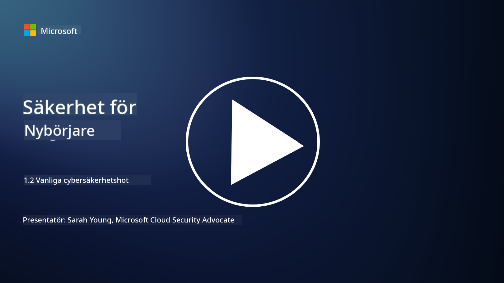

<!--
CO_OP_TRANSLATOR_METADATA:
{
  "original_hash": "6fc3030323139d7134a4ca9d03eccac9",
  "translation_date": "2025-09-03T23:24:40+00:00",
  "source_file": "1.2 Common cybersecurity threats.md",
  "language_code": "sv"
}
-->
# Vanliga cybersäkerhetshot

## Introduktion

I denna lektion kommer vi att gå igenom:

- Vad är ett cybersäkerhetshot?

- Varför vill illasinnade aktörer kompromettera data och IT-system?

- Vilka är de vanligaste typerna av cybersäkerhetshot?

- Vad är MITRE ATT&CK-ramverket?

- Var kan jag hålla mig uppdaterad om cybersäkerhetshot?

## Vad är ett cybersäkerhetshot?

Ett cybersäkerhetshot avser varje potentiell fara eller risk som kan äventyra konfidentialiteten, integriteten eller tillgängligheten av data eller IT-system. Dessa hot kommer från illasinnade aktörer som försöker utnyttja sårbarheter för att få obehörig åtkomst, stjäla känslig information, störa verksamheter eller orsaka skada för individer, organisationer eller till och med hela nationer. Cybersäkerhetshot kan ta olika former och rikta sig mot olika aspekter av digitala system och data.

## Varför vill illasinnade aktörer kompromettera data och IT-system?

Illasinnade aktörer komprometterar data och IT-system av olika skäl, ofta drivna av personlig vinning, ideologiska motiv eller viljan att orsaka störningar. Att förstå dessa motiv kan hjälpa organisationer och individer att bättre försvara sig mot cyberhot. Några vanliga skäl till varför illasinnade aktörer utför cyberattacker inkluderar:

1. **Ekonomisk vinning**: Många attacker drivs av viljan att tjäna pengar. Illasinnade aktörer kan stjäla känslig information som kreditkortsnummer, bankuppgifter eller personliga identitetsuppgifter för att begå bedrägeri, identitetsstöld, utpressning eller sälja den stulna informationen på den mörka webben.

2. **Spionage**: Nationer, konkurrenter eller andra enheter kan ägna sig åt cyberspionage för att stjäla känslig information från regeringar, företag eller forskningsinstitut för politiska, ekonomiska eller militära fördelar.

3. **Störning och sabotage**: Vissa attacker syftar till att störa kritisk infrastruktur, tjänster eller verksamheter av politiska eller ideologiska skäl. Dessa attacker kan orsaka omfattande kaos, ekonomiska förluster och skada på rykte.

4. **Ideologiska motiv**: Hacktivister och grupper med ideologiska eller politiska motiv kan kompromettera system för att öka medvetenheten om vissa frågor, främja sina övertygelser eller protestera mot specifika handlingar eller organisationer.

5. **Oavsiktliga handlingar**: Inte alla illasinnade handlingar är avsiktliga; vissa individer kan omedvetet bidra till cyberhot genom att falla offer för social ingenjörskonst eller vara en del av ett komprometterat nätverk.

I slutändan kan motiven för att kompromettera data och IT-system variera mycket, och konsekvenserna av dessa attacker kan vara allvarliga. Det är viktigt för individer, organisationer och regeringar att ta cybersäkerhet på allvar och implementera åtgärder för att skydda sig mot dessa hot.

## Vilka är de vanligaste typerna av cybersäkerhetshot?

Det finns flera vanliga typer av cyberattacker som illasinnade aktörer använder för att kompromettera system, stjäla data och orsaka störningar. Här är några av de mest förekommande typerna vid tidpunkten för denna text:

1. **Phishing**:

Phishing innebär att skicka vilseledande e-postmeddelanden eller meddelanden som ser ut att komma från legitima källor för att lura mottagare att avslöja känslig information, såsom lösenord, kreditkortsnummer eller personliga uppgifter. Phishing kan också leda offer till skadliga webbplatser eller att ladda ner skadlig programvara.

2. **Skadlig programvara (Malware)**:

Skadlig programvara omfattar en rad skadliga program som är utformade för att infektera system, stjäla data eller orsaka skada. Typer av skadlig programvara inkluderar:

- **Ransomware**: Krypterar filer och kräver en lösensumma för att dekryptera dem.

- **Trojaner**: Förklädda som legitim programvara, ger de angripare obehörig åtkomst.

- **Virus**: Självreplikerande program som fäster sig vid filer och sprids.

- **Maskar**: Självreplikerande program som sprids genom nätverk.

3. **Denial of Service (DoS) och Distributed Denial of Service (DDoS)**:

DoS-attacker överbelastar ett målsystem och gör det otillgängligt för användare. DDoS-attacker använder ett nätverk av komprometterade enheter för att översvämma ett mål med trafik, vilket gör det svårt för systemet att fungera korrekt eller kan stoppa det helt.

4. **SQL-injektion**:

Vid denna attack manipulerar angripare en webbapplikations inmatningsfält för att injicera skadliga SQL-frågor, vilket potentiellt ger obehörig åtkomst till databaser och känslig information.

5. **Cross-Site Scripting (XSS)**:

Angripare injicerar skadliga skript i webbapplikationer, som sedan körs av användares webbläsare. Detta kan leda till stöld av användardata och/eller spridning av skadlig programvara.

6. **Social ingenjörskonst**:

Social ingenjörskonst utnyttjar mänsklig psykologi för att manipulera individer att avslöja konfidentiell information eller utföra handlingar som äventyrar säkerheten.

7. **Zero-Day (0day) exploits**:

Dessa attacker riktar sig mot sårbarheter i programvara eller hårdvara som ännu inte är kända av leverantören eller allmänheten. Angripare utnyttjar dessa sårbarheter innan patchar utvecklas. Många organisationer oroar sig för zero-days eftersom det inte finns någon patch för dem, men de är inte lika vanliga som andra attacker på denna lista. När en zero-day upptäcks arbetar säkerhetsforskare snabbt för att skapa en patch, och därför är zero-days generellt kortlivade.

8. **Credential-attacker**:

Dessa attacker inkluderar brute force-attacker, där angripare upprepade gånger gissar lösenord, och credential stuffing-attacker, där stulna inloggningsuppgifter från en webbplats används för att försöka få åtkomst till andra webbplatser.

## Vad är MITRE ATT&CK-ramverket?

[MITRE ATT&CK-ramverket](https://attack.mitre.org/) (Adversarial Tactics, Techniques, and Common Knowledge) är ett ramverk som katalogiserar och kategoriserar de taktiker, tekniker och procedurer (TTPs) som angripare använder vid cyberattacker. Ramverket skapades av MITRE Corporation, en ideell organisation som driver forsknings- och utvecklingscenter för olika statliga myndigheter.

MITRE ATT&CK-ramverket erbjuder ett standardiserat sätt att beskriva och analysera cyberhot, vilket gör det möjligt för cybersäkerhetsproffs att bättre förstå och försvara sig mot olika attacktekniker. Det används i stor utsträckning av säkerhetsteam, hotjägare och incidenthanterare för att:

1. **Förstå angripares beteende**: Ramverket dokumenterar verkliga attackbeteenden och beskriver stegen som angripare tar från initial intrång till att uppnå sina mål. Det täcker ett brett spektrum av attacktekniker som används av olika hotgrupper.

2. **Planera och implementera försvarsstrategier**: Säkerhetsteam kan använda ramverket för att utveckla proaktiva försvarsstrategier som är anpassade till de specifika taktiker och tekniker som angripare kan använda.

3. **Incidenthantering och hotjakt**: Vid utredning av incidenter eller genomförande av hotjakt kan säkerhetsproffs hänvisa till ramverket för att identifiera och mildra specifika tekniker som används av angripare.

Ramverket är organiserat i matriser som grupperar attacktekniker baserat på specifika plattformar och miljöer, såsom Windows, macOS, Linux och molntjänster. Varje matris är indelad i taktiker (övergripande mål) och tekniker (specifika metoder som används för att uppnå dessa mål). För varje teknik tillhandahåller ramverket information om hur den fungerar, potentiella motåtgärder och relevanta referenser till verkliga hotaktörer som har använt tekniken.

Ramverket uppdateras och utökas kontinuerligt när ny hotinformation samlas in och cybersäkerhetslandskapet utvecklas. Det är en värdefull resurs för att förbättra en organisations cybersäkerhet genom att möjliggöra en djupare förståelse för hur angripare arbetar och hur man försvarar sig mot deras taktiker.

## Var kan jag hålla mig uppdaterad om cybersäkerhetshot?

Det finns många källor som kan användas för att hålla sig uppdaterad om cybersäkerhetshot. Här är några exempel:

- [Open Web Application Security Project (OWASP) top 10 vulnerabilities](https://owasp.org/Top10/)
- [Common Vulnerabilities and Exposures (CVEs)](https://www.bing.com/ck/a?!&&p=53df6007f017bca2JmltdHM9MTY5MjU3NjAwMCZpZ3VpZD0zYmY4N2RiYS1jYWI1LTYwMDgtMWY1YS02ZmYyY2JjNjYxZWUmaW5zaWQ9NTc2OQ&ptn=3&hsh=3&fclid=3bf87dba-cab5-6008-1f5a-6ff2cbc661ee&psq=cve&u=a1aHR0cHM6Ly9iaW5nLmNvbS9hbGluay9saW5rP3VybD1odHRwcyUzYSUyZiUyZmN2ZS5taXRyZS5vcmclMmYmc291cmNlPXNlcnAtcnImaD1BZXN4S0VBWTNnbGhNZEFpd3daMlNSZkZQNTlrODhIUnYxRUtlSkY1RTk0JTNkJnA9a2NvZmZjaWFsd2Vic2l0ZQ&ntb=1 "Common Vulnerabilities and Exposures")
- [Microsoft Security Response Center blogs](https://msrc.microsoft.com/blog/)
- [National Institute of Standards and Technology (NIST)](https://www.dhs.gov/topics/cybersecurity): NIST tillhandahåller resurser, varningar och senaste uppdateringar om potentiella cybersäkerhetshot.
- [Cybersecurity and Infrastructure Security Agency (CISA)](https://www.cisa.gov/resources-tools/resources/free-cybersecurity-services-and-tools): CISA erbjuder cybersäkerhetsresurser och bästa praxis för företag, statliga myndigheter och andra organisationer. CISA delar uppdaterad information om högpåverkande typer av säkerhetsaktivitet som påverkar samhället i stort samt djupgående analyser av nya och utvecklande cyberhot.
- [National Cybersecurity Center of Excellence (NCCoE)](https://www.dhs.gov/topics/cybersecurity): NCCoE är ett nav som tillhandahåller praktiska cybersäkerhetslösningar som kan tillämpas i verkliga situationer.
- [US-CERT](https://www.cisa.gov/resources-tools/resources/free-cybersecurity-services-and-tools): United States Computer Emergency Readiness Team (US-CERT) erbjuder en mängd cybersäkerhetsresurser, inklusive varningar, tips och mer.
- Ditt lands Cyber Emergency Response Team (CERT)

---

**Ansvarsfriskrivning**:  
Detta dokument har översatts med hjälp av AI-översättningstjänsten [Co-op Translator](https://github.com/Azure/co-op-translator). Även om vi strävar efter noggrannhet, bör det noteras att automatiserade översättningar kan innehålla fel eller brister. Det ursprungliga dokumentet på dess originalspråk bör betraktas som den auktoritativa källan. För kritisk information rekommenderas professionell mänsklig översättning. Vi ansvarar inte för eventuella missförstånd eller feltolkningar som uppstår vid användning av denna översättning.