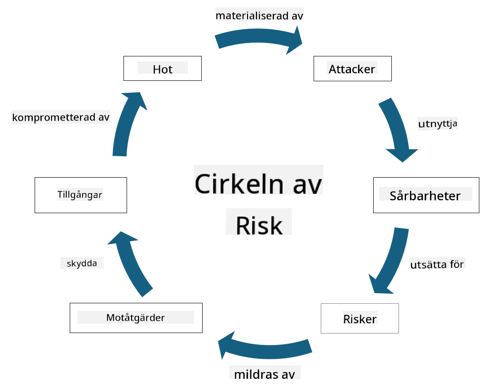

<!--
CO_OP_TRANSLATOR_METADATA:
{
  "original_hash": "fcca304f072cabf206388199e8e2e578",
  "translation_date": "2025-09-04T01:30:26+00:00",
  "source_file": "1.3 Understanding risk management.md",
  "language_code": "sv"
}
-->
# Förstå riskhantering

## Introduktion

I denna lektion kommer vi att gå igenom:

 - Definitioner av vanligt förekommande säkerhetstermer
   
 - Typer av säkerhetskontroller

 - Bedömning av säkerhetsrisker

## Definitioner av vanligt förekommande säkerhetstermer

Dessa termer är grundläggande begrepp inom cybersäkerhet och riskhantering. Låt oss bryta ner varje term och hur de relaterar till varandra:

1. **Hotaktör**:

En hotaktör är en individ, grupp, organisation eller automatiserat system som har potential att utnyttja sårbarheter i ett system eller nätverk för att orsaka skada. Hotaktörer kan vara hackare, skapare av skadlig programvara, missnöjda anställda eller andra enheter som utgör en risk för informations- och teknologisystem.

2. **Hot**:

Ett hot är en potentiell händelse eller handling som kan utnyttja sårbarheter i ett system och orsaka skada på en tillgång. Hot kan inkludera handlingar som hacking, dataintrång, överbelastningsattacker och mer. Hot är "vad" som kan orsaka skada på en organisations tillgångar.

3. **Sårbarhet**:

En sårbarhet är en svaghet eller brist i ett systems design, implementering eller konfiguration som kan utnyttjas av en hotaktör för att kompromettera systemets säkerhet. Sårbarheter kan finnas i programvara, hårdvara, processer eller mänskligt beteende. Att identifiera och åtgärda sårbarheter är avgörande för att minimera risken för framgångsrika attacker.

4. **Risk**:

Risk är den potentiella förlusten, skadan eller skadan som kan uppstå från interaktionen mellan ett hot och en sårbarhet. Det är sannolikheten att en hotaktör utnyttjar en sårbarhet för att orsaka en negativ påverkan. Risker bedöms ofta utifrån deras potentiella påverkan och sannolikhet för att inträffa.

5. **Tillgång**:

En tillgång är allt av värde som en organisation vill skydda. Tillgångar kan inkludera fysiska objekt (som datorer och servrar), data (kundinformation, finansiella register), immateriella rättigheter (affärshemligheter, patent) och även mänskliga resurser (anställdas färdigheter och kunskap). Att skydda tillgångar är ett centralt mål inom cybersäkerhet.

6. **Exponering**:

Exponering avser tillståndet av att vara sårbar för potentiella hot. Det inträffar när en sårbarhet finns som kan utnyttjas av en hotaktör. Exponering belyser risken som är förknippad med att ha sårbarheter i ett system eller nätverk.

7. **Kontroll**:

En kontroll är en åtgärd som införs för att minska risken i samband med sårbarheter och hot. Kontroller kan vara tekniska, procedurmässiga eller administrativa till sin natur. De är utformade för att förebygga, upptäcka eller mildra potentiella hot och sårbarheter. Exempel inkluderar brandväggar, åtkomstkontroller, kryptering, säkerhetspolicyer och utbildning av anställda.

Sammanfattningsvis: Hotaktörer utnyttjar sårbarheter för att genomföra hot, vilket kan leda till risker som har potential att skada värdefulla tillgångar. Exponering uppstår när sårbarheter finns, och kontroller införs för att minska risken genom att förebygga eller mildra hotens påverkan på tillgångar. Denna ramverk utgör grunden för cybersäkerhetsriskhantering och vägleder organisationer i att identifiera, bedöma och hantera potentiella risker för deras informationssystem och tillgångar.

## Typer av säkerhetskontroller

Säkerhetskontroller är åtgärder eller skydd som implementeras för att skydda informationssystem och tillgångar från olika hot och sårbarheter. De kan klassificeras i flera kategorier baserat på deras fokus och syfte. Här är några vanliga typer av säkerhetskontroller:

1. **Administrativa kontroller**:

Dessa kontroller är relaterade till policyer, procedurer och riktlinjer som styr organisationens säkerhetspraxis och användarbeteende.

- Säkerhetspolicyer och procedurer: Dokumenterade riktlinjer som definierar hur säkerhet upprätthålls inom en organisation.

- Säkerhetsmedvetenhet och utbildning: Program för att utbilda anställda om säkerhetsbästa praxis och potentiella hot.

- Incidenthantering: Planer för att hantera och mildra säkerhetsincidenter.

2. **Tekniska kontroller**:

Tekniska kontroller involverar användning av teknik för att upprätthålla säkerhetsåtgärder och skydda system och data. Exempel på tekniska kontroller är:

- Åtkomstkontroller: Åtgärder som begränsar användares åtkomst till resurser baserat på deras roller och behörigheter.

- Kryptering: Omvandling av data till ett säkert format för att förhindra obehörig åtkomst.

- Brandväggar: Nätverkssäkerhetsenheter som filtrerar och kontrollerar inkommande och utgående trafik.

- Intrångsdetekterings- och förebyggandesystem (IDPS): Verktyg som övervakar nätverkstrafik för misstänkt aktivitet.

- Antivirus- och antimalwareprogram: Program som upptäcker och tar bort skadlig programvara.

- Autentiseringsmekanismer: Metoder för att verifiera användares identitet, såsom lösenord, biometrik och multifaktorautentisering.

- Patchhantering: Regelbundna uppdateringar av programvara för att åtgärda kända sårbarheter.

3. **Fysiska kontroller**:

Fysiska kontroller är åtgärder för att skydda fysiska tillgångar och anläggningar.

- Säkerhetsvakter och åtkomstkontrollpersonal: Personal som övervakar och kontrollerar åtkomst till fysiska lokaler.

- Övervakningskameror: Videomonitoreringssystem för att övervaka och spela in aktiviteter.

- Lås och fysiska barriärer: Fysiska åtgärder för att begränsa åtkomst till känsliga områden.

- Miljökontroller: Åtgärder för att reglera temperatur, luftfuktighet och andra miljöfaktorer som påverkar utrustning och datacenter.

4. **Operativa kontroller**:

Dessa kontroller relaterar till dagliga operationer och aktiviteter som säkerställer systemens löpande säkerhet.

- Ändringshantering: Processer för att spåra och godkänna ändringar i system och konfigurationer.

- Backup och katastrofåterställning: Planer för datorsäkerhetskopiering och återställning vid systemfel eller katastrofer.

- Loggning och revision: Övervakning och registrering av systemaktiviteter för säkerhet och efterlevnad.

- Säker kodningspraxis: Riktlinjer för att skriva programvara för att minimera sårbarheter.

5. **Juridiska och regulatoriska kontroller**:

Dessa kontroller säkerställer efterlevnad av relevanta lagar, regler och branschstandarder. Vilka standarder en organisation behöver följa beror på jurisdiktion, bransch och andra faktorer.

- Dataskyddsregler: Efterlevnad av lagar som GDPR, HIPAA och CCPA.

- Branschspecifika standarder: Efterlevnad av standarder som PCI DSS för säkerhet av betalningskortdata.

Dessa kategorier av säkerhetskontroller samverkar för att skapa en omfattande säkerhetsstrategi för organisationer, vilket hjälper till att skydda deras system, data och tillgångar från en mängd olika hot.

## Bedömning av säkerhetsrisker

Vissa säkerhetsproffs anser att riskhantering är något som lämnas till riskhanteringsexperter, men att förstå processen för att hantera säkerhetsrisker är viktigt för alla säkerhetsproffs för att kunna uttrycka säkerhetsrisker på ett sätt som resten av organisationen kan förstå och agera på.

Organisationer måste ständigt bedöma säkerhetsrisker och besluta vilka åtgärder (eller inga) som ska vidtas mot risker för verksamheten. Nedan följer en översikt över hur detta vanligtvis görs. Observera att denna process vanligtvis utförs av flera olika team inom en organisation; det är sällan ett enda team ansvarar för hela riskhanteringsprocessen.

1. **Identifiera tillgångar och hot**:

Organisationen identifierar de tillgångar som den vill skydda. Dessa kan inkludera data, system, hårdvara, programvara, immateriella rättigheter och mer. Därefter identifierar de potentiella hot som kan rikta sig mot dessa tillgångar.

2. **Bedöma sårbarheter**:

Organisationer identifierar sedan sårbarheter eller svagheter i system eller processer som kan utnyttjas av hot. Dessa sårbarheter kan härröra från programvarufel, felkonfigurationer, brist på säkerhetskontroller och mänskliga misstag.

3. **Sannolikhetsbedömning**:

Organisationen utvärderar sedan sannolikheten för att varje hot inträffar. Detta innebär att beakta historiska data, hotinformation, branschtrender och interna faktorer. Sannolikheten kan kategoriseras som låg, medel eller hög baserat på hotets sannolikhet att materialiseras.

4. **Påverkansbedömning**:

Nästa steg är att fastställa den potentiella påverkan av varje hot om det skulle utnyttja en sårbarhet. Påverkan kan omfatta ekonomiska förluster, operativa störningar, skada på rykte, juridiska konsekvenser och mer. Påverkan kan också kategoriseras som låg, medel eller hög baserat på de potentiella konsekvenserna.

5. **Riskberäkning**:

Sannolikhets- och påverkansbedömningarna kombineras för att beräkna den totala risknivån för varje identifierat hot. Detta görs ofta med hjälp av en riskmatris som tilldelar numeriska värden eller kvalitativa beskrivningar till sannolikhets- och påverkansnivåer. Den resulterande risknivån hjälper till att prioritera vilka risker som behöver omedelbar uppmärksamhet.

6. **Prioritering och beslutsfattande**:

Organisationen prioriterar sedan risker genom att fokusera på de med högst kombinerade sannolikhets- och påverkansvärden. Detta gör det möjligt att fördela resurser och implementera kontroller mer effektivt. Högriskhot kräver omedelbar uppmärksamhet, medan lågriskhot kan hanteras över en längre tidsperiod.

7. **Riskbehandling**:

Baserat på riskbedömningen bestämmer organisationen hur varje risk ska mildras eller hanteras. Detta kan innebära att implementera säkerhetskontroller, överföra risk genom försäkring eller till och med acceptera vissa nivåer av kvarvarande risk om de anses hanterbara/för dyra att åtgärda/etc.

8. **Kontinuerlig övervakning och granskning**:

Riskbedömning är inte en engångsprocess. Den bör genomföras regelbundet eller när det sker betydande förändringar i organisationens miljö. Kontinuerlig övervakning säkerställer att nya hot, sårbarheter eller förändringar i affärslandskapet beaktas.

Genom att bedöma säkerhetsrisker på detta strukturerade sätt kan organisationer fatta välgrundade beslut om resursfördelning, säkerhetskontroller och övergripande riskhanteringsstrategier. Målet är att minska organisationens totala riskexponering samtidigt som säkerhetsinsatserna anpassas till organisationens affärsmål och strategier.

---

**Ansvarsfriskrivning**:  
Detta dokument har översatts med hjälp av AI-översättningstjänsten [Co-op Translator](https://github.com/Azure/co-op-translator). Även om vi strävar efter noggrannhet, vänligen notera att automatiska översättningar kan innehålla fel eller felaktigheter. Det ursprungliga dokumentet på sitt ursprungliga språk bör betraktas som den auktoritativa källan. För kritisk information rekommenderas professionell mänsklig översättning. Vi ansvarar inte för eventuella missförstånd eller feltolkningar som uppstår vid användning av denna översättning.