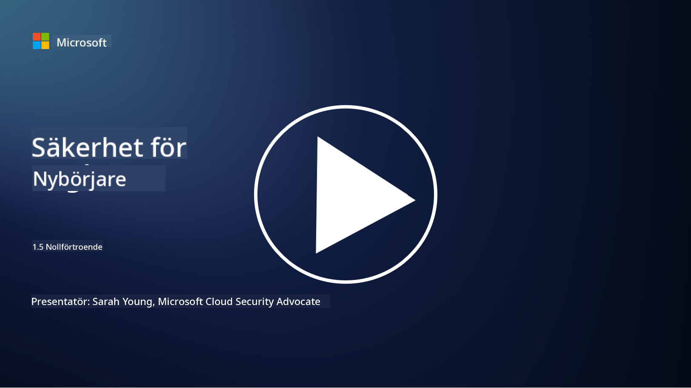
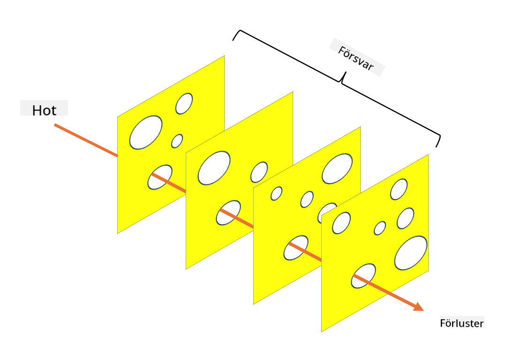

<!--
CO_OP_TRANSLATOR_METADATA:
{
  "original_hash": "75f77f972d2233c584f87c1eb96c983b",
  "translation_date": "2025-09-03T23:47:45+00:00",
  "source_file": "1.5 Zero trust.md",
  "language_code": "sv"
}
-->
# Zero Trust

"Zero trust" är ett uttryck som används flitigt inom säkerhetskretsar nuförtiden. Men vad betyder det egentligen, är det bara ett modeord? I den här lektionen ska vi fördjupa oss i vad zero trust faktiskt innebär.

## Introduktion

- I den här lektionen kommer vi att gå igenom:

- Vad är zero trust?

- Hur skiljer sig zero trust från traditionella säkerhetsarkitekturer?

- Vad är djupförsvar?

## Zero Trust

Zero Trust är ett cybersäkerhetskoncept som utmanar den traditionella idén om "lita och verifiera" genom att anta att ingen enhet, vare sig inom eller utanför en organisations nätverk, ska betraktas som pålitlig per automatik. Istället förespråkar Zero Trust att varje användare, enhet och applikation som försöker få åtkomst till resurser ska verifieras, oavsett var de befinner sig. Grundprincipen för Zero Trust är att minimera "angreppsytan" och begränsa den potentiella skadan vid säkerhetsintrång.

I en Zero Trust-modell betonas följande principer:

1. **Verifiera identitet**: Autentisering och auktorisering tillämpas strikt på alla användare och enheter, oavsett deras plats. Kom ihåg att en identitet inte nödvändigtvis är mänsklig: det kan vara en enhet, en applikation, etc.

2. **Minsta behörighet**: Användare och enheter får endast den åtkomst som är absolut nödvändig för att utföra sina uppgifter, vilket minskar potentiell skada vid kompromettering.

3. **Mikrosegmentering**: Nätverksresurser delas upp i mindre segment för att begränsa lateral rörelse inom nätverket vid ett intrång.

4. **Kontinuerlig övervakning**: Löpande övervakning och analys av användar- och enhetsbeteende utförs för att upptäcka avvikelser och potentiella hot. Moderna övervakningstekniker använder även maskininlärning, AI och hotintelligens för att ge ytterligare detaljer och kontext till övervakningen.

5. **Datakryptering**: Data krypteras både under transport och i vila för att förhindra obehörig åtkomst.

6. **Strikta åtkomstkontroller**: Åtkomstkontroller tillämpas baserat på kontext, såsom användarroller, enhetens hälsa och nätverksplats.

Microsoft delar upp zero trust i fem pelare, som vi kommer att diskutera i en senare lektion.

## Skillnader från traditionella säkerhetsarkitekturer

Zero Trust skiljer sig från traditionella säkerhetsarkitekturer, såsom perimeterbaserade modeller, på flera sätt:

1. **Perimeter vs. identitetscentrerad**: Traditionella modeller fokuserar på att säkra nätverkets perimeter och antar att interna användare och enheter kan litas på när de väl är inne. Zero Trust antar däremot att hot kan komma både inifrån och utifrån nätverket och tillämpar strikta identitetsbaserade kontroller.

2. **Implicit vs. explicit tillit**: Traditionella modeller litar implicit på enheter och användare inom nätverket tills motsatsen bevisas. Zero Trust verifierar identiteter explicit och övervakar kontinuerligt för avvikelser.

3. **Platt vs. segmenterat nätverk**: Traditionella arkitekturer involverar ofta platta nätverk där interna användare har bred åtkomst. Zero Trust förespråkar att segmentera nätverket i mindre, isolerade zoner för att begränsa potentiella intrång.

4. **Reaktiv vs. proaktiv**: Traditionell säkerhet förlitar sig ofta på reaktiva åtgärder som perimeterbrandväggar och intrångsdetektering. Zero Trust tar en proaktiv inställning genom att anta att intrång är sannolika och minimera deras påverkan.

## Djupförsvar

Djupförsvar, även känt som lagerbaserad säkerhet, är en cybersäkerhetsstrategi som innebär att flera lager av säkerhetskontroller och åtgärder implementeras för att skydda en organisations tillgångar. Målet är att skapa överlappande lager av försvar så att om ett lager bryts, kan andra fortfarande ge skydd. Varje lager fokuserar på en annan aspekt av säkerhet och stärker organisationens övergripande säkerhetsnivå.

Djupförsvar involverar en kombination av tekniska, procedurmässiga och fysiska säkerhetsåtgärder. Dessa kan inkludera brandväggar, intrångsdetekteringssystem, åtkomstkontroller, kryptering, användarutbildning, säkerhetspolicyer och mer. Idén är att skapa flera barriärer som tillsammans gör det svårt för angripare att tränga igenom en organisations system och nätverk. Detta kallas ibland även för "schweizerost"-modellen, som också används inom olycksförebyggande i andra industrier (t.ex. transport).

## Vidare läsning

[Vad är Zero Trust?](https://learn.microsoft.com/security/zero-trust/zero-trust-overview?WT.mc_id=academic-96948-sayoung)

[Evolutionen av Zero Trust – Microsofts positioneringsdokument](https://query.prod.cms.rt.microsoft.com/cms/api/am/binary/RWJJdT?WT.mc_id=academic-96948-sayoung)

[Zero Trust och BeyondCorp Google Cloud | Google Cloud Blog](https://cloud.google.com/blog/topics/developers-practitioners/zero-trust-and-beyondcorp-google-cloud)

---

**Ansvarsfriskrivning**:  
Detta dokument har översatts med hjälp av AI-översättningstjänsten [Co-op Translator](https://github.com/Azure/co-op-translator). Även om vi strävar efter noggrannhet, vänligen notera att automatiska översättningar kan innehålla fel eller felaktigheter. Det ursprungliga dokumentet på dess originalspråk bör betraktas som den auktoritativa källan. För kritisk information rekommenderas professionell mänsklig översättning. Vi ansvarar inte för eventuella missförstånd eller feltolkningar som uppstår vid användning av denna översättning.