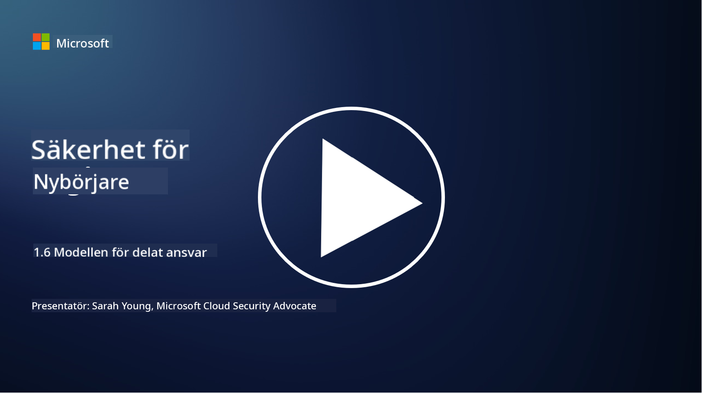

<!--
CO_OP_TRANSLATOR_METADATA:
{
  "original_hash": "a48db640d80c786b928ca178c414f084",
  "translation_date": "2025-09-04T00:26:27+00:00",
  "source_file": "1.6 Shared responsibility model.md",
  "language_code": "sv"
}
-->
# Den delade ansvarmodellen

Delat ansvar är ett nyare koncept inom IT som uppstod med framväxten av molntjänster. Ur ett cybersäkerhetsperspektiv är det avgörande att förstå vem som tillhandahåller vilka säkerhetskontroller för att undvika luckor i försvaret.

## Introduktion

I denna lektion kommer vi att gå igenom:

 - Vad innebär delat ansvar inom cybersäkerhet?
   
 - Vad är skillnaden i delat ansvar för säkerhetskontroller mellan IaaS, PaaS och SaaS?

 - Var kan du hitta information om vilka säkerhetskontroller din molnplattform tillhandahåller?

 - Vad innebär "lita men verifiera"?

## Vad innebär delat ansvar inom cybersäkerhet?

Delat ansvar inom cybersäkerhet syftar på fördelningen av säkerhetsansvar mellan en molntjänstleverantör (CSP) och dess kunder. I molntjänstmiljöer, såsom Infrastructure as a Service (IaaS), Platform as a Service (PaaS) och Software as a Service (SaaS), har både CSP och kunden roller att spela för att säkerställa säkerheten för data, applikationer och system.

## Vad är skillnaden i delat ansvar för säkerhetskontroller mellan IaaS, PaaS och SaaS?

Fördelningen av ansvar beror vanligtvis på vilken typ av molntjänst som används:

 - **IaaS (Infrastructure as a Service)**: CSP tillhandahåller den grundläggande infrastrukturen (servrar, nätverk, lagring), medan kunden ansvarar för att hantera operativsystem, applikationer och säkerhetskonfigurationer på den infrastrukturen.
   
 - **PaaS (Platform as a Service):** CSP erbjuder en plattform där kunder kan bygga och distribuera applikationer. CSP hanterar den underliggande infrastrukturen, och kunden fokuserar på applikationsutveckling och datasäkerhet.

 - **SaaS (Software as a Service)**: CSP tillhandahåller fullt fungerande applikationer som är tillgängliga via internet. I detta fall ansvarar CSP för applikationens säkerhet och infrastruktur, medan kunden hanterar användaråtkomst och dataanvändning.

Att förstå delat ansvar är avgörande eftersom det klargör vilka säkerhetsaspekter som täcks av CSP och vilka kunden behöver ta hand om. Det hjälper till att undvika missförstånd och säkerställer att säkerhetsåtgärder implementeras på ett heltäckande sätt.

## Var kan du hitta information om vilka säkerhetskontroller din molnplattform tillhandahåller?

För att ta reda på vilka säkerhetskontroller din molnplattform tillhandahåller behöver du hänvisa till molntjänstleverantörens dokumentation och resurser. Dessa inkluderar:

 - **CSP:s webbplats och dokumentation**: CSP:s webbplats innehåller information om de säkerhetsfunktioner och kontroller som erbjuds som en del av deras tjänster. CSP:er brukar erbjuda detaljerad dokumentation som förklarar deras säkerhetsrutiner, kontroller och rekommendationer. Detta kan inkludera whitepapers, säkerhetsguider och teknisk dokumentation.
   
 - **Säkerhetsbedömningar och revisioner**: De flesta CSP:er låter sina säkerhetskontroller granskas av oberoende säkerhetsexperter och organisationer. Dessa granskningar kan ge insikter om kvaliteten på CSP:s säkerhetsåtgärder. Ibland leder detta till att CSP får ett säkerhetscertifikat (se nästa punkt).
   
 - **Säkerhetscertifieringar**: De flesta CSP:er erhåller certifieringar såsom ISO:27001, SOC 2 och FedRAMP, etc. Dessa certifieringar visar att leverantören uppfyller specifika säkerhets- och efterlevnadsstandarder.

Kom ihåg att detaljnivån och tillgången till information kan variera mellan olika molnleverantörer. Se alltid till att du konsulterar officiella och uppdaterade resurser från molntjänstleverantören för att fatta välgrundade beslut om säkerheten för dina molnbaserade tillgångar.

## Vad innebär "lita men verifiera"?

I samband med att använda en CSP, tredjepartsprogramvara eller annan IT-säkerhetstjänst kan en organisation initialt lita på leverantörens påståenden om säkerhetsåtgärder. Men för att verkligen säkerställa säkerheten för sina data och system bör de verifiera dessa påståenden genom säkerhetsbedömningar, penetrationstester och en granskning av den externa partens säkerhetskontroller innan de fullt ut integrerar programvaran eller tjänsten i sin verksamhet. Alla individer och organisationer bör sträva efter att lita men verifiera de säkerhetskontroller som de själva inte ansvarar för.

## Delat ansvar inom en organisation

Kom ihåg att delat ansvar för säkerhet inom en organisation mellan olika team också måste beaktas. Säkerhetsteamet kommer sällan att implementera alla kontroller själva och behöver samarbeta med driftsteam, utvecklare och andra delar av verksamheten för att implementera alla säkerhetskontroller som krävs för att hålla en organisation säker.

## Vidare läsning
- [Shared responsibility in the cloud - Microsoft Azure | Microsoft Learn](https://learn.microsoft.com/azure/security/fundamentals/shared-responsibility?WT.mc_id=academic-96948-sayoung)
- [What is shared responsibility model? – Definition from TechTarget.com](https://www.techtarget.com/searchcloudcomputing/definition/shared-responsibility-model)
- [The shared responsibility model explained and what it means for cloud security | CSO Online](https://www.csoonline.com/article/570779/the-shared-responsibility-model-explained-and-what-it-means-for-cloud-security.html)
- [Shared Responsibility for Cloud Security: What You Need to Know (cisecurity.org)](https://www.cisecurity.org/insights/blog/shared-responsibility-cloud-security-what-you-need-to-know)

---

**Ansvarsfriskrivning**:  
Detta dokument har översatts med hjälp av AI-översättningstjänsten [Co-op Translator](https://github.com/Azure/co-op-translator). Även om vi strävar efter noggrannhet, bör det noteras att automatiska översättningar kan innehålla fel eller inexaktheter. Det ursprungliga dokumentet på dess originalspråk bör betraktas som den auktoritativa källan. För kritisk information rekommenderas professionell mänsklig översättning. Vi ansvarar inte för eventuella missförstånd eller feltolkningar som uppstår vid användning av denna översättning.