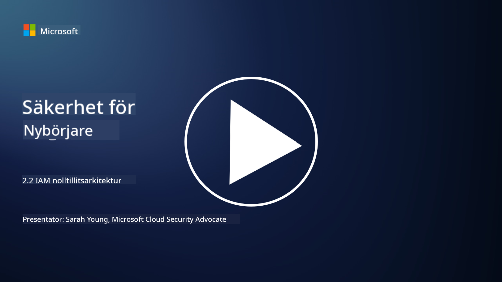

<!--
CO_OP_TRANSLATOR_METADATA:
{
  "original_hash": "4774a978af123f72ebb872199c4c4d4f",
  "translation_date": "2025-09-03T23:41:11+00:00",
  "source_file": "2.2 IAM zero trust architecture.md",
  "language_code": "sv"
}
-->
# IAM Zero Trust-arkitektur

Identitet är en nyckelkomponent för att implementera en Zero Trust-arkitektur och skapa en säkerhetsperimeter för alla IT-miljöer. I det här avsnittet ska vi utforska varför det är viktigt att använda identitetskontroller för att implementera Zero Trust.

## Introduktion

I denna lektion ska vi gå igenom:

 - Varför behöver vi använda identitet som vår säkerhetsperimeter i moderna IT-miljöer?
   
 - Hur skiljer sig detta från traditionella IT-arkitekturer?

 - Hur används identitet för att implementera en Zero Trust-arkitektur?

## Varför behöver vi använda identitet som vår säkerhetsperimeter i moderna IT-miljöer?

I moderna IT-miljöer blir det traditionella konceptet med en fysisk säkerhetsperimeter (som använder verktyg som brandväggar och nätverksgränser) som den primära försvarslinjen mot cyberhot allt mindre effektivt. Detta beror på den ökande tekniska komplexiteten, framväxten av distansarbete och användningen av molntjänster. Istället skiftar organisationer mot att använda identitet som den nya säkerhetsperimetern. Det innebär att säkerheten kretsar kring att verifiera och hantera identiteten för användare, enheter och applikationer som försöker få åtkomst till resurser, oavsett deras fysiska plats.

Här är varför det är avgörande att använda identitet som säkerhetsperimeter i moderna IT-miljöer:

**Distansarbete**: Med distansarbete och mobila enheter som standard kan användare få åtkomst till resurser från olika platser och enheter. Den traditionella perimeterbaserade säkerhetsmodellen fungerar inte när användare inte längre är bundna till ett fysiskt kontor.

**Moln- och hybridmiljöer**: Organisationer använder alltmer molntjänster och hybridmiljöer. Data och applikationer finns inte längre enbart inom organisationens lokaler, vilket gör traditionella säkerhetsperimetrar mindre relevanta.

**Zero Trust-säkerhet**: Konceptet med Zero Trust-säkerhet utgår från att ingen enhet, vare sig inom eller utanför nätverket, ska automatiskt betraktas som pålitlig. Identitet blir grunden för att verifiera åtkomstförfrågningar, oavsett var de kommer ifrån.

**Hotlandskap**: Cyberhot utvecklas ständigt, och angripare hittar sätt att kringgå traditionella säkerhetsperimetrar. Phishing, social ingenjörskonst och insiderhot utnyttjar ofta mänskliga svagheter snarare än att försöka bryta sig igenom nätverksgränser.

**Datacentrerat fokus**: Att skydda känslig data är avgörande. Genom att fokusera på identitet kan organisationer kontrollera vem som har åtkomst till vilken data, vilket minskar risken för dataintrång.

## Hur skiljer sig detta från traditionella IT-arkitekturer?

Traditionella IT-arkitekturer förlitade sig starkt på säkerhetsmodeller baserade på perimetrar, där brandväggar och nätverksgränser spelade en betydande roll för att hålla hot utanför. De huvudsakliga skillnaderna mellan traditionella och identitetscentrerade tillvägagångssätt är:

|      Aspekt                 |      Traditionella IT-arkitekturer                                                               |      Identitetscentrerat tillvägagångssätt                                                                  |
|-----------------------------|--------------------------------------------------------------------------------------------------|------------------------------------------------------------------------------------------------------------|
|     Fokus                   |     Perimeterfokus: Förlitade sig på perimeterförsvar som brandväggar och   åtkomstkontroll.     |     Fokus på identitetsverifiering: Skifte från nätverksgränser till att verifiera   användar-/enhetsidentitet. |
|     Plats                   |     Platsberoende: Säkerhet kopplad till fysiska kontorsplatser och   nätverksgränser.           |     Platsoberoende: Säkerhet är inte kopplad till specifika platser; åtkomst   från var som helst.          |
|     Tillitsantagande        |     Antagen tillit: Tillit antogs inom nätverkets perimeter för   användare/enheter.             |     Zero Trust-ansats: Tillit antas aldrig; åtkomst verifieras baserat   på identitet och kontext.         |
|     Enhetsövervägande       |     Enhetsdiversitet: Antog att enheter inom nätverkets perimeter var   säkra.                   |     Enhetsmedvetenhet: Tar hänsyn till enhetens hälsa och säkerhetsstatus,   oavsett plats.                |
|     Dataskydd               |     Dataskydd: Fokus på att säkra nätverksperimetrar för att skydda   data.                      |     Datacentrerat skydd: Fokus på att kontrollera dataåtkomst baserat på   identitet och datas känslighet. |

## Hur används identitet för att implementera en Zero Trust-arkitektur?

I en Zero Trust-arkitektur är den grundläggande principen att aldrig automatiskt lita på någon enhet, oavsett om den befinner sig inom eller utanför nätverkets perimeter. Identitet spelar en central roll i att implementera en Zero Trust-ansats genom att möjliggöra kontinuerlig verifiering av enheter som försöker få åtkomst till resurser. Moderna säkerhetskontroller för identitet kräver att varje användare, enhet, applikation och tjänst som söker åtkomst till resurser identifieras och autentiseras noggrant innan åtkomst beviljas. Detta innefattar att verifiera deras digitala identitet genom metoder som användarnamn/lösenordskombinationer, multifaktorautentisering (MFA), biometriska lösningar och andra starka autentiseringsmekanismer.

## Vidare läsning

- [Securing identity with Zero Trust | Microsoft Learn](https://learn.microsoft.com/security/zero-trust/deploy/identity?WT.mc_id=academic-96948-sayoung)
- [Zero Trust Principles and Guidance for Identity and Access | CSA (cloudsecurityalliance.org)](https://cloudsecurityalliance.org/artifacts/zero-trust-principles-and-guidance-for-iam/)
- [Zero Trust Identity Controls - Essentials Series - Episode 2 - YouTube](https://www.youtube.com/watch?v=fQZQznIKcGM&list=PLXtHYVsvn_b_gtX1-NB62wNervQx1Fhp4&index=13)

---

**Ansvarsfriskrivning**:  
Detta dokument har översatts med hjälp av AI-översättningstjänsten [Co-op Translator](https://github.com/Azure/co-op-translator). Även om vi strävar efter noggrannhet, vänligen notera att automatiska översättningar kan innehålla fel eller felaktigheter. Det ursprungliga dokumentet på sitt ursprungliga språk bör betraktas som den auktoritativa källan. För kritisk information rekommenderas professionell mänsklig översättning. Vi ansvarar inte för eventuella missförstånd eller feltolkningar som uppstår vid användning av denna översättning.