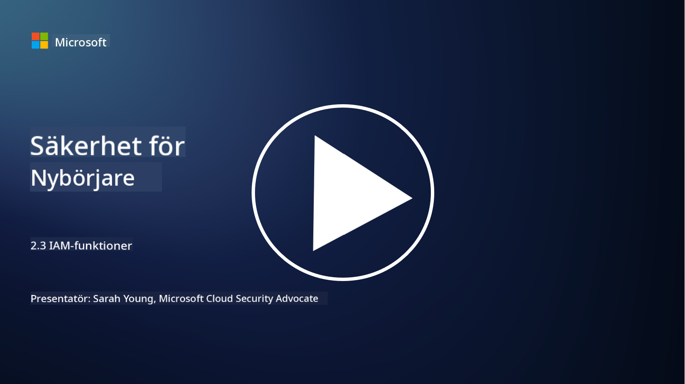

<!--
CO_OP_TRANSLATOR_METADATA:
{
  "original_hash": "bf0b8a54f2c69951744df5a94bc923f7",
  "translation_date": "2025-09-04T01:55:56+00:00",
  "source_file": "2.3 IAM capabilities.md",
  "language_code": "sv"
}
-->
# IAM-funktioner

I den här sektionen går vi igenom mer detaljer om de centrala verktyg och funktioner som används för identitetssäkerhet.

## Introduktion

I den här lektionen går vi igenom:

 - Vad är en katalogtjänst?
      
     
    
 - Vilka funktioner kan användas för att säkra identiteter?
>
>        Multifaktorautentisering (MFA)
> 
>        Single Sign-On (SSO)
> 
>        Rollbaserad åtkomstkontroll (RBAC)
> 
>        Adaptiv autentisering
> 
>        Biometrisk autentisering
> 
>        Hantering av privilegierad åtkomst (PAM)
> 
>        Identitetsstyrning och administration (IGA)
> 
>        Beteendeanalys

## Vad är en katalogtjänst?

En katalogtjänst är en specialiserad databas som lagrar och hanterar information om nätverksresurser, inklusive användare, grupper, enheter, applikationer och andra objekt. Den fungerar som en centraliserad databas för identitets- och åtkomstrelaterad information, vilket gör det möjligt för organisationer att effektivt hantera och kontrollera användarautentisering, auktorisering och andra säkerhetsrelaterade uppgifter.

Katalogtjänster spelar en avgörande roll i moderna IT-miljöer genom att ge en grund för lösningar inom identitets- och åtkomsthantering (IAM). De möjliggör säker åtkomst till resurser, upprätthåller åtkomstpolicyer och förenklar administrativa uppgifter. En av de mest kända katalogtjänsterna är Microsoft Active Directory, men det finns andra lösningar som LDAP (Lightweight Directory Access Protocol) kataloger som fyller liknande funktioner.

Nyckelfunktioner och egenskaper hos en katalogtjänst inom cybersäkerhet inkluderar:

 - **Användarautentisering**: Katalogtjänster validerar användaruppgifter (som användarnamn och lösenord) för att säkerställa att endast auktoriserade användare kan få åtkomst till nätverket och dess resurser.
 - **Användarauktorisering**: De avgör vilken åtkomstnivå varje användare har baserat på deras roll, gruppmedlemskap och andra attribut. Detta säkerställer att användare endast kan komma åt de resurser de har rätt till.
 - **Grupphantering**: Katalogtjänster gör det möjligt för administratörer att organisera användare i logiska grupper, vilket förenklar hanteringen av åtkomstkontroller. Behörigheter kan tilldelas grupper istället för individuella användare.
 - **Lösenordspolicyer**: De upprätthåller regler för lösenordskomplexitet och utgång, vilket förbättrar säkerheten för användarkonton.
 - **Single Sign-On (SSO)**: Vissa katalogtjänster stödjer SSO, vilket gör det möjligt för användare att få åtkomst till flera applikationer och tjänster med en enda uppsättning inloggningsuppgifter.
 - **Centraliserad användarhantering**: Katalogtjänster centraliserar användarinformation, vilket gör det enklare att hantera användarkonton, profiler och attribut från en enda plats.
 - **Granskning och loggning**: De kan registrera användarautentisering och åtkomstaktiviteter, vilket hjälper till vid säkerhetsgranskningar och efterlevnad.

## Vilka funktioner kan användas för att säkra identiteter?

**Multifaktorautentisering (MFA)**

MFA kräver att användare tillhandahåller flera former av verifiering innan åtkomst beviljas. Detta inkluderar vanligtvis något användaren vet (lösenord), något användaren har (smartphone eller säkerhetstoken) och något användaren är (biometriska data som fingeravtryck eller ansiktsigenkänning).

**Single Sign-On (SSO)**

SSO gör det möjligt för användare att få åtkomst till flera applikationer och system med en enda uppsättning inloggningsuppgifter. Detta förbättrar användarupplevelsen och minskar riskerna som är förknippade med att hantera flera lösenord.

**Rollbaserad åtkomstkontroll (RBAC)**

RBAC tilldelar behörigheter baserat på fördefinierade roller. Användare får åtkomst baserat på sina roller inom organisationen.

**Adaptiv autentisering**

Adaptiv autentisering bedömer riskfaktorer som plats, enhet, tid för åtkomst och användarbeteende för att dynamiskt justera nivån av autentisering som krävs. Om en begäran verkar misstänkt kan ytterligare autentiseringssteg aktiveras.

**Biometrisk autentisering**

Biometrisk autentisering använder unika biologiska egenskaper som fingeravtryck, ansiktsdrag, röstmönster och till och med beteendemässiga egenskaper som skrivhastighet för identitetsverifiering.

**Hantering av privilegierad åtkomst (PAM)**

PAM fokuserar på att säkra åtkomst till kritiska system och data genom att upprätthålla strikta kontroller för privilegierade konton. Det inkluderar funktioner som åtkomst vid behov och sessionsövervakning.

**Identitetsstyrning och administration (IGA)**

IGA-lösningar hanterar användaridentiteter och deras åtkomst till resurser under hela deras livscykel. Detta inkluderar onboarding, provisionering, rollbaserad åtkomstkontroll och avveckling.

**Beteendeanalys**

Beteendeanalys övervakar användarbeteende och etablerar baslinjemönster. Avvikelser från normen kan utlösa varningar för vidare undersökning.

# Vidare läsning
- [Azure Active Directory fundamentals documentation - Microsoft Entra | Microsoft Learn](https://learn.microsoft.com/azure/active-directory/fundamentals/?WT.mc_id=academic-96948-sayoung)
- [What is Azure Active Directory? - Microsoft Entra | Microsoft Learn](https://learn.microsoft.com/azure/active-directory/fundamentals/whatis?WT.mc_id=academic-96948-sayoung)
- [Manage your multi-cloud identity infrastructure with Microsoft Entra - YouTube](https://www.youtube.com/watch?v=9qQiq3wTS2Y&list=PLXtHYVsvn_b_gtX1-NB62wNervQx1Fhp4&index=18)

---

**Ansvarsfriskrivning**:  
Detta dokument har översatts med hjälp av AI-översättningstjänsten [Co-op Translator](https://github.com/Azure/co-op-translator). Även om vi strävar efter noggrannhet, vänligen notera att automatiska översättningar kan innehålla fel eller felaktigheter. Det ursprungliga dokumentet på dess originalspråk bör betraktas som den auktoritativa källan. För kritisk information rekommenderas professionell mänsklig översättning. Vi ansvarar inte för eventuella missförstånd eller feltolkningar som uppstår vid användning av denna översättning.