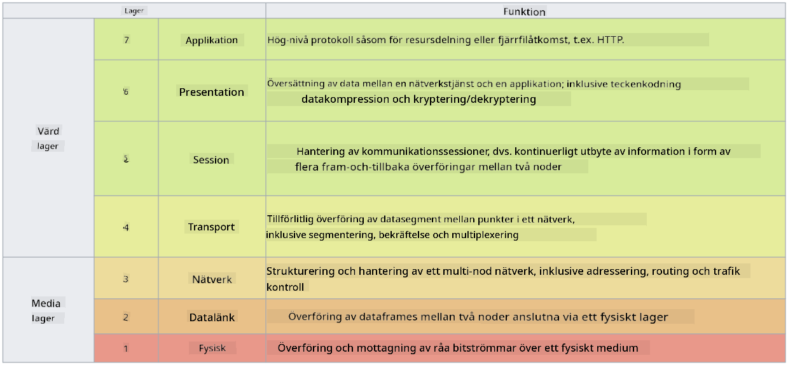

<!--
CO_OP_TRANSLATOR_METADATA:
{
  "original_hash": "252724eceeb183fb9018f88c5e1a3f0c",
  "translation_date": "2025-09-04T01:46:32+00:00",
  "source_file": "3.1 Networking key concepts.md",
  "language_code": "sv"
}
-->
# Grundläggande nätverkskoncept

Om du har arbetat inom IT är det troligt att du har stött på nätverkskoncept. Även om vi använder identitet som vår primära perimeterkontroll i moderna miljöer betyder det inte att nätverkskontroller är överflödiga. Även om detta är ett omfattande ämne kommer vi i denna lektion att gå igenom några viktiga nätverkskoncept.

I denna lektion kommer vi att behandla:

 - Vad är IP-adressering?
   
 - Vad är OSI-modellen?

 

 - Vad är TCP/UDP?

   
 

 - Vad är portnummer?

   
  

 - Vad är kryptering vid lagring och under överföring?

## Vad är IP-adressering?

IP-adressering, eller Internet Protocol-adressering, är en numerisk etikett som tilldelas varje enhet som är ansluten till ett datornätverk som använder Internet Protocol för kommunikation. Den fungerar som en unik identifierare för enheter inom ett nätverk och gör det möjligt för dem att skicka och ta emot data över internet eller andra sammankopplade nätverk. Det finns två huvudsakliga versioner av IP-adressering: IPv4 (Internet Protocol version 4) och IPv6 (Internet Protocol version 6). En IP-adress representeras vanligtvis i antingen IPv4-format (t.ex. 192.168.1.1) eller IPv6-format (t.ex. 2001:0db8:85a3:0000:0000:8a2e:0370:7334).

## Vad är OSI-modellen?

OSI-modellen (Open Systems Interconnection) är en konceptuell ram som standardiserar funktionerna i ett kommunikationssystem i sju distinkta lager. Varje lager utför specifika uppgifter och kommunicerar med angränsande lager för att säkerställa effektiv och tillförlitlig datakommunikation mellan enheter i ett nätverk. Lagren, från botten till toppen, är följande:

 1. Fysiskt lager
    
 
 2. Datalänklager

    
    

 1. Nätverkslager

    
   

 1. Transportlager

    

 1. Sessionslager

    
   

 1. Presentationslager

    
    

 1. Applikationslager

OSI-modellen ger en gemensam referens för att förstå hur nätverksprotokoll och teknologier interagerar, oavsett specifika hårdvaru- eller mjukvaruimplementationer.

_ref: https://en.wikipedia.org/wiki/OSI_model_

## Vad är TCP/UDP?

TCP (Transmission Control Protocol) och UDP (User Datagram Protocol) är två grundläggande transportlagerprotokoll som används i datornätverk för att underlätta kommunikationen mellan enheter över internet eller inom ett lokalt nätverk. De ansvarar för att dela upp data i paket för överföring och sedan sätta ihop dessa paket till den ursprungliga datan på mottagarsidan. Dock skiljer de sig åt i sina egenskaper och användningsområden.

**TCP (Transmission Control Protocol)**:

TCP är ett anslutningsorienterat protokoll som erbjuder tillförlitlig och ordnad dataöverföring mellan enheter. Det etablerar en anslutning mellan avsändaren och mottagaren innan datautbytet börjar. TCP säkerställer att datapaketen anländer i rätt ordning och kan hantera omöverföring av förlorade paket för att garantera dataintegritet och fullständighet. Detta gör TCP lämpligt för applikationer som kräver tillförlitlig dataöverföring, såsom webbsurfning, e-post, filöverföring (FTP) och databaskommunikation.

**UDP (User Datagram Protocol)**:

UDP är ett anslutningslöst protokoll som erbjuder snabbare dataöverföring men inte samma nivå av tillförlitlighet som TCP. Det etablerar ingen formell anslutning innan data skickas och inkluderar inga mekanismer för att bekräfta eller skicka om förlorade paket. UDP är lämpligt för applikationer där hastighet och effektivitet är viktigare än garanterad leverans, såsom realtidskommunikation, strömmande media, online-spel och DNS-förfrågningar.

Sammanfattningsvis prioriterar TCP tillförlitlighet och ordnad leverans, vilket gör det lämpligt för applikationer som kräver datanoggrannhet, medan UDP betonar hastighet och effektivitet, vilket gör det lämpligt för applikationer där mindre dataförlust eller omkastning av ordning är acceptabelt i utbyte mot minskad latens. Valet mellan TCP och UDP beror på de specifika kraven för den applikation eller tjänst som används.

## Vad är portnummer?

Inom nätverk är ett portnummer en numerisk identifierare som används för att skilja mellan olika tjänster eller applikationer som körs på en enskild enhet inom ett nätverk. Portar hjälper till att dirigera inkommande data till rätt applikation. Portnummer är 16-bitars osignerade heltal, vilket innebär att de sträcker sig från 0 till 65535. De är indelade i tre intervall:

- Välkända portar (0-1023): Reserverade för standardtjänster som HTTP (port 80) och FTP (port 21).

- Registrerade portar (1024-49151): Används för applikationer och tjänster som inte ingår i det välkända intervallet men är officiellt registrerade.

- Dynamiska/privata portar (49152-65535): Tillgängliga för tillfällig eller privat användning av applikationer.

## Vad är kryptering vid lagring och under överföring?

Kryptering är processen att omvandla data till ett säkert format för att skydda det från obehörig åtkomst eller manipulation. Kryptering kan tillämpas på data både "vid lagring" (när det lagras på en enhet eller server) och "under överföring" (när det överförs mellan enheter eller över nätverk).

Kryptering vid lagring: Detta innebär att kryptera data som lagras på enheter, servrar eller lagringssystem. Även om en angripare får fysisk åtkomst till lagringsmediet kan de inte komma åt datan utan krypteringsnycklarna. Detta är avgörande för att skydda känslig data vid enhetsstöld, dataintrång eller obehörig åtkomst.

Kryptering under överföring: Detta innebär att kryptera data när det färdas mellan enheter eller över nätverk. Detta förhindrar avlyssning och obehörig avlyssning av data under överföring. Vanliga protokoll för kryptering under överföring inkluderar HTTPS för webbkommunikation och TLS/SSL för att säkra olika typer av nätverkstrafik.

## Vidare läsning
- [How Do IP Addresses Work? (howtogeek.com)](https://www.howtogeek.com/341307/how-do-ip-addresses-work/)
- [Understanding IP Address: An Introductory Guide (geekflare.com)](https://geekflare.com/understanding-ip-address/)
- [What is the OSI model? The 7 layers of OSI explained (techtarget.com)](https://www.techtarget.com/searchnetworking/definition/OSI)
- [The OSI Model – The 7 Layers of Networking Explained in Plain English (freecodecamp.org)](https://www.freecodecamp.org/news/osi-model-networking-layers-explained-in-plain-english/)
- [TCP/IP protocols - IBM Documentation](https://www.ibm.com/docs/en/aix/7.3?topic=protocol-tcpip-protocols)
- [Common Ports Cheat Sheet: The Ultimate Ports & Protocols List (stationx.net)](https://www.stationx.net/common-ports-cheat-sheet/)
- [Azure Data Encryption-at-Rest - Azure Security | Microsoft Learn](https://learn.microsoft.com/azure/security/fundamentals/encryption-atrest?WT.mc_id=academic-96948-sayoung)

---

**Ansvarsfriskrivning**:  
Detta dokument har översatts med hjälp av AI-översättningstjänsten [Co-op Translator](https://github.com/Azure/co-op-translator). Även om vi strävar efter noggrannhet, vänligen notera att automatiska översättningar kan innehålla fel eller felaktigheter. Det ursprungliga dokumentet på dess originalspråk bör betraktas som den auktoritativa källan. För kritisk information rekommenderas professionell mänsklig översättning. Vi ansvarar inte för eventuella missförstånd eller feltolkningar som uppstår vid användning av denna översättning.