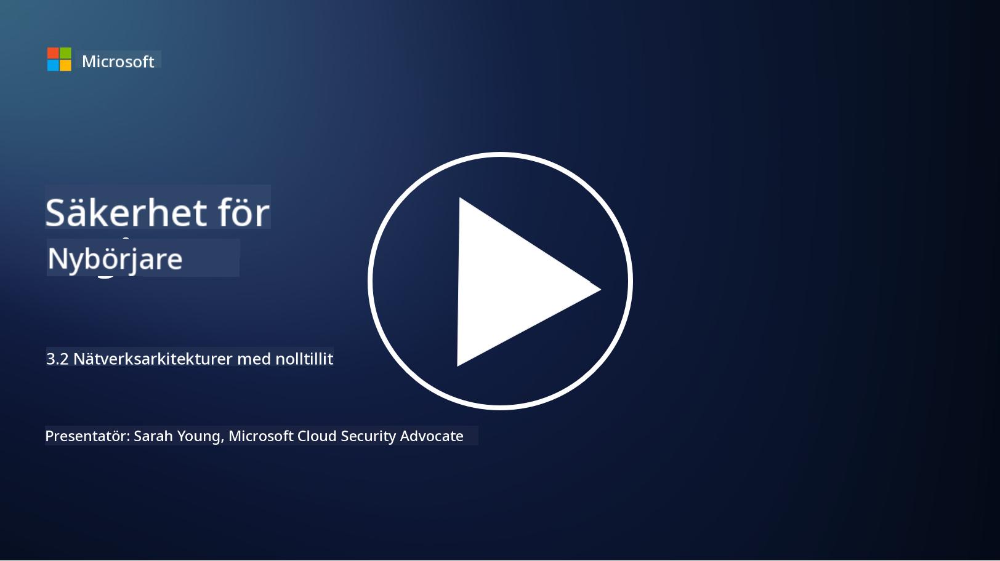

<!--
CO_OP_TRANSLATOR_METADATA:
{
  "original_hash": "680d6e14d9d33fc471c22f44679713f8",
  "translation_date": "2025-09-04T00:38:26+00:00",
  "source_file": "3.2 Networking zero trust architecture.md",
  "language_code": "sv"
}
-->
# Nätverksarkitekturer för Zero Trust

Nätverket utgör ett viktigt lager i Zero Trust-kontroller. I den här lektionen kommer vi att lära oss mer om detta:

 - Vad är nätverkssegmentering? 
 - Hur hjälper nätverkssegmentering till att implementera Zero Trust? 
 - Vad är end-to-end-kryptering?

## Vad är nätverkssegmentering?

Nätverkssegmentering är praxis att dela upp ett nätverk i mindre, isolerade segment eller delnät. Varje segment är isolerat från de andra, och åtkomst mellan segmenten styrs och begränsas baserat på specifika säkerhetspolicyer. Nätverkssegmentering används för att förbättra säkerheten genom att begränsa effekterna av potentiella intrång och minska angripares möjligheter att röra sig lateralt inom nätverket.

Genom att implementera nätverkssegmentering kan en organisation skapa "zoner" som separerar olika typer av användare, applikationer och data. Detta minskar attackytan och begränsar den potentiella skadan vid en säkerhetsincident. Nätverkssegmentering kan uppnås med hjälp av teknologier som virtuella LAN (VLAN), brandväggar och åtkomstkontroller.

## Hur hjälper nätverkssegmentering till att implementera Zero Trust?

Nätverkssegmentering är nära kopplad till principerna i Zero Trust-modellen. I en Zero Trust-arkitektur hjälper nätverkssegmentering till att upprätthålla principen om "minsta privilegium" genom att säkerställa att användare och enheter endast har åtkomst till de specifika resurser och tjänster de behöver för att utföra sina uppgifter. Genom att dela upp nätverket i mindre zoner kan organisationer implementera strikta åtkomstkontroller, isolera kritiska tillgångar och förhindra angripares laterala rörelser.

Nätverkssegmentering underlättar också införandet av identitetsbaserade åtkomstkontroller, där användare och enheter autentiseras och auktoriseras noggrant innan de får åtkomst till specifika segment. Detta förhindrar obehörig åtkomst till känsliga resurser och minskar risken för skador vid komprometterade inloggningsuppgifter.

## Vad är end-to-end-kryptering?

End-to-end (E2E) kryptering är en säkerhetsåtgärd som säkerställer att data förblir krypterad under hela sin resa från avsändaren till mottagaren. I denna process krypteras data vid avsändarens ände, och endast mottagaren har dekrypteringsnyckeln för att låsa upp och läsa datan. Krypterings- och dekrypteringsprocesserna sker vid ändpunkterna, vilket gör det extremt svårt för obehöriga parter, inklusive tjänsteleverantörer och mellanhänder, att få åtkomst till den okrypterade datan.

E2E-kryptering ger en hög nivå av konfidentialitet och säkerhet för datatransmission, även om datan passerar genom olika mellanliggande system eller nätverk. Det används ofta i säkra meddelandeappar, e-posttjänster och andra kommunikationsplattformar för att skydda känslig information från avlyssning och obehörig åtkomst.

Denna krypteringsmetod säkerställer att även om angripare lyckas få åtkomst till data under överföring, kommer de endast att se krypterat innehåll som är meningslöst utan dekrypteringsnyckeln. End-to-end-kryptering spelar en avgörande roll för att skydda användarnas integritet och förhindra att känslig information exponeras för obehöriga parter.

## Vad är SASE?

SASE står för "Secure Access Service Edge" och är en cybersäkerhetsram och arkitektur som kombinerar nätverkssäkerhet och WAN-funktioner (Wide Area Networking) i en enda molnbaserad tjänst. SASE är utformat för att ge säker och skalbar åtkomst till nätverksresurser, applikationer och data för fjärr- och mobila användare samtidigt som det förenklar nätverkshantering och minskar komplexiteten i traditionella nätverks- och säkerhetsarkitekturer.

Nyckelkarakteristika och komponenter i SASE inkluderar:

1.  **Molnbaserad:** SASE levereras som en molntjänst, vilket innebär att säkerhets- och nätverksfunktioner tillhandahålls från molnet istället för att förlita sig på traditionell hårdvara och apparater på plats.
    
2.  **Integration av säkerhet och nätverk:** SASE integrerar olika säkerhetstjänster som Secure Web Gateways (SWG), Firewall as a Service (FWaaS), Data Loss Prevention (DLP), Zero Trust Network Access (ZTNA) och WAN-optimering med WAN-funktioner. Denna integration hjälper till att effektivisera säkerhets- och nätverksoperationer.
    
3.  **Zero Trust:** SASE bygger på principen om Zero Trust, vilket innebär att det upprätthåller strikta åtkomstkontroller och principer om minsta privilegium. Användare och enheter är inte betrodda som standard och måste autentiseras och auktoriseras innan de får åtkomst till resurser.
    
4.  **Identitetscentrerad:** SASE fokuserar på användar- och enhetsidentiteter som grund för åtkomstkontroll. Identitets- och kontextbaserade policyer används för att bestämma åtkomsträttigheter, och dessa policyer anpassas dynamiskt baserat på användarbeteende och kontext.
    
5.  **Skalbarhet och flexibilitet:** SASE kan enkelt skalas för att hantera ett stort antal användare och enheter, vilket gör det lämpligt för organisationer med olika och föränderliga nätverks- och säkerhetsbehov.
   

SASE är särskilt relevant i den moderna eran av distansarbete och molnanvändning, eftersom det erbjuder ett omfattande och flexibelt tillvägagångssätt för att säkra och hantera nätverksåtkomst. Det hjälper organisationer att anpassa sig till förändrade säkerhets- och nätverkskrav samtidigt som det bibehåller ett starkt fokus på användarcentrerade och Zero Trust-säkerhetsmodeller.

## Vidare läsning

- [What Is Network Segmentation? - Cisco](https://www.cisco.com/c/en/us/products/security/what-is-network-segmentation.html#~benefits)
- [What Is Micro-Segmentation? - Cisco](https://www.cisco.com/c/en/us/products/security/what-is-microsegmentation.html)
- [Implementing Network Segmentation and Segregation | Cyber.gov.au](https://www.cyber.gov.au/resources-business-and-government/maintaining-devices-and-systems/system-hardening-and-administration/network-hardening/implementing-network-segmentation-and-segregation)
- [What Is Network Segmentation and Why It Matters | CompTIA](https://www.comptia.org/blog/security-awareness-training-network-segmentation)
- [Network Segmentation: Concepts and Practices (cmu.edu)](https://insights.sei.cmu.edu/blog/network-segmentation-concepts-and-practices/)
- [Secure networks with Zero Trust | Microsoft Learn](https://learn.microsoft.com/security/zero-trust/deploy/networks?WT.mc_id=academic-96948-sayoung)
- [What is end-to-end encryption? | IBM](https://www.ibm.com/topics/end-to-end-encryption)
- [What Is End-to-End Encryption, and Why Does It Matter? (howtogeek.com)](https://www.howtogeek.com/711656/what-is-end-to-end-encryption-and-why-does-it-matter/)
-  [Definition of Secure Access Service Edge (SASE) - Gartner Information Technology Glossary](https://www.gartner.com/en/information-technology/glossary/secure-access-service-edge-sase)
- [What Is Secure Access Service Edge (SASE)? | Microsoft Security](https://www.microsoft.com/security/business/security-101/what-is-sase?WT.mc_id=academic-96948-sayoung)

---

**Ansvarsfriskrivning**:  
Detta dokument har översatts med hjälp av AI-översättningstjänsten [Co-op Translator](https://github.com/Azure/co-op-translator). Även om vi strävar efter noggrannhet, vänligen notera att automatiska översättningar kan innehålla fel eller felaktigheter. Det ursprungliga dokumentet på dess originalspråk bör betraktas som den auktoritativa källan. För kritisk information rekommenderas professionell mänsklig översättning. Vi ansvarar inte för eventuella missförstånd eller feltolkningar som uppstår vid användning av denna översättning.