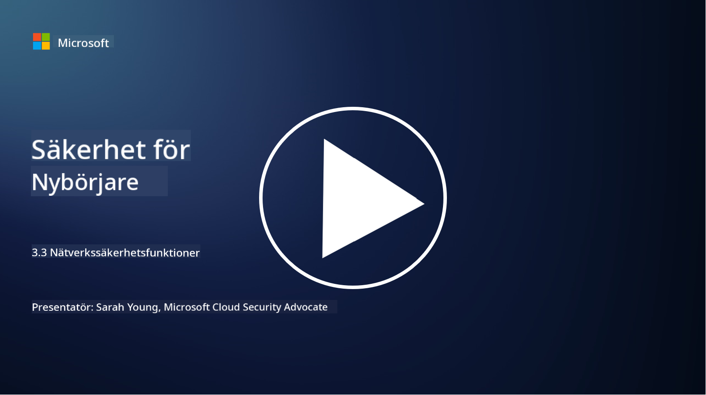

<!--
CO_OP_TRANSLATOR_METADATA:
{
  "original_hash": "c3aba077bb98eebc925dd58d870229ab",
  "translation_date": "2025-09-03T23:33:48+00:00",
  "source_file": "3.3 Network security capabilities.md",
  "language_code": "sv"
}
-->
# Nätverkssäkerhetsfunktioner

I den här lektionen kommer vi att lära oss om följande funktioner som kan användas för att säkra ett nätverk:

 - Traditionella brandväggar
 - Brandväggar för webbapplikationer
 - Molnsäkerhetsgrupper
 - CDN
 - Lastbalanserare
 - Bastionvärdar
 - VPN
 - DDoS-skydd

## Traditionella brandväggar

Traditionella brandväggar är säkerhetsenheter som kontrollerar och övervakar inkommande och utgående nätverkstrafik baserat på fördefinierade säkerhetsregler. De fungerar som en barriär mellan ett betrott internt nätverk och opålitliga externa nätverk, filtrerar trafik för att förhindra obehörig åtkomst och potentiella hot.

## Brandväggar för webbapplikationer

Brandväggar för webbapplikationer (WAF) är specialiserade brandväggar som är utformade för att skydda webbapplikationer från olika attacker, såsom SQL-injektion, cross-site scripting och andra sårbarheter. De analyserar HTTP-förfrågningar och svar för att identifiera och blockera skadlig trafik som riktar sig mot webbapplikationer.

## Molnsäkerhetsgrupper

Säkerhetsgrupper är en grundläggande nätverkssäkerhetsfunktion som tillhandahålls av molntjänstleverantörer. De fungerar som virtuella brandväggar som kontrollerar inkommande och utgående trafik till och från molnresurser, såsom virtuella maskiner (VM) och instanser. Säkerhetsgrupper gör det möjligt för organisationer att definiera regler som avgör vilken typ av trafik som tillåts och nekas, vilket ger ett extra lager av skydd för molnbaserade lösningar.

## Content Delivery Network (CDN)

Ett Content Delivery Network är ett distribuerat nätverk av servrar som är placerade på olika geografiska platser. CDN:er hjälper till att förbättra prestanda och tillgänglighet för webbplatser genom att cachelagra innehåll och leverera det från servrar som är närmare användaren. De erbjuder också viss nivå av skydd mot DDoS-attacker genom att distribuera trafik över flera serverplatser.

## Lastbalanserare

Lastbalanserare fördelar inkommande nätverkstrafik över flera servrar för att optimera resursanvändning, säkerställa hög tillgänglighet och förbättra applikationsprestanda. De hjälper till att förhindra serveröverbelastning och upprätthålla effektiva svarstider, vilket stärker nätverkets motståndskraft.

## Bastionvärdar

Bastionvärdar är mycket säkra och isolerade servrar som ger kontrollerad åtkomst till ett nätverk från ett externt, opålitligt nätverk (som internet). De fungerar som ingångspunkter för administratörer att säkert komma åt interna system. Bastionvärdar är vanligtvis konfigurerade med starka säkerhetsåtgärder för att minimera attackytan.

## Virtuella privata nätverk (VPN)

VPN:er skapar krypterade tunnlar mellan en användares enhet och en fjärrserver, vilket säkerställer säker och privat kommunikation över potentiellt osäkra nätverk som internet. VPN:er används ofta för att ge fjärråtkomst till interna nätverk, vilket gör det möjligt för användare att komma åt resurser som om de fysiskt befann sig på samma nätverk.

## Verktyg för DDoS-skydd

DDoS (Distributed Denial of Service)-skyddsverktyg och tjänster är utformade för att mildra effekterna av DDoS-attacker, där flera komprometterade enheter överbelastar ett nätverk eller en tjänst för att överväldiga det. DDoS-skyddslösningar identifierar och filtrerar bort skadlig trafik, vilket säkerställer att legitim trafik fortfarande kan nå sin avsedda destination.

## Vidare läsning

- [What Is a Firewall? - Cisco](https://www.cisco.com/c/en/us/products/security/firewalls/what-is-a-firewall.html#~types-of-firewalls)
- [What Does a Firewall Actually Do? (howtogeek.com)](https://www.howtogeek.com/144269/htg-explains-what-firewalls-actually-do/)
- [What is a Firewall? How Firewalls Work & Types of Firewalls (kaspersky.com)](https://www.kaspersky.com/resource-center/definitions/firewall)
- [Network security group - how it works | Microsoft Learn](https://learn.microsoft.com/azure/virtual-network/network-security-group-how-it-works)
- [Introduction to Azure Content Delivery Network (CDN) - Training | Microsoft Learn](https://learn.microsoft.com/training/modules/intro-to-azure-content-delivery-network/?WT.mc_id=academic-96948-sayoung)
- [What is a content delivery network (CDN)? - Azure | Microsoft Learn](https://learn.microsoft.com/azure/cdn/cdn-overview?WT.mc_id=academic-96948-sayoung)
- [What Is Load Balancing? How Load Balancers Work (nginx.com)](https://www.nginx.com/resources/glossary/load-balancing/)
- [Bastion hosts vs. VPNs · Tailscale](https://tailscale.com/learn/bastion-hosts-vs-vpns/)
- [What is VPN? How It Works, Types of VPN (kaspersky.com)](https://www.kaspersky.com/resource-center/definitions/what-is-a-vpn)
- [Introduction to Azure DDoS Protection - Training | Microsoft Learn](https://learn.microsoft.com/training/modules/introduction-azure-ddos-protection/?WT.mc_id=academic-96948-sayoung)
- [What Is a DDoS Attack? | Microsoft Security](https://www.microsoft.com/security/business/security-101/what-is-a-ddos-attack?WT.mc_id=academic-96948-sayoung)

---

**Ansvarsfriskrivning**:  
Detta dokument har översatts med hjälp av AI-översättningstjänsten [Co-op Translator](https://github.com/Azure/co-op-translator). Även om vi strävar efter noggrannhet, bör du vara medveten om att automatiska översättningar kan innehålla fel eller felaktigheter. Det ursprungliga dokumentet på dess ursprungliga språk bör betraktas som den auktoritativa källan. För kritisk information rekommenderas professionell mänsklig översättning. Vi ansvarar inte för eventuella missförstånd eller feltolkningar som uppstår vid användning av denna översättning.