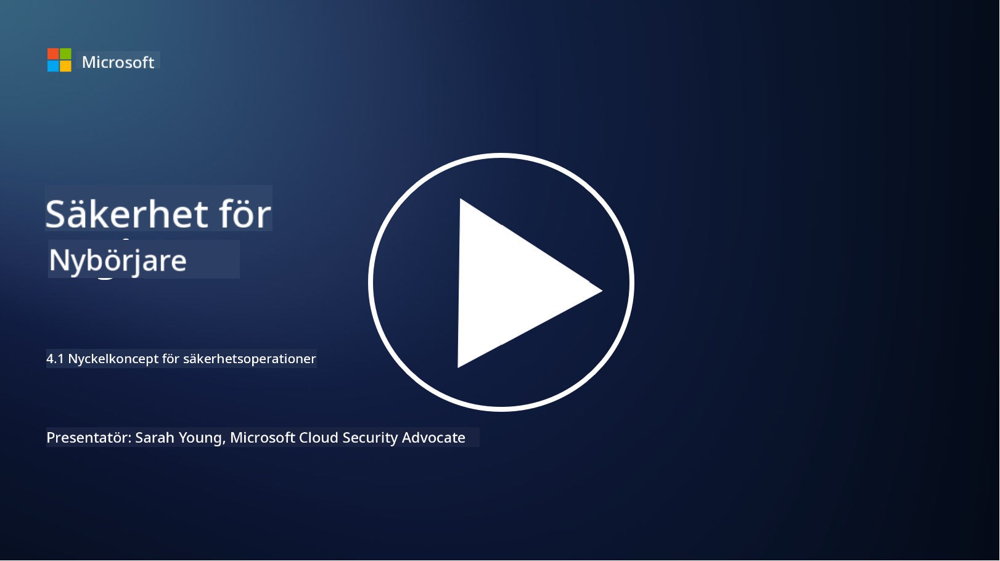

<!--
CO_OP_TRANSLATOR_METADATA:
{
  "original_hash": "6a55b31df9eebf550d040cef0ef7dff3",
  "translation_date": "2025-09-04T02:03:03+00:00",
  "source_file": "4.1 SecOps key concepts.md",
  "language_code": "sv"
}
-->
# Säkerhetsoperationers nyckelkoncept

Säkerhetsoperationer är en kritisk del av en organisations övergripande säkerhetsfunktion. I denna lektion kommer vi att lära oss mer om detta:

 - Vad är en säkerhetsoperationsfunktion inom ett företag?
   
 - Vilka former kan säkerhetsoperationer ta?
   
   - Hur skiljer sig säkerhetsoperationer från traditionella IT-operationer?

## Vad är en säkerhetsoperationsfunktion inom ett företag?

En säkerhetsoperationsfunktion inom ett företag hänvisar till ett dedikerat team eller avdelning som ansvarar för att övervaka, upptäcka, undersöka och svara på cybersäkerhetshot och incidenter. Det primära målet för en säkerhetsoperationsfunktion är att säkerställa konfidentialitet, integritet och tillgänglighet för organisationens digitala tillgångar genom att proaktivt identifiera och minska säkerhetsrisker samt effektivt hantera säkerhetsincidenter.

## Vilka former kan säkerhetsoperationer ta?

Säkerhetsoperationer kan ta olika former beroende på organisationens storlek och komplexitet. Några vanliga former inkluderar:

**Security Operations Center (SOC):** Ett centraliserat team som ansvarar för övervakning, analys och respons på säkerhetshändelser dygnet runt. SOC använder ofta avancerade verktyg och teknologier för att identifiera och hantera hot i realtid.

**Incident Response Team:** Ett specialiserat team som fokuserar på att hantera säkerhetsincidenter och intrång. De genomför undersökningar, koordinerar insatser och underlättar återhämtning.

**Threat Hunting Team:** Ett team som proaktivt söker efter tecken på avancerade hot och dolda sårbarheter som kanske inte upptäcks av traditionella säkerhetsverktyg.

**Red Team/Blue Team:** Red team simulerar attacker för att identifiera sårbarheter, medan blue team försvarar mot dessa attacker. Båda teamen arbetar tillsammans för att förbättra säkerhetsåtgärder.

**Managed Security Services Provider (MSSP):** Vissa organisationer outsourcar sina säkerhetsoperationer till tredjepartsleverantörer som specialiserar sig på säkerhetsövervakning och incidenthantering.

## Hur skiljer sig säkerhetsoperationer från traditionella IT-operationer?

Säkerhetsoperationer och traditionella IT-operationer är relaterade men distinkta funktioner:

**Fokus:** IT-operationer fokuserar på att hantera och underhålla organisationens IT-infrastruktur och säkerställa dess funktionalitet och tillgänglighet. Säkerhetsoperationer prioriterar att identifiera och minska säkerhetsrisker samt hantera incidenter.

**Ansvarsområden:** IT-operationer hanterar uppgifter som systemunderhåll, mjukvaruuppdateringar och användarsupport. Säkerhetsoperationer hanterar hotdetektering, incidenthantering, sårbarhetshantering och säkerhetsövervakning.

**Tidsaspekt:** IT-operationer betonar omedelbar systemtillgänglighet och prestanda. Säkerhetsoperationer fokuserar på att identifiera och åtgärda hot, vilket inte alltid sammanfaller med omedelbar tillgänglighet.

**Kompetens:** Säkerhetsoperationer kräver specialiserade färdigheter inom hotanalys, incidenthantering och cybersäkerhetsverktyg. IT-operationer kräver expertis inom systemadministration, nätverkshantering och applikationssupport.

## Arbetsflöde för incidenthantering

NIST Cybersecurity Framework Core Functions listar fem övergripande funktioner som bör utföras kontinuerligt som en del av organisationens operativa miljö för att minska cybersäkerhetsrisker. 

Det är viktigt att förstå att dessa aktiviteter bör existera som en del av en större cirkel som integreras med och anpassas till organisationens bredare cybersäkerhetsprocesser. 

**Note:** Du kan läsa mer om NIST Cybersecurity Framework på [https://www.nist.gov/cybersecurity](https://www.nist.gov/cybersecurity)

## Vidare läsning

- [Security operations | Microsoft Learn](https://learn.microsoft.com/security/operations/overview?WT.mc_id=academic-96948-sayoung)
- [Implementing security operations processes | Microsoft Learn](https://learn.microsoft.com/security/operations/?WT.mc_id=academic-96948-sayoung)
- [What is a security operations center (SOC)? | Microsoft Security](https://www.microsoft.com/security/business/security-101/what-is-a-security-operations-center-soc?WT.mc_id=academic-96948-sayoung)
- [What Is a Security Operations Center | Cybersecurity | CompTIA](https://www.comptia.org/content/articles/what-is-a-security-operations-center)

---

**Ansvarsfriskrivning**:  
Detta dokument har översatts med hjälp av AI-översättningstjänsten [Co-op Translator](https://github.com/Azure/co-op-translator). Även om vi strävar efter noggrannhet, vänligen notera att automatiska översättningar kan innehålla fel eller felaktigheter. Det ursprungliga dokumentet på sitt originalspråk bör betraktas som den auktoritativa källan. För kritisk information rekommenderas professionell mänsklig översättning. Vi ansvarar inte för eventuella missförstånd eller feltolkningar som uppstår vid användning av denna översättning.