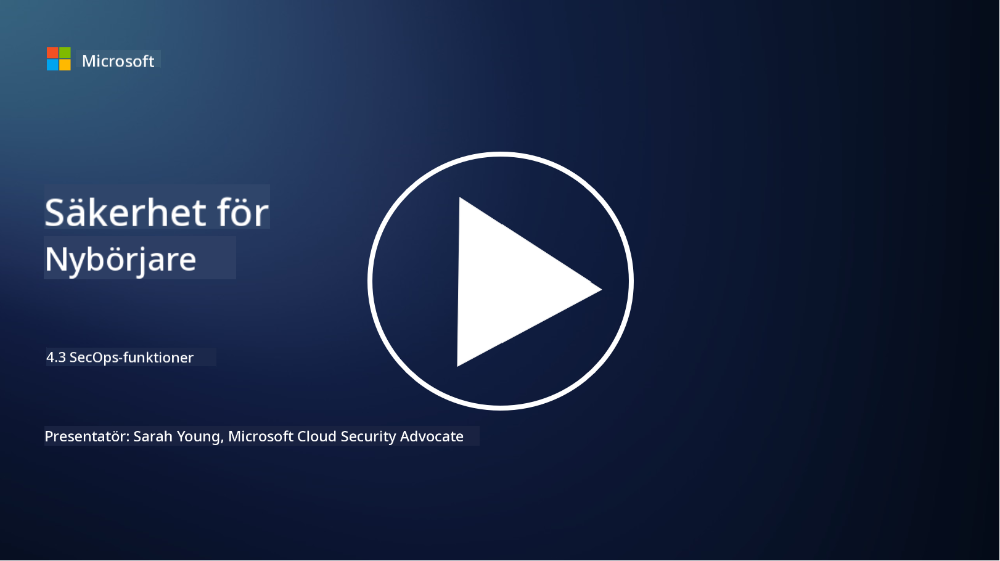

<!--
CO_OP_TRANSLATOR_METADATA:
{
  "original_hash": "553eb694c89f1caca0694e8d8ab89e0e",
  "translation_date": "2025-09-04T01:19:32+00:00",
  "source_file": "4.3 SecOps capabilities.md",
  "language_code": "sv"
}
-->
# SecOps-funktioner

I det här avsnittet går vi igenom mer detaljer om de centrala verktygen och funktionerna som kan användas inom säkerhetsoperationer.

I denna lektion kommer vi att behandla:

- Vad är ett verktyg för säkerhetsinformation och händelsehantering (SIEM)?

- Vad är XDR?

- Vilka funktioner kan användas för att förbättra säkerhetsoperationer?

## Vad är ett verktyg för säkerhetsinformation och händelsehantering (SIEM)?

Ett verktyg för säkerhetsinformation och händelsehantering (SIEM) används för att analysera säkerhetsvarningar som genereras i en organisations IT-miljö. De samlar in, aggregerar, korrelerar och analyserar loggdata och säkerhetshändelser från olika källor, såsom nätverksenheter, servrar, applikationer och säkerhetssystem.

Viktiga funktioner och egenskaper hos SIEM-verktyg inkluderar:

1. **Logginsamling**: SIEM-verktyg samlar in loggar och säkerhetshändelsedata från en mängd olika enheter, system och applikationer, inklusive brandväggar, intrångsdetekteringssystem, antivirusprogram och mer.

2. **Datakonvertering**: De konverterar loggdata till ett gemensamt format för att underlätta analys och korrelation.

3. **Händelsekorrelation**: SIEM-verktyg korrelerar händelser för att identifiera mönster och avvikelser som kan indikera säkerhetsincidenter eller hot.

4. **Larm och notifieringar**: SIEM-verktyg genererar larm och notifieringar i realtid när misstänkt aktivitet eller säkerhetsöverträdelser upptäcks, vilket möjliggör omedelbar respons.

5. **Incidentdetektering**: De underlättar upptäckten av säkerhetsincidenter, inklusive obehörig åtkomst, dataintrång, skadlig kod och interna hot.

6. **Analyser av användar- och enhetsbeteende (UEBA)**: Vissa SIEM-verktyg inkluderar UEBA-funktioner för att identifiera avvikande användar- och enhetsbeteenden som kan indikera komprometterade konton eller interna hot.

7. **Integration av hotinformation**: SIEM-verktyg kan integreras med hotinformationsflöden för att förbättra hotdetektering genom att jämföra kända indikatorer på kompromiss (IOCs) med nätverksaktivitet.

8. **Automatisering och orkestrering**: Automatiseringsfunktioner gör det möjligt för SIEM att automatisera svar på vanliga säkerhetsincidenter, vilket minskar svarstider och manuellt arbete.

9. **Instrumentpanel och visualisering**: De erbjuder instrumentpaneler och visualiseringsverktyg för att övervaka säkerhetsdata och skapa anpassade rapporter.

10. **Integration med andra säkerhetsverktyg**: SIEM-verktyg integreras ofta med andra säkerhetsverktyg och teknologier, såsom lösningar för endpoint detection and response (EDR), för att ge en helhetsbild av en organisations säkerhetsläge.

## Vad är XDR?

XDR (Extended Detection and Response) är en teknologi som utökar funktionerna hos traditionell Endpoint Detection and Response (EDR) och kombinerar dem med bredare säkerhetstelemetri från olika källor för att ge en mer omfattande bild av en organisations säkerhetsläge. XDR syftar till att förbättra hotdetektering, incidenthantering och övergripande säkerhet genom att hantera begränsningarna med att enbart förlita sig på EDR, SIEM eller andra individuella säkerhetsverktyg.

Viktiga egenskaper och komponenter hos XDR inkluderar:

1. **Dataintegration**: XDR integrerar data från flera källor, inklusive enheter, nätverkstrafik, molntjänster, e-post och mer. Denna omfattande datainsamling ger en bredare kontext för hotdetektering och analys.

2. **Avancerad analys**: XDR använder avancerad analys, maskininlärning och beteendeanalys för att identifiera och prioritera säkerhetshot. Den söker efter mönster och avvikelser i den integrerade datan för att upptäcka både kända och okända hot.

3. **Automatiserad hotdetektering**: XDR automatiserar upptäckten av säkerhetshot och avvikelser genom att korrelera information från olika källor. Den kan identifiera komplexa attackkedjor som kan sträcka sig över flera vektorer.

4. **Incidentutredning och respons**: XDR tillhandahåller verktyg för incidentutredning och respons, vilket hjälper säkerhetsteam att snabbt bedöma omfattningen och påverkan av incidenter och vidta lämpliga åtgärder.

5. **Integration av hotinformation**: Den integrerar hotinformationsflöden och data för att förbättra hotdetektering genom att jämföra kända indikatorer på kompromiss (IOCs) med organisationens nätverks- och enhetsaktivitet.

6. **Enhetlig konsol**: XDR erbjuder vanligtvis en enhetlig konsol eller instrumentpanel där säkerhetsteam kan visa och hantera säkerhetslarm och incidenter från olika källor på ett centraliserat sätt.

7. **Plattformsöverskridande täckning**: XDR-lösningar täcker ett brett spektrum av plattformar, inklusive enheter, servrar, molnmiljöer och mobila enheter, vilket gör dem lämpliga för moderna, mångsidiga IT-miljöer.

## Vilka funktioner kan användas för att förbättra säkerhetsoperationer?

För att förbättra säkerhetsoperationer kan organisationer använda flera funktioner utöver SIEM-verktyg:

1. **Maskininlärning och artificiell intelligens**: Implementera avancerad analys, maskininlärning och AI för att upptäcka utvecklande hot och automatisera hotjakt.

2. **Analyser av användar- och enhetsbeteende (UEBA)**: Analysera användar- och enhetsbeteende för att upptäcka avvikelser och interna hot.

3. **Hotinformationsflöden**: Integrera hotinformationsflöden för att hålla sig uppdaterad om de senaste hoten och indikatorerna på kompromiss.

4. **Säkerhetsorkestrering, automatisering och respons (SOAR)**: Implementera SOAR-plattformar för att automatisera incidenthantering och effektivisera arbetsflöden inom säkerhetsoperationer.

5. **Bedrägeriteknologier**: Använd bedrägeriteknologier för att vilseleda och upptäcka angripare inom nätverket.

## Vidare läsning

- [What is SIEM? | Microsoft Security](https://www.microsoft.com/security/business/security-101/what-is-siem?WT.mc_id=academic-96948-sayoung)
- [What Is SIEM? - Security Information and Event Management - Cisco](https://www.cisco.com/c/en/us/products/security/what-is-siem.html)
- [Security information and event management - Wikipedia](https://en.wikipedia.org/wiki/Security_information_and_event_management)
- [What Is XDR? | Microsoft Security](https://www.microsoft.com/security/business/security-101/what-is-xdr?WT.mc_id=academic-96948-sayoung)
- [XDR & XDR Security (kaspersky.com.au)](https://www.kaspersky.com.au/resource-center/definitions/what-is-xdr)
- [The Power of SecOps: Redefining Core Security Capabilities - The New Stack](https://thenewstack.io/the-power-of-secops-redefining-core-security-capabilities/)
- [Seven Steps to Improve Your Security Operations and Response (securityintelligence.com)](https://securityintelligence.com/seven-steps-to-improve-your-security-operations-and-response/)

---

**Ansvarsfriskrivning**:  
Detta dokument har översatts med hjälp av AI-översättningstjänsten [Co-op Translator](https://github.com/Azure/co-op-translator). Även om vi strävar efter noggrannhet, vänligen notera att automatiska översättningar kan innehålla fel eller felaktigheter. Det ursprungliga dokumentet på sitt originalspråk bör betraktas som den auktoritativa källan. För kritisk information rekommenderas professionell mänsklig översättning. Vi ansvarar inte för eventuella missförstånd eller feltolkningar som uppstår vid användning av denna översättning.