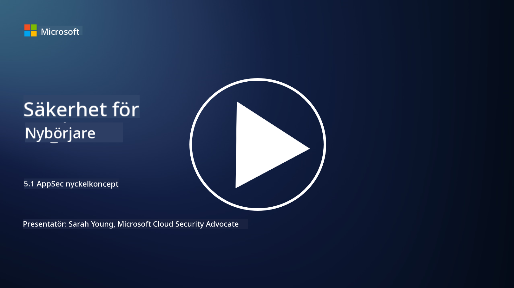

<!--
CO_OP_TRANSLATOR_METADATA:
{
  "original_hash": "e4b56bb23078d3ffb7ad407d280b0c36",
  "translation_date": "2025-09-04T00:32:24+00:00",
  "source_file": "5.1 AppSec key concepts.md",
  "language_code": "sv"
}
-->
# AppSec nyckelkoncept

Applikationssäkerhet är en säkerhetsspecialisering i sig själv. I den här delen av kursen kommer vi att fördjupa oss i applikationssäkerhet.

## Introduktion

I denna lektion kommer vi att gå igenom:

- Vad är applikationssäkerhet?

- Vilka är nyckelkoncepten/principerna för applikationssäkerhet?

## Vad är applikationssäkerhet?

Applikationssäkerhet, ofta förkortat "AppSec," avser praktiken att skydda mjukvaruapplikationer från säkerhetshot, sårbarheter och attacker. Det innefattar processer, tekniker och verktyg som används för att identifiera, mildra och förebygga säkerhetsrisker under hela utvecklings-, implementerings- och underhållslivscykeln för en applikation.

Applikationssäkerhet är avgörande eftersom applikationer ofta är mål för cyberattacker. Skadliga aktörer utnyttjar sårbarheter och svagheter i mjukvara för att få obehörig åtkomst, stjäla data, störa tjänster eller utföra andra skadliga aktiviteter. Effektiv applikationssäkerhet hjälper till att säkerställa konfidentialitet, integritet och tillgänglighet för en applikation och dess tillhörande data.

## Vilka är nyckelkoncepten/principerna för applikationssäkerhet?

Nyckelkoncept och principer som ligger till grund för applikationssäkerhet inkluderar:

1. **Säker från början**:

- Säkerhet bör integreras i applikationens design och arkitektur från början, istället för att läggas till i efterhand.

2. **Validering av indata**:

- All användarinmatning bör valideras för att säkerställa att den följer förväntade format och är fri från skadlig kod eller data.

3. **Kodning av utdata**:

- Data som skickas till klienten bör kodas korrekt för att förhindra sårbarheter som cross-site scripting (XSS).

4. **Autentisering och auktorisering**:

- Autentisera användare och auktorisera deras åtkomst till resurser baserat på deras roller och behörigheter.

5. **Dataskydd**:

- Känslig data bör krypteras vid lagring, överföring och bearbetning för att förhindra obehörig åtkomst.

6. **Sessionshantering**:

- Säker sessionshantering skyddar användarsessioner från kapning och obehörig åtkomst.

7. **Säkra beroenden**:

- Håll alla mjukvaruberoenden uppdaterade med säkerhetsfixar för att förhindra sårbarheter.

8. **Felhantering och loggning**:

- Implementera säker felhantering för att undvika att avslöja känslig information och säkerställ säkra loggningsrutiner.

9. **Säkerhetstestning**:

- Testa regelbundet applikationer för sårbarheter med metoder som penetrationstestning, kodgranskning och automatiserade skanningsverktyg.

10. **Säker mjukvaruutvecklingslivscykel (SDLC)**:

- Integrera säkerhetsrutiner i varje fas av mjukvaruutvecklingslivscykeln, från kravställning till implementering och underhåll.

## Vidare läsning

- [SheHacksPurple: What is Application Security? - YouTube](https://www.youtube.com/watch?v=eNmccQNzSSY)
- [What Is Application Security? - Cisco](https://www.cisco.com/c/en/us/solutions/security/application-first-security/what-is-application-security.html#~how-does-it-work)
- [What is application security? A process and tools for securing software | CSO Online](https://www.csoonline.com/article/566471/what-is-application-security-a-process-and-tools-for-securing-software.html)
- [OWASP Cheat Sheet Series | OWASP Foundation](https://owasp.org/www-project-cheat-sheets/)

---

**Ansvarsfriskrivning**:  
Detta dokument har översatts med hjälp av AI-översättningstjänsten [Co-op Translator](https://github.com/Azure/co-op-translator). Även om vi strävar efter noggrannhet, bör du vara medveten om att automatiserade översättningar kan innehålla fel eller felaktigheter. Det ursprungliga dokumentet på dess ursprungliga språk bör betraktas som den auktoritativa källan. För kritisk information rekommenderas professionell mänsklig översättning. Vi ansvarar inte för eventuella missförstånd eller feltolkningar som uppstår vid användning av denna översättning.